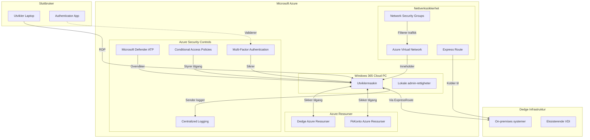
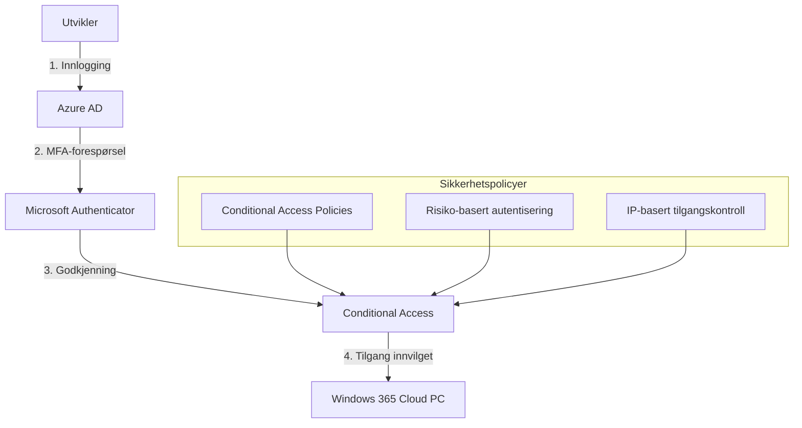
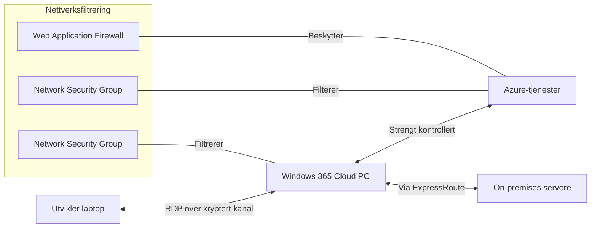
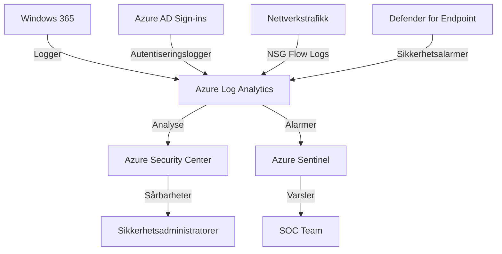

# Vedlegg: Sikkerhetsvurdering for Windows 365 Utviklingsmaskiner

## Sikkerhetsarkitektur

Dette dokumentet utdyper sikkerhetsaspektene ved den foreslåtte Windows 365 Cloud PC-løsningen for utviklingsmaskiner. Dokumentet er rettet mot sikkerhetsavdelingen og adresserer de mest sentrale sikkerhetsmessige problemstillingene.

### Arkitekturell oversikt

## Hovedsikkerhetsprinsipper

Løsningen bygger på følgende sikkerhetsprinsipper:

1. **Prinsippet om minste privilegium**
   - Administrative rettigheter begrenses til Windows 365-maskinen
   - Ingen administrative rettigheter på produksjonssystemer
   - Tilgangsstyring basert på spesifikke roller og behov

2. **Dybdeforsvar**
   - Flere lag med sikkerhetskontroller
   - Segmentert nettverk med kontrollert trafikk
   - Flere autentiseringsfaktorer

3. **Segmentering**
   - Separate brukerkontoer for utviklingsmaskiner
   - Isolasjon fra standard brukerkontomiljø
   - Nettverksisolasjon mellom utviklingsmiljø og produksjon

4. **Kontinuerlig overvåking**
   - Omfattende logging av aktivitet
   - Automatiserte varsler ved mistenkelig aktivitet
   - Regelmessig gjennomgang av logger og brukeraktivitet

## Detaljerte sikkerhetstiltak

### 1. Identitets- og tilgangsstyring

**Implementerte tiltak:**
- Dedikerte Azure AD-kontoer for Windows 365-tilgang (ikke koblet til standard brukerkontoer)
- Multifaktor-autentisering med Microsoft Authenticator
- Betinget tilgang basert på risiko, lokasjon, og enhet
- Privileged Identity Management for tidsavgrenset tilgang ved behov
- Robust passordhåndtering med høye kompleksitetskrav

### 2. Nettverkssikkerhet

**Implementerte tiltak:**
- Dedikert virtuelt nettverk (VNet) for Windows 365-maskiner
- Network Security Groups (NSG) med strenge regler
- Just-in-time nettverkstilgang til kritiske ressurser
- Kryptert trafikk mellom alle komponenter
- Privat ExpressRoute-forbindelse til on-premises nettverk
- Begrensning av utgående internett-trafikk til godkjente tjenester

### 3. Enhetssikkerhet

**Implementerte tiltak:**
- Microsoft Defender for Endpoint på alle Windows 365-maskiner
- Automatiserte sikkerhetsoppdateringer
- Application Control (Windows Defender Application Control)
- Kryptering av virtuelle disker
- Regelmessig sikkerhetsscanning
- Beskyttelse mot dataeksfiltrering

### 4. Logging og overvåking

**Implementerte tiltak:**
- Sentralisert logging i Azure Log Analytics
- Azure Sentinel for avansert trusseljakt
- Automatiserte varsler ved mistenkelig aktivitet
- Overvåking av privilegert tilgang
- Regelmessig sikkerhetsgjennomgang
- Lagring av logger i henhold til retensjonskrav

## Risikohåndtering

| Risiko | Beskrivelse | Sikkerhetstiltak | Restrisiko |
|--------|-------------|------------------|------------|
| **R1: Misbruk av admin-rettigheter** | Utviklere kan potensielt misbruke admin-rettigheter på Windows 365-maskinen | - Omfattende logging - Atferdsanalyse - Kontrollert nettverkstilgang - Segmentering fra produksjonsmiljø | Lav |
| **R2: Dataeksfiltrering** | Sensitiv kode eller data kan bli overført til uautoriserte enheter/lokasjoner | - DLP-løsninger - Begrenset tilgang til eksterne lagringstjenester - Overvåking av dataoverføringer | Lav |
| **R3: Kompromitterte utviklerkontoer** | Angriper får tilgang til utviklers Windows 365-konto | - MFA obligatorisk - Unike brukernavn/passord - Begrensninger på IP-adresser - Atferdsbasert autentisering | Lav |
| **R4: Malware/ransomware** | Skadelig programvare installeres på utviklermaskinen | - Microsoft Defender ATP - Kontrollert installasjon av programvare - Regelmessig sikkerhetsscanning - Isolasjon fra produksjonsmiljø | Lav-middels |
| **R5: Lateral bevegelse** | Angriper beveger seg fra utviklermaskinen til andre systemer | - Nettverkssegmentering - Mikrosegmentering - Just-in-time tilgang - Privileged Access Workstations (PAW) for kritisk tilgang | Lav |

## Samsvar med sikkerhetskrav

Løsningen er designet for å oppfylle følgende sikkerhetskrav:

1. **Beskyttelse av sensitiv kode og data**
   - Ingen lokal lagring av data på utviklernes fysiske enheter
   - Kryptert lagring i Azure
   - Kontrollert datadeling mellom miljøer

2. **Sikker autentisering**
   - Separate brukerkontoer for utviklingsmiljøer
   - Multifaktor-autentisering
   - Risikobasert tilgangskontroll

3. **Sporbarhet og etterlevelse**
   - Omfattende logging og revisjonsspor
   - Tydelig identifisering av brukerhandlinger
   - Rolleoversikt med minimale rettigheter

## Oppsummering av sikkerhetsvurdering

Windows 365 Cloud PC-løsningen for utviklere representerer en balansert tilnærming som ivaretar utviklernes behov for fleksibilitet samtidig som sikkerheten styrkes sammenlignet med dagens VDI-løsning. 

De primære sikkerhetsfordelene inkluderer:

1. **Segmentering** av utviklerkontoen fra standard brukerkontoer
2. **Styrket autentisering** med MFA og separate innloggingsdetaljer
3. **Omfattende logging og overvåking** av aktivitet på utviklingsmaskinene
4. **Kontrollert nettverkstilgang** mellom miljøer
5. **Moderne sikkerhetsverktøy** gjennom Microsoft Defender-økosystemet

Gjennom implementeringen av disse sikkerhetstiltakene vil risikoen ved å gi utviklere lokale administrative rettigheter på Windows 365-maskinene reduseres til et akseptabelt nivå, samtidig som utviklingseffektiviteten forbedres.

## Anbefalte ytterligere sikkerhetstiltak

Følgende tiltak kan vurderes for ytterligere styrking av sikkerheten:

1. **Privileged Access Management** for tidsbegrenset elevering av rettigheter
2. **Regelmessige penetrasjonstester** av Windows 365-miljøet
3. **Sikkerhetsopplæring** for utviklere om sikker bruk av admin-rettigheter
4. **Automatisert compliance-sjekker** for å identifisere avvik fra sikkerhetspolicyer
5. **Just-in-time administrativ tilgang** for spesielt sensitive operasjoner 