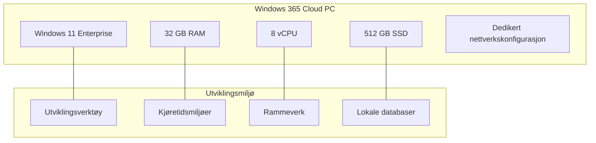
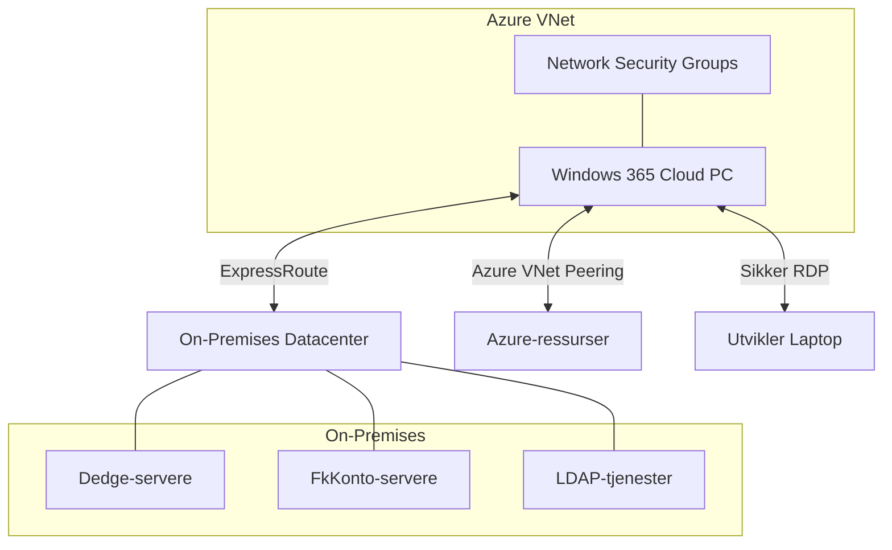
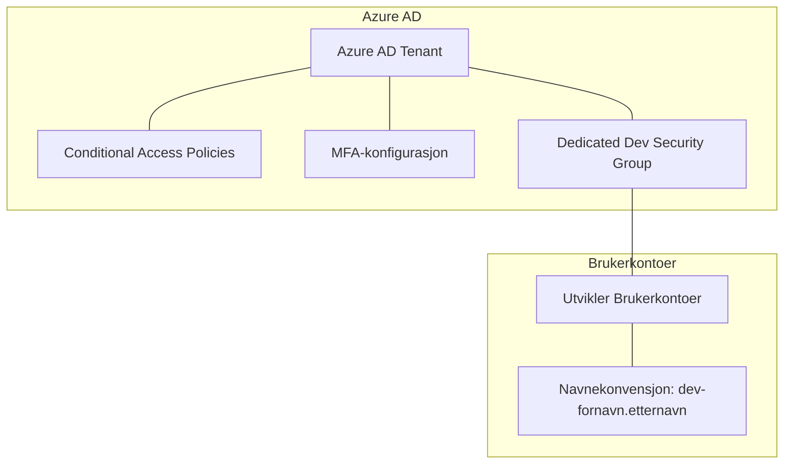
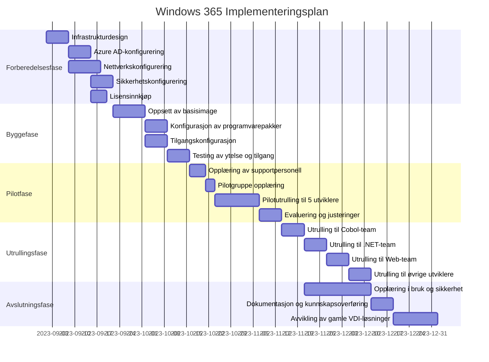
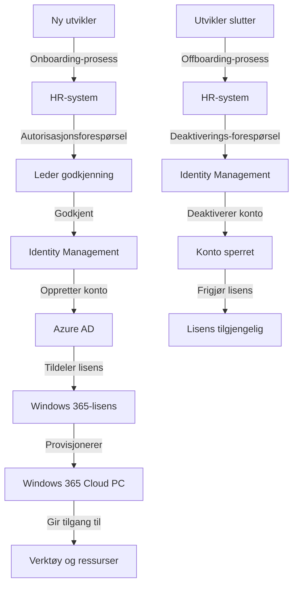
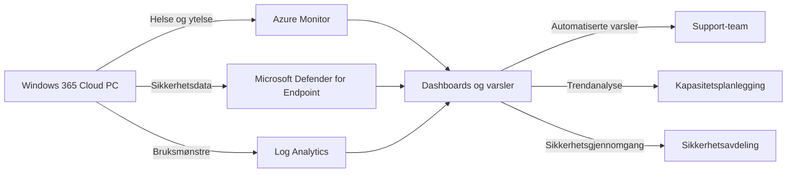

# Teknisk implementasjon av Windows 365 for utviklingsavdelingen

## Sammendrag

Dette dokumentet er utarbeidet for leveranseavdelingen ved Dedge og beskriver den tekniske implementasjonen av Windows 365 Cloud PC-løsningen for utviklingsavdelingen. Dokumentet inneholder detaljerte tekniske spesifikasjoner, konfigurasjonsveiledning og implementeringsplan.

## Tekniske spesifikasjoner

### Windows 365 Cloud PC-konfigurasjon



#### Anbefalte maskinprofiler

| Utviklerrolle | CPU | RAM | Lagring | Anbefalt Windows 365-lisens |
|---------------|-----|-----|---------|---------------------------|
| Cobol-utvikler | 4 vCPU | 16 GB | 256 GB | Windows 365 Enterprise 4 vCPU |
| .NET/C#-utvikler | 8 vCPU | 32 GB | 512 GB | Windows 365 Enterprise 8 vCPU |
| Web-utvikler | 8 vCPU | 32 GB | 512 GB | Windows 365 Enterprise 8 vCPU |
| PowerShell/scripting | 4 vCPU | 16 GB | 256 GB | Windows 365 Enterprise 4 vCPU |
| DevOps/CI/CD | 8 vCPU | 32 GB | 512 GB | Windows 365 Enterprise 8 vCPU |

#### Programvare og verktøy

Basiskonfigurasjon for alle utviklingsmaskiner:

- Microsoft Windows 11 Enterprise
- Microsoft Visual Studio Code
- Git og GitHub Desktop
- Windows Terminal
- Windows Subsystem for Linux (WSL2)
- Docker Desktop
- 7-Zip
- Notepad++
- Microsoft Excel (kun denne komponenten fra Office-pakken)

Rollebaserte tilleggspakker:

- **Cobol**: Micro Focus Enterprise Developer, Eclipse
- **.NET/C#**: Visual Studio Enterprise, SQL Server Management Studio, .NET SDK
- **Web**: Node.js, npm, Visual Studio Code-utvidelser, web-rammeverk
- **PowerShell**: PowerShell 7, VS Code PowerShell-utvidelser, Azure PowerShell-moduler
- **DevOps**: Azure CLI, Terraform, Ansible, Jenkins agent

## Nettverkskonfigurasjon



### Nettverksspesifikasjoner

1. **VNet-konfigurasjon**
   - Dedikert VNet for Windows 365-instanser
   - Adresseområde: 10.X.0.0/16 (spesifikt område defineres under implementering)
   - Subnet for Windows 365: 10.X.1.0/24
   - NSG med strenge regler for inn- og utgående trafikk

2. **Hybrid-tilkobling**
   - ExpressRoute-forbindelse til on-premises datacenter
   - Sikker VNET-peering til Azure-ressurser (P-Dedge og T-Dedge abonnementer)
   - DNS-konfigurasjon for å løse både on-premises og Azure-ressurser

3. **RDP-konfigurasjon**
   - RDP med støtte for flere skjermer
   - UDP-transport for forbedret ytelse
   - Optimal kompresjon for best mulig brukeropplevelse

## Azure Active Directory-konfigurasjon



### Brukerkontoer og autentisering

1. **Kontooppsett**
   - Separate utviklerkontoer for Windows 365-tilgang
   - Navnekonvensjon: `dev-fornavn.etternavn@Dedge.no`
   - Robust passordpolicy med minimum 16 tegn, kompleksitetskrav
   - Passordene for disse kontoene skal være unike og ikke gjenbrukes

2. **Multifaktor-autentisering (MFA)**
   - Obligatorisk MFA for alle innlogginger på Windows 365
   - Microsoft Authenticator som primær MFA-mekanisme
   - Fallback-mekanismer ved tapte enheter

3. **Betinget tilgang**
   - Policyer basert på brukerens lokasjon, enhet, og risikonivå
   - Begrensning av tilgang til spesifikke geografiske områder
   - Krav om kompatible enheter

## Implementeringsplan



### Faseplaner

#### Fase 1: Forberedelse (3-4 uker)
1. Detaljert teknisk design av løsningen
2. Konfigurasjon av Azure AD for dedikerte brukerkontoer
3. Nettverkskonfigurasjon i Azure
4. Innkjøp av nødvendige lisenser
5. Oppsett av sikkerhetspolicyer

#### Fase 2: Bygging (3 uker)
1. Oppsett av grunnleggende Windows 365-image
2. Installasjon og konfigurasjon av nødvendig programvare
3. Konfigurasjon av tilgangsstyring og sikkerhetsinnstillinger
4. Testing av ytelse, tilgjengelighet og sikkerhet

#### Fase 3: Pilot (3 uker)
1. Identifisering av pilotbrukere (5 utviklere fra ulike team)
2. Opplæring av pilotbrukere
3. Overvåking og støtte under pilotperioden
4. Samling av tilbakemeldinger og justeringer

#### Fase 4: Utrulling (4 uker)
1. Fasert utrulling til utviklingsteam basert på prioritet
2. Opplæring og dokumentasjon for sluttbrukere
3. Kontinuerlig overvåking og støtte under utrulling
4. Oppfølging av problemer og utfordringer

#### Fase 5: Avslutning (3 uker)
1. Fullføre dokumentasjon og opplæringsmateriale
2. Kunnskapsoverføring til driftsteam
3. Gradvis nedskalering og avvikling av eksisterende VDI-løsning
4. Evaluering av prosjektet

## Detaljert konfigurasjonsveiledning

### Windows 365 Enterprise-oppsett

```powershell
# PowerShell-eksempel for oppsett av Windows 365-policy
# Dette må kjøres av en administrator med tilstrekkelige rettigheter

# Koble til Microsoft Graph
Connect-MgGraph -Scopes "CloudPC.ReadWrite.All", "Policy.ReadWrite.All"

# Opprett en ny Windows 365-policy
$provisioningPolicy = New-MgDeviceManagementVirtualEndpointProvisioningPolicy `
    -DisplayName "Dedge Utvikler Cloud PC Policy" `
    -Description "Standard policy for utviklere" `
    -ManagedBy "Intune" `
    -ImageType "Gallery" `
    -ImageId "MicrosoftWindowsDesktop_windows-11-21h2-ent" `
    -EnableSingleSignOn $false

# Konfigurer nettverksinnstillinger
$networkSettings = New-MgDeviceManagementVirtualEndpointProvisioningPolicyNetworkSetting `
    -ProvisioningPolicyId $provisioningPolicy.Id `
    -NetworkConfigurationId $networkConfigurationId

# Konfigurer domenetilkobling (hvis relevant)
$domainJoinSettings = New-MgDeviceManagementVirtualEndpointProvisioningPolicyDomainJoinSetting `
    -ProvisioningPolicyId $provisioningPolicy.Id `
    -DomainName "Dedge.local" `
    -OrganizationalUnit "OU=CloudPCs,OU=Devices,DC=Dedge,DC=local"

# Tildel policy til sikkerhetsgruppen for utviklere
$assignment = New-MgDeviceManagementVirtualEndpointProvisioningPolicyAssignment `
    -ProvisioningPolicyId $provisioningPolicy.Id `
    -Target @{
        "@odata.type" = "#microsoft.graph.groupAssignmentTarget"
        "groupId" = $securityGroupId
    }
```

### Installasjon av utviklingsverktøy (automatisering)

Følgende PowerShell-script kan brukes for å automatisere installasjonen av utviklingsverktøy på Windows 365-maskinene. Dette kan implementeres via Intune eller kjøres manuelt på hver maskin:

```powershell
# Eksempel på PowerShell-script for programvareinstallasjon
# Kan distribueres via Intune eller kjøres lokalt

# Installer Chocolatey (pakkebehandler)
Set-ExecutionPolicy Bypass -Scope Process -Force
Invoke-Expression ((New-Object System.Net.WebClient).DownloadString('https://chocolatey.org/install.ps1'))

# Installer grunnleggende utviklingsverktøy
choco install -y git github-desktop vscode 7zip notepadplusplus microsoft-windows-terminal

# Installer Docker
choco install -y docker-desktop

# Installer WSL2
wsl --install -d Ubuntu

# Basert på utviklerrolle, installerer rollebasert programvare
$developerRole = "dotnet" # Alternativer: cobol, dotnet, web, powershell, devops

switch ($developerRole) {
    "cobol" {
        # Cobol-spesifikke verktøy ville typisk kreve manuell installasjon
        # men kan automatiseres hvis installasjonsfilene er tilgjengelige
    }
    "dotnet" {
        choco install -y visualstudio2022enterprise sql-server-management-studio dotnetcore-sdk
    }
    "web" {
        choco install -y nodejs npm
        npm install -g @angular/cli @vue/cli create-react-app
    }
    "powershell" {
        choco install -y powershell-core
        Install-Module -Name Az -AllowClobber -Force
    }
    "devops" {
        choco install -y azure-cli terraform ansible jenkins-x
    }
}

# Installer kun Excel fra Office-pakken
choco install -y microsoft-office-deployment --params="/Product:Excel"
```

### Sikkerhetskonfigurasjon via Intune

Følgende Microsoft Intune-policyer anbefales for Windows 365-maskinene:

1. **Endpoint Security Policies**
   - Antivirus-konfigurasjon
   - Firewall-innstillinger
   - Disk Encryption

2. **Device Configuration Profiles**
   - Local Administrator Password Solution (LAPS)
   - Device Restrictions (sikkerhetskonfigurasjoner)
   - Custom OMA-URI Settings for avansert konfigurasjon

3. **Compliance Policies**
   - Krav til operativsystemversjon
   - Kryptering
   - Sikkerhetsprogramvare

## Drifts- og supportprosesser

### Brukeradministrasjon



### Support og feilsøking

For å sikre effektiv support etableres følgende prosesser:

1. **Nivå 1-support:**
   - Grunnleggende brukerproblemer
   - Tilgangsproblemer
   - Enkel programvarefeilsøking

2. **Nivå 2-support:**
   - Komplekse problemer med Windows 365
   - Nettverksproblemer
   - Sikkerhetshendelser

3. **Nivå 3-support:**
   - Avansert feilsøking med Microsoft
   - Infrastrukturproblemer
   - Kritiske hendelser

### Overvåking og vedlikehold



Planlagt vedlikehold:
- Månedlig oppdatering av Windows 365-image
- Kvartalsvise gjennomganger av sikkerhetspolicyer
- Årlig gjennomgang av ressursallokering og skalering

## Kostnadsestimater

| Beskrivelse | Enhetskostnad (NOK) | Antall | Total kostnad (NOK) |
|-------------|---------------------|--------|---------------------|
| Windows 365 Enterprise 4 vCPU lisens | 1 100 kr/mnd | 15 | 16 500 kr/mnd |
| Windows 365 Enterprise 8 vCPU lisens | 1 750 kr/mnd | 25 | 43 750 kr/mnd |
| ExpressRoute-tilkobling | 5 000 kr/mnd | 1 | 5 000 kr/mnd |
| Azure AD P2-lisenser | 200 kr/mnd | 40 | 8 000 kr/mnd |
| **Totale månedlige kostnader** | | | **73 250 kr/mnd** |

*Merk: Dette er estimerte kostnader og faktiske tall kan variere basert på avtalebetingelser og volumrabatter.*

## Suksesskriterier og målinger

For å evaluere suksessen av implementeringen, anbefales følgende KPIer:

1. **Brukeropplevelse**
   - >85% tilfredshet blant utviklere
   - <5 minutter oppstartstid for en ny Windows 365-maskin
   - <50ms latens ved normal bruk

2. **Sikkerhet**
   - 0 sikkerhetshendelser relatert til admin-rettigheter
   - 100% compliance med sikkerhetspolicyer
   - <24 timer responstid for å adressere sårbarheter

3. **Produktivitet**
   - >95% oppetid for Windows 365-tjenesten
   - <2 timer nedetid per måned
   - <30 minutter for å provisjonere en ny maskin

## Konklusjon

Implementeringen av Windows 365 Cloud PC-løsning for utviklere representerer en betydelig forbedring i forhold til dagens VDI-løsning. Denne løsningen balanserer behovet for utviklingsfleksibilitet med organisasjonens sikkerhetskrav, og gir et moderne, skalerbart utviklingsmiljø.

Ved å følge implementeringsplanen og konfigurasjonsanbefalingene i dette dokumentet, vil leveranseavdelingen kunne utrullere en robust og sikker løsning som oppfyller både utviklernes og sikkerhetsavdelingens behov.

---

## Vedlegg

1. Detaljerte PowerShell-scripts for automatisering
2. Intune-konfigurasjonsmaler
3. Brukeropplæringsmateriale
4. Feilsøkingsprosedyrer 