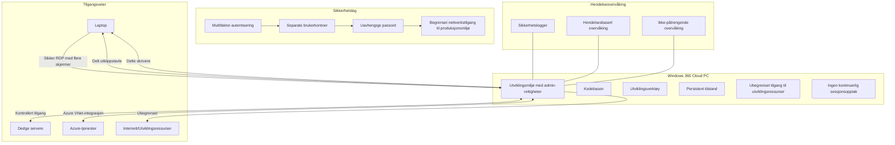
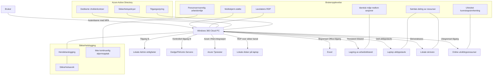
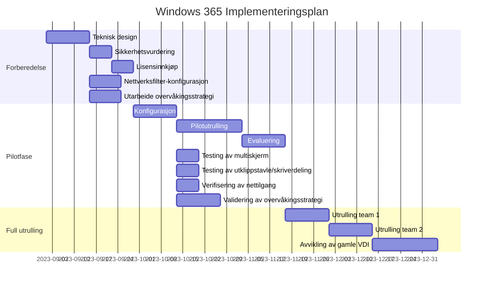

# Windows 365 Cloud PC - Løsningsforslag for Utviklingsmaskiner

## Innholdsfortegnelse
1. [Bakgrunn og formål](#bakgrunn-og-formål)
2. [Nåværende situasjon](#nåværende-situasjon)
3. [Foreslått løsning](#foreslått-løsning)
4. [Sikkerhetsvurdering](#sikkerhetsvurdering)
5. [Teknisk implementasjon](#teknisk-implementasjon)
6. [Fordeler med løsningen](#fordeler-med-løsningen)
7. [Risikofaktorer og håndtering](#risikofaktorer-og-håndtering)
8. [Implementeringsplan](#implementeringsplan)
9. [Juridiske og personvernsmessige hensyn](#juridiske-og-personvernsmessige-hensyn)
10. [Konklusjon](#konklusjon)

## Bakgrunn og formål

Utviklingsavdelingen ved Dedge har behov for effektive og sikre utviklingsmaskiner for å arbeide med ulike teknologier som Cobol, .NET C#, PowerShell, webløsninger og andre utviklingsverktøy. Dette dokumentet presenterer et løsningsforslag for migrering fra dagens VDI-løsning hostet hos Digiplex til en Windows 365 Cloud PC-løsning hostet i Azure.

Formålet er å balansere utviklernes behov for fleksibilitet og administrative rettigheter med organisasjonens sikkerhetskrav, samtidig som vi utnytter fordelene ved sky-baserte løsninger.

## Nåværende situasjon

I dag benytter utviklere VDI-løsninger som er hostet hos Digiplex. Følgende utfordringer er identifisert med nåværende oppsett:

1. Utviklere har administrative rettigheter, noe som representerer en potensiell sikkerhetsrisiko
2. Samme brukernavn og passord benyttes på både laptop og VDI, som øker risikoen ved kompromittering
3. Begrenset skalerbarhet i eksisterende infrastruktur
4. Økt ressursbehov for moderne utviklingsverktøy
5. Begrensninger av nettadresser hindrer tilgang til nødvendige utviklingsressurser
6. Sessjonsopptak og kontinuerlig skjermovervåking gjennom CyberArk på privilegerte servere skaper utfordringer for utviklingsarbeidet

## Foreslått løsning

Vi foreslår å implementere Windows 365 Cloud PC-løsninger i Azure for utviklerne. Denne løsningen vil være spesialtilpasset utviklingsarbeid og vil ha følgende nøkkelkomponenter:

### Brukerautentisering og tilgangskontroll

- Separate brukerkontoer uavhengig av eksisterende VDI-løsning og laptop-innlogging
- Unike passord som ikke deles med andre systemer
- Mulighet for multifaktor-autentisering via Microsoft Authenticator
- Lokale administrative rettigheter begrenses til utviklingsmaskinen
- **Ingen kontinuerlig sessjonsopptak** av utviklerens arbeidsflate, i motsetning til CyberArk-tilnærmingen på privilegerte servere

### Tekniske spesifikasjoner

- Windows 365 Enterprise-lisenser med dedikerte ressurser
- **Persistent tilstand**: Alle Cloud PC-er beholder nøyaktig tilstand mellom sesjoner
- **Multiscreen-støtte**: Fullstendig støtte for RDP med flere skjermer
- **Delt utklippstavle**: Sømløs kopiering og liming mellom laptop og Cloud PC
- **Skriverdeling**: Tilgang til lokale skrivere fra Cloud PC
- **Ubegrenset nettilgang**: Fulltilgang til utviklingsressurser inkludert YouTube, Reddit og andre kunnskapsplattformer
- Optimalisert for RDP-ytelse med lav latens
- Tilrettelagt for installasjon av utviklingsverktøy og redigering av systeminnstillinger
- Tilgang til Excel (kun) fra Microsoft Office-pakken for Cobol-integrasjon

### Nettverkstilgang

- Sikker tilgang til eksisterende servere for Dedge og FkKonto
- Konfigurert for tilgang til nye Azure-baserte tjenester under abonnementene P-Dedge og T-Dedge
- Tilgang til lokale disker på utviklernes laptoper, men ikke nettverksdisker
- Åpen tilgang til tekniske informasjonskilder og videobaserte opplæringsressurser på nett

### Overvåking og personvern

- Selektiv logging av sikkerhetsrelevante hendelser fremfor kontinuerlig skjermopptak
- Balansert tilnærming til sikkerhet som respekterer utviklernes arbeidsmiljø og personvern
- Differensiert sikkerhetstilnærming mellom produksjonsservere og utviklingsmiljøer

## Sikkerhetsvurdering

Selv om løsningen gir utviklere administrative rettigheter, implementeres flere sikkerhetslag:

1. **Segmentering**: Separate brukerkontoer uten kobling til hovedbrukerkontoen
2. **Multifaktor-autentisering**: Ekstra sikkerhetslag ved innlogging
3. **Nettverksisolasjon**: Begrenset og kontrollert nettverkstilgang til produksjonsmiljøer, men ubegrenset tilgang til utviklingsressurser
4. **Målrettet overvåking**: Logging og monitorering av sikkerhetsrelevante hendelser på Windows 365-maskinene, uten kontinuerlig sessjonsopptak
5. **Sikkerhetsoppdateringer**: Automatisert utrulling av kritiske sikkerhetsoppdateringer
6. **Moderne sikkerhetsløsninger**: Beskyttelse mot skadelig kode uten å begrense tilgangen til legitime kunnskapsressurser

## Teknisk implementasjon

Implementasjonen vil involvere følgende komponenter:

1. **Windows 365 Enterprise**: 
   - Gir mulighet for tilpasning av maskinvare og programvare
   - Sikrer fullstendig **persistent tilstand** mellom alle sesjoner - maskinen forblir nøyaktig slik utvikleren forlot den
   - Støtter **flere skjermer i RDP** med opptil 16 skjermer, 4K-oppløsning, og opptil 32-bit fargegjengivelse

2. **Azure Active Directory**: Håndterer separate brukerkontoer og tilgangsstyring

3. **Sikker nettverksforbindelse**: 
   - VNet-integrasjon mellom Windows 365 og Azure-tjenester
   - Ingen blokkering av legitime utviklingsressurser på nett (YouTube, Reddit, Stack Overflow, etc.)
   - Sikre nettfiltre som beskytter mot skadelig kode uten å hindre tilgang til teknisk innhold

4. **Hybrid tilkobling**: Sikker forbindelse til eksisterende on-premises infrastruktur

5. **Optimalisert RDP-opplevelse**:
   - Konfigurert for UDP-transport for bedre ytelse
   - Støtte for høy bildekvalitet og lyd
   - **Delt utklippstavle** for sømløs kopiering og liming av tekst, kode, bilder og filer
   - **Tilgang til lokale skrivere** fra Cloud PC-miljøet
   - Overføring av lokale ressurser som tastaturevent, mus, og kopier/lim inn

6. **Personvernvennlig overvåking**:
   - Målrettet logging av sikkerhetsrelevante hendelser
   - Ingen kontinuerlig skjermopptak som med CyberArk
   - Balansert tilnærming mellom sikkerhet og personvern

## Fordeler med løsningen

1. **Økt sikkerhet**: Segmentering av utviklingsmiljøer fra produksjons- og kontormiljøer
2. **Forbedret fleksibilitet**: Utviklere kan selvstendig installere nødvendige verktøy
3. **Skalerbarhet**: Enkel oppskalering av ressurser etter behov
4. **Moderne infrastruktur**: Utnyttelse av sky-fordeler som høy tilgjengelighet
5. **Kostnadskontroll**: Forutsigbar abonnementsmodell i stedet for store investeringer
6. **Geografisk fleksibilitet**: Mulighet for tilgang fra ulike lokasjoner
7. **Persistent tilstand**: Utviklere kan fortsette nøyaktig der de slapp, med alle programmer, filer og vinduer i samme tilstand
8. **Optimal arbeidsflyt**: Støtte for flere skjermer sikrer at utviklere kan arbeide effektivt med komplekse oppgaver
9. **Sømløs integrasjon**: Delt utklippstavle og skrivere eliminerer barrierer mellom lokal og cloud-basert arbeidsflate
10. **Ubegrenset kunnskapstilgang**: Utviklere får tilgang til alle relevante kunnskapsressurser uten unødige begrensninger
11. **Forbedret arbeidsmiljø**: Eliminering av kontinuerlig sessjonsopptak som i CyberArk-løsninger, til fordel for en mer målrettet og ikke-påtrengende sikkerhetsovervåking

## Risikofaktorer og håndtering

| Risiko | Sannsynlighet | Konsekvens | Håndtering |
|--------|---------------|------------|------------|
| Misbruk av administrative rettigheter | Middels | Høy | Målrettet overvåking, logging av sikkerhetsrelevante hendelser, segmentering fra produksjonsmiljø |
| Dataeksfiltrering | Lav | Høy | Kontrollert nettverkstilgang til sensitive systemer, DLP-løsninger |
| Kompromitterte brukerkontoer | Lav | Høy | MFA, separate passord, overvåking av unormal aktivitet |
| Utilstrekkelig ytelse | Middels | Middels | Skalerbare maskinprofiler, ytelseovervåking |
| Nettverksproblemer | Lav | Høy | Redundant nettverkstilkobling, fallback-løsninger |
| Problemer med multiskjerm-konfigurasjon | Lav | Middels | Standardisert RDP-konfigurasjon, brukerdokumentasjon |
| Problemer med delt utklippstavle/skrivere | Lav | Middels | Dokumentert oppsett, testing av skriverkompatibilitet |
| Sikkerhetsproblemer fra ubegrenset nettilgang | Lav | Middels | Moderne endepunktbeskyttelse, Advanced Threat Protection, og sikkerhetsopplæring |
| Manglende sporbarhet uten sessjonsopptak | Lav | Middels | Hendelsesbasert logging, versionskontrollsystemer for kode, avviksdeteksjon |

## Implementeringsplan

Implementeringen foreslås gjennomført i faser for å sikre en kontrollert overgang og mulighet for justering underveis.

## Juridiske og personvernsmessige hensyn

### Arbeidsmiljølovgivning og personvern

Kontinuerlig sessjonsopptak og skjermovervåking av arbeidstakeres aktivitet reiser flere juridiske og etiske problemstillinger:

1. **Arbeidsmiljøloven**: Etter norsk arbeidsmiljølovgivning (§ 9-1) skal kontrolltiltak som iverksettes ha saklig grunn i virksomhetens forhold, og ikke innebære en uforholdsmessig belastning for arbeidstakeren. Kontinuerlig overvåking av utvikleres arbeid via skjermopptak kan være i strid med dette prinsippet når det gjelder utviklingsmiljøer som primært er arbeidsverktøy.

2. **Personvernforordningen (GDPR)**: 
   - Prinsippet om dataminimering: Kontinuerlig opptak av skjermaktivitet strider mot prinsippet om å begrense datainnsamling til det som er nødvendig for å oppnå formålet.
   - Proporsjonalitet: Overvåkingstiltakene må stå i forhold til risikoen. For utviklingsmiljøer er det ofte tilstrekkelig med logging av spesifikke sikkerhetsrelevante hendelser.

3. **Differensiering mellom miljøer**: Det er juridisk grunnlag for forskjellige sikkerhetstiltak i ulike miljøer:
   - Produksjonsmiljøer med privilegert tilgang til sensitive data: Strengere kontroller som CyberArk med sessjonsopptak kan være berettiget
   - Utviklingsmiljøer: En mer balansert tilnærming som respekterer utviklernes personvern og arbeidsmiljø er hensiktsmessig

### Anbefalte retningslinjer

Basert på juridisk rammeverk og beste praksis, anbefaler vi:

1. **Målrettet overvåking**: Fokusere på logging av spesifikke sikkerhetsrelevante hendelser fremfor kontinuerlig opptak av all aktivitet
2. **Transparent kommunikasjon**: Tydelig informere utviklere om hvilke sikkerhetslogger som samles inn og hvorfor
3. **Differensiert tilnærming**: Tydeligere skille mellom sikkerhetstiltak i produksjonsmiljøer versus utviklingsmiljøer
4. **Balansegang**: Sikre nødvendig sikkerhet samtidig som man respekterer utviklernes arbeidsforhold og personvern

Denne tilnærmingen vil gi en mer hensiktsmessig balanse mellom sikkerhets- og personvernhensyn, og er sannsynligvis mer i tråd med norsk lovgivning og GDPR.

## Konklusjon

Windows 365 Cloud PC representerer en balansert løsning som ivaretar både utviklernes behov for fleksibilitet og administrative rettigheter, samtidig som organisasjonens sikkerhetskrav adresseres gjennom flere lag med sikkerhetstiltak. 

Løsningen sikrer viktige utviklerkrav:
- **Persistent tilstand**: Alle programmer, filer og vinduer forblir nøyaktig i samme tilstand mellom sesjoner, noe som øker produktiviteten betraktelig
- **Multiskjerm-støtte**: Full støtte for flere skjermer i RDP, så utviklere kan utnytte hele skjermområdet sitt effektivt
- **Delt utklippstavle og skrivere**: Sømløs deling av utklippstavle og skrivere mellom laptop og Cloud PC sikrer en integrert arbeidsopplevelse
- **Administrative rettigheter**: Utviklere har nødvendig frihet til å tilpasse miljøet etter behov
- **Sikker separasjon**: Løsningen sikrer god isolasjon fra andre systemer og brukerkontoer
- **Ubegrenset tilgang til utviklingsressurser**: Ingen blokkering av legitime kunnskapskilder som Reddit, YouTube, Stack Overflow og andre ressurser utviklere trenger for å løse tekniske utfordringer
- **Personvern og arbeidsmiljø**: Eliminering av kontinuerlig sessjonsopptak som i CyberArk-løsninger, til fordel for en mer målrettet og ikke-påtrengende sikkerhetsovervåking

Vi anbefaler å gå videre med en pilotutrulling for en mindre gruppe utviklere for å validere løsningen før full implementering.

---

**Vedlegg:**
1. Detaljert teknisk spesifikasjon for Windows 365-maskiner
2. Sikkerhetsevaluering
3. Kostnadsanalyse
4. Implementeringsdetaljer
5. Juridisk vurdering av overvåking i utviklingsmiljøer 