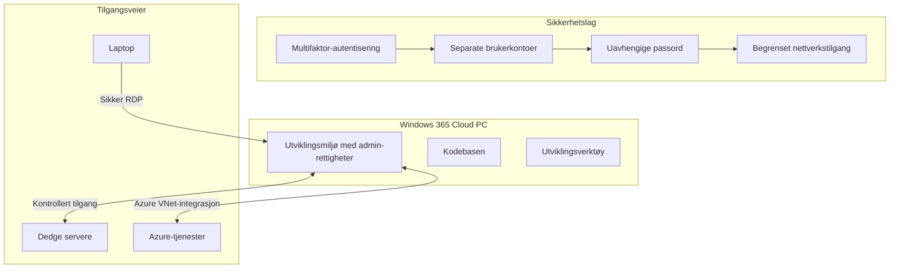
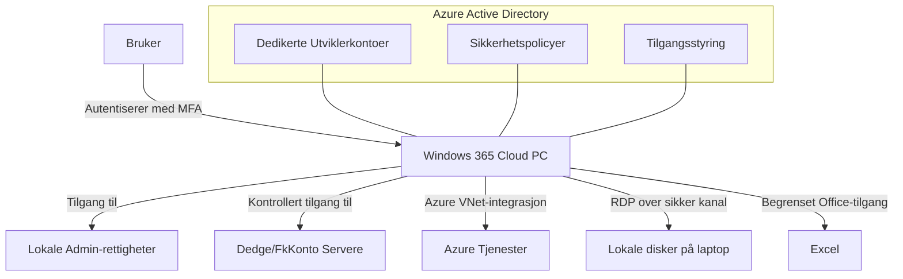
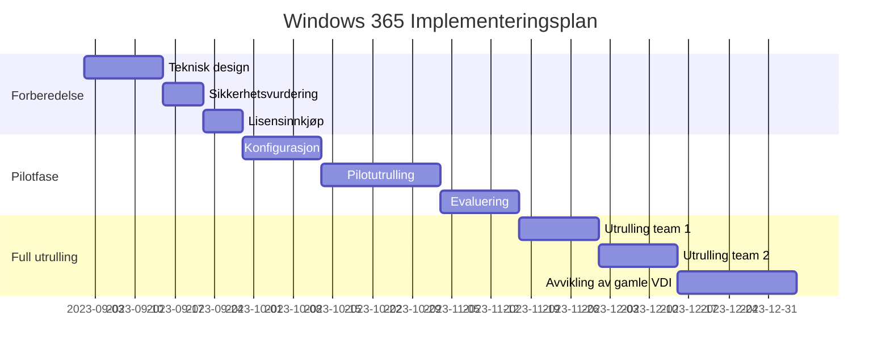

# Windows 365 Cloud PC - Løsningsforslag for Utviklingsmaskiner

## Innholdsfortegnelse
1. [Bakgrunn og formål](#bakgrunn-og-formål)
2. [Nåværende situasjon](#nåværende-situasjon)
3. [Foreslått løsning](#foreslått-løsning)
4. [Sikkerhetsvurdering](#sikkerhetsvurdering)
5. [Teknisk implementasjon](#teknisk-implementasjon)
6. [Fordeler med løsningen](#fordeler-med-løsningen)
7. [Risikofaktorer og håndtering](#risikofaktorer-og-håndtering)
8. [Implementeringsplan](#implementeringsplan)
9. [Konklusjon](#konklusjon)

## Bakgrunn og formål

Utviklingsavdelingen ved Dedge har behov for effektive og sikre utviklingsmaskiner for å arbeide med ulike teknologier som Cobol, .NET C#, PowerShell, webløsninger og andre utviklingsverktøy. Dette dokumentet presenterer et løsningsforslag for migrering fra dagens VDI-løsning hostet hos Digiplex til en Windows 365 Cloud PC-løsning hostet i Azure.

Formålet er å balansere utviklernes behov for fleksibilitet og administrative rettigheter med organisasjonens sikkerhetskrav, samtidig som vi utnytter fordelene ved sky-baserte løsninger.

## Nåværende situasjon

I dag benytter utviklere VDI-løsninger som er hostet hos Digiplex. Følgende utfordringer er identifisert med nåværende oppsett:

1. Utviklere har administrative rettigheter, noe som representerer en potensiell sikkerhetsrisiko
2. Samme brukernavn og passord benyttes på både laptop og VDI, som øker risikoen ved kompromittering
3. Begrenset skalerbarhet i eksisterende infrastruktur
4. Økt ressursbehov for moderne utviklingsverktøy

## Foreslått løsning

Vi foreslår å implementere Windows 365 Cloud PC-løsninger i Azure for utviklerne. Denne løsningen vil være spesialtilpasset utviklingsarbeid og vil ha følgende nøkkelkomponenter:

### Brukerautentisering og tilgangskontroll

- Separate brukerkontoer uavhengig av eksisterende VDI-løsning og laptop-innlogging
- Unike passord som ikke deles med andre systemer
- Mulighet for multifaktor-autentisering via Microsoft Authenticator
- Lokale administrative rettigheter begrenses til utviklingsmaskinen

### Tekniske spesifikasjoner

- Windows 365 Enterprise-lisenser med dedikerte ressurser
- Optimalisert for RDP med støtte for flere skjermer
- Tilrettelagt for installasjon av utviklingsverktøy og redigering av systeminnstillinger
- Tilgang til Excel (kun) fra Microsoft Office-pakken for Cobol-integrasjon

### Nettverkstilgang

- Sikker tilgang til eksisterende servere for Dedge og FkKonto
- Konfigurert for tilgang til nye Azure-baserte tjenester under abonnementene P-Dedge og T-Dedge
- Tilgang til lokale disker på utviklernes laptoper, men ikke nettverksdisker

## Sikkerhetsvurdering

Selv om løsningen gir utviklere administrative rettigheter, implementeres flere sikkerhetslag:

1. **Segmentering**: Separate brukerkontoer uten kobling til hovedbrukerkontoen
2. **Multifaktor-autentisering**: Ekstra sikkerhetslag ved innlogging
3. **Nettverksisolasjon**: Begrenset og kontrollert nettverkstilgang
4. **Overvåking**: Logging og monitorering av aktivitet på Windows 365-maskinene
5. **Sikkerhetsoppdateringer**: Automatisert utrulling av kritiske sikkerhetsoppdateringer

## Teknisk implementasjon

Implementasjonen vil involvere følgende komponenter:

1. **Windows 365 Enterprise**: Gir mulighet for tilpasning av maskinvare og programvare
2. **Azure Active Directory**: Håndterer separate brukerkontoer og tilgangsstyring
3. **Sikker nettverksforbindelse**: VNet-integrasjon mellom Windows 365 og Azure-tjenester
4. **Hybrid tilkobling**: Sikker forbindelse til eksisterende on-premises infrastruktur

## Fordeler med løsningen

1. **Økt sikkerhet**: Segmentering av utviklingsmiljøer fra produksjons- og kontormiljøer
2. **Forbedret fleksibilitet**: Utviklere kan selvstendig installere nødvendige verktøy
3. **Skalerbarhet**: Enkel oppskalering av ressurser etter behov
4. **Moderne infrastruktur**: Utnyttelse av sky-fordeler som høy tilgjengelighet
5. **Kostnadskontroll**: Forutsigbar abonnementsmodell i stedet for store investeringer
6. **Geografisk fleksibilitet**: Mulighet for tilgang fra ulike lokasjoner

## Risikofaktorer og håndtering

| Risiko | Sannsynlighet | Konsekvens | Håndtering |
|--------|---------------|------------|------------|
| Misbruk av administrative rettigheter | Middels | Høy | Overvåking, logging, segmentering fra produksjonsmiljø |
| Dataeksfiltrering | Lav | Høy | Kontrollert nettverkstilgang, DLP-løsninger |
| Kompromitterte brukerkontoer | Lav | Høy | MFA, separate passord, overvåking av unormal aktivitet |
| Utilstrekkelig ytelse | Middels | Middels | Skalerbare maskinprofiler, ytelseovervåking |
| Nettverksproblemer | Lav | Høy | Redundant nettverkstilkobling, fallback-løsninger |

## Implementeringsplan

Implementeringen foreslås gjennomført i faser for å sikre en kontrollert overgang og mulighet for justering underveis.

## Konklusjon

Windows 365 Cloud PC representerer en balansert løsning som ivaretar både utviklernes behov for fleksibilitet og administrative rettigheter, samtidig som organisasjonens sikkerhetskrav adresseres gjennom flere lag med sikkerhetstiltak. Løsningen vil gi utviklerne effektive arbeidsverktøy samtidig som risikoen knyttet til administrative rettigheter reduseres gjennom segmentering, multifaktor-autentisering og andre sikkerhetstiltak.

Vi anbefaler å gå videre med en pilotutrulling for en mindre gruppe utviklere for å validere løsningen før full implementering.

---

**Vedlegg:**
1. Detaljert teknisk spesifikasjon for Windows 365-maskiner
2. Sikkerhetsevaluering
3. Kostnadsanalyse
4. Implementeringsdetaljer 