# Generic Log Handler - Architecture Documentation

## Executive Summary

The Generic Log Handler is a **well-architected .NET 10 solution** following clean architecture principles with proper separation of concerns, dependency inversion, and extensibility patterns. This document provides a comprehensive architectural overview with diagrams.

---

## Architecture Assessment

### Overall Rating: ✅ Architecturally Sound

| Criteria | Score | Notes |
|----------|-------|-------|
| **Separation of Concerns** | ⭐⭐⭐⭐⭐ | Clear layering (Core → Data → Services) |
| **Dependency Inversion** | ⭐⭐⭐⭐⭐ | Interfaces for all major contracts |
| **Extensibility** | ⭐⭐⭐⭐⭐ | Plugin-style importers and parsers |
| **Testability** | ⭐⭐⭐⭐☆ | Good abstraction, but no test projects yet |
| **Resilience** | ⭐⭐⭐⭐⭐ | Retry logic, circuit breakers, graceful degradation |
| **Performance** | ⭐⭐⭐⭐⭐ | Streaming, batching, pagination, indexing |
| **Security** | ⭐⭐⭐⭐☆ | Windows Auth ready, rate limiting, but needs hardening |
| **Observability** | ⭐⭐⭐⭐⭐ | Serilog, audit logs, import status tracking |

---

## Solution Structure

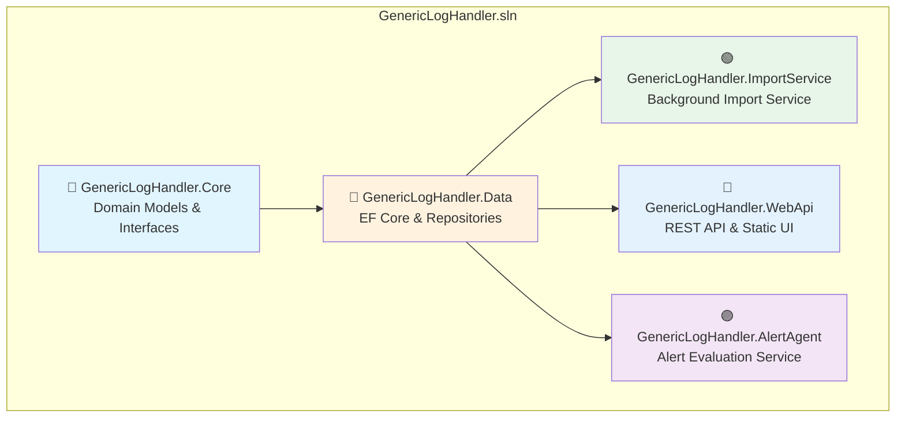

---

## Layer Architecture

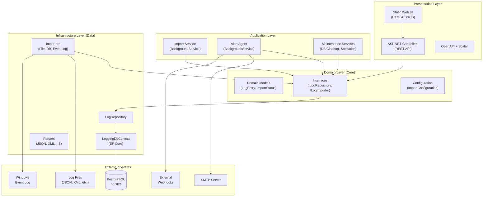

---

## Project Dependencies

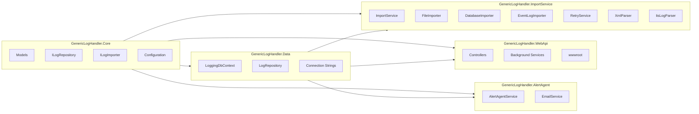

---

## Data Flow Diagrams

### Import Flow

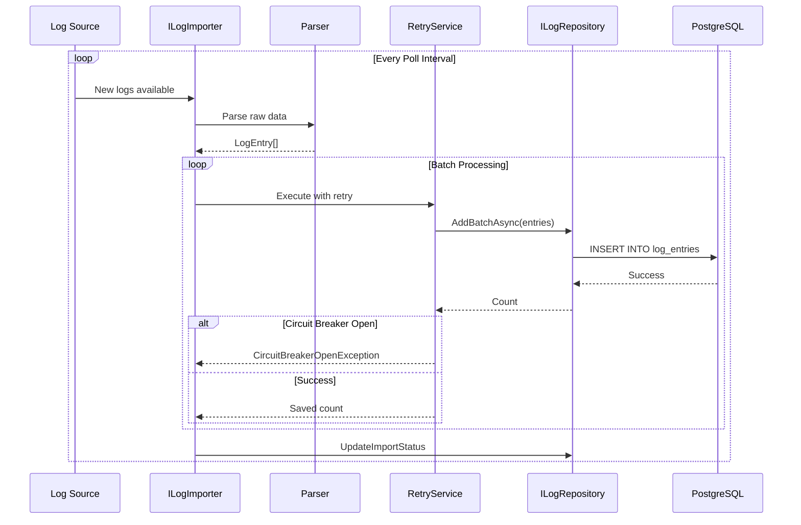

### Search Flow

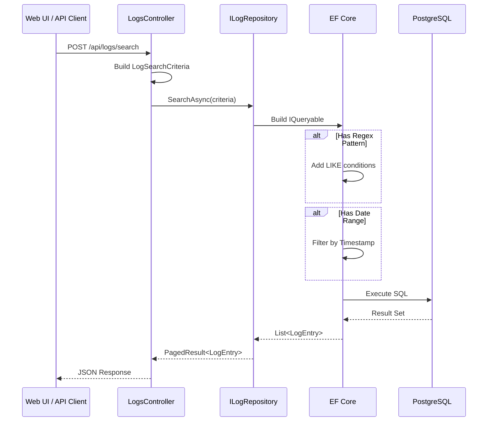

### Alert Evaluation Flow

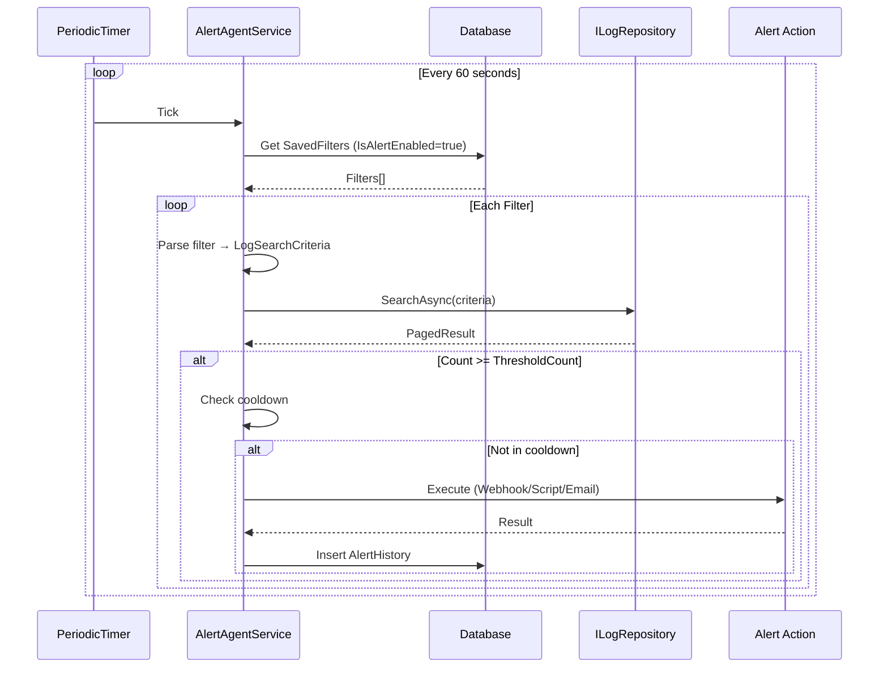

---

## Component Architecture

### Importer Strategy Pattern

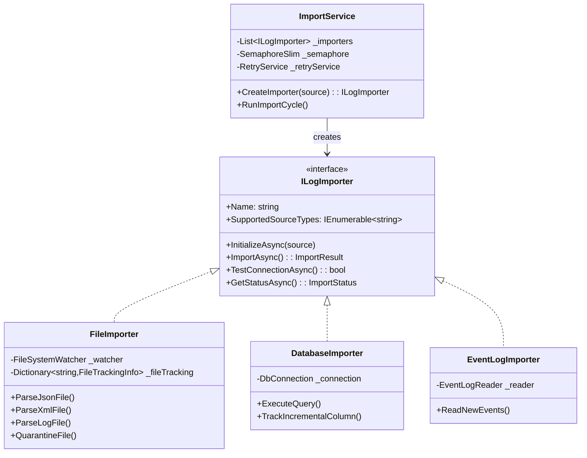

### Repository Pattern

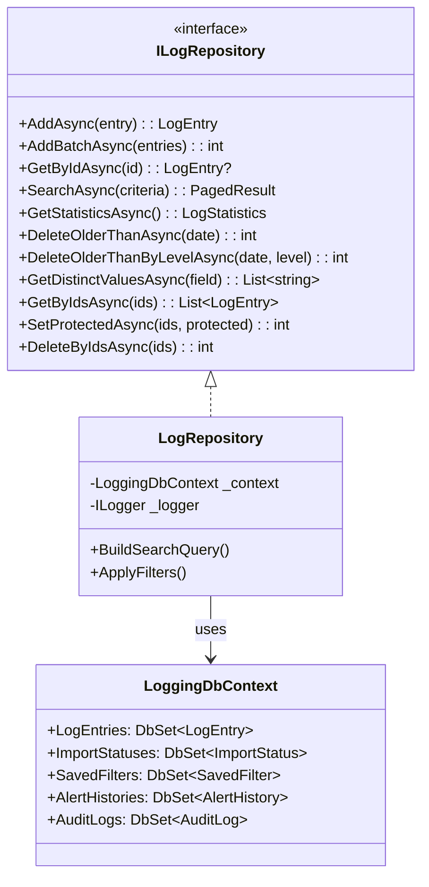

---

## Database Schema

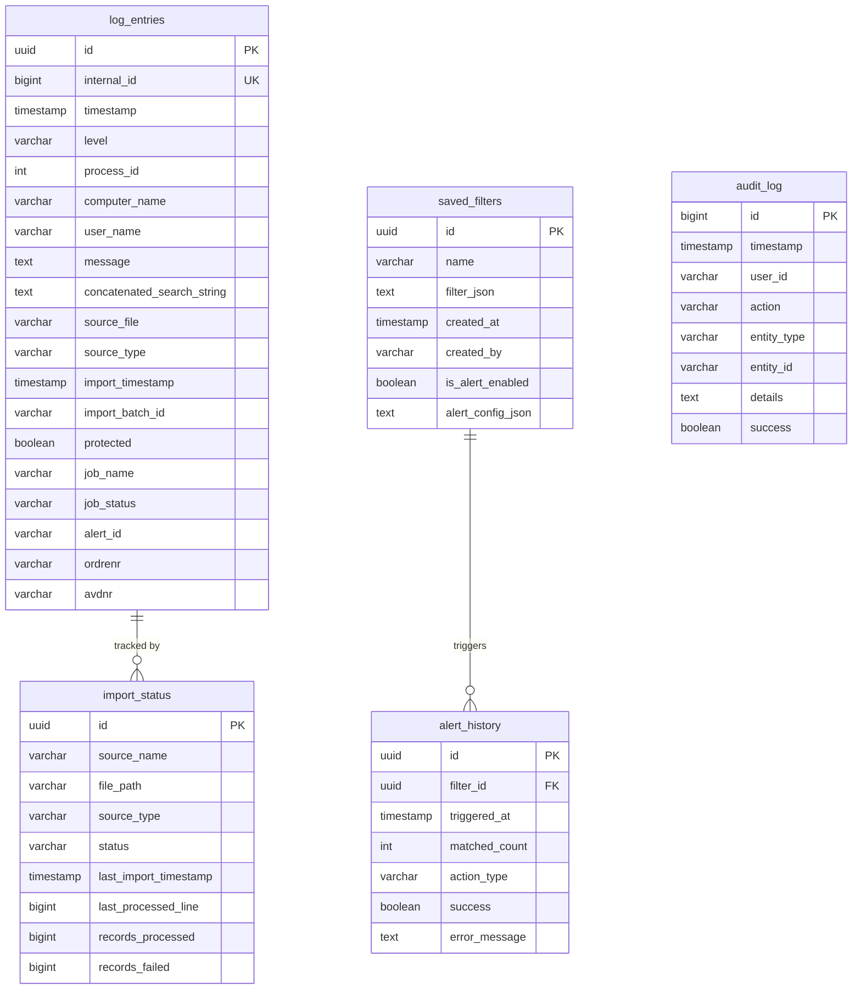

---

## Frontend Architecture

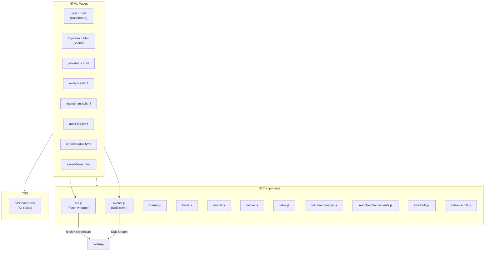

---

## Deployment Architecture

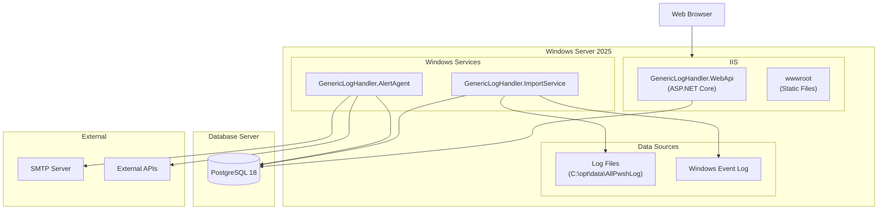

---

## Key Design Patterns

### 1. Repository Pattern
All database access goes through `ILogRepository`, isolating EF Core details from consumers.

### 2. Strategy Pattern
`ILogImporter` implementations (`FileImporter`, `DatabaseImporter`, `EventLogImporter`) are selected at runtime based on source configuration.

### 3. Factory Method
`ImportService.CreateImporter()` creates the appropriate importer based on `ImportSource.Type`.

### 4. Circuit Breaker
`RetryService` implements a circuit breaker to prevent cascading failures when a source is consistently failing.

### 5. Observer Pattern
Server-Sent Events (`EventsController`) notify connected clients of real-time updates.

### 6. Background Worker
`BackgroundService` implementations for long-running import, alert, and maintenance tasks.

---

## Strengths

| Aspect | Implementation |
|--------|----------------|
| **Clean Architecture** | Core has no dependencies on outer layers |
| **Multi-DB Support** | EF Core providers for PostgreSQL, DB2, SQL Server |
| **Streaming** | Large files processed line-by-line, not loaded entirely |
| **Batch Processing** | Configurable batch sizes for bulk inserts |
| **Hot Reload Config** | FileSystemWatcher monitors config files for changes |
| **Retry Logic** | Exponential backoff with jitter for transient failures |
| **Audit Trail** | All user actions logged to `audit_log` table |
| **Protected Entries** | Logs can be marked protected from automatic cleanup |
| **Quarantine** | Corrupted files moved to quarantine folder |
| **Real-time Updates** | SSE for live dashboard updates |

---

## Areas for Improvement

| Area | Recommendation |
|------|----------------|
| **Unit Tests** | Add test projects with xUnit/Moq |
| **Integration Tests** | Add Testcontainers for DB testing |
| **API Versioning** | Add `/api/v1/` prefix for future compatibility |
| **CQRS** | Consider separating read/write models for scale |
| **Message Queue** | Add RabbitMQ/Azure Service Bus for decoupling |
| **Caching** | Add Redis for frequently-accessed data |
| **Health Checks** | Expand `/health` with dependency checks |
| **OpenTelemetry** | Add distributed tracing |

---

## Technology Stack

| Layer | Technology |
|-------|------------|
| Runtime | .NET 10 |
| API Framework | ASP.NET Core 10 |
| ORM | Entity Framework Core 10 |
| Primary Database | PostgreSQL 18 |
| Alternative Databases | IBM DB2, SQL Server |
| Logging | Serilog |
| Authentication | Windows Authentication (Negotiate) |
| Web UI | Vanilla JavaScript (no framework) |
| Background Services | .NET Worker Service |
| Email | MailKit |
| Excel Export | ClosedXML |
| CSV Processing | CsvHelper |

---

## Conclusion

The Generic Log Handler solution follows **solid architectural principles** and is well-suited for its purpose as an enterprise log aggregation and alerting platform. The layered architecture, proper abstraction, and extensibility patterns make it maintainable and scalable.

The main areas for future investment are:
1. **Test coverage** - Critical for enterprise reliability
2. **Distributed tracing** - For production observability
3. **Caching layer** - For improved performance at scale

Overall: **Production-ready architecture** with room for incremental improvements.
