# Alert Agent Architecture

How the Alert Agent detects patterns across log entries, and how the full pipeline flows from raw log data through parsing, business identifier extraction, job correlation, and alert evaluation.

## System Overview

The GenericLogHandler has three runtime processes that work together:

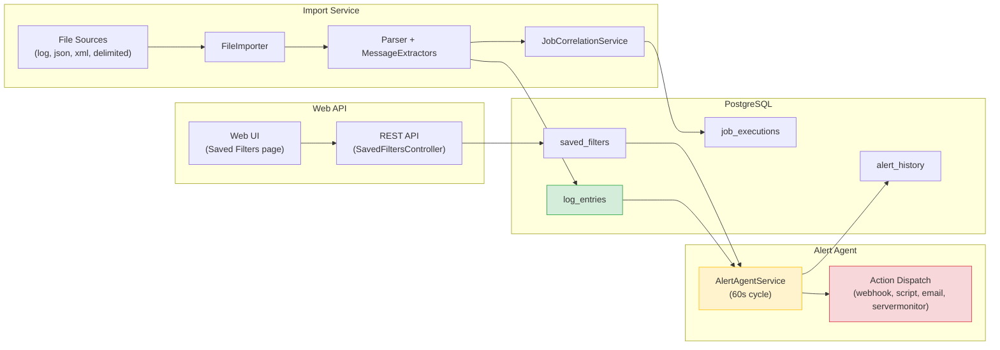

## The Two-Phase Pattern Detection Architecture

Pattern detection happens in **two distinct phases**, spread across two separate processes:

| Phase | Process | What It Does | Where Patterns Are Defined |
|-------|---------|-------------|---------------------------|
| **Phase 1: Extraction** | Import Service | Parses raw log lines and extracts business identifiers (Ordrenr, Avdnr, AlertId, JobName) using regex `MessageExtractors` from config | `import-config.json` → `Parser.MessageExtractors` |
| **Phase 2: Evaluation** | Alert Agent | Queries extracted fields in the database using saved filter criteria with time windows, thresholds, and cooldowns | `saved_filters` table → `FilterJson` + `AlertConfig` |

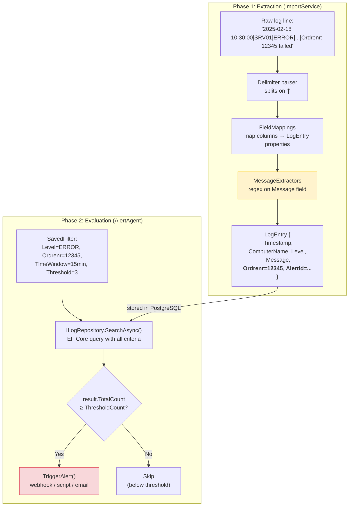

## Phase 1: MessageExtractors in import-config.json

MessageExtractors are regex patterns defined per import source. After each log line is parsed into fields (Timestamp, ComputerName, Level, Message, etc.), the extractors scan the **Message** field to pull out business identifiers.

### Config Structure

```json
{
  "ImportSources": [{
    "Name": "ServerMonitor Logs",
    "Type": "file",
    "Config": {
      "Parser": {
        "Delimiter": "|",
        "FieldMappings": {
          "0": { "TargetColumn": "Timestamp", "DateFormat": "yyyy-MM-dd HH:mm:ss" },
          "1": { "TargetColumn": "ComputerName" },
          "9": { "TargetColumn": "Message" }
        },
        "MessageExtractors": [
          {
            "Name": "ordrenr",
            "Pattern": "(?:ordrenr|ordrenummer|orderno)[:\\s=]+(?<value>\\d+)",
            "TargetColumn": "Ordrenr",
            "CaptureGroup": "value",
            "IgnoreCase": true
          }
        ]
      }
    }
  }]
}
```

### Extraction Flow

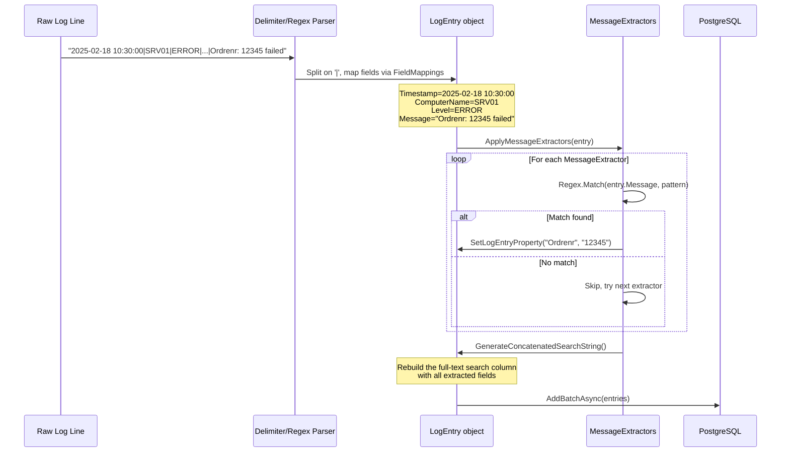

### MessageExtractor Properties

| Property | Type | Description |
|----------|------|-------------|
| `Name` | string | Identifier for logging (e.g., "ordrenr") |
| `Pattern` | string | Regex with named capture group |
| `TargetColumn` | string | LogEntry property to populate (e.g., "Ordrenr", "Avdnr", "AlertId") |
| `CaptureGroup` | string | Named group to extract (default: "value") |
| `IgnoreCase` | bool | Case-insensitive matching (default: true) |

### Standard Extractors Used Across Sources

These three extractors are configured on most import sources:

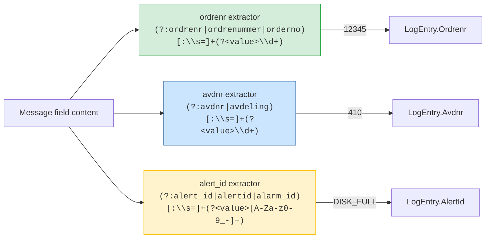

## Phase 1b: Job Correlation (Multi-Entry Pattern)

The `JobCorrelationService` in the Import Service performs **multi-entry pattern detection** by correlating "Started" and "Completed"/"Failed" log entries for the same job.

### How It Links Entries

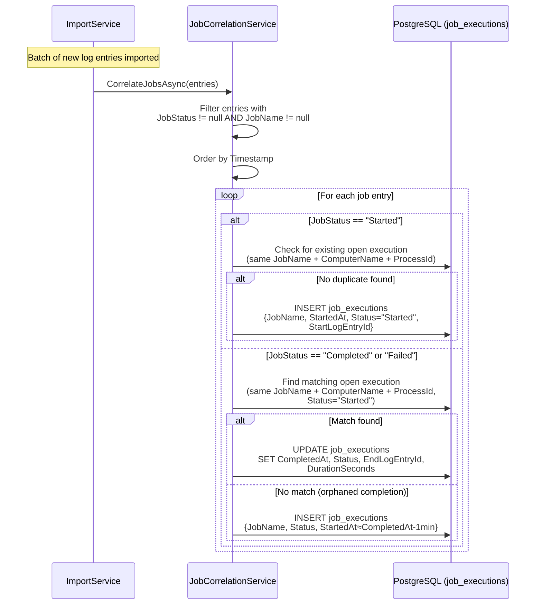

### JobExecution Lifecycle

```mermaid
statediagram-v2
    [*] --> Started : LogEntry with JobStatus="Started"
    Started --> Completed : LogEntry with JobStatus="Completed"<br/>(same JobName + ComputerName)
    Started --> Failed : LogEntry with JobStatus="Failed"
    Started --> TimedOut : No completion after<br/>OrphanTimeoutHours (default 24h)
    Completed --> [*]
    Failed --> [*]
    TimedOut --> [*]
```

### Job Correlation Config

Configured in `appsettings.json` under `JobTracking`:

| Property | Default | Description |
|----------|---------|-------------|
| `EnableJobCorrelation` | true | Enable/disable job linking |
| `OrphanTimeoutHours` | 24 | Hours before a started-but-not-completed job is marked TimedOut |
| `CheckIntervalMinutes` | 15 | How often to check for orphaned jobs |
| `AutoMarkOrphanedJobs` | true | Automatically mark orphans as TimedOut |
| `RetentionDays` | 90 | Days to keep job execution history |

## Phase 2: Alert Agent Evaluation

The Alert Agent is a separate background service that polls the database every 60 seconds.

### Alert Architecture

Alerts are **not** defined in `import-config.json`. They are defined through the Web UI and stored in the `saved_filters` database table. Each saved filter optionally has:

- `IsAlertEnabled` (bool) — tells the Alert Agent to evaluate this filter
- `FilterJson` — serialized search criteria (levels, message text, regex, business IDs, etc.)
- `AlertConfig` — serialized action configuration (type, threshold, cooldown, endpoints)

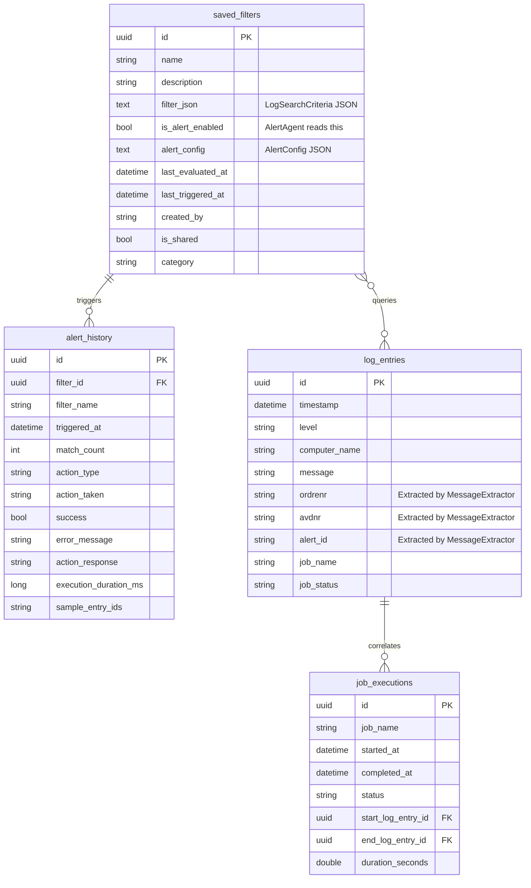

### Alert Agent Main Loop

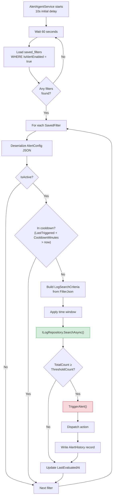

### Time Window Logic

The Alert Agent applies a time window to each query, so it only evaluates recent log entries:

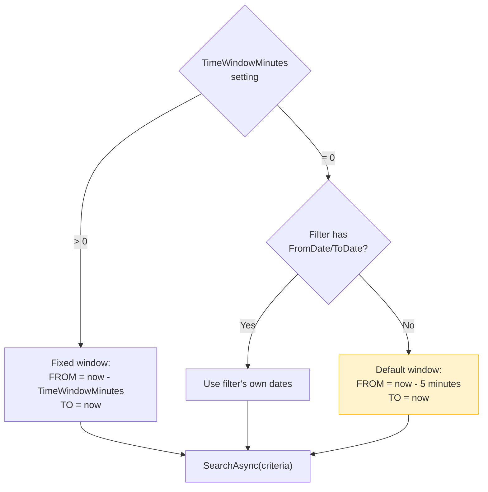

### Multi-Entry Pattern Detection Through Filters

The Alert Agent detects multi-entry patterns **through the combination of filter criteria and threshold**. A saved filter can match many entries across a time window:

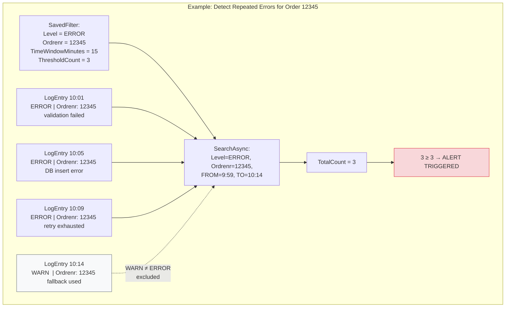

### AlertConfig Properties

| Property | Type | Default | Description |
|----------|------|---------|-------------|
| `Type` | string | "webhook" | Action type: `webhook`, `script`, `email`, `servermonitor` |
| `Endpoint` | string | — | URL (webhook/servermonitor) or file path (script) |
| `Method` | string | "POST" | HTTP method for webhooks |
| `Headers` | dict | {} | Custom HTTP headers for webhooks |
| `BodyTemplate` | string | — | Template with `{{filterName}}`, `{{matchCount}}`, `{{entries}}` |
| `ThresholdCount` | int | 1 | Minimum matches to trigger |
| `CooldownMinutes` | int | 15 | Suppress re-triggering within this window |
| `TimeWindowMinutes` | int | 0 | Search window (0 = last 5 min default) |
| `IncludeEntries` | bool | true | Include matching entries in payload |
| `MaxEntriesToInclude` | int | 10 | Max entries in payload |
| `IsActive` | bool | true | Enable/disable this alert |
| `ScriptArguments` | list | [] | Extra args for script actions |
| `EmailRecipients` | list | [] | Email addresses for email actions |
| `EmailSubject` | string | "Log Handler Alert: {{filterName}}" | Email subject template |
| `ServerMonitorSeverity` | string | "Warning" | Severity level for ServerMonitor |

## Action Dispatch

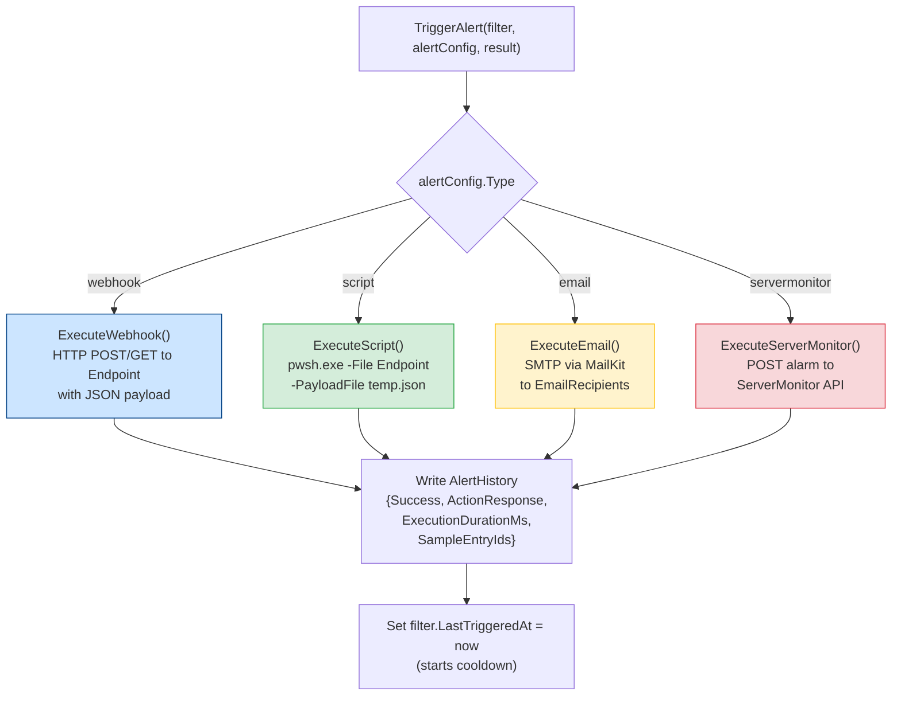

### Webhook Payload Structure

```json
{
  "FilterId": "guid",
  "FilterName": "Order 12345 Error Threshold",
  "TriggeredAt": "2025-02-18T10:14:00Z",
  "MatchCount": 3,
  "Threshold": 3,
  "Entries": [
    {
      "Id": "guid",
      "Timestamp": "2025-02-18T10:09:00Z",
      "Level": "ERROR",
      "ComputerName": "SRV01",
      "UserName": "SYSTEM",
      "Message": "Ordrenr: 12345 retry exhausted",
      "ErrorId": null,
      "Ordrenr": "12345",
      "Avdnr": null,
      "JobName": "OrderProcessing"
    }
  ]
}
```

If `BodyTemplate` is set, placeholders are replaced: `{{filterName}}`, `{{matchCount}}`, `{{threshold}}`, `{{triggeredAt}}`, `{{entries}}`.

## End-to-End: Raw Log to Alert

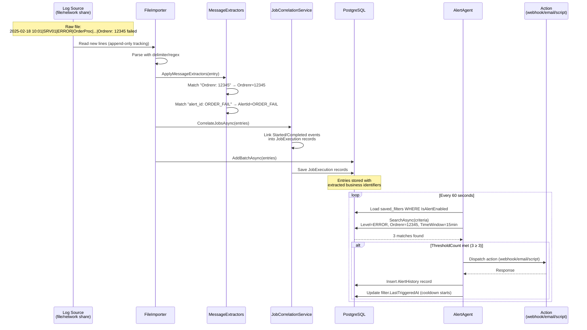

## Where Each Piece Is Configured

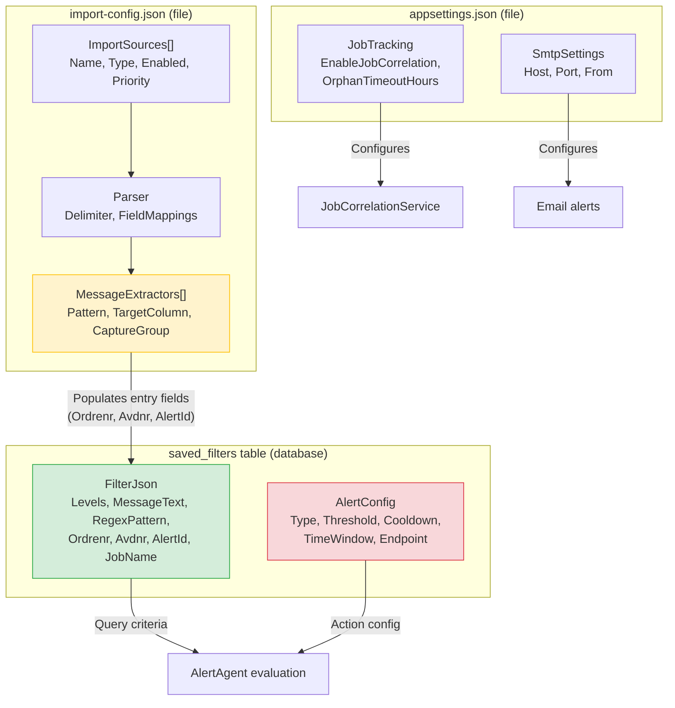

## Summary

| Concern | Where Configured | Where Executed | How It Works |
|---------|-----------------|----------------|-------------|
| **Line parsing** | `import-config.json` → `Parser.Delimiter` + `FieldMappings` | ImportService → FileImporter | Split line, map columns to LogEntry properties |
| **Business ID extraction** | `import-config.json` → `Parser.MessageExtractors[]` | ImportService → `ApplyMessageExtractors()` | Regex on Message field, populate Ordrenr/Avdnr/AlertId |
| **Job correlation** | `appsettings.json` → `JobTracking` | ImportService → `JobCorrelationService` | Match "Started"→"Completed" entries by JobName+Computer |
| **Alert filter criteria** | `saved_filters` table → `FilterJson` | AlertAgent → `BuildSearchCriteria()` | Multi-field query on log_entries with time window |
| **Alert threshold** | `saved_filters` table → `AlertConfig.ThresholdCount` | AlertAgent → `EvaluateFilter()` | Trigger only when match count ≥ threshold |
| **Alert action** | `saved_filters` table → `AlertConfig.Type` + `Endpoint` | AlertAgent → `TriggerAlert()` | Webhook, script, email, or ServerMonitor |
| **Alert cooldown** | `saved_filters` table → `AlertConfig.CooldownMinutes` | AlertAgent → cooldown check | Suppress re-triggering for N minutes |
| **Alert history** | `alert_history` table | AlertAgent → every trigger | Logs match count, action result, sample entry IDs |
