# Authentication System Extraction Analysis

## Executive Summary

The GenericLogHandler authentication system is a comprehensive, custom JWT-based solution that **can be extracted** into a standalone authentication service. This document analyzes the current architecture, extraction complexity, and multi-application integration strategy.

---

## Current Security Architecture

### Where is Security Enforced?

**Security is enforced at the BACKEND (API endpoints)**, not the frontend. The frontend only provides UX conveniences.

| Layer | Security Role |
|-------|---------------|
| **Backend (API)** | **Primary enforcement** - JWT validation, policy-based authorization, token refresh |
| **Frontend (JS)** | **UX only** - Token storage, redirect to login, hide/show UI elements |

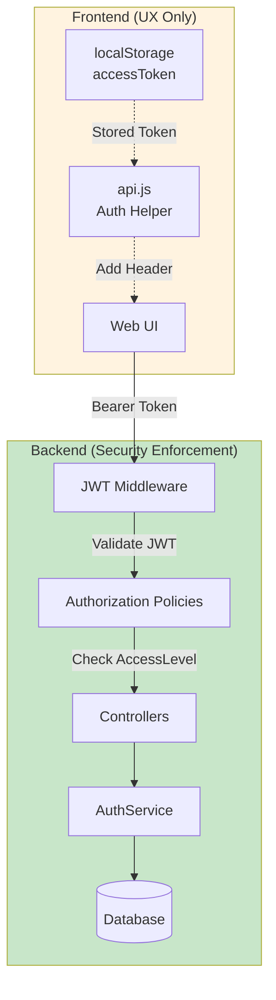

### Current Auth Components

| File | Purpose |
|------|---------|
| `Core/Models/Auth/User.cs` | User entity with AccessLevel enum |
| `Core/Models/Auth/LoginToken.cs` | Magic links, password reset tokens |
| `Core/Models/Auth/RefreshToken.cs` | Session refresh tokens |
| `Core/Models/Auth/AuthConfiguration.cs` | JWT settings, rules |
| `WebApi/Services/AuthService.cs` | All auth business logic |
| `WebApi/Services/AuthEmailService.cs` | Email sending |
| `WebApi/Controllers/AuthController.cs` | Auth API endpoints |
| `Data/LoggingDbContext.cs` | User, LoginToken, RefreshToken DbSets |
| `wwwroot/login.html` | Login UI |
| `wwwroot/js/api.js` | Frontend token management |

### Authorization Policies

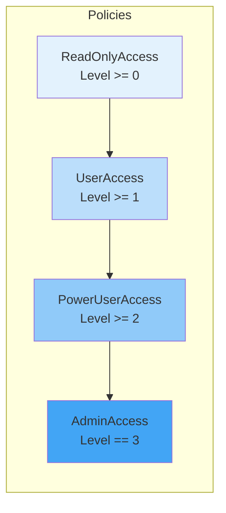

---

## Extraction Feasibility

### Complexity Assessment: **MODERATE**

| Aspect | Complexity | Notes |
|--------|------------|-------|
| Code separation | Low | Auth code is well-isolated in Services + Controllers |
| Database schema | Low | 3 tables (users, login_tokens, refresh_tokens) easily separable |
| Configuration | Low | `AuthConfiguration` is self-contained |
| JWT integration | Low | Standard JWT Bearer, easy to share signing key |
| Multi-app support | Moderate | Requires shared token validation, centralized user store |
| Frontend reuse | Low | `login.html` + `api.js` auth functions are portable |

### What Needs Extraction

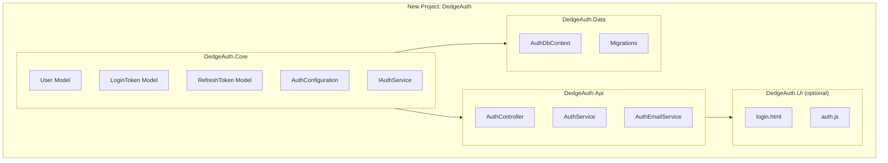

---

## Multi-Application Architecture

### Option 1: Centralized Auth Service (Recommended)

A standalone authentication microservice that all applications use.

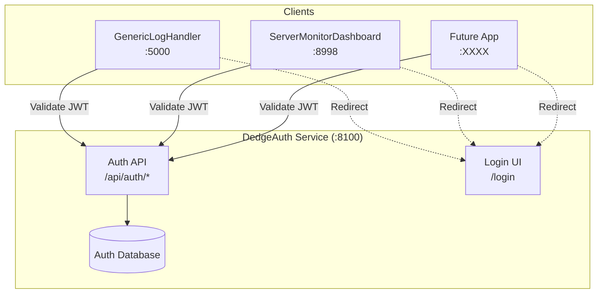

#### Authentication Flow

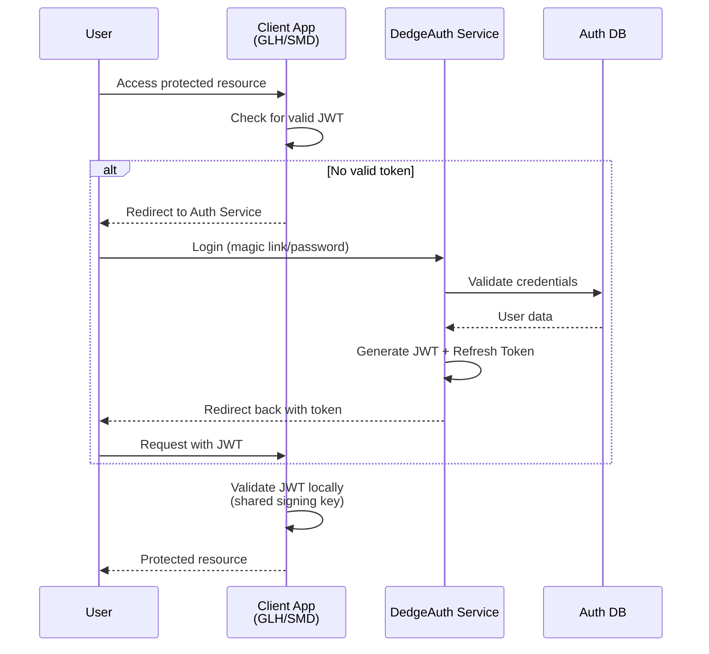

#### Key Benefits
- **Single user database** - Users register once, access all apps
- **Centralized management** - Admin UI in one place
- **Consistent security** - Same policies everywhere
- **Easy onboarding** - New apps just add JWT validation

#### Client App Integration

Each client app needs minimal code:

```csharp
// Program.cs in any client app
builder.Services.AddAuthentication(JwtBearerDefaults.AuthenticationScheme)
    .AddJwtBearer(options =>
    {
        options.TokenValidationParameters = new TokenValidationParameters
        {
            ValidateIssuer = true,
            ValidateAudience = true,
            ValidIssuer = "DedgeAuth",
            ValidAudience = "FKApps",  // or specific app
            IssuerSigningKey = new SymmetricSecurityKey(sharedKey)
        };
    });

// Add same authorization policies
builder.Services.AddAuthorization(options =>
{
    options.AddPolicy("PowerUserAccess", policy =>
        policy.RequireClaim("accessLevel", "2", "3"));
});
```

### Option 2: Shared Library (Simpler, Less Ideal)

Each app embeds the auth library but uses a shared database.

```mermaid
flowchart TB
    subgraph SharedDB["Shared Auth Database"]
        DB[(users<br/>login_tokens<br/>refresh_tokens)]
    end
    
    subgraph GLH["GenericLogHandler"]
        GLH_REF[DedgeAuth.Core<br/>DedgeAuth.Data<br/>DedgeAuth.Services]
        GLH_AUTH[/api/auth/*]
    end
    
    subgraph SMD["ServerMonitorDashboard"]
        SMD_REF[DedgeAuth.Core<br/>DedgeAuth.Data<br/>DedgeAuth.Services]
        SMD_AUTH[/api/auth/*]
    end
    
    GLH_REF --> DB
    SMD_REF --> DB
```

#### Drawbacks
- Duplicate auth endpoints in each app
- Code updates require redeploying all apps
- More complex versioning

---

## ServerMonitorDashboard Integration

### Current State
- No authentication (anonymous access)
- ASP.NET Core 10 Web API + static UI
- Port 8998

### Integration Steps

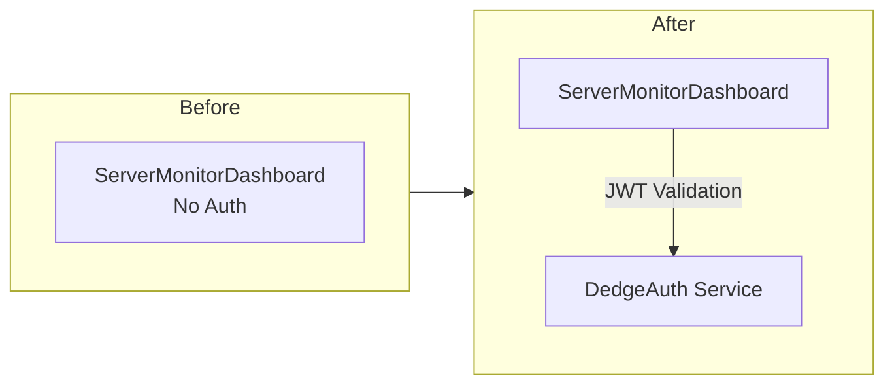

1. **Add NuGet packages**: `Microsoft.AspNetCore.Authentication.JwtBearer`
2. **Configure JWT validation** in `Program.cs` (shared signing key with DedgeAuth)
3. **Add authorization policies** (same as GenericLogHandler)
4. **Add `[Authorize]` attributes** to controllers
5. **Update frontend** to use DedgeAuth login or embed auth.js

### Minimal Code Changes for SMD

| File | Change |
|------|--------|
| `Program.cs` | Add JWT authentication + policies (~30 lines) |
| `Controllers/*.cs` | Add `[Authorize(Policy = "...")]` attributes |
| `wwwroot/js/*.js` | Add token handling from api.js |
| `appsettings.json` | Add auth configuration section |

---

## Proposed Project Structure

```
C:\opt\src\DedgeAuth\
├── DedgeAuth.sln
├── src\
│   ├── DedgeAuth.Core\                    # Models, interfaces
│   │   ├── Models\
│   │   │   ├── User.cs
│   │   │   ├── LoginToken.cs
│   │   │   ├── RefreshToken.cs
│   │   │   └── AuthConfiguration.cs
│   │   └── Interfaces\
│   │       └── IAuthService.cs
│   │
│   ├── DedgeAuth.Data\                    # Database context, migrations
│   │   ├── AuthDbContext.cs
│   │   └── Migrations\
│   │
│   ├── DedgeAuth.Services\                # Shared services (can be used by client apps)
│   │   ├── AuthService.cs
│   │   ├── AuthEmailService.cs
│   │   └── JwtTokenService.cs
│   │
│   ├── DedgeAuth.Api\                     # Standalone auth service
│   │   ├── Controllers\
│   │   │   └── AuthController.cs
│   │   ├── Program.cs
│   │   └── wwwroot\
│   │       ├── login.html
│   │       └── js\
│   │           └── auth.js
│   │
│   └── DedgeAuth.Client\                  # NuGet package for client apps
│       ├── Extensions\
│       │   └── AuthServiceCollectionExtensions.cs
│       └── Middleware\
│           └── JwtValidationMiddleware.cs
```

---

## Implementation Roadmap

### Phase 1: Extract (Estimated: 2-3 hours)
- [ ] Create DedgeAuth solution structure
- [ ] Move auth models to DedgeAuth.Core
- [ ] Move DbContext tables to DedgeAuth.Data
- [ ] Move AuthService to DedgeAuth.Services
- [ ] Create DedgeAuth.Api with auth endpoints

### Phase 2: Integrate GenericLogHandler (Estimated: 1 hour)
- [ ] Add DedgeAuth.Client reference
- [ ] Update Program.cs to use DedgeAuth
- [ ] Remove embedded auth code (keep as fallback option)
- [ ] Test all auth flows

### Phase 3: Integrate ServerMonitorDashboard (Estimated: 1-2 hours)
- [ ] Add JWT authentication to Program.cs
- [ ] Add authorization policies
- [ ] Add `[Authorize]` attributes to controllers
- [ ] Add frontend token handling
- [ ] Test protected endpoints

### Phase 4: Polish (Estimated: 1 hour)
- [ ] Create DedgeAuth.Client NuGet package
- [ ] Add configuration documentation
- [ ] Create admin scripts

---

## Database & Deployment

### Database: PostgreSQL

DedgeAuth will use **PostgreSQL** (same as GenericLogHandler) for consistency and reliability.

#### Database Schema

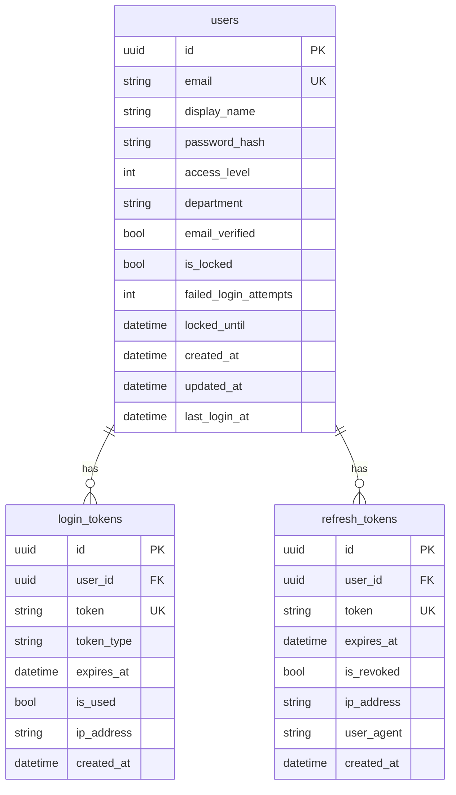

### Automated Setup Script

The DedgeAuth project will include a self-sufficient setup script that:

1. Detects or installs PostgreSQL
2. Creates the database
3. Runs migrations
4. Seeds default admin users
5. Configures and starts the service

```powershell
# Install-DedgeAuth.ps1 - Self-sufficient setup script

param(
    [string]$InstallPath = "C:\opt\apps\DedgeAuth",
    [int]$Port = 8100,
    [ValidateSet("Service", "IIS", "Kestrel")]
    [string]$HostingMode = "Service"
)

# --- PostgreSQL Detection/Installation ---

function Get-PostgresPath {
    # 1. Check if psql is in PATH
    $psql = Get-Command psql -ErrorAction SilentlyContinue
    if ($psql) { return Split-Path $psql.Source -Parent }
    
    # 2. Check common installation paths
    $commonPaths = @(
        "C:\Program Files\PostgreSQL\18\bin",
        "C:\Program Files\PostgreSQL\17\bin",
        "C:\Program Files\PostgreSQL\16\bin"
    )
    foreach ($path in $commonPaths) {
        if (Test-Path "$path\psql.exe") { return $path }
    }
    
    # 3. Ask user or install via winget
    $choice = Read-Host "PostgreSQL not found. [I]nstall via winget, or [P]rovide path?"
    if ($choice -eq 'I') {
        Write-Host "Installing PostgreSQL via winget..."
        winget install PostgreSQL.PostgreSQL.18 --accept-package-agreements
        return "C:\Program Files\PostgreSQL\18\bin"
    } else {
        return Read-Host "Enter path to PostgreSQL bin folder"
    }
}

$pgBin = Get-PostgresPath
$env:PATH = "$pgBin;$env:PATH"

# --- Database Creation ---

$dbName = "DedgeAuth"
$dbUser = "DedgeAuth_app"
$dbPassword = [System.Guid]::NewGuid().ToString("N").Substring(0, 16)

Write-Host "Creating database '$dbName'..."
psql -U postgres -c "CREATE DATABASE $dbName;" 2>$null
psql -U postgres -c "CREATE USER $dbUser WITH PASSWORD '$dbPassword';"
psql -U postgres -c "GRANT ALL PRIVILEGES ON DATABASE $dbName TO $dbUser;"

# --- Run EF Migrations ---

Write-Host "Running database migrations..."
dotnet ef database update --project "$InstallPath\DedgeAuth.Api"

# --- Seed Default Admins ---

# Configured in appsettings.json - seeded on first startup
# AdminEmails: ["geir.helge.starholm@Dedge.no", "svein.morten.erikstad@Dedge.no"]
```

### Default Admin Configuration

```json
// DedgeAuth appsettings.json
{
  "ConnectionStrings": {
    "AuthDb": "Host=localhost;Database=DedgeAuth;Username=DedgeAuth_app;Password=<generated>"
  },
  "AuthConfiguration": {
    "AdminEmails": [
      "geir.helge.starholm@Dedge.no",
      "svein.morten.erikstad@Dedge.no"
    ],
    "AllowedDomain": "Dedge.no",
    "JwtSecret": "<auto-generated-on-first-run>",
    "JwtIssuer": "DedgeAuth",
    "JwtAudience": "FKApps",
    "AccessTokenExpiryMinutes": 30,
    "RefreshTokenExpiryDays": 7
  }
}
```

### First-Run Seeding Logic

```csharp
// DedgeAuth.Api/Services/DatabaseSeeder.cs
public class DatabaseSeeder
{
    public async Task SeedAsync(AuthDbContext db, IOptions<AuthConfiguration> config)
    {
        // Create admin users if they don't exist
        foreach (var email in config.Value.AdminEmails)
        {
            if (!await db.Users.AnyAsync(u => u.Email == email))
            {
                var user = new User
                {
                    Email = email,
                    DisplayName = email.Split('@')[0].Replace(".", " "),
                    AccessLevel = AccessLevel.Admin,
                    EmailVerified = true,  // Pre-verified for admins
                    CreatedAt = DateTime.UtcNow
                };
                db.Users.Add(user);
                
                // Send welcome email with password setup link
                await _emailService.SendPasswordSetupEmail(user);
            }
        }
        await db.SaveChangesAsync();
    }
}
```

---

## Hosting Options Comparison

### Option 1: Windows Service (Recommended for DedgeAuth)

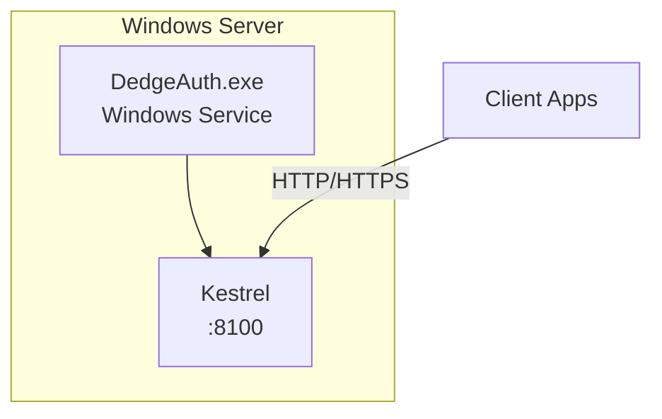

| Aspect | Windows Service |
|--------|-----------------|
| **Startup** | Automatic on boot |
| **Reliability** | Auto-restart on failure |
| **Management** | `sc.exe`, Services MMC, PowerShell |
| **Port binding** | Direct Kestrel |
| **SSL/TLS** | Kestrel certificate or reverse proxy |
| **Complexity** | Low |
| **Best for** | Internal services, microservices |

**Installation:**

```powershell
# Create Windows Service
sc.exe create DedgeAuth binPath="C:\opt\apps\DedgeAuth\DedgeAuth.Api.exe" start=auto
sc.exe description DedgeAuth "FK Authentication Service"
sc.exe start DedgeAuth
```

**Program.cs configuration:**

```csharp
var builder = WebApplication.CreateBuilder(args);

// Support running as Windows Service
builder.Host.UseWindowsService(options =>
{
    options.ServiceName = "DedgeAuth";
});

builder.WebHost.UseUrls("http://*:8100", "https://*:5051");
```

### Option 2: IIS Hosted

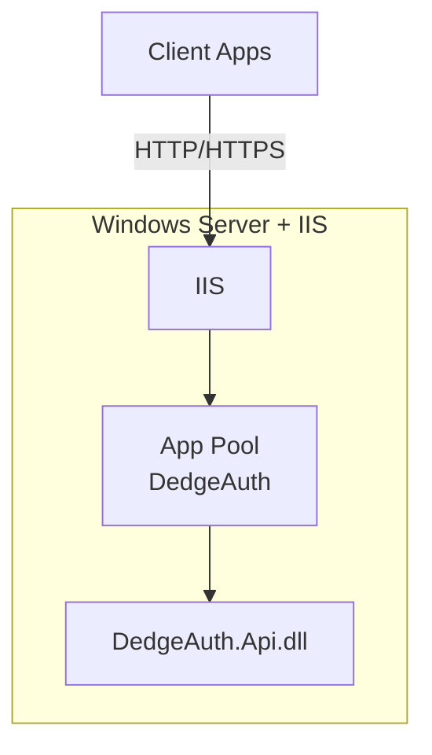

| Aspect | IIS |
|--------|-----|
| **Startup** | IIS manages lifecycle |
| **Reliability** | IIS app pool recycling |
| **Management** | IIS Manager, PowerShell |
| **Port binding** | IIS bindings (80/443 shared) |
| **SSL/TLS** | IIS certificate management |
| **Complexity** | Medium |
| **Best for** | Integration with existing IIS infrastructure |

**Considerations:**
- Requires IIS + ASP.NET Core Hosting Bundle
- Shares port 80/443 with other sites (path-based routing)
- More complex setup but familiar to IIS admins

### Option 3: Standalone Kestrel (Development/Testing)

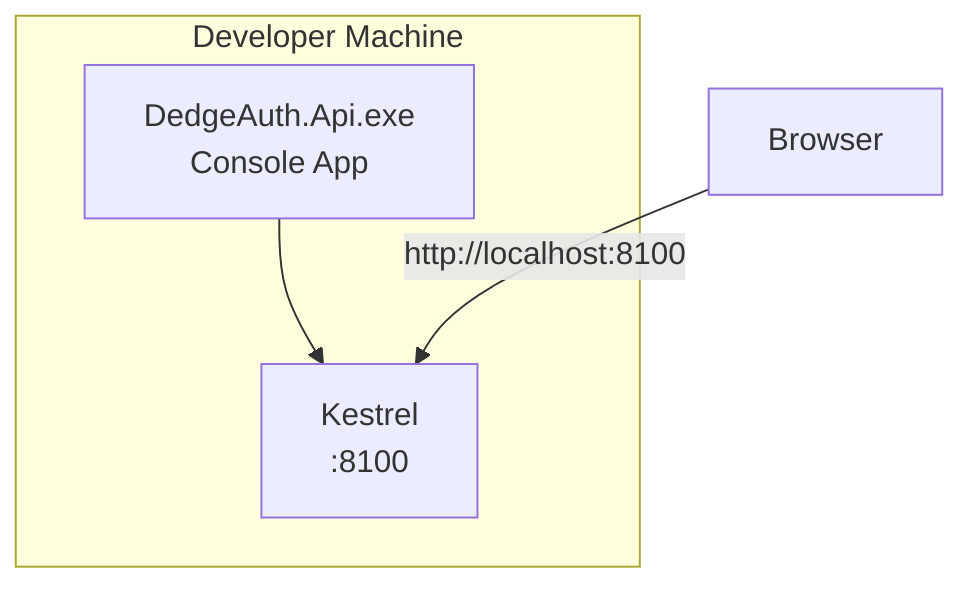

| Aspect | Standalone Kestrel |
|--------|-------------------|
| **Startup** | Manual or scheduled task |
| **Reliability** | No auto-restart |
| **Management** | Manual process management |
| **Best for** | Development, testing |

---

### Recommendation: Windows Service

For DedgeAuth, **Windows Service** is recommended because:

| Reason | Benefit |
|--------|---------|
| **Always running** | Starts on boot, restarts on failure |
| **Independent** | Doesn't require IIS |
| **Simple** | Single executable, easy to deploy |
| **Consistent** | Same pattern as GenericLogHandler ImportService |
| **Portable** | Same deployment on dev/test/prod |

### Deployment Architecture

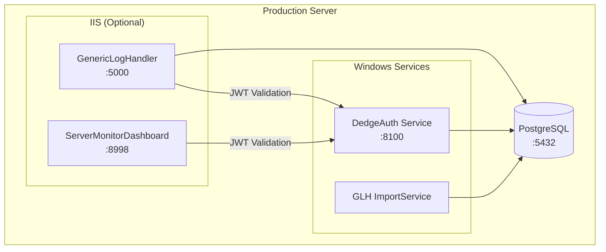

### Complete Install Script Structure

```
C:\opt\src\DedgeAuth\
├── scripts\
│   ├── Install-DedgeAuth.ps1          # Main installer
│   │   ├── Detect/install PostgreSQL (winget)
│   │   ├── Create database + user
│   │   ├── Run EF migrations
│   │   ├── Generate JWT secret
│   │   ├── Create Windows Service
│   │   └── Seed admin users
│   │
│   ├── Uninstall-DedgeAuth.ps1        # Clean removal
│   ├── Update-DedgeAuth.ps1           # In-place upgrade
│   └── Get-DedgeAuthStatus.ps1        # Health check
```

### Install Script Flow

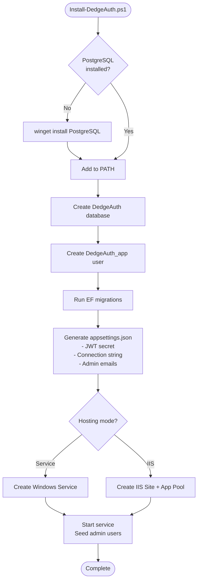

---

## Security Considerations

### Token Sharing Security

| Concern | Mitigation |
|---------|------------|
| Shared signing key | Store in secure configuration (not in code) |
| Token scope | Use `audience` claim to restrict tokens to specific apps |
| Token theft | Short access token lifetime (15-30 min) + refresh tokens |
| Cross-app access | Optional: issue app-specific tokens with audience validation |

### Multi-Audience JWT Support

```mermaid
flowchart TB
    subgraph DedgeAuth
        TOKEN[JWT Token<br/>aud: ["GLH", "SMD", "FKApps"]]
    end
    
    subgraph GLH
        V1[Validate<br/>aud contains "GLH" OR "FKApps"]
    end
    
    subgraph SMD
        V2[Validate<br/>aud contains "SMD" OR "FKApps"]
    end
    
    TOKEN --> V1
    TOKEN --> V2
```

---

## Future: Windows AD/SSO Plugin Architecture

### Can AD Authentication Be Added Later?

**Yes.** The proposed DedgeAuth architecture can be designed with a **pluggable authentication provider pattern**, allowing:

1. Custom JWT auth (current implementation)
2. Windows AD/Negotiate SSO (future plugin)
3. Per-application provider selection

### Pluggable Provider Architecture

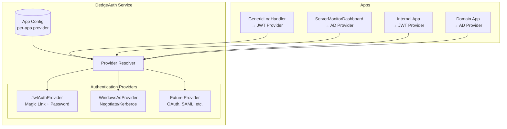

### Per-Application Provider Configuration

Each client application can specify which auth provider to use:

```json
// DedgeAuth appsettings.json
{
  "AuthProviders": {
    "Default": "Jwt",
    "Applications": {
      "GenericLogHandler": {
        "Provider": "Jwt",
        "AllowedDomains": ["Dedge.no"]
      },
      "ServerMonitorDashboard": {
        "Provider": "WindowsAd",
        "FallbackProvider": "Jwt",
        "AdGroups": {
          "Admin": "FK-IT-Admins",
          "PowerUser": "FK-IT-PowerUsers",
          "User": "FK-IT-Users"
        }
      },
      "ExternalApp": {
        "Provider": "Jwt",
        "RequireEmailVerification": true
      }
    }
  }
}
```

### Windows AD Provider Flow

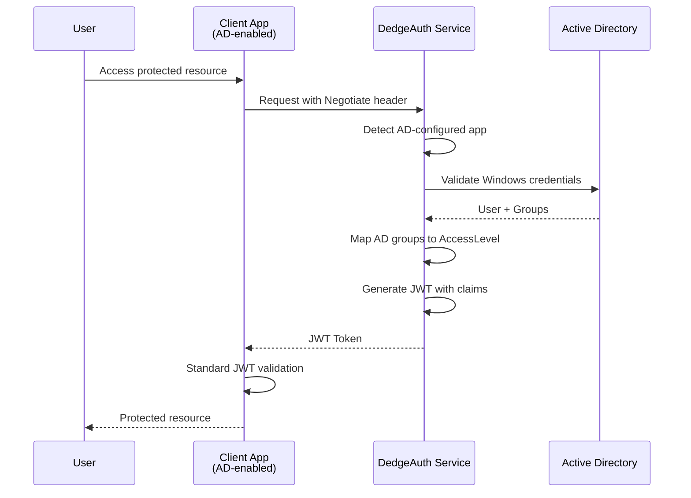

### Hybrid Authentication Support

For environments transitioning to AD or with mixed clients:

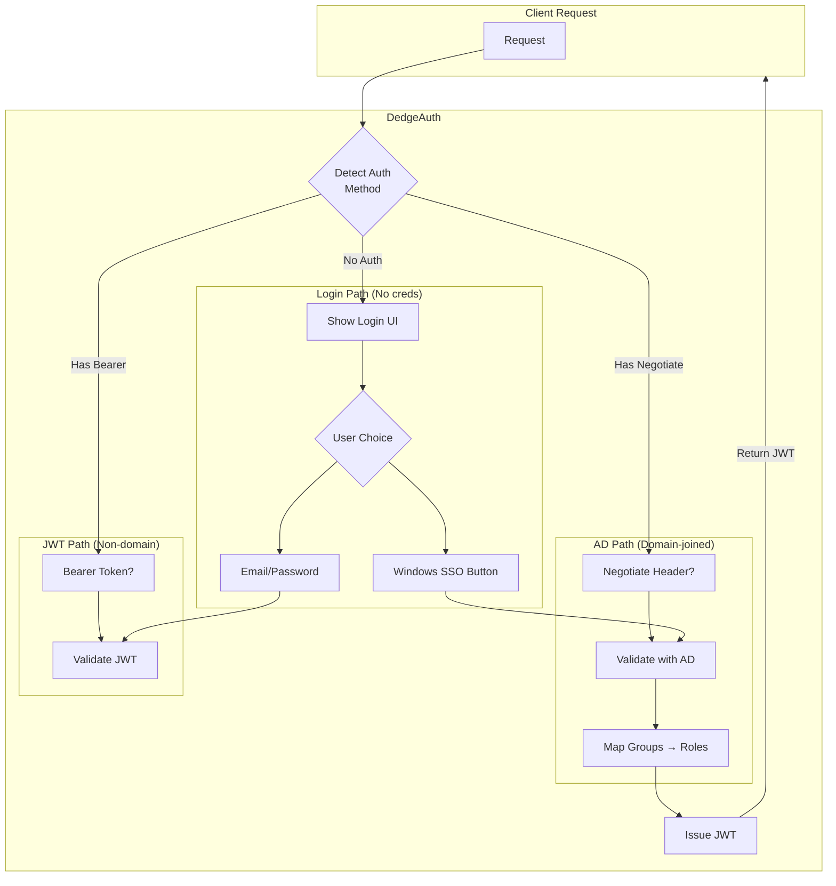

### Implementation: IAuthenticationProvider Interface

```csharp
// DedgeAuth.Core/Interfaces/IAuthenticationProvider.cs
public interface IAuthenticationProvider
{
    string ProviderName { get; }
    bool CanHandle(HttpContext context, string appId);
    Task<AuthResult> AuthenticateAsync(HttpContext context);
    Task<ClaimsPrincipal?> ValidateTokenAsync(string token);
}

// DedgeAuth.Providers.Jwt/JwtAuthProvider.cs
public class JwtAuthProvider : IAuthenticationProvider
{
    public string ProviderName => "Jwt";
    // Magic link, password, email verification...
}

// DedgeAuth.Providers.WindowsAd/WindowsAdProvider.cs  
public class WindowsAdProvider : IAuthenticationProvider
{
    public string ProviderName => "WindowsAd";
    // Negotiate/Kerberos, AD group mapping...
}
```

### AD Group to AccessLevel Mapping

| AD Group | AccessLevel | Notes |
|----------|-------------|-------|
| `FK-IT-Admins` | Admin (3) | Full access to all apps |
| `FK-IT-PowerUsers` | PowerUser (2) | Configuration access |
| `FK-IT-Users` | User (1) | Standard access |
| `Domain Users` | ReadOnly (0) | View-only access |
| *(no group match)* | Denied | Or fallback to JWT login |

### Benefits of Plugin Architecture

| Benefit | Description |
|---------|-------------|
| **Gradual migration** | Add AD support without breaking existing JWT auth |
| **Per-app flexibility** | Some apps use AD, others use JWT |
| **Fallback support** | AD fails → offer JWT login |
| **Future-proof** | Add OAuth, SAML, etc. later |
| **Consistent output** | All providers issue same JWT format |

### Considerations for Non-AD Clients

For clients not enrolled in Active Directory:

| Scenario | Solution |
|----------|----------|
| External contractors | Use JWT provider with email verification |
| BYOD devices | JWT provider (magic link works everywhere) |
| Linux/Mac workstations | JWT provider or Kerberos (if configured) |
| Mobile devices | JWT provider with password login |
| Mixed environment | Hybrid mode with login UI choice |

### Updated Project Structure with Providers

```
C:\opt\src\DedgeAuth\
├── src\
│   ├── DedgeAuth.Core\
│   │   └── Interfaces\
│   │       └── IAuthenticationProvider.cs    # Provider contract
│   │
│   ├── DedgeAuth.Providers.Jwt\                 # Current implementation
│   │   ├── JwtAuthProvider.cs
│   │   ├── MagicLinkService.cs
│   │   └── PasswordService.cs
│   │
│   ├── DedgeAuth.Providers.WindowsAd\           # Future AD plugin
│   │   ├── WindowsAdProvider.cs
│   │   ├── AdGroupMapper.cs
│   │   └── NegotiateHandler.cs
│   │
│   ├── DedgeAuth.Api\
│   │   ├── Middleware\
│   │   │   └── MultiProviderAuthMiddleware.cs
│   │   └── Configuration\
│   │       └── ProviderConfiguration.cs
```

### Complexity for Adding AD Provider

| Task | Effort | Notes |
|------|--------|-------|
| Create IAuthenticationProvider interface | 1 hour | Already partially exists in AuthService |
| Refactor JwtAuthProvider | 2 hours | Extract from AuthService |
| Implement WindowsAdProvider | 3-4 hours | Negotiate handler + group mapping |
| Multi-provider middleware | 2 hours | Route to correct provider |
| Per-app configuration | 1 hour | Config file + database option |
| **Total** | **9-10 hours** | After initial extraction |

---

## Conclusion

**The extraction is feasible and recommended.** The current auth system is well-structured and can be cleanly separated into a standalone service. The centralized auth service approach (Option 1) provides the best long-term value:

- **Complexity**: Moderate (8-12 hours initial, +9-10 hours for AD plugin)
- **Risk**: Low (no breaking changes if done incrementally)
- **Value**: High (reusable across all FK internal applications)
- **Future-proof**: Pluggable provider architecture supports AD, OAuth, SAML, etc.

### Recommendation

1. Start with **Option 1 (Centralized Auth Service)**
2. Deploy DedgeAuth as a separate service on its own port
3. Design with `IAuthenticationProvider` interface from the start
4. Migrate GenericLogHandler first (already has the code)
5. Then integrate ServerMonitorDashboard (start with JWT, add AD later)
6. Package DedgeAuth.Client as internal NuGet for future apps
7. Add WindowsAdProvider when AD access becomes available for non-domain clients

---

## Appendix: Current File References

### GenericLogHandler Auth Files

```
src/GenericLogHandler.Core/Models/Auth/
├── User.cs                    # User entity with AccessLevel enum
├── LoginToken.cs              # Magic link tokens
├── RefreshToken.cs            # Session tokens
└── AuthConfiguration.cs       # JWT/auth settings

src/GenericLogHandler.WebApi/Services/
├── AuthService.cs             # Core auth logic (~600 lines)
└── AuthEmailService.cs        # Email sending (~150 lines)

src/GenericLogHandler.WebApi/Controllers/
└── AuthController.cs          # Auth endpoints (~400 lines)

src/GenericLogHandler.WebApi/wwwroot/
├── login.html                 # Login UI
└── js/api.js                  # Token handling (Auth helper lines 288-328)

src/GenericLogHandler.Data/
└── LoggingDbContext.cs        # DbSets for User, LoginToken, RefreshToken
```

### ServerMonitorDashboard Files to Modify

```
src/ServerMonitorDashboard/
├── Program.cs                 # Add JWT auth config
├── Controllers/*.cs           # Add [Authorize] attributes
├── appsettings.json           # Add auth section
└── wwwroot/js/*.js            # Add token handling
```
