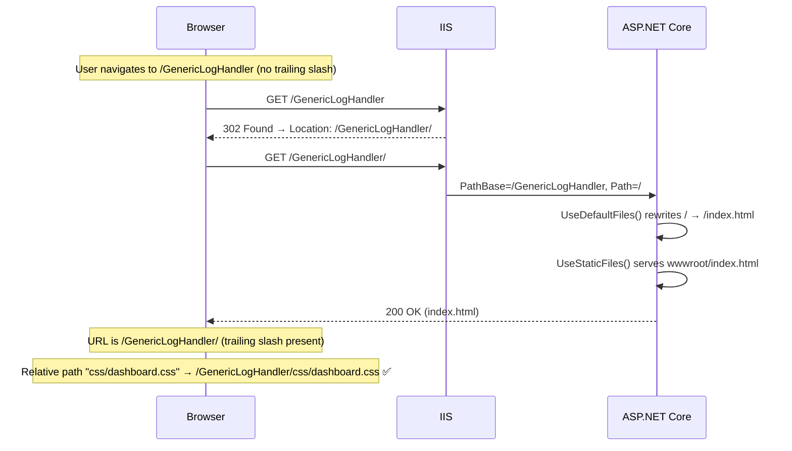
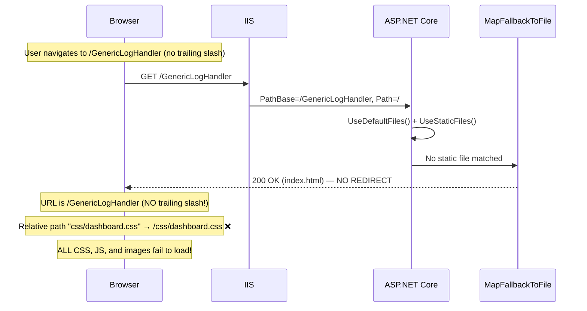
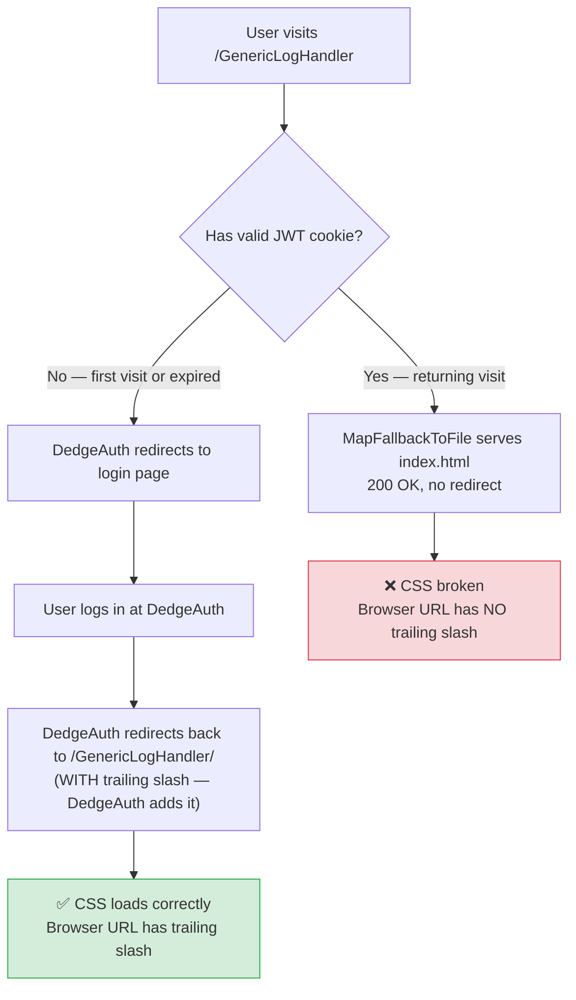
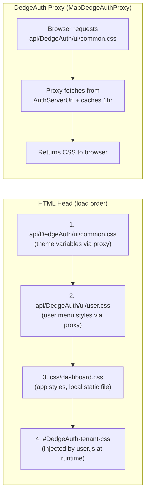

# CSS Loading Flow — IIS Virtual Applications

## The Problem

GenericLogHandler (and all FK apps) run as **IIS virtual applications** under `Default Web Site`:

| URL | Virtual App |
|-----|-------------|
| `http://server/GenericLogHandler/` | GenericLogHandler |
| `http://server/DocView/` | DocView |
| `http://server/DedgeAuth/` | DedgeAuth |

HTML pages use **relative paths** for CSS and JS:

```html
<link rel="stylesheet" href="css/dashboard.css">
<link rel="stylesheet" href="api/DedgeAuth/ui/common.css">
```

Relative paths resolve based on the browser's **current URL**. The trailing slash matters:

| Browser URL | Relative `css/dashboard.css` resolves to | Result |
|---|---|---|
| `localhost/GenericLogHandler/` | `localhost/GenericLogHandler/css/dashboard.css` | Correct |
| `localhost/GenericLogHandler` | `localhost/css/dashboard.css` | **BROKEN** |

## The Trailing-Slash Mechanism

IIS has a built-in behavior: when a request targets a virtual directory **without** a trailing slash, IIS responds with a **302 redirect** to add the slash. This ensures relative paths always resolve correctly.



## How `MapFallbackToFile` Breaks This

`MapFallbackToFile("index.html")` is a catch-all endpoint that serves `index.html` for **any** unmatched request. When a request for `/GenericLogHandler` (no trailing slash) arrives, the fallback intercepts it **before** IIS can issue the 302 redirect:



## Why It Seems Intermittent

The bug appears and disappears because of the **DedgeAuth login redirect**:



Timeline of the recurring issue:
1. **After deployment**: App pool restarts, JWT cookies invalidate
2. **User re-authenticates**: DedgeAuth redirect adds trailing slash → CSS works
3. **Next day**: User returns with valid cookie → no redirect → CSS breaks
4. **Developer "fixes" it**: Re-adds CSS or clears cache → works temporarily
5. **Repeat from step 3**

## The CSS Loading Stack



All paths are **relative** (no leading `/`), so they depend on the trailing slash being present.

## Correct Program.cs Middleware Order

```csharp
app.UseDedgeAuth();          // Auth middleware (skips .css, .js, .png etc.)
app.UseDefaultFiles();    // Rewrites / → /index.html
app.UseStaticFiles();     // Serves wwwroot/* files
app.MapControllers();     // API endpoints
app.MapDedgeAuthProxy();     // Proxies /api/DedgeAuth/ui/* to DedgeAuth server
app.MapHealthChecks("/health");
// NO MapFallbackToFile — this app is NOT a SPA
```

## Rules

1. **NEVER** use `MapFallbackToFile` in multi-page apps with IIS virtual application hosting
2. `MapFallbackToFile` is only valid for true SPAs (React, Angular, Vue) with client-side routing
3. All FK web apps use separate HTML pages — they are **not** SPAs
4. All CSS/JS references must use **relative paths** (no leading `/`)
5. `UseDefaultFiles()` + `UseStaticFiles()` is sufficient for serving `index.html` at `/`
