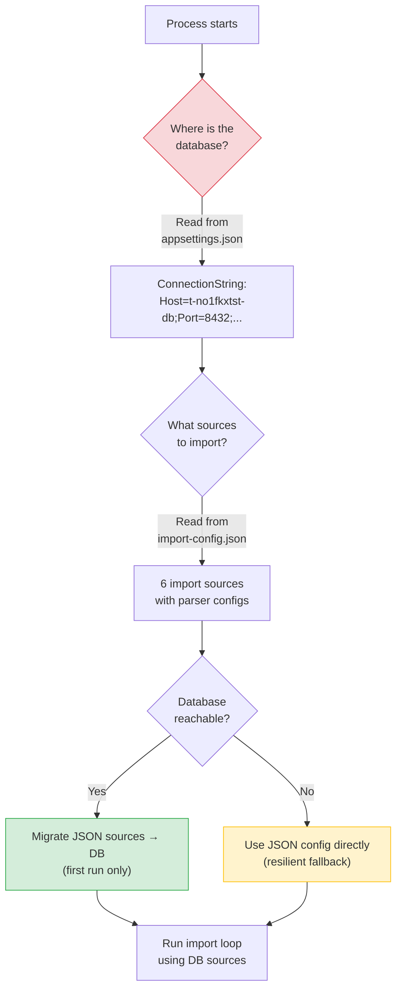
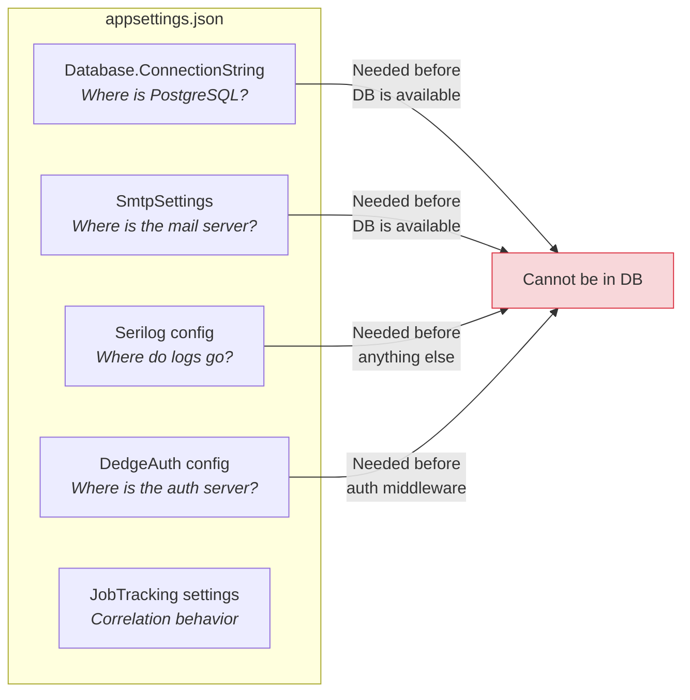
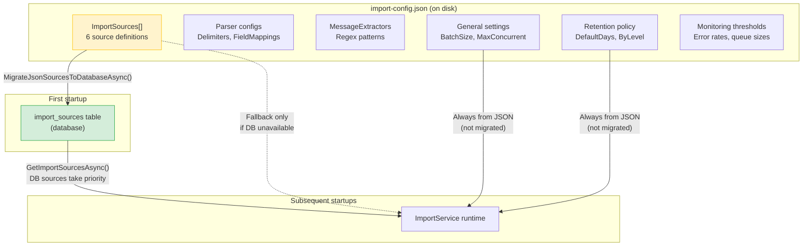
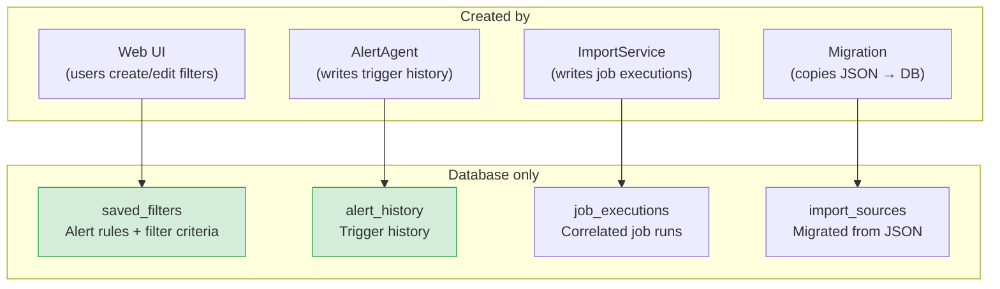
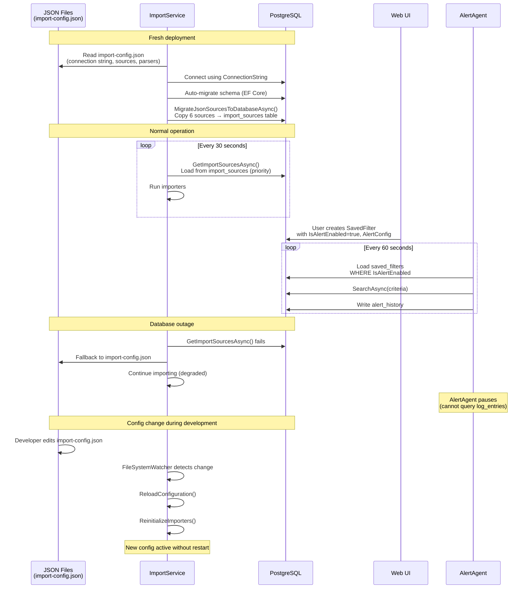
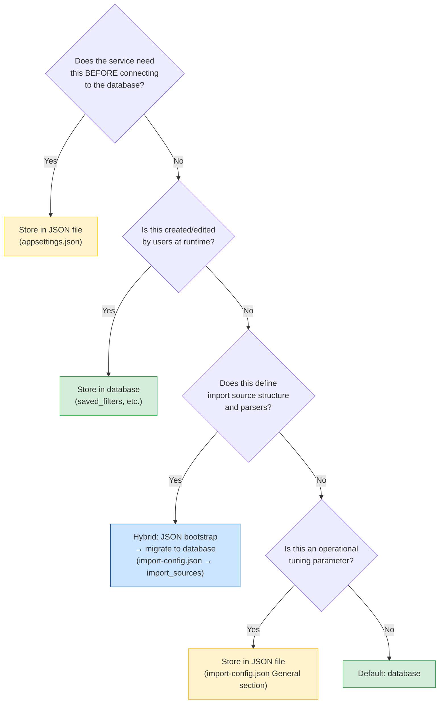

# Configuration Storage Strategy: JSON Files vs Database

Why the Import Service and Alert Agent store configuration where they do, and the architectural reasoning behind the hybrid approach.

## The Short Answer

The system uses **both** JSON files and the database, but for different purposes:

| What | Where | Why |
|------|-------|-----|
| Import sources, parsers, extractors | `import-config.json` → migrated to database | Bootstrap: must exist before the database is reachable |
| Database connection string | `appsettings.json` | Chicken-and-egg: can't read the DB connection from the DB |
| Alert rules and actions | Database (`saved_filters` table) | Runtime data: created/modified by users through the UI |
| Service settings (batch size, concurrency) | `import-config.json` / `appsettings.json` | Infrastructure: rarely changes, needs to be available at startup |

## The Chicken-and-Egg Problem

The most fundamental reason is the **startup dependency chain**. The ImportService and AlertAgent need to know *how* to connect to the database before they can read anything from it.

If the database is down, unreachable, or has not been created yet (fresh deployment), the ImportService **still starts and works** because it falls back to reading `import-config.json` directly.

## What Lives Where and Why

### 1. `appsettings.json` — Infrastructure That Cannot Be in a Database

These settings define **how to reach external systems**. They must be available the instant the process starts, before any database connection is established. Storing them in the database would create a circular dependency.

### 2. `import-config.json` — Bootstrap Config That Migrates to DB

The import sources start in JSON and **migrate to the database on first run**. After that, the database version is authoritative. But the JSON file remains as:

- A **bootstrap mechanism** for fresh deployments
- A **fallback** when the database is unavailable
- A **hot-reload source** for development (edit the file, ImportService picks it up via `FileSystemWatcher`)
- A **version-controlled record** of the initial configuration (committed to git)

### 3. `saved_filters` table — Pure Runtime Data

Alert rules live **exclusively in the database** because they are:

- Created and modified by users through the Web UI at runtime
- Not needed at startup (the AlertAgent loads them each 60-second cycle)
- Frequently updated (enable/disable, change thresholds, add new alerts)
- User-owned data, not infrastructure configuration

## The Hybrid Lifecycle

## Why Not Store Everything in the Database?

| Concern | JSON File | Database |
|---------|-----------|----------|
| **Available before DB connection** | Yes | No (circular dependency) |
| **Works during DB outage** | Yes | No |
| **Version-controlled in git** | Yes | No (requires DB exports) |
| **Editable with a text editor** | Yes | Needs UI or SQL |
| **Hot-reload without restart** | Yes (FileSystemWatcher) | Requires polling |
| **Deployed with the application** | Yes (part of publish) | Requires separate migration |
| **Multi-user editing** | No (file locks) | Yes (concurrent access) |
| **Audit trail** | Git history only | DB triggers/history tables |
| **UI management** | Config Editor page (raw JSON) | Dedicated CRUD pages |

## Why Not Store Everything in JSON Files?

| Concern | JSON File | Database |
|---------|-----------|----------|
| **User-created data** | Awkward (file writes from web) | Natural (INSERT/UPDATE) |
| **Concurrent access** | File locks, corruption risk | ACID transactions |
| **Querying** | Parse entire file | SQL WHERE clauses |
| **Relationships** | Manual (cross-reference by name) | Foreign keys |
| **Schema evolution** | Manual JSON migration | EF Core migrations |
| **Multiple consumers** | File sharing/locking issues | Connection pooling |

## The Decision Matrix

## Concrete Examples

### Example 1: Database Connection String

**Stored in:** `appsettings.json`  
**Why:** The ImportService needs this to connect to PostgreSQL. It cannot read the connection string from PostgreSQL because it hasn't connected yet.

### Example 2: Import Source "ServerMonitor Logs"

**Stored in:** `import-config.json` initially, then migrated to `import_sources` table  
**Why:** On a fresh deployment, there is no database yet. The JSON file provides the initial seed data. Once the database is up and the migration runs, the database version becomes authoritative. The WebApi's Import Sources page then manages it going forward.

### Example 3: MessageExtractors (Regex Patterns)

**Stored in:** `import-config.json` → `Parser.MessageExtractors`, serialized into `import_sources.config_json` during migration  
**Why:** These are tightly coupled to the parser config for each source. They travel with the source definition — first in JSON, then in the database's `config_json` column.

### Example 4: Alert Rule "Detect 3+ Errors for Order 12345"

**Stored in:** `saved_filters` table (database only)  
**Why:** A user created this through the Saved Filters Maintenance page. It was never in a JSON file. It's runtime data managed through the UI.

### Example 5: BatchSize = 1000

**Stored in:** `import-config.json` → `General.BatchSize`  
**Why:** This is an operational tuning parameter. It's set once and rarely changed. It doesn't belong in the database because it's needed before the database connection is established and it's not user-facing data.

## Summary

The hybrid approach exists because the system must solve three conflicting requirements:

1. **Boot without a database** — JSON files provide everything needed to start, connect, and create the database schema from scratch
2. **Runtime management by users** — Alerts, saved filters, and import source CRUD need a proper database with transactions and a UI
3. **Resilience** — If the database goes down, the ImportService continues processing using the JSON fallback; it doesn't stop dead

The JSON file is the **seed** and **safety net**. The database is the **runtime authority**. The migration bridges them.
