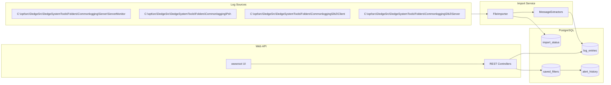
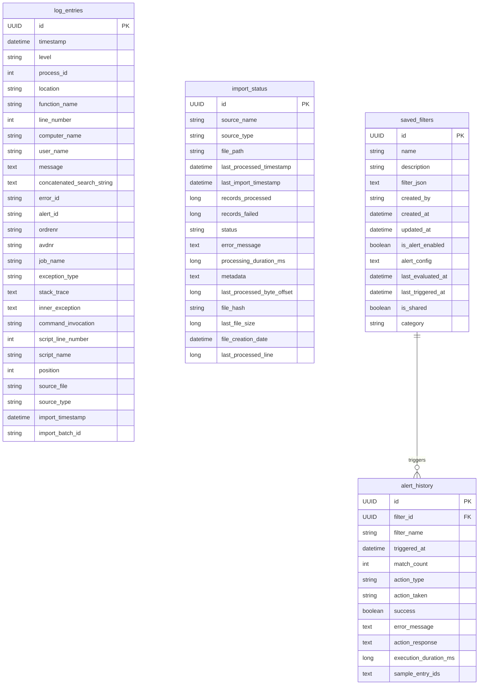
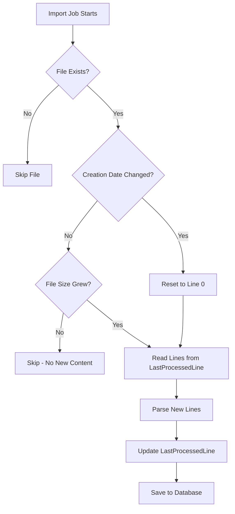

# Generic Log Handler - Data Model

This document describes the database schema used by the Generic Log Handler system.

## System Architecture



## Entity Relationship Diagram



## Tables

### log_entries

Main table storing all imported log entries from various sources.

| Column | Type | Description |
|--------|------|-------------|
| `id` | UUID | Primary key |
| `timestamp` | datetime | When the log entry occurred |
| `level` | string(10) | Log level (TRACE, DEBUG, INFO, WARN, ERROR, FATAL) |
| `process_id` | int | Process ID that generated the log |
| `location` | string(500) | Code location/path |
| `function_name` | string(200) | Function or method name |
| `line_number` | int | Line number in source code |
| `computer_name` | string(100) | Source computer name |
| `user_name` | string(100) | User who generated the log |
| `message` | text | Main log message content |
| `concatenated_search_string` | text | Combined searchable text from all fields |
| `error_id` | string(100) | Error identifier if applicable |
| `alert_id` | string(100) | Alert ID extracted from message |
| `ordrenr` | string(50) | Order number extracted from message |
| `avdnr` | string(50) | Department number extracted from message |
| `job_name` | string(200) | Job/module name |
| `exception_type` | string(500) | Exception class name |
| `stack_trace` | text | Full stack trace |
| `inner_exception` | text | Inner exception details |
| `command_invocation` | string(1000) | PowerShell command invocation |
| `script_line_number` | int | Line number in script |
| `script_name` | string(500) | Script filename |
| `position` | int | Position in stream |
| `source_file` | string(1000) | Original file path |
| `source_type` | string(50) | Import source type (file, database, eventlog) |
| `import_timestamp` | datetime | When the record was imported |
| `import_batch_id` | string(50) | Batch ID for grouping imports |

#### Business Identifier Fields

Extracted dynamically from message content via regex patterns in `import-config.json`:

| Field | Pattern Examples | Description |
|-------|------------------|-------------|
| `alert_id` | `alert_id: ABC123`, `alertid=XYZ` | Alert/alarm identifier |
| `ordrenr` | `ordrenr: 12345`, `ordrenummer=67890` | Order number (indexed) |
| `avdnr` | `avdnr: 789`, `avdeling=456` | Department number (indexed) |
| `job_name` | Parsed from delimiter position | Job or task name |

#### Indexes

| Index Name | Columns | Purpose |
|------------|---------|---------|
| `idx_log_entries_timestamp` | timestamp | Time-based queries |
| `idx_log_entries_level` | level | Filter by severity |
| `idx_log_entries_computer` | computer_name | Filter by source computer |
| `idx_log_entries_source` | source_file | Filter by source file |
| `idx_log_entries_alert_id` | alert_id | Alert lookups |
| `idx_log_entries_ordrenr` | ordrenr | Order number lookups |
| `idx_log_entries_avdnr` | avdnr | Department lookups |
| `idx_log_entries_job_name` | job_name | Job name lookups |

### import_status

Tracks the status of each import source and file processing state. Supports incremental processing for append-only files.

| Column | Type | Description |
|--------|------|-------------|
| `id` | UUID | Primary key |
| `source_name` | string(200) | Import source name from config |
| `source_type` | string(50) | Source type (file, database, eventlog) |
| `file_path` | string(1000) | Path to the processed file |
| `last_processed_timestamp` | datetime | Last data timestamp processed |
| `last_import_timestamp` | datetime | When import job last ran |
| `records_processed` | long | Count of successfully processed records |
| `records_failed` | long | Count of failed records |
| `status` | string | Pending, Processing, Completed, Failed, Paused |
| `error_message` | text | Error details if failed |
| `processing_duration_ms` | long | How long the import took |
| `metadata` | text | Additional JSON metadata |
| `last_processed_byte_offset` | long | Byte position for incremental reads |
| `file_hash` | string(64) | Hash to detect file changes |
| `last_file_size` | long | File size at last processing |
| `file_creation_date` | datetime | File creation date (UTC) for rotation detection |
| `last_processed_line` | long | Last processed line number (1-based) |

#### Append-Only File Processing

When `IsAppendOnly: true` is set in the import source config:

1. The importer tracks the file's creation date and last processed line number
2. On each run, only new lines (after `last_processed_line`) are imported
3. If the file creation date changes (file rotation), processing resets to line 0
4. This prevents re-importing already processed log entries



### saved_filters

Stores user-defined search filters that can be reused and optionally trigger alerts.

| Column | Type | Description |
|--------|------|-------------|
| `id` | UUID | Primary key |
| `name` | string(200) | Filter display name |
| `description` | string(1000) | Optional description |
| `filter_json` | text | JSON-serialized search criteria |
| `created_by` | string(100) | Username who created |
| `created_at` | datetime | Creation timestamp |
| `updated_at` | datetime | Last modification |
| `is_alert_enabled` | boolean | Whether alerts are enabled |
| `alert_config` | text | JSON configuration for alert actions |
| `last_evaluated_at` | datetime | When filter was last checked |
| `last_triggered_at` | datetime | When alert was last triggered |
| `is_shared` | boolean | Visible to other users |
| `category` | string(100) | Optional category/tag |

#### Alert Config Structure

```json
{
  "ActionType": "webhook",
  "WebhookUrl": "https://example.com/alert",
  "Threshold": 1,
  "CooldownMinutes": 15,
  "IncludeSampleEntries": true,
  "MaxSampleEntries": 5
}
```

### alert_history

Tracks the history of triggered alerts.

| Column | Type | Description |
|--------|------|-------------|
| `id` | UUID | Primary key |
| `filter_id` | UUID | Reference to saved_filters |
| `filter_name` | string(200) | Filter name at time of trigger |
| `triggered_at` | datetime | When the alert fired |
| `match_count` | int | Number of matching entries |
| `action_type` | string(50) | webhook, script, servermonitor, email |
| `action_taken` | string(1000) | Description of action |
| `success` | boolean | Whether the action succeeded |
| `error_message` | text | Error details if failed |
| `action_response` | text | Response from action (webhook body, etc.) |
| `execution_duration_ms` | long | How long the action took |
| `sample_entry_ids` | text | JSON array of sample log entry IDs |

## Configuration Files

| File | Path | Purpose |
|------|------|---------|
| `import-config.json` | `c:\opt\src\GenericLogHandler\import-config.json` | Import sources, parsers, retention |
| `appsettings.json` | `c:\opt\src\GenericLogHandler\appsettings.json` | Connection strings, logging |

### Current Import Sources

| Source | Path | Format |
|--------|------|--------|
| ServerMonitor Logs | `C:\opt\src\DedgeSrc\DedgeSystemTools\Folders\Commonlogging\Server\ServerMonitor\*.*` | Pipe-delimited |
| PowerShell Logs | `C:\opt\src\DedgeSrc\DedgeSystemTools\Folders\Commonlogging\Psh\*.*` | Pipe-delimited |
| DB2 Client Logs | `C:\opt\src\DedgeSrc\DedgeSystemTools\Folders\Commonlogging\Db2\Client\*.*` | Pipe-delimited |
| DB2 Server Logs | `C:\opt\src\DedgeSrc\DedgeSystemTools\Folders\Commonlogging\Db2\Server\*.*` | Pipe-delimited |

## Notes

- `message`, `stack_trace`, `inner_exception`, and `concatenated_search_string` are stored as `text` in PostgreSQL and `CLOB` in DB2 to keep full content searchable.
- There is no direct FK between `log_entries` and `import_status`; imports are tracked by `source_name` + `file_path` and `import_batch_id`.
- The `saved_filters.alert_config` stores an `AlertConfig` object as JSON with webhook URLs, thresholds, cooldowns, etc.
- All datetime fields are stored in UTC.
