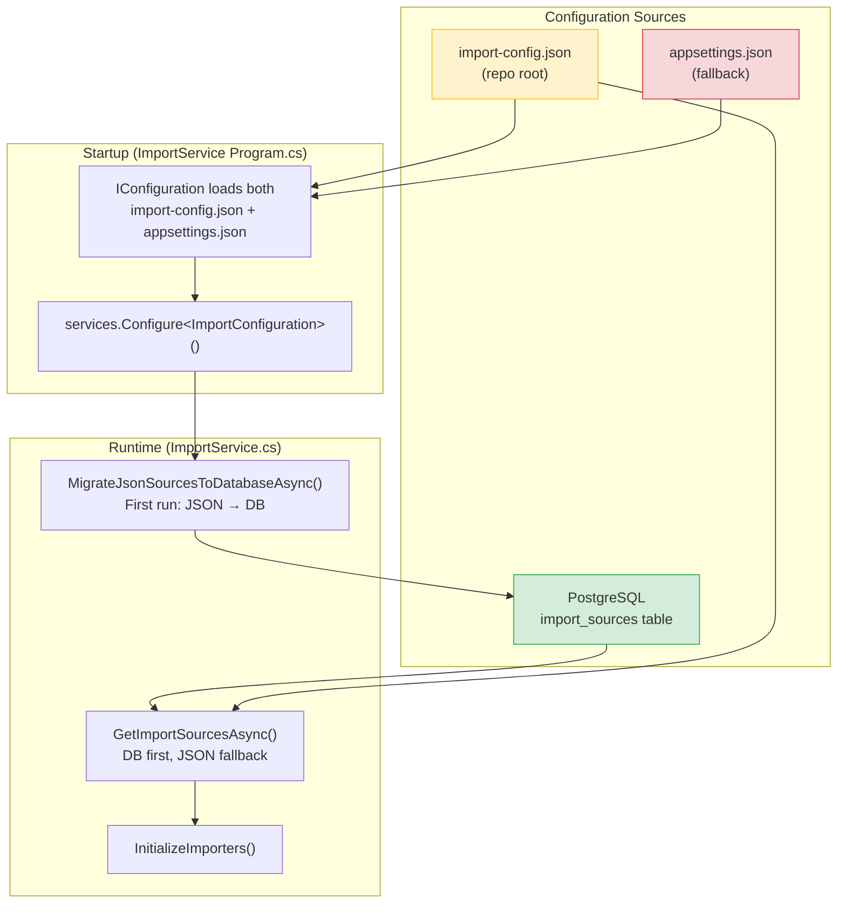
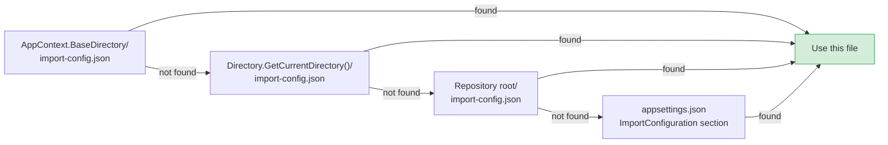
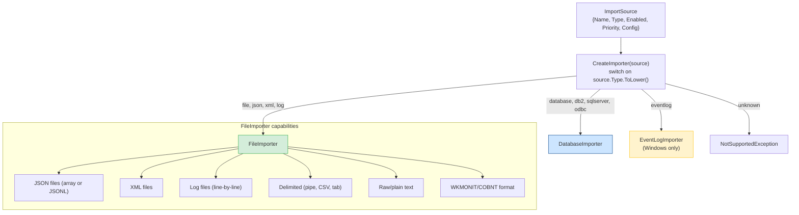
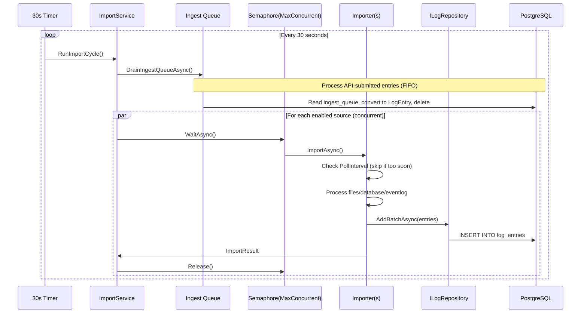
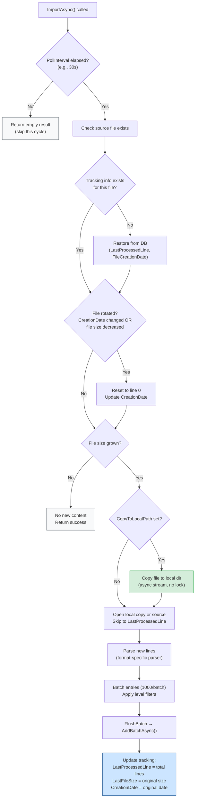
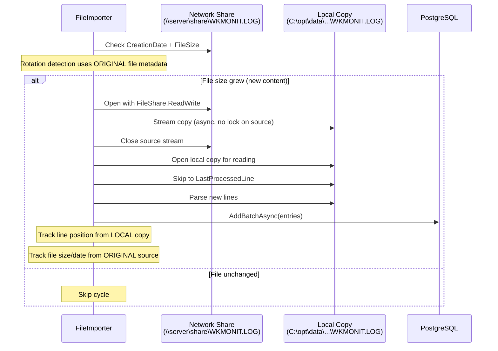
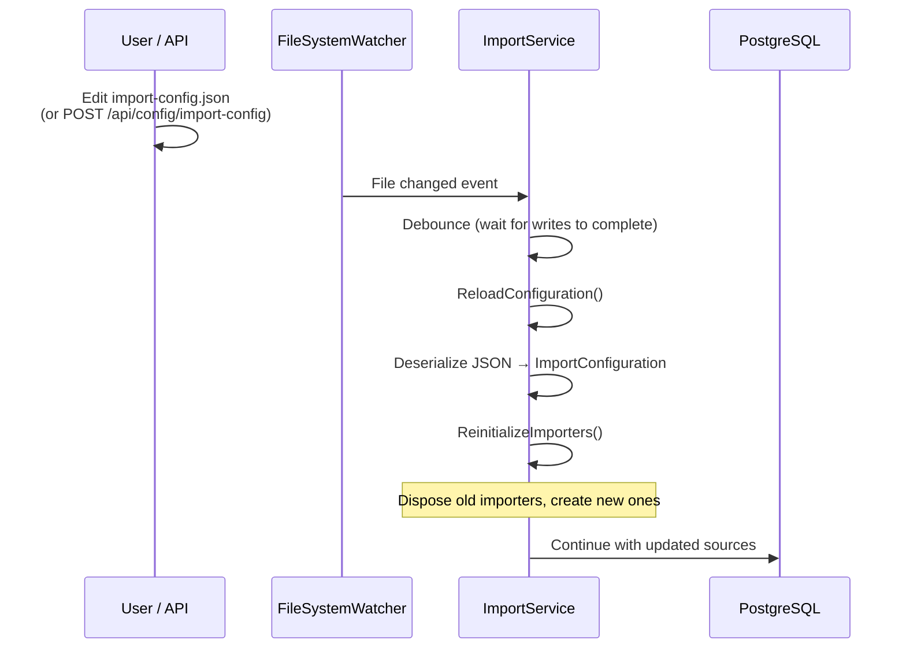
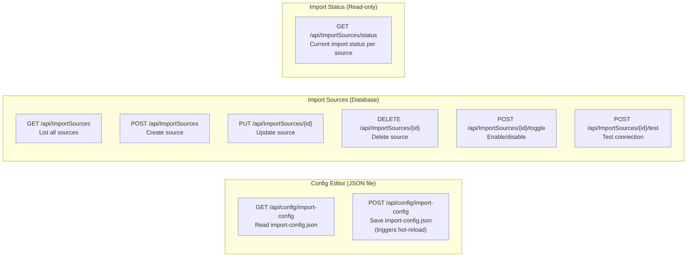

# Import Configuration Architecture

How `import-config.json` flows through the GenericLogHandler solution, from file on disk to processed log entries.

## Configuration Sources

The system supports **two** configuration sources, with database taking priority:

| Source | File | When Used |
|--------|------|-----------|
| **JSON file** | `import-config.json` (repo root) | Initial setup, hot-reload |
| **Database** | `import_sources` table (PostgreSQL) | Runtime, after first migration |

On first startup, JSON sources are **migrated to the database**. After that, database sources take precedence. The JSON file remains as a fallback and can be edited via the Web API's Config Editor.



## Config File Discovery

Both ImportService and WebApi search for `import-config.json` in this order:



Repository root is found by searching upward from the base directory for `GenericLogHandler.sln` or `import-config.json`.

## import-config.json Structure

```json
{
  "Version": "1.0",
  "Metadata": { "Name": "...", "Description": "..." },
  "General": {
    "ServiceName": "GenericLogHandler",
    "MaxConcurrentImports": 4,
    "BatchSize": 1000,
    "RunOnce": false,
    "RetryAttempts": 3,
    "HealthCheckInterval": 60
  },
  "Database": {
    "Type": "postgresql",
    "ConnectionString": "..."
  },
  "Retention": { "DefaultDays": 90, "CleanupSchedule": "0 2 * * *" },
  "ImportSources": [
    {
      "Name": "COBNT WKMONIT",
      "Type": "file",
      "Enabled": true,
      "Priority": 5,
      "Config": {
        "Path": "\\\\server\\share\\WKMONIT.LOG",
        "Format": "log",
        "IsAppendOnly": true,
        "PollInterval": 30,
        "CopyToLocalPath": "C:\\opt\\data\\...",
        "..."
      }
    }
  ]
}
```

## ImportSource → Importer Factory

The `Type` field on each ImportSource determines which `ILogImporter` implementation is created:



## Main Import Loop



## FileImporter: Append-Only Processing Flow

For files configured with `IsAppendOnly: true` (like WKMONIT.LOG):



## CopyToLocalPath: Network File Safety

For business-critical files on network shares:



## Config Properties and Their Effects

### ImportSourceConfig — File Import Properties

| Property | Type | Default | Effect |
|----------|------|---------|--------|
| `Path` | string | — | File path or glob pattern (`*.log`) |
| `Format` | string | — | `log`, `json`, `xml`, `delimited`, `raw` |
| `IsAppendOnly` | bool | false | Track position, resume from last line |
| `PollInterval` | int | 30 | Seconds between checks for append-only files |
| `CopyToLocalPath` | string | — | Copy to local dir before reading |
| `WatchDirectory` | bool | false | Use FileSystemWatcher for real-time |
| `MaxFilesPerRun` | int | 0 | Limit files per cycle (0 = unlimited) |
| `MaxFileAgeDays` | int | 30 | Skip files older than N days |
| `SkipHeaderLines` | int | 0 | Skip N lines at top of file |
| `Encoding` | string | utf-8 | File encoding |
| `MoveProcessedFiles` | bool | false | Move to ProcessedFilesLocation after |
| `MaxFullReadMB` | int | 100 | Max size for whole-file JSON/XML read |
| `QuarantineErrorRateThreshold` | double | 50 | % error rate to quarantine file |

### ImportSourceConfig — Parser Properties

| Property | Type | Effect |
|----------|------|--------|
| `Parser.Delimiter` | string | Column separator for delimited formats |
| `Parser.Pattern` | string | Regex with named groups for complex formats |
| `Parser.FieldMappings` | dict | Map column index → LogEntry property |
| `Parser.MessageExtractors` | list | Regex extractors for business identifiers |

### General Settings (affect all sources)

| Property | Default | Effect |
|----------|---------|--------|
| `MaxConcurrentImports` | 4 | Semaphore limit for parallel source processing |
| `BatchSize` | 1000 | Entries per database INSERT batch |
| `RunOnce` | false | Exit after one cycle (for testing) |
| `RetryAttempts` | 3 | Retry count on transient failures |
| `HealthCheckInterval` | 60 | Seconds between health checks |

## Hot-Reload Flow



## Web API Management Endpoints



## End-to-End: From Config to Log Entry

```mermaid
flowchart LR
    CONFIG["import-config.json"] --> STARTUP["ImportService<br/>startup"]
    STARTUP --> MIGRATE["Migrate to DB"]
    MIGRATE --> LOOP["30s import loop"]
    
    LOOP --> FACTORY["CreateImporter()<br/>based on Type"]
    FACTORY --> IMPORTER["FileImporter /<br/>DatabaseImporter /<br/>EventLogImporter"]
    
    IMPORTER --> PARSE["Parse source data"]
    PARSE --> FILTER["Apply level filters"]
    FILTER --> BATCH["Batch (1000 entries)"]
    BATCH --> REPO["ILogRepository<br/>.AddBatchAsync()"]
    REPO --> PG["PostgreSQL<br/>log_entries table"]
    
    PG --> API["WebApi REST endpoints"]
    API --> UI["Dashboard / Log Search /<br/>Job Status / Analytics"]

    style CONFIG fill:#fff3cd,stroke:#ffc107
    style PG fill:#d4edda,stroke:#28a745
    style UI fill:#cce5ff,stroke:#004085
```


