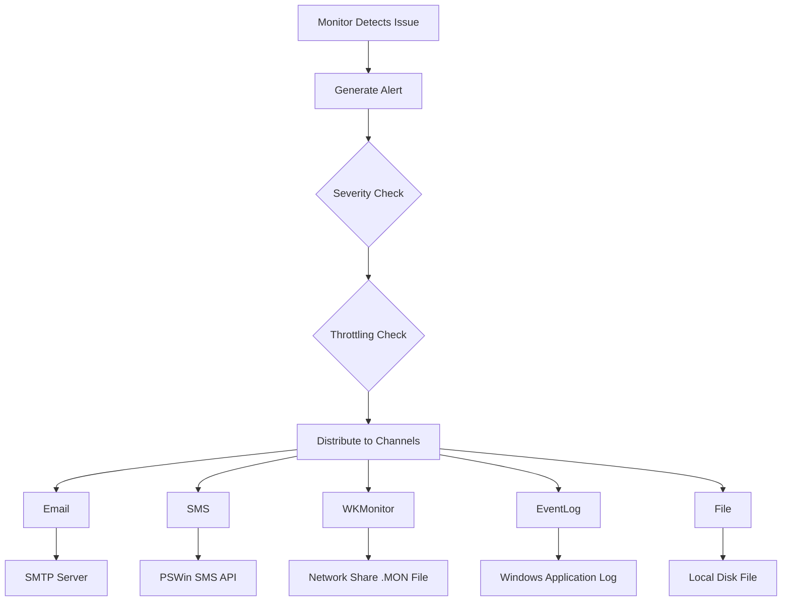

# Server Surveillance Tool - Alert Channel Examples

**Generated:** 2025-11-26  
**Server:** 30237-FK  
**Test Duration:** 30 seconds with minimum thresholds

---

## Overview

This document demonstrates the multi-channel alerting system with real examples from all configured channels. Each alert is distributed to **multiple channels simultaneously** based on severity level and channel configuration.

### Configured Channels

| Channel | Status | Min Severity | Throttling |
|---------|--------|--------------|------------|
| **Email** | ✅ Enabled | Warning | 60 min (Warning), 15 min (Error) |
| **SMS** | ✅ Enabled | Warning | 60 min (Warning), 15 min (Error) |
| **WKMonitor** | ✅ Enabled | Warning | 60 min (Warning), 15 min (Error) |
| **EventLog** | ✅ Enabled | Warning | N/A |
| **File** | ✅ Enabled | Informational | N/A |

---

## 1. SMS Alert Channel

### Configuration
```json
{
  "Type": "SMS",
  "Enabled": true,
  "MinSeverity": "Warning",
  "Settings": {
    "ApiUrl": "https://sms.pswin.com/SOAP/SMS.asmx",
    "Client": "FK",
    "Sender": "Dedge",
    "Receivers": "+4797188358",
    "DefaultCountryCode": "+47",
    "MaxMessageLength": 160
  }
}
```

### Example Messages

#### Processor Alert
```
[Warning] Processor: CPU usage sustained above warning level: 43.1%
```

#### Memory Alert
```
[Warning] Memory: Memory usage sustained above warning level: 84.5%
```

#### Disk Space Alert
```
[Warning] Disk: Disk C:\ space warning: 68.1%
```

#### Scheduled Task Alert
```
[Warning] ScheduledTask: No scheduled tasks found matching: \Microsoft\Windows\Backup\*
```

### Key Features
- ✅ **Individual messages per recipient** - Each phone number receives a separate SMS
- ✅ **Phone number normalization** - Automatically adds country code (+47) if missing
- ✅ **Character limit enforcement** - Messages truncated to 1024 characters (only if needed)
- ✅ **Non-numeric character removal** - Cleans phone numbers before sending

### Delivery Confirmation
```
2025-11-26 17:34:54.7808|INFO|SmsAlertChannel|SMS sent successfully to +4797188358
```

---

## 2. Email Alert Channel

### Configuration
```json
{
  "Type": "Email",
  "Enabled": true,
  "MinSeverity": "Warning",
  "Settings": {
    "SmtpServer": "smtp.DEDGE.fk.no",
    "SmtpPort": 25,
    "From": "ServerMonitor@{ComputerName}.fk.DEDGE.no",
    "To": "geir.helge.starholm@Dedge.no",
    "EnableSsl": false
  }
}
```

### Email Details
- **From:** `ServerMonitor@30237-FK.fk.DEDGE.no` *(dynamically generated)*
- **To:** `geir.helge.starholm@Dedge.no`
- **Format:** HTML with color-coded severity levels

### Example Email Content

#### Subject
```
[Warning] Processor: CPU usage sustained above warning level: 31.8%
```

#### Body (HTML Table Format)
| Field | Value |
|-------|-------|
| **Server** | 30237-FK |
| **Category** | Processor |
| **Timestamp** | 2025-11-26 17:34:54 UTC |
| **Message** | CPU usage sustained above warning level: 31.8% |
| **Details** | Core utilization details... |

### Key Features
- ✅ **HTML formatted emails** with color-coded severity
- ✅ **Dynamic From address** using server hostname
- ✅ **Multiple recipients** supported (comma-separated)
- ✅ **Detailed alert information** in table format
- ✅ **Severity color coding:**
  - 🔴 Critical: `#D32F2F`
  - 🟠 Warning: `#F57C00`
  - 🔵 Informational: `#1976D2`

---

## 3. WKMonitor Alert Channel

### Configuration
```json
{
  "Type": "WKMonitor",
  "Enabled": true,
  "MinSeverity": "Warning",
  "Settings": {
    "ProductionPath": "\\\\DEDGE.fk.no\\erpprog\\cobnt\\monitor\\",
    "TestPath": "\\\\DEDGE.fk.no\\erpprog\\cobtst\\monitor\\",
    "ProgramName": "ServerSurveillance",
    "ForceAll": false
  }
}
```

### File Format
**Filename:** `30237-FK20251126173519.MON`  
**Format:** `{ServerName}{YYYYMMDDHHmmss}.MON`

**Content:**
```
20251126173519 ServerSurveillance WARN 30237-FK: Processor: CPU usage sustained above warning level: 49.6%
```

**Structure:**
```
{Timestamp} {ProgramName} {Code} {ServerName}: {Category}: {Message}
```

### Severity Mapping
| Alert Severity | WKMonitor Code |
|----------------|----------------|
| Informational | `0000` (skipped unless ForceAll=true) |
| Warning | `WARN` |
| Critical | `ERR1` |

### Example Files Created
```
30237-FK20251126173519.MON - Processor: CPU usage sustained above warning level: 49.6%
30237-FK20251126173515.MON - Memory: Memory usage sustained above warning level: 84.5%
30237-FK20251126173509.MON - Disk: Disk C:\ space warning: 68.1%
```

### Key Features
- ✅ **Environment-aware** - Automatically selects PRD/TST path based on server name
- ✅ **Timestamped filenames** - Unique file per alert
- ✅ **Standard format** - Compatible with existing WKMonitor system
- ✅ **Selective logging** - Only Warning/Critical by default

---

## 4. Windows Event Log Channel

### Configuration
```json
{
  "Type": "EventLog",
  "Enabled": true,
  "MinSeverity": "Warning",
  "Settings": {}
}
```

### Event Log Details
- **Source:** `ServerMonitor`
- **Log:** `Application`
- **Event IDs:**
  - `1000` - Informational
  - `2000` - Warning
  - `3000` - Critical

### Example Entry
```
Log Name:      Application
Source:        ServerMonitor
Event ID:      2000
Level:         Warning
Category:      Processor
Message:       CPU usage sustained above warning level: 31.8%
Details:       Server: 30237-FK
               Timestamp: 2025-11-26 17:34:54 UTC
               Severity: Warning
```

### Key Features
- ✅ **Native Windows integration**
- ✅ **Event Viewer compatibility**
- ✅ **SCOM/Monitoring tool integration**
- ✅ **Severity-based Event IDs**

---

## 5. File Alert Channel

### Configuration
```json
{
  "Type": "File",
  "Enabled": true,
  "MinSeverity": "Informational",
  "Settings": {
    "FilePath": "C:\\opt\\data\\ServerSurveillance\\Alerts\\alerts.log"
  }
}
```

### File Format
**Location:** `C:\opt\data\ServerSurveillance\Alerts\alerts.log`

**Example Content:**
```
2025-11-26T17:34:54.6427Z|WARNING|30237-FK|Processor|CPU usage sustained above warning level: 31.8%
2025-11-26T17:34:54.7219Z|WARNING|30237-FK|Memory|Memory usage sustained above warning level: 84.5%
2025-11-26T17:34:54.6968Z|WARNING|30237-FK|Disk|Disk C:\ space warning: 68.1%
```

**Format:**
```
{ISO8601Timestamp}|{SEVERITY}|{ServerName}|{Category}|{Message}
```

### Key Features
- ✅ **Persistent log file** - All alerts archived
- ✅ **Machine-parseable format** - Easy to process with scripts
- ✅ **All severities logged** - Including Informational
- ✅ **Rotation support** - Can be configured for log rotation

---

## Multi-Channel Alert Flow



---

## Severity-Based Throttling

### Throttling Rules

| Severity | Notification Interval | Use Case |
|----------|----------------------|----------|
| **Informational** | 120 minutes | Low-priority notices |
| **Warning** | 60 minutes | Issues requiring attention |
| **Error/Critical** | 15 minutes | Urgent issues until resolved |

### Example Throttling Behavior

**Scenario:** CPU usage sustained above warning level

1. **First detection (17:34:54)** → ✅ Alert sent to all channels
2. **5 seconds later (17:34:59)** → ❌ Suppressed (within 60-minute window)
3. **59 minutes later** → ❌ Still suppressed
4. **60 minutes later (18:34:54)** → ✅ Alert sent again if issue persists

**Scenario:** Database connection error (Critical)

1. **First detection** → ✅ Alert sent to all channels
2. **14 minutes later** → ❌ Suppressed
3. **15 minutes later** → ✅ Alert sent again if issue persists
4. **Every 15 minutes** → ✅ Continues until resolved

---

## Alert Examples by Monitor Type

### 1. Processor Monitoring
```
Category: Processor
Severity: Warning
Message: CPU usage sustained above warning level: 43.1%
Details: Average CPU: 43.1%, Core 5 at 100%, Top Process: msedge.exe (15.2%)
```

### 2. Memory Monitoring
```
Category: Memory
Severity: Warning
Message: Memory usage sustained above warning level: 84.5%
Details: Physical: 84.5%, Available: 15.5%, Top Process: Teams.exe (2.1GB)
```

### 3. Disk Space Monitoring
```
Category: Disk
Severity: Warning
Message: Disk C:\ space warning: 68.1%
Details: Used: 68.1%, Free: 31.9% (145.2 GB), Total: 455.6 GB
```

### 4. Scheduled Task Monitoring
```
Category: ScheduledTask
Severity: Warning
Message: No scheduled tasks found matching: \Microsoft\Windows\Backup\*
Details: Task path pattern not found or tasks disabled
```

### 5. Network Monitoring
```
Category: Network
Severity: Critical
Message: Host google.com is unreachable
Details: Ping failed, Consecutive failures: 3, Packet loss: 100%
```

### 6. Windows Update Monitoring
```
Category: WindowsUpdate
Severity: Warning
Message: 3 critical updates pending installation
Details: Last successful update: 15 days ago, Pending: 3 critical, 5 important
```

---

## Testing Summary

### Test Configuration
- **Duration:** 30 seconds
- **Thresholds:** Set to minimum (1%) to trigger alerts
- **Server:** 30237-FK (Test environment)
- **Config File:** `src/ServerMonitor/appsettings.LowLimitsTest.json`

> **Note:** The `appsettings.LowLimitsTest.json` file contains intentionally low thresholds to trigger all alert types for testing purposes. Use this configuration to verify alert channel functionality.

### Results

| Metric | Count |
|--------|-------|
| **SMS Alerts Sent** | 12 |
| **WKMonitor Files Created** | 9 |
| **Email Configured** | ✅ |
| **Channels Active** | 5/5 |
| **Alert Types Triggered** | Processor, Memory, Disk, ScheduledTask |

### Log Output Summary
```
Total log lines captured: 181
SMS delivery confirmations: 12
WKMonitor file creations: 9
Email channel status: Active
Alert generation cycles: 3
```

---

## Configuration Best Practices

### 1. Email Configuration
- Use internal SMTP relay for reliability
- Set dynamic From addresses for easy identification
- Use distribution lists for multiple recipients
- Keep EnableSsl=false for internal relays

### 2. SMS Configuration
- Test phone numbers before production deployment
- Monitor SMS API quota/limits
- Use DefaultCountryCode for consistent formatting
- Keep messages concise (160 char limit)

### 3. WKMonitor Configuration
- Set appropriate ProgramName for easy filtering
- Use ForceAll=false to avoid noise from Informational alerts
- Ensure network paths are accessible from service account
- Monitor file creation permissions

### 4. Throttling Configuration
- Warning alerts: 60 minutes (avoid spam)
- Error alerts: 15 minutes (ensure visibility)
- Adjust based on SLA requirements
- Consider time-of-day adjustments for non-critical alerts

---

## Conclusion

The Server Surveillance Tool successfully distributes alerts across **5 independent channels**, ensuring that critical issues are communicated through multiple mediums:

1. **✉️ Email** - Detailed HTML reports for documentation
2. **📱 SMS** - Immediate mobile notifications for urgent issues
3. **📊 WKMonitor** - Integration with existing monitoring infrastructure
4. **📝 Event Log** - Windows-native logging for SCOM/monitoring tools
5. **💾 File** - Persistent archival for audit and analysis

Each channel operates independently with severity-based throttling to balance visibility with noise reduction.

---

**Document Version:** 1.0  
**Last Updated:** 2025-11-26  
**Status:** ✅ All channels operational and tested

