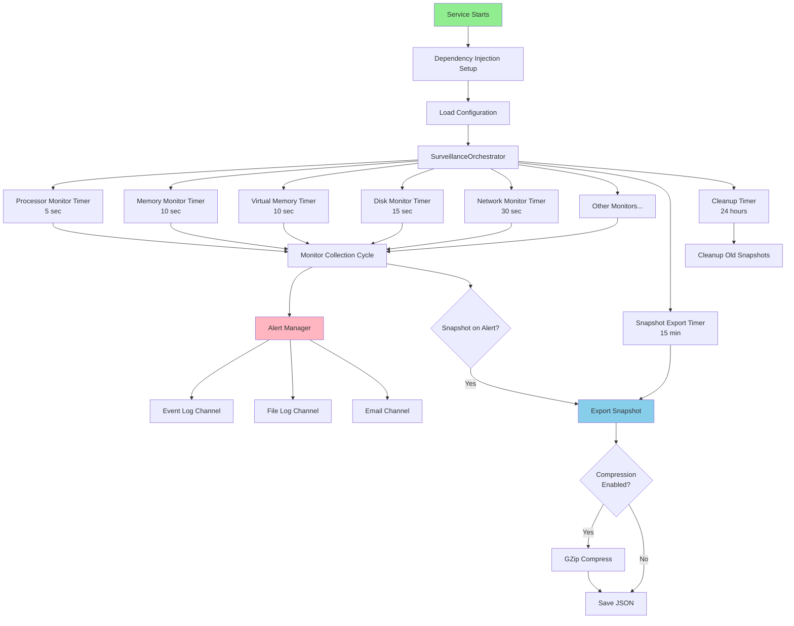
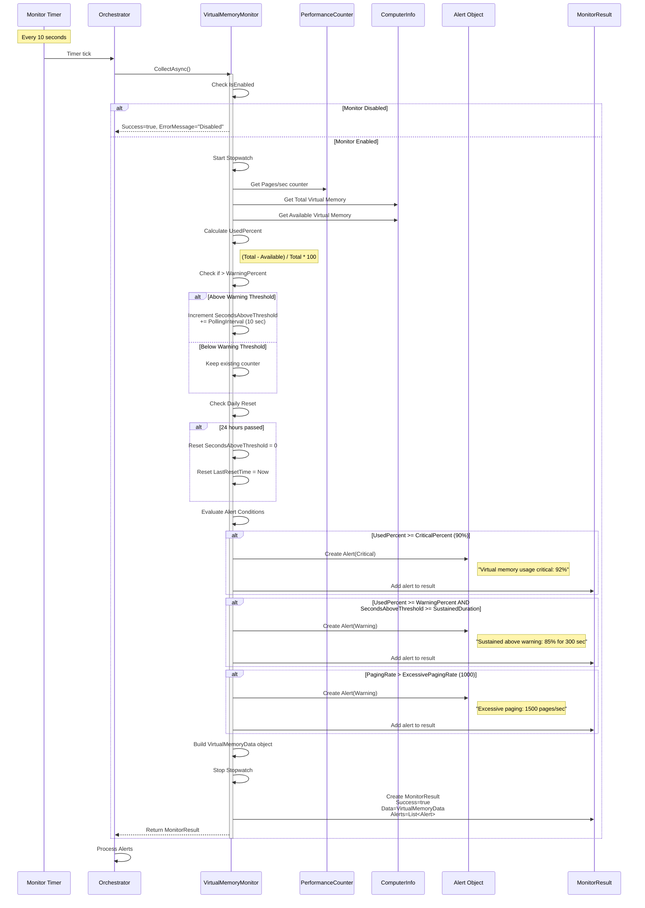
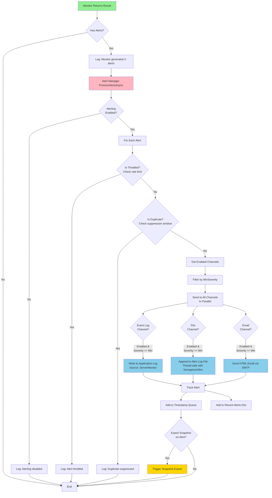
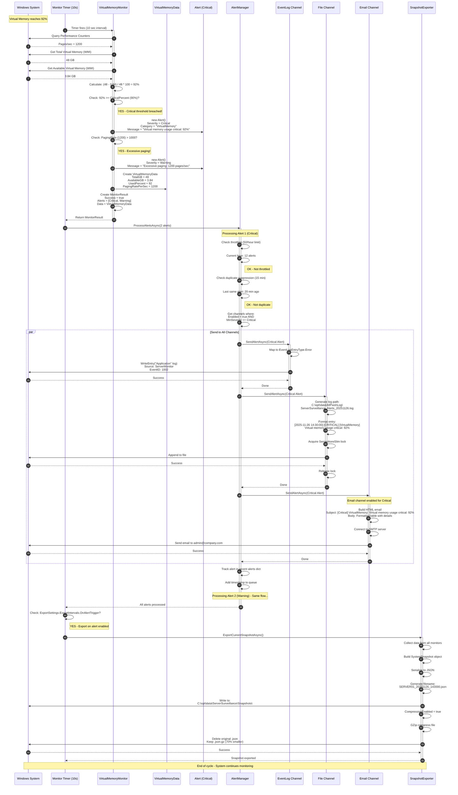
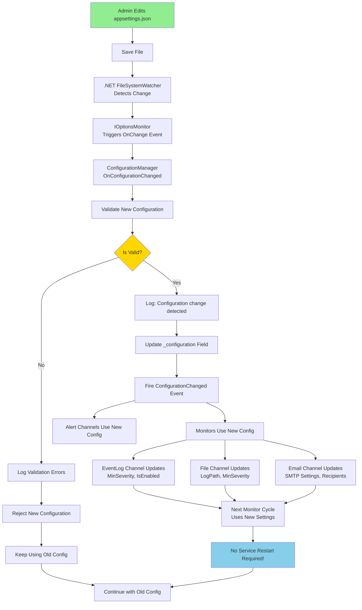

# Server Surveillance Tool - Monitoring Flow Diagrams

**Purpose:** Visual representation of monitoring flow and alert processing  
**Example:** Virtual Memory threshold breach scenario  
**Date:** 2025-11-26

---

## Table of Contents
1. [Overall System Architecture](#overall-system-architecture)
2. [Virtual Memory Monitoring Flow](#virtual-memory-monitoring-flow)
3. [Alert Processing Flow](#alert-processing-flow)
4. [Complete Breach-to-Notification Flow](#complete-breach-to-notification-flow)
5. [Configuration Hot-Reload Flow](#configuration-hot-reload-flow)
6. [Snapshot Export Flow](#snapshot-export-flow)

---

## Overall System Architecture



---

## Virtual Memory Monitoring Flow

### Detailed Monitor Collection Cycle



---

## Alert Processing Flow

### From Monitor to Alert Channels



---

## Complete Breach-to-Notification Flow

### Virtual Memory Critical Threshold Breach Example



---

## Configuration Hot-Reload Flow



---

## Snapshot Export Flow

```mermaid
flowchart TB
    Start{Export Trigger} --> Scheduled[Scheduled Timer<br/>Every 15 minutes]
    Start --> OnAlert[Alert Triggered]
    Start --> OnDemand[On-Demand Request]
    
    Scheduled --> Collect[Collect Current Snapshot]
    OnAlert --> Collect
    OnDemand --> Collect
    
    Collect --> Parallel[Query All Enabled Monitors<br/>In Parallel]
    
    Parallel --> PMon[Processor Monitor]
    Parallel --> MMon[Memory Monitor]
    Parallel --> VMon[Virtual Memory Monitor]
    Parallel --> DMon[Disk Monitor]
    Parallel --> NMon[Network Monitor]
    Parallel --> UMon[Uptime Monitor]
    Parallel --> WMon[Windows Update Monitor]
    Parallel --> EMon[Event Log Monitor]
    Parallel --> TMon[Scheduled Task Monitor]
    
    PMon --> Await[Await All Results]
    MMon --> Await
    VMon --> Await
    DMon --> Await
    NMon --> Await
    UMon --> Await
    WMon --> Await
    EMon --> Await
    TMon --> Await
    
    Await --> Build[Build SystemSnapshot]
    
    Build --> Metadata[Add Metadata:<br/>ServerName<br/>Timestamp<br/>SnapshotId (GUID)<br/>ToolVersion<br/>CollectionDurationMs]
    
    Metadata --> AddData[Add Monitor Data:<br/>Processor<br/>Memory<br/>VirtualMemory<br/>Disks<br/>Network<br/>Uptime<br/>WindowsUpdates<br/>Events<br/>ScheduledTasks<br/>Alerts]
    
    AddData --> Serialize[Serialize to JSON<br/>Pretty-printed<br/>CamelCase<br/>Null values omitted]
    
    Serialize --> Filename[Generate Filename<br/>Pattern: ServerName_Timestamp.json<br/>Example: SERVER01_20251126_143000.json]
    
    Filename --> CheckDir{Output Directory<br/>Exists?}
    
    CheckDir -->|No| CreateDir[Create Directory]
    CheckDir -->|Yes| WritePath[Write to Path]
    CreateDir --> WritePath
    
    WritePath --> Write[Write JSON to File]
    
    Write --> Compress{Compression<br/>Enabled?}
    
    Compress -->|No| Done[Log: Snapshot Exported]
    
    Compress -->|Yes| GZip[GZip Compress]
    
    GZip --> Size[Original: 250 KB<br/>Compressed: 75 KB<br/>70% reduction]
    
    Size --> DeleteOrig[Delete Original JSON]
    
    DeleteOrig --> Rename[Keep .json.gz]
    
    Rename --> Done
    
    Done --> End[End]
    
    style Start fill:#90EE90
    style Build fill:#FFB6C1
    style Serialize fill:#87CEEB
    style GZip fill:#FFD700
```

---

## Real-World Example Timeline

### What Actually Happens: Virtual Memory Breach at 14:30:00

```mermaid
gantt
    title Virtual Memory Breach Detection and Response Timeline
    dateFormat HH:mm:ss
    axisFormat %H:%M:%S
    
    section Monitoring
    Virtual Memory at 85%           :14:29:50, 10s
    Virtual Memory at 92%           :14:30:00, 10s
    Threshold breached detected     :14:30:00, 1s
    
    section Data Collection
    Query Performance Counters      :14:30:00, 100ms
    Query WMI (Total Memory)        :14:30:00, 80ms
    Query WMI (Available Memory)    :14:30:00, 80ms
    Calculate percentages           :14:30:00, 10ms
    
    section Alert Creation
    Create Critical Alert           :14:30:00, 5ms
    Create Warning Alert (Paging)   :14:30:00, 5ms
    Build MonitorResult             :14:30:00, 10ms
    
    section Alert Processing
    AlertManager receives alerts    :14:30:00, 5ms
    Check throttling limits         :14:30:00, 2ms
    Check duplicate suppression     :14:30:00, 3ms
    
    section Alert Delivery
    Write to Event Log              :14:30:00, 50ms
    Write to Alert File             :14:30:00, 30ms
    Send Email                      :14:30:00, 500ms
    
    section Snapshot Export
    Trigger snapshot export         :14:30:01, 10ms
    Collect all monitor data        :14:30:01, 2500ms
    Serialize to JSON               :14:30:03, 300ms
    GZip compress                   :14:30:04, 400ms
    Write to disk                   :14:30:04, 100ms
    
    section Logging
    Log alert generation            :14:30:00, 5ms
    Log alert delivery              :14:30:01, 5ms
    Log snapshot export             :14:30:05, 5ms
```



**Total Time:**
- Detection to Alert Delivery: ~600ms
- Detection to Snapshot Export Complete: ~5 seconds

---

## Configuration Reference for Virtual Memory

From `appsettings.json`:

```json
{
  "VirtualMemoryMonitoring": {
    "Enabled": true,
    "PollingIntervalSeconds": 10,
    "Thresholds": {
      "WarningPercent": 80,
      "CriticalPercent": 90,
      "SustainedDurationSeconds": 300,
      "ExcessivePagingRate": 1000
    }
  }
}
```

**Alert Triggers:**
1. **Critical Alert**: UsedPercent >= 90% (immediate)
2. **Warning Alert (Sustained)**: UsedPercent >= 80% for 300+ seconds
3. **Warning Alert (Paging)**: PagingRate > 1000 pages/sec

---

## Summary

This document demonstrates:
- ✅ How monitors collect data and evaluate thresholds
- ✅ How alerts are created and processed
- ✅ How alerts are distributed to multiple channels in parallel
- ✅ How snapshot exports are triggered and compressed
- ✅ How configuration hot-reload works without service restart
- ✅ Real-world timing of the entire detection-to-notification pipeline

**Total latency from threshold breach to administrator notification: ~600 milliseconds** ⚡

---

*Last Updated: 2025-11-26*

