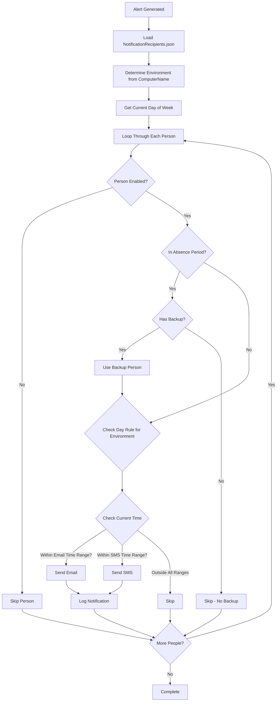
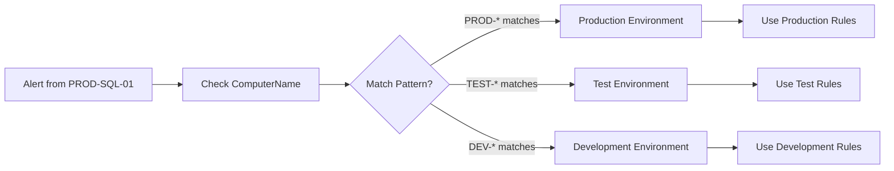
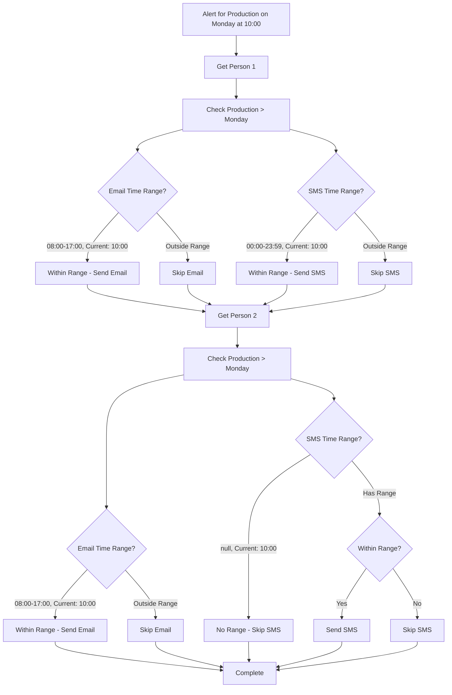
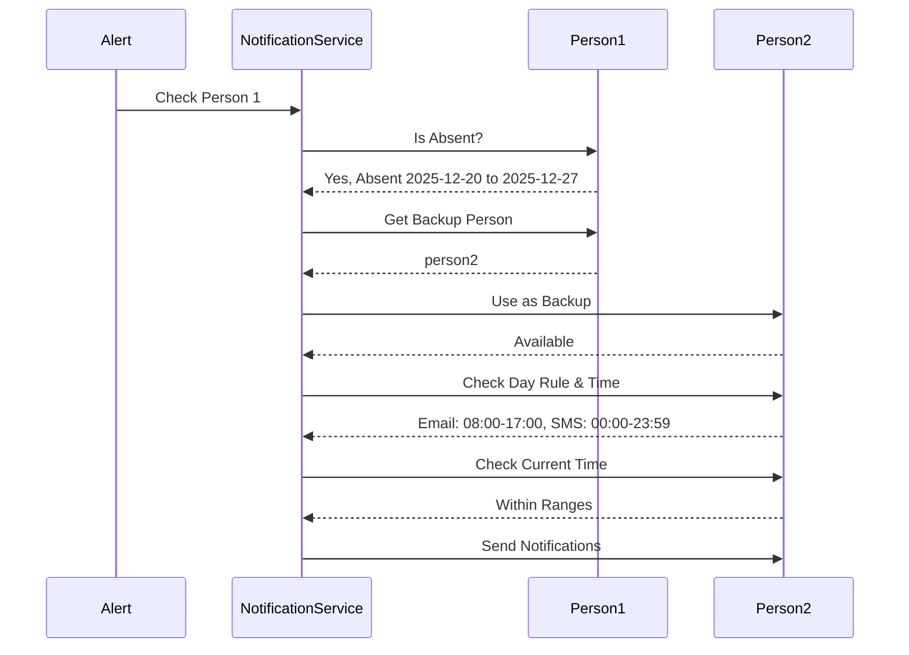

# Notification Management System - Simplified Designtes

## Overview

Simple notification management for small teams (1-4 people) with:
- **Environment-based routing**: Different recipients for different server environments
- **Per-person, per-day rules**: Each person can have different notification settings for each day of the week
- **Vacation/absence management**: Temporarily disable notifications for specific people
- **Flexible per-environment rules**: Different rules for Production, Test, Development, etc.

---

## JSON Configuration Structure

### File Location
`config/NotificationRecipients.json`

### Simplified Schema

```json
{
  "version": "1.0",
  "lastUpdated": "2025-12-12T10:00:00Z",
  "environments": [
    {
      "name": "Production",
      "computerNamePatterns": ["PROD-*", "*-PROD-*", "PRODUCTION-*"]
    },
    {
      "name": "Test",
      "computerNamePatterns": ["TEST-*", "*-TEST-*", "TST-*"]
    },
    {
      "name": "Development",
      "computerNamePatterns": ["DEV-*", "*-DEV-*", "DEVELOPMENT-*"]
    }
  ],
  "people": [
    {
      "id": "person1",
      "name": "John Doe",
      "email": "john.doe@company.com",
      "phone": "+4712345678",
      "enabled": true,
      "environments": {
        "Production": {
          "Monday": { "email": { "from": "08:00", "to": "17:00" }, "sms": { "from": "00:00", "to": "23:59" } },
          "Tuesday": { "email": { "from": "08:00", "to": "17:00" }, "sms": { "from": "00:00", "to": "23:59" } },
          "Wednesday": { "email": { "from": "08:00", "to": "17:00" }, "sms": { "from": "00:00", "to": "23:59" } },
          "Thursday": { "email": { "from": "08:00", "to": "17:00" }, "sms": { "from": "00:00", "to": "23:59" } },
          "Friday": { "email": { "from": "08:00", "to": "17:00" }, "sms": { "from": "00:00", "to": "23:59" } },
          "Saturday": { "email": null, "sms": { "from": "00:00", "to": "23:59" } },
          "Sunday": { "email": null, "sms": { "from": "00:00", "to": "23:59" } }
        },
        "Test": {
          "Monday": { "email": { "from": "08:00", "to": "17:00" }, "sms": null },
          "Tuesday": { "email": { "from": "08:00", "to": "17:00" }, "sms": null },
          "Wednesday": { "email": { "from": "08:00", "to": "17:00" }, "sms": null },
          "Thursday": { "email": { "from": "08:00", "to": "17:00" }, "sms": null },
          "Friday": { "email": { "from": "08:00", "to": "17:00" }, "sms": null },
          "Saturday": { "email": null, "sms": null },
          "Sunday": { "email": null, "sms": null }
        },
        "Development": {
          "Monday": { "email": null, "sms": null },
          "Tuesday": { "email": null, "sms": null },
          "Wednesday": { "email": null, "sms": null },
          "Thursday": { "email": null, "sms": null },
          "Friday": { "email": null, "sms": null },
          "Saturday": { "email": null, "sms": null },
          "Sunday": { "email": null, "sms": null }
        }
      },
      "absences": [
        {
          "startDate": "2025-12-20",
          "endDate": "2025-12-27",
          "reason": "Vacation",
          "backupPersonId": "person2"
        }
      ]
    },
    {
      "id": "person2",
      "name": "Jane Smith",
      "email": "jane.smith@company.com",
      "phone": "+4798765432",
      "enabled": true,
      "environments": {
        "Production": {
          "Monday": { "email": { "from": "08:00", "to": "17:00" }, "sms": null },
          "Tuesday": { "email": { "from": "08:00", "to": "17:00" }, "sms": null },
          "Wednesday": { "email": { "from": "08:00", "to": "17:00" }, "sms": { "from": "00:00", "to": "23:59" } },
          "Thursday": { "email": { "from": "08:00", "to": "17:00" }, "sms": { "from": "00:00", "to": "23:59" } },
          "Friday": { "email": { "from": "08:00", "to": "17:00" }, "sms": null },
          "Saturday": { "email": null, "sms": { "from": "00:00", "to": "23:59" } },
          "Sunday": { "email": null, "sms": { "from": "00:00", "to": "23:59" } }
        },
        "Test": {
          "Monday": { "email": { "from": "08:00", "to": "17:00" }, "sms": null },
          "Tuesday": { "email": { "from": "08:00", "to": "17:00" }, "sms": null },
          "Wednesday": { "email": { "from": "08:00", "to": "17:00" }, "sms": null },
          "Thursday": { "email": { "from": "08:00", "to": "17:00" }, "sms": null },
          "Friday": { "email": { "from": "08:00", "to": "17:00" }, "sms": null },
          "Saturday": { "email": null, "sms": null },
          "Sunday": { "email": null, "sms": null }
        },
        "Development": {
          "Monday": { "email": null, "sms": null },
          "Tuesday": { "email": null, "sms": null },
          "Wednesday": { "email": null, "sms": null },
          "Thursday": { "email": null, "sms": null },
          "Friday": { "email": null, "sms": null },
          "Saturday": { "email": null, "sms": null },
          "Sunday": { "email": null, "sms": null }
        }
      },
      "absences": []
    },
    {
      "id": "person3",
      "name": "Bob Johnson",
      "email": "bob.johnson@company.com",
      "phone": "+4711111111",
      "enabled": true,
      "environments": {
        "Production": {
          "Monday": { "email": null, "sms": { "from": "00:00", "to": "23:59" } },
          "Tuesday": { "email": null, "sms": { "from": "00:00", "to": "23:59" } },
          "Wednesday": { "email": null, "sms": { "from": "00:00", "to": "23:59" } },
          "Thursday": { "email": null, "sms": { "from": "00:00", "to": "23:59" } },
          "Friday": { "email": null, "sms": { "from": "00:00", "to": "23:59" } },
          "Saturday": { "email": null, "sms": { "from": "00:00", "to": "23:59" } },
          "Sunday": { "email": null, "sms": { "from": "00:00", "to": "23:59" } }
        },
        "Test": {
          "Monday": { "email": null, "sms": null },
          "Tuesday": { "email": null, "sms": null },
          "Wednesday": { "email": null, "sms": null },
          "Thursday": { "email": null, "sms": null },
          "Friday": { "email": null, "sms": null },
          "Saturday": { "email": null, "sms": null },
          "Sunday": { "email": null, "sms": null }
        },
        "Development": {
          "Monday": { "email": null, "sms": null },
          "Tuesday": { "email": null, "sms": null },
          "Wednesday": { "email": null, "sms": null },
          "Thursday": { "email": null, "sms": null },
          "Friday": { "email": null, "sms": null },
          "Saturday": { "email": null, "sms": null },
          "Sunday": { "email": null, "sms": null }
        }
      },
      "absences": []
    }
  ]
}
```

---

## System Flow

### Notification Decision Process



### Environment Detection



### Per-Person, Per-Day, Per-Environment Logic



### Vacation/Absence Handling



---

## Key Features

### 1. Simple Structure
- **People**: List of 1-4 people with contact info
- **Environments**: Per-environment configuration
- **Days**: Per-day rules (Monday through Sunday)
- **Channels**: Simple boolean for email and SMS per day

### 2. Per-Environment, Per-Person, Per-Day Rules with Time Ranges

Each person has a matrix with time ranges:
```
Person 1:
  Production:
    Monday:    { email: { from: "08:00", to: "17:00" }, sms: { from: "00:00", to: "23:59" } }
    Tuesday:   { email: { from: "08:00", to: "17:00" }, sms: { from: "00:00", to: "23:59" } }
    Wednesday: { email: { from: "08:00", to: "17:00" }, sms: { from: "00:00", to: "23:59" } }
    ...
  Test:
    Monday:    { email: { from: "08:00", to: "17:00" }, sms: null }
    ...
  Development:
    Monday:    { email: null, sms: null }
    ...
```

**Time Range Rules:**
- `null` = Channel disabled for that day
- `{ from: "08:00", to: "17:00" }` = Channel enabled during this time range
- Time format: `HH:mm` (24-hour format)
- If current time is within range, notification is sent
- If current time is outside range, notification is skipped

### 3. Vacation Management
- Simple date range (startDate, endDate)
- Optional backup person ID
- If backup not specified, person is skipped during absence

---

## Implementation

### Configuration Model

```csharp
public class NotificationRecipientsConfig
{
    public string Version { get; set; }
    public DateTime LastUpdated { get; set; }
    public List<EnvironmentConfig> Environments { get; set; }
    public List<PersonConfig> People { get; set; }
}

public class EnvironmentConfig
{
    public string Name { get; set; }
    public List<string> ComputerNamePatterns { get; set; }
}

public class PersonConfig
{
    public string Id { get; set; }
    public string Name { get; set; }
    public string Email { get; set; }
    public string Phone { get; set; }
    public bool Enabled { get; set; }
    public Dictionary<string, Dictionary<string, DayNotificationRule>> Environments { get; set; }
    public List<AbsencePeriod> Absences { get; set; }
}

public class DayNotificationRule
{
    public TimeRange? Email { get; set; }
    public TimeRange? Sms { get; set; }
}

public class TimeRange
{
    public string From { get; set; }  // Format: "HH:mm" (e.g., "08:00")
    public string To { get; set; }    // Format: "HH:mm" (e.g., "17:00")
}

public class AbsencePeriod
{
    public DateTime StartDate { get; set; }
    public DateTime EndDate { get; set; }
    public string Reason { get; set; }
    public string? BackupPersonId { get; set; }
}
```

### Service Interface

```csharp
public interface INotificationRecipientService
{
    List<RecipientInfo> GetRecipientsForAlert(
        string environment, 
        string dayOfWeek, 
        string channel);
    
    bool IsPersonAbsent(string personId, DateTime date);
    string? GetBackupPerson(string personId, DateTime date);
}
```

### Usage in Alert Channels

```csharp
// In EmailAlertChannel
var recipients = _notificationService.GetRecipientsForAlert(
    environment: "Production",
    dayOfWeek: "Monday",
    currentTime: DateTime.Now,
    channel: "email");

foreach (var recipient in recipients)
{
    SendEmail(recipient.Email, alert);
}

// In SmsAlertChannel
var recipients = _notificationService.GetRecipientsForAlert(
    environment: "Production",
    dayOfWeek: "Monday",
    currentTime: DateTime.Now,
    channel: "sms");

foreach (var recipient in recipients)
{
    SendSms(recipient.Phone, alert);
}
```

### Time Range Validation

```csharp
public bool IsTimeWithinRange(TimeRange? range, DateTime currentTime)
{
    if (range == null)
        return false; // Channel disabled
    
    var currentTimeStr = currentTime.ToString("HH:mm");
    return string.Compare(currentTimeStr, range.From) >= 0 && 
           string.Compare(currentTimeStr, range.To) <= 0;
}
```

---

## Example Scenarios

### Scenario 1: Production Monday Alert at 10:00
- **Environment**: Production
- **Day**: Monday
- **Time**: 10:00
- **Person 1**: Email (08:00-17:00) ✅, SMS (00:00-23:59) ✅ → **Both sent**
- **Person 2**: Email (08:00-17:00) ✅, SMS (null) ❌ → **Email only**
- **Person 3**: Email (null) ❌, SMS (00:00-23:59) ✅ → **SMS only**

### Scenario 2: Production Monday Alert at 20:00 (Outside Business Hours)
- **Environment**: Production
- **Day**: Monday
- **Time**: 20:00
- **Person 1**: Email (08:00-17:00) ❌, SMS (00:00-23:59) ✅ → **SMS only**
- **Person 2**: Email (08:00-17:00) ❌, SMS (null) ❌ → **Skipped**
- **Person 3**: Email (null) ❌, SMS (00:00-23:59) ✅ → **SMS only**

### Scenario 3: Test Weekend Alert at 14:00
- **Environment**: Test
- **Day**: Saturday
- **Time**: 14:00
- **Person 1**: Email (null) ❌, SMS (null) ❌ → **Skipped**
- **Person 2**: Email (null) ❌, SMS (null) ❌ → **Skipped**
- **Person 3**: Email (null) ❌, SMS (null) ❌ → **Skipped**
- **Result**: No notifications sent

### Scenario 4: Person on Vacation
- **Person 1**: Absent Dec 20-27
- **Backup**: Person 2
- **Alert on Dec 22 (Monday, Production) at 10:00**
- **Person 1**: Skipped (absent)
- **Person 2**: Used as backup → Email (08:00-17:00) ✅, SMS (null) ❌ → **Email sent**
- **Person 3**: Normal check → Email (null) ❌, SMS (00:00-23:59) ✅ → **SMS sent**

---

## Benefits

1. **Simple Structure**: Easy to understand and maintain
2. **Flexible Rules**: Per-environment, per-person, per-day configuration with time ranges
3. **Time-Based Control**: Specify exact time windows when notifications should be sent
4. **Small Team Focus**: Designed for 1-4 people
5. **Vacation Support**: Automatic backup resolution
6. **Easy Updates**: Just edit JSON file
7. **Clear Matrix**: See all rules at a glance
8. **24/7 or Business Hours**: Support both continuous and time-limited notifications

---

## Migration Path

1. **Create JSON file** with current hardcoded recipients
2. **Add service** to load and parse JSON
3. **Update EmailAlertChannel** to use service
4. **Update SmsAlertChannel** to use service
5. **Test with one environment** first
6. **Gradually migrate** all environments
7. **Remove hardcoded** email/phone lists

---

## Future Enhancements (Optional)

1. **Time ranges**: Add time-of-day filtering (e.g., 08:00-17:00)
2. **Severity filtering**: Different rules for Critical vs Warning
3. **REST API**: Manage configuration via API
4. **Web UI**: Visual editor for the matrix
5. **Calendar integration**: Auto-detect absences
