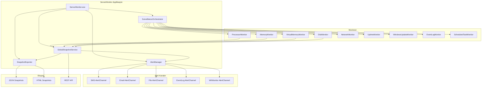
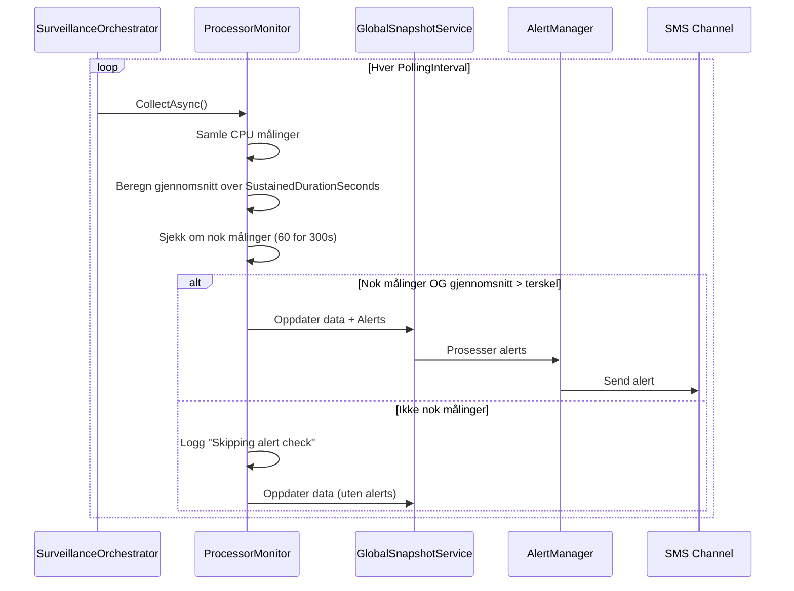
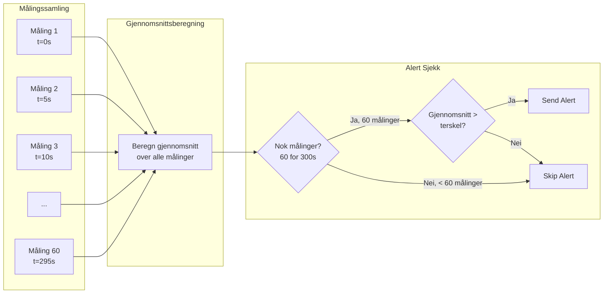
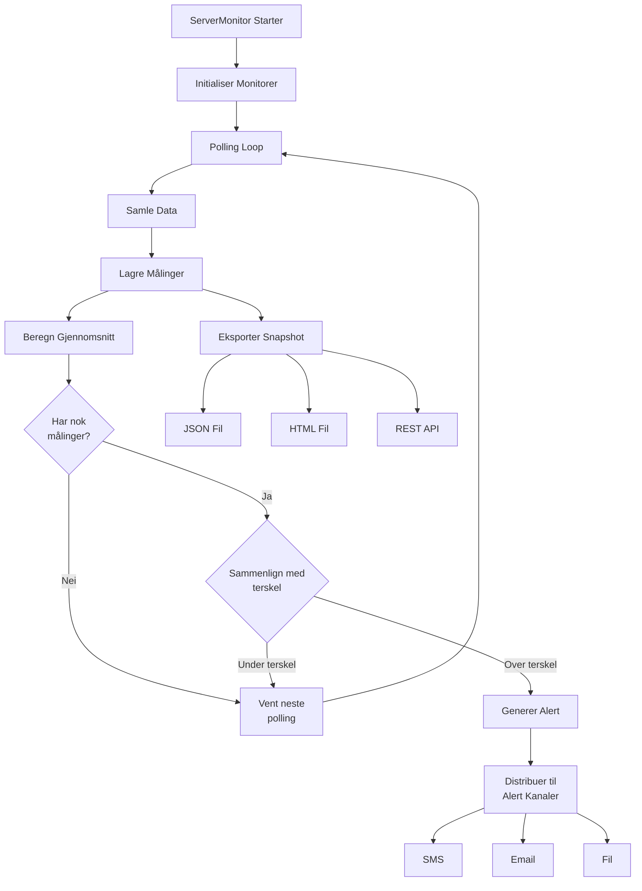
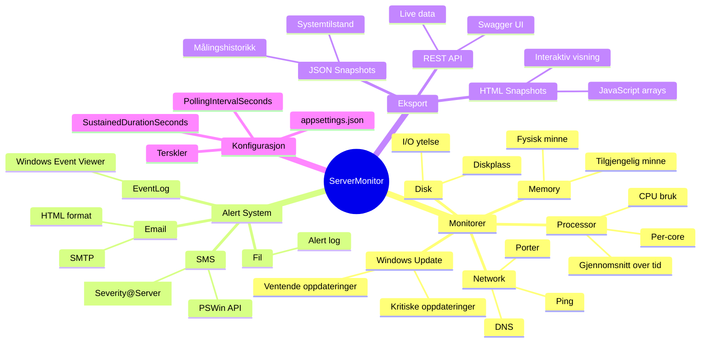
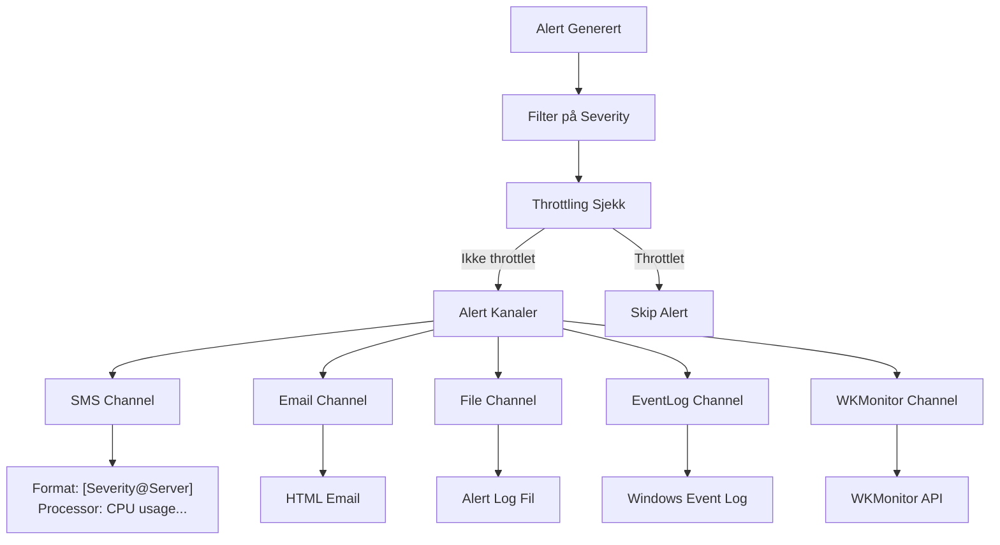
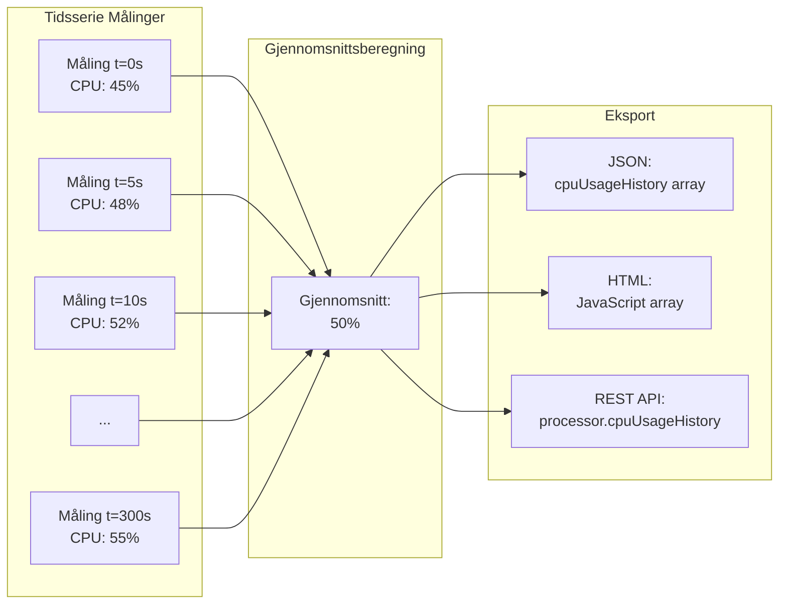
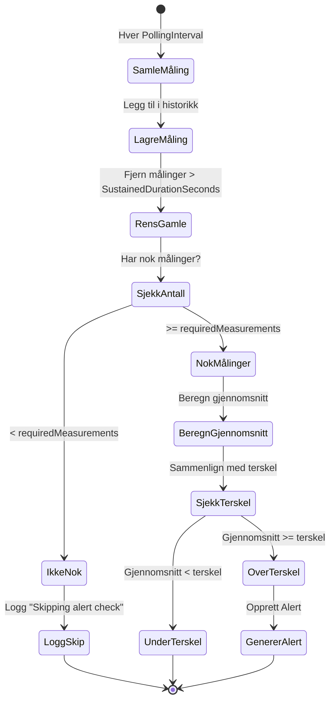
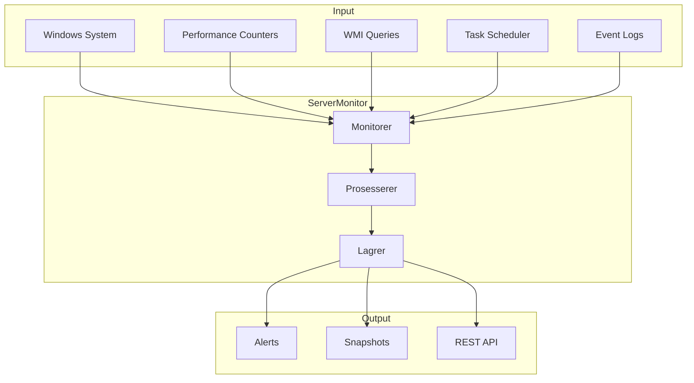

# ServerMonitor - Systemoversikt

## Arkitektur

## Overvåkingsflyt

## Måling og Gjennomsnittsberegning

## Dataflyt

## Komponenter

## Alert Distribusjon

## Målingshistorikk

## Terskel Sjekk Logikk

## Eksempel: CPU Alert Scenario

```mermaid
gantt
    title CPU Overvåking - 5 Minutter (300 sekunder)
    dateFormat X
    axisFormat %Ss
    
    section Målinger
    Måling 1 (t=0s)    :0, 5
    Måling 2 (t=5s)    :5, 5
    Måling 3 (t=10s)   :10, 5
    Måling 4-59        :15, 280
    Måling 60 (t=295s) :295, 5
    
    section Gjennomsnitt
    Beregn gjennomsnitt :300, 1
    
    section Alert Sjekk
    Sjekk terskel       :301, 1
    Send alert (hvis over) :302, 1
```

## System Oversikt

