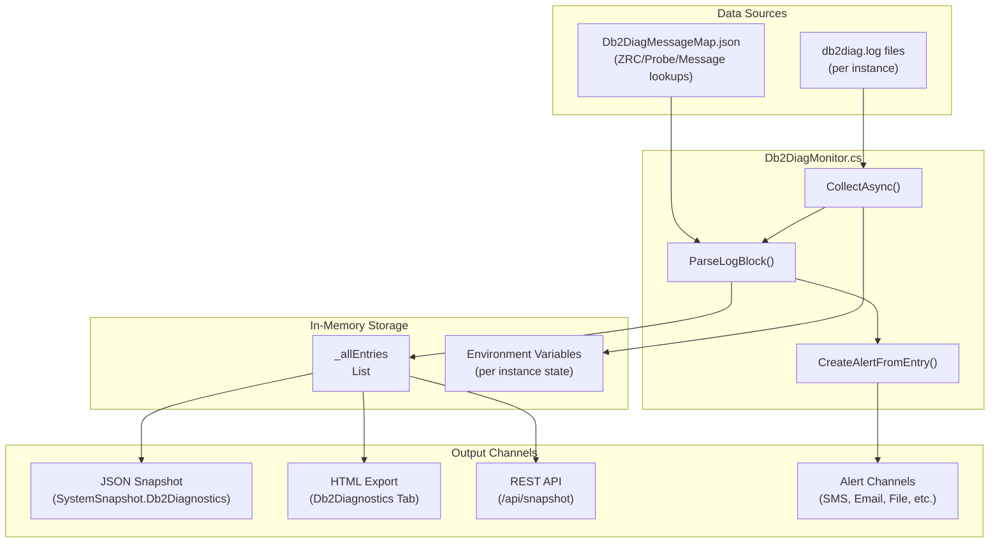
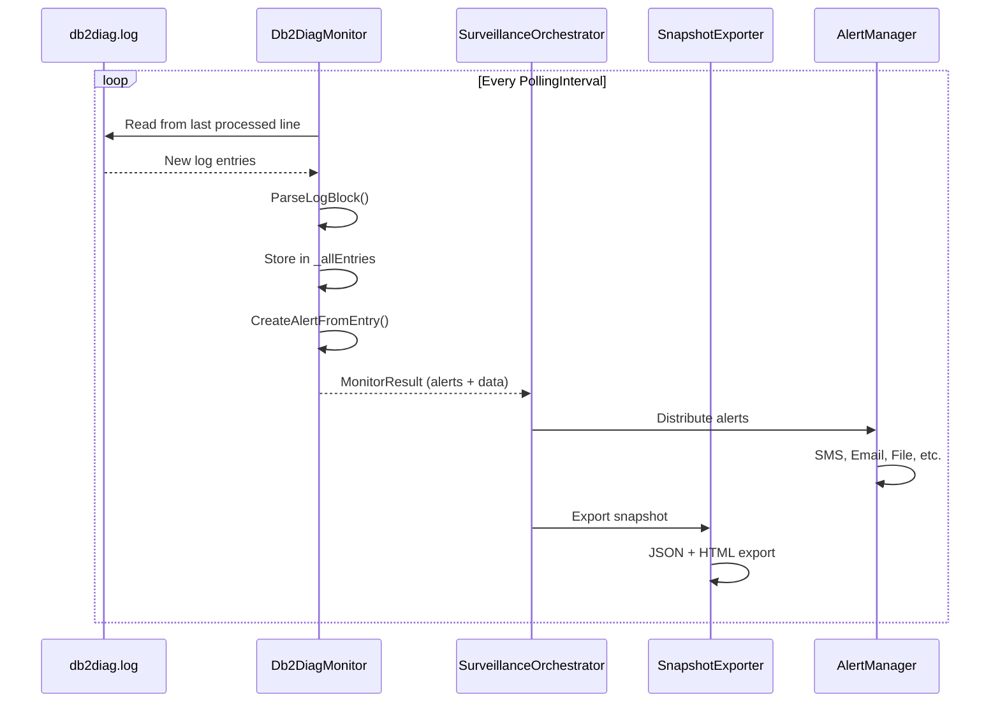
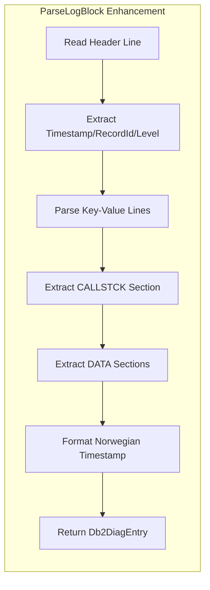
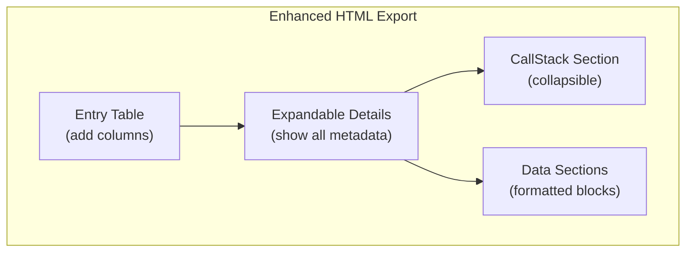
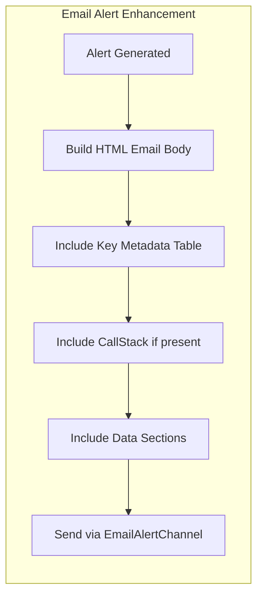

# DB2 Diagnostic Monitor - Design & Enhancement Plan

## Current Architecture



## Data Flow



---

## Current vs Original Data Model Comparison

### Fields in Original PowerShell Script (Db2-DiagTracker.ps1)

| Field | Current C# Model | Status |
|-------|------------------|--------|
| `Timestamp` | ✅ `Timestamp` | ✓ Same |
| `TimestampNorwegian` | ❌ Missing | **ADD** |
| `TimestampParsed` | ✅ `TimestampParsed` | ✓ Same |
| `RecordId` | ✅ `RecordId` | ✓ Same |
| `Level` | ✅ `Level` | ✓ Same |
| `LevelPriority` | ✅ `LevelPriority` | ✓ Same |
| `SourceLineNumber` | ✅ `SourceLineNumber` | ✓ Same |
| `Description` | ✅ `Description` | ✓ Same |
| `ProcessId_PID` | ✅ `ProcessId` | ✓ Renamed |
| `ThreadId_TID` | ✅ `ThreadId` | ✓ Renamed |
| `ProcessName_PROC` | ✅ `ProcessName` | ✓ Renamed |
| `InstanceName_INSTANCE` | ❌ Missing | **ADD** (from log, not path) |
| `InstanceName` | ✅ `InstanceName` | ✓ Same (from path) |
| `PartitionNumber_NODE` | ❌ Missing | **ADD** |
| `DatabaseName_DB` | ✅ `DatabaseName` | ✓ Same |
| `ApplicationHandle_APPHDL` | ✅ `ApplicationHandle` | ✓ Same |
| `ApplicationId_APPID` | ✅ `ApplicationId` | ✓ Same |
| `UnitOfWorkId_UOWID` | ❌ Missing | **ADD** |
| `LastActivityId_LAST_ACTID` | ❌ Missing | **ADD** |
| `AuthorizationId_AUTHID` | ✅ `AuthorizationId` | ✓ Same |
| `HostName_HOSTNAME` | ✅ `HostName` | ✓ Same |
| `EngineDispatchableUnitId_EDUID` | ❌ Missing | **ADD** |
| `EngineDispatchableUnitName_EDUNAME` | ❌ Missing | **ADD** |
| `FunctionAndProbe_FUNCTION` | ✅ `Function` | ✓ Renamed |
| `MessageText_MESSAGE` | ✅ `Message` | ✓ Same |
| `CalledFunction_CALLED` | ✅ `CalledFunction` | ✓ Same |
| `ReturnCode_RETCODE` | ✅ `ReturnCode` | ✓ Same |
| `CallStack_CALLSTACK` | ❌ Missing | **ADD** |
| `DataSections` | ❌ Missing | **ADD** |
| `RawContentLines` | ❌ Missing | **ADD** (optional) |

### Missing Fields Summary

| Category | Fields to Add |
|----------|--------------|
| **Timestamp** | `TimestampNorwegian` (formatted for Norwegian timezone) |
| **Process/Thread** | `PartitionNumber` (NODE) |
| **Application** | `UnitOfWorkId` (UOWID), `LastActivityId` (LAST_ACTID) |
| **EDU** | `EngineDispatchableUnitId` (EDUID), `EngineDispatchableUnitName` (EDUNAME) |
| **Debug** | `CallStack` (array of stack frames), `DataSections` (structured data blocks) |
| **Source** | `RawContentLines` (original log lines for reference) |

---

## Enhancement Plan

### Phase 1: Extend Data Model

Update `Db2DiagEntry` in `ServerMonitor.Core/Models/Db2DiagModels.cs`:

```csharp
public class Db2DiagEntry
{
    // Existing fields...
    
    // NEW: Norwegian timezone formatted timestamp
    public string? TimestampNorwegian { get; set; }
    
    // NEW: Partition/Node information
    public string? PartitionNumber { get; set; }  // NODE
    
    // NEW: Application tracking
    public string? UnitOfWorkId { get; set; }     // UOWID
    public string? LastActivityId { get; set; }   // LAST_ACTID
    
    // NEW: Engine Dispatchable Unit (EDU) info
    public string? EngineDispatchableUnitId { get; set; }    // EDUID
    public string? EngineDispatchableUnitName { get; set; }  // EDUNAME
    
    // NEW: Debug information
    public List<string> CallStack { get; set; } = new();
    public List<Db2DataSection> DataSections { get; set; } = new();
    
    // NEW: Original log content (optional, for debugging)
    public List<string>? RawContentLines { get; set; }
}

public class Db2DataSection
{
    public int Number { get; set; }
    public string Type { get; set; } = string.Empty;
    public List<string> Lines { get; set; } = new();
}
```

### Phase 2: Update Parser

Extend `ParseLogBlock()` in `Db2DiagMonitor.cs` to extract new fields:



**Key changes:**
1. Add regex for `EDUID`, `EDUNAME`, `NODE`, `UOWID`, `LAST_ACTID`
2. Detect and parse `CALLSTCK:` sections (stack frames)
3. Detect and parse `DATA #N:` sections (structured data)
4. Add Norwegian timezone formatting

### Phase 3: Update Exports

#### JSON Snapshot Export
No changes needed - new fields automatically serialized.

#### HTML Export Enhancement

Update `SnapshotHtmlExporter.cs` to display new fields:



**New HTML sections:**
1. Add columns for EDU, Node, UOWID to main table
2. Show CallStack in expandable `<details>` block
3. Render DataSections with syntax highlighting
4. Show RawContentLines as copyable code block

#### REST API Enhancement
No changes needed - `SystemSnapshot.Db2Diagnostics` already returns full data.

### Phase 4: Enhanced Email Alerts

Update alert creation to include rich metadata in email body:



**Email template additions:**
- Formatted metadata table with all DB2 fields
- Color-coded severity indicator
- Link to full HTML report (if accessible)
- CallStack formatted as monospace block
- Truncated DataSections with "view full in report" link

---

## Implementation Checklist

### Models
- [ ] Add `TimestampNorwegian` to `Db2DiagEntry`
- [ ] Add `PartitionNumber` (NODE) to `Db2DiagEntry`
- [ ] Add `UnitOfWorkId` (UOWID) to `Db2DiagEntry`
- [ ] Add `LastActivityId` (LAST_ACTID) to `Db2DiagEntry`
- [ ] Add `EngineDispatchableUnitId` (EDUID) to `Db2DiagEntry`
- [ ] Add `EngineDispatchableUnitName` (EDUNAME) to `Db2DiagEntry`
- [ ] Add `CallStack` list to `Db2DiagEntry`
- [ ] Add `DataSections` list to `Db2DiagEntry`
- [ ] Create `Db2DataSection` class
- [ ] Add optional `RawContentLines` to `Db2DiagEntry`

### Parser (Db2DiagMonitor.cs)
- [ ] Add key-value extraction for new fields
- [ ] Implement CALLSTCK section parsing
- [ ] Implement DATA section parsing
- [ ] Add Norwegian timezone formatting
- [ ] Preserve raw content lines (optional)

### HTML Export (SnapshotHtmlExporter.cs)
- [ ] Add new columns to entry table
- [ ] Enhance details section with new fields
- [ ] Add CallStack rendering
- [ ] Add DataSections rendering
- [ ] Add copy-to-clipboard for raw content

### Email Alerts (EmailAlertChannel.cs)
- [ ] Create HTML email template with metadata table
- [ ] Include CallStack section (if present)
- [ ] Include truncated DataSections
- [ ] Add severity color coding
- [ ] Include link to full report

### Alert Metadata
- [ ] Add new fields to `Alert.Metadata` dictionary
- [ ] Include EDU info in alert details
- [ ] Include Node/Partition info

---

## Example: Enhanced JSON Output

```json
{
  "Timestamp": "2026-01-05-07.55.23.394000+060",
  "TimestampNorwegian": "2026-01-05 07:55:23.394 +01:00",
  "TimestampParsed": "2026-01-05T07:55:23.394",
  "RecordId": "I32563699F546",
  "Level": "Error",
  "LevelPriority": 2,
  "SourceLineNumber": 735309,
  "EndLineNumber": 735325,
  "InstanceName": "DB2FED",
  "DatabaseName": "FKMPRD",
  "ProcessId": "4400",
  "ThreadId": "7240",
  "ProcessName": "db2syscs.exe",
  "PartitionNumber": "000",
  "ApplicationHandle": "0-15",
  "ApplicationId": "*LOCAL.DB2.251214080447",
  "UnitOfWorkId": "1",
  "LastActivityId": "0",
  "AuthorizationId": "SRV_CRM",
  "HostName": "p-no1fkmprd-db",
  "EngineDispatchableUnitId": "7240",
  "EngineDispatchableUnitName": "db2stmm (FKMPRD) 0",
  "Function": "DB2 UDB, config/install, sqlfLogUpdateCfgParam, probe:20",
  "Message": "Transaction log full",
  "ReturnCode": "ZRC=0x8700000A=-2030043126",
  "CalledFunction": null,
  "CallStack": [
    "[0] 0x00007FFD1234ABCD db2syscs.dll!sqlfLogUpdateCfgParam+0x1234",
    "[1] 0x00007FFD1234EFGH db2syscs.dll!sqlpixfm::Flush+0x5678"
  ],
  "DataSections": [
    {
      "Number": 1,
      "Type": "Hexdump 16 bytes",
      "Lines": ["0000 00 01 02 03 04 05 06 07  08 09 0A 0B 0C 0D 0E 0F"]
    }
  ],
  "Description": {
    "ZrcCode": {
      "description": "Transaction log full",
      "category": "Logging",
      "sqlState": "57011",
      "severity": "Critical"
    },
    "LevelInfo": {
      "priority": 2,
      "description": "Error condition detected",
      "action": "Investigate immediately"
    }
  },
  "RawContentLines": [
    "2026-01-05-07.55.23.394000+060 I32563699F546        LEVEL: Error",
    "PID     : 4400                 TID : 7240           PROC : db2syscs.exe",
    "..."
  ]
}
```

---

## Example: Enhanced Email Alert

```html
<h2 style="color: #d32f2f;">🔴 DB2 Critical Alert</h2>

<table style="border-collapse: collapse; width: 100%;">
  <tr><th style="text-align: left; padding: 8px; background: #f5f5f5;">Server</th>
      <td style="padding: 8px;">p-no1fkmprd-db</td></tr>
  <tr><th style="text-align: left; padding: 8px; background: #f5f5f5;">Instance</th>
      <td style="padding: 8px;">DB2FED</td></tr>
  <tr><th style="text-align: left; padding: 8px; background: #f5f5f5;">Database</th>
      <td style="padding: 8px;">FKMPRD</td></tr>
  <tr><th style="text-align: left; padding: 8px; background: #f5f5f5;">Timestamp</th>
      <td style="padding: 8px;">2026-01-05 07:55:23 (Norwegian)</td></tr>
  <tr><th style="text-align: left; padding: 8px; background: #f5f5f5;">Level</th>
      <td style="padding: 8px; color: #d32f2f; font-weight: bold;">Error</td></tr>
  <tr><th style="text-align: left; padding: 8px; background: #f5f5f5;">Message</th>
      <td style="padding: 8px;">Transaction log full</td></tr>
  <tr><th style="text-align: left; padding: 8px; background: #f5f5f5;">Function</th>
      <td style="padding: 8px; font-family: monospace;">sqlfLogUpdateCfgParam, probe:20</td></tr>
  <tr><th style="text-align: left; padding: 8px; background: #f5f5f5;">Return Code</th>
      <td style="padding: 8px; font-family: monospace;">ZRC=0x8700000A</td></tr>
  <tr><th style="text-align: left; padding: 8px; background: #f5f5f5;">Application</th>
      <td style="padding: 8px;">SRV_CRM (*LOCAL.DB2.251214080447)</td></tr>
  <tr><th style="text-align: left; padding: 8px; background: #f5f5f5;">EDU</th>
      <td style="padding: 8px;">7240 (db2stmm (FKMPRD) 0)</td></tr>
</table>

<h3>ZRC Code Description</h3>
<p><strong>Transaction log full</strong> - Category: Logging, SQL State: 57011</p>
<p><em>Recommendation: Increase log file size or archive logs</em></p>

<h3>Call Stack</h3>
<pre style="background: #263238; color: #aed581; padding: 10px; font-size: 12px;">
[0] 0x00007FFD1234ABCD db2syscs.dll!sqlfLogUpdateCfgParam+0x1234
[1] 0x00007FFD1234EFGH db2syscs.dll!sqlpixfm::Flush+0x5678
</pre>

<p><a href="http://server:8999/swagger">View full report in ServerMonitor</a></p>
```

---

## Priority

| Priority | Task | Effort |
|----------|------|--------|
| **P1** | Add missing fields to model | Low |
| **P1** | Update parser for new fields | Medium |
| **P2** | Enhance HTML export | Medium |
| **P2** | Add fields to alert metadata | Low |
| **P3** | Create enhanced email template | Medium |
| **P3** | Add CallStack/DataSection parsing | High |
| **P4** | Optional RawContentLines storage | Low |
