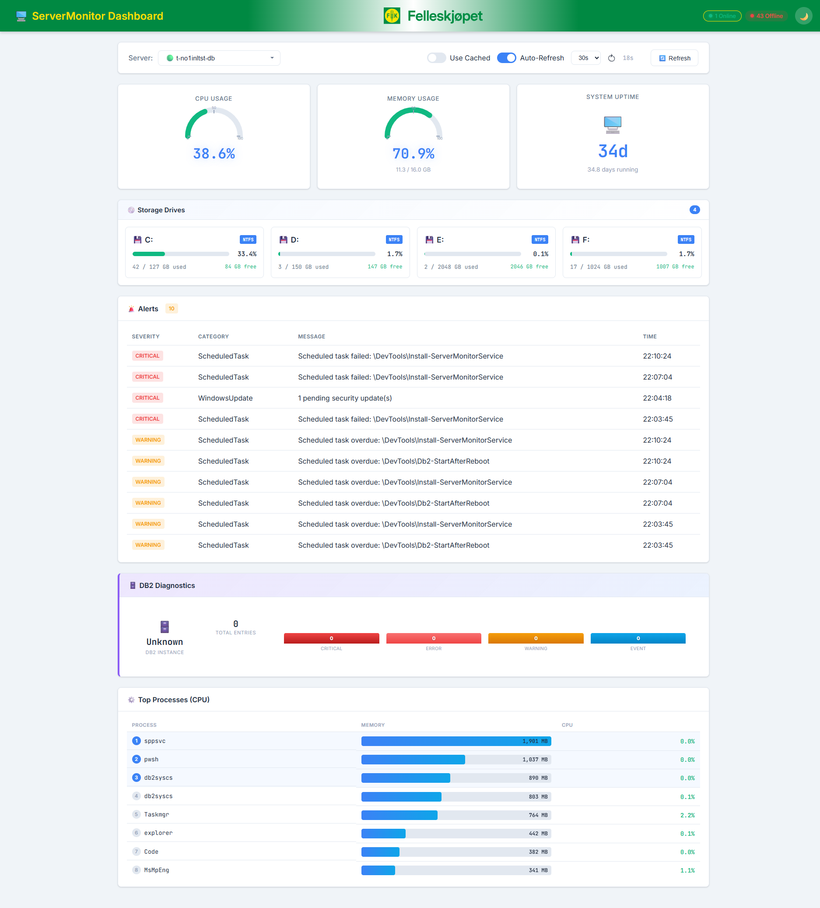
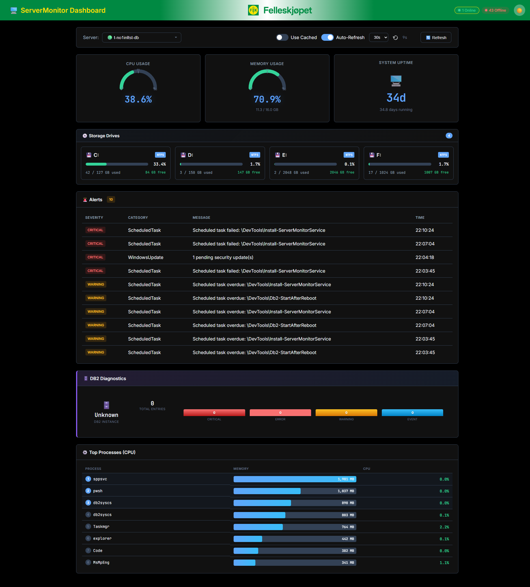

# 🖥️ ServerMonitor - Komplett Serverovervåkingsløsning

> **Dedges egenutviklede løsning for sanntids serverovervåking, varsling og dashbord**

---

## 📋 Innholdsfortegnelse

1. [Oversikt](#oversikt)
2. [Systemarkitektur](#systemarkitektur)
3. [Komponenter](#komponenter)
4. [Dashboard](#dashboard)
5. [Varslingssystem](#varslingssystem)
6. [Automatisk Oppdatering](#automatisk-oppdatering)
7. [Tekniske Spesifikasjoner](#tekniske-spesifikasjoner)

---

## Oversikt

**ServerMonitor** er en komplett overvåkingsløsning utviklet internt hos Dedge for å gi IT-avdelingen full kontroll over serverparken. Løsningen gir sanntids innsikt i:

- 🔄 **CPU-bruk** - Prosessorbelastning med historikk
- 💾 **Minnebruk** - RAM-utnyttelse og topp prosesser
- 💿 **Diskplass** - Alle disker med ledige/brukte GB
- ⏱️ **Oppetid** - Hvor lenge serveren har kjørt
- 🚨 **Varsler** - Kritiske hendelser og advarsler
- 🗄️ **DB2 Diagnostikk** - Databasehelse for DB2-servere
- 📋 **Windows Updates** - Ventende sikkerhetsoppdateringer
- ⚙️ **Planlagte Oppgaver** - Feilede eller forsinkede oppgaver

---

## Systemarkitektur

```
┌─────────────────────────────────────────────────────────────────────┐
│                        ServerMonitor Økosystem                       │
├─────────────────────────────────────────────────────────────────────┤
│                                                                      │
│   ┌──────────────┐     ┌──────────────┐     ┌──────────────┐        │
│   │   Server 1   │     │   Server 2   │     │   Server N   │        │
│   │              │     │              │     │              │        │
│   │ ┌──────────┐ │     │ ┌──────────┐ │     │ ┌──────────┐ │        │
│   │ │  Agent   │ │     │ │  Agent   │ │     │ │  Agent   │ │        │
│   │ │ :8999    │ │     │ │ :8999    │ │     │ │ :8999    │ │        │
│   │ └────┬─────┘ │     │ └────┬─────┘ │     │ └────┬─────┘ │        │
│   │      │       │     │      │       │     │      │       │        │
│   │ ┌────┴─────┐ │     │ ┌────┴─────┐ │     │ ┌────┴─────┐ │        │
│   │ │ TrayIcon │ │     │ │ TrayIcon │ │     │ │ TrayIcon │ │        │
│   │ └──────────┘ │     │ └──────────┘ │     │ └──────────┘ │        │
│   └──────────────┘     └──────────────┘     └──────────────┘        │
│          │                    │                    │                 │
│          └────────────────────┼────────────────────┘                 │
│                               │                                      │
│                               ▼                                      │
│                    ┌──────────────────┐                              │
│                    │    Dashboard     │                              │
│                    │     :8998        │                              │
│                    │                  │                              │
│                    │  ┌────────────┐  │                              │
│                    │  │ Dashboard  │  │                              │
│                    │  │  TrayIcon  │  │                              │
│                    │  └────────────┘  │                              │
│                    └──────────────────┘                              │
│                                                                      │
└─────────────────────────────────────────────────────────────────────┘
```

---

## Komponenter

### 1. 🔧 ServerMonitor Agent

**Hovedkomponenten** som kjører på hver server som skal overvåkes.

**Funksjoner:**
- Samler inn systemdata hvert 30. sekund
- Eksponerer REST API på port 8999
- Genererer varsler basert på konfigurerbare terskler
- Eksporterer øyeblikksbilder til JSON og HTML
- Støtter DB2 diagnostikklogg-parsing

**API Endepunkter:**
| Endepunkt | Beskrivelse |
|-----------|-------------|
| `/api/Snapshot` | Full system snapshot (live) |
| `/api/CachedSnapshot` | Cached snapshot (raskere) |
| `/api/Health/IsAlive` | Helsesjekk |
| `/api/Health/CurrentVersion` | Installert versjon |
| `/api/Alerts` | Alle varsler |

---

### 2. 🔔 ServerMonitor TrayIcon

**Systemstatusikon** som kjører i Windows systemstatusfeltet på hver server.

**Funksjoner:**
- Viser agent-status med fargekodet ikon:
  - 🟢 **Grønn** = Agent kjører normalt
  - 🔴 **Rød** = Agent stoppet
  - 🟡 **Gul** = Installasjon pågår
- Høyreklikk-meny for hurtighandlinger:
  - Start/Stopp agent
  - Åpne Swagger API
  - Se installert versjon
  - Manuell reinstallering
- **Automatisk oppdatering** når ny versjon publiseres
- Balloon-varsler ved kritiske hendelser

---

### 3. 📊 ServerMonitor Dashboard

**Sentralt web-dashbord** for å overvåke alle servere fra én lokasjon.

**Funksjoner:**
- Oversikt over alle servere med online/offline status
- Sanntids eller cached data
- Auto-refresh med konfigurerbart intervall
- Mørk/lys modus
- Bokmerke-støtte med URL-parametere

**Visualiseringer:**
- **Speedometer-gauger** for CPU og minne
- **Fremdriftslinjer** for diskbruk
- **Tabeller** for varsler og topp prosesser
- **DB2 panel** med alvorlighetsfordeling

---

### 4. 🖱️ Dashboard TrayIcon

**Systemstatusikon for dashbordet** med varslingsfunksjonalitet.

**Funksjoner:**
- Hurtigtilgang til dashbordet
- Balloon-varsler fra alle overvåkede servere
- Filtrer varsler etter:
  - Miljø (Kun produksjon / Alle)
  - Alvorlighetsgrad (Critical, Error, Warning, Info)
- Klikk på varsel åpner dashbordet på riktig server

---

## Dashboard

### Skjermbilder

**Lys modus:**



**Mørk modus:**



### Hovedvisning

Dashbordet gir en komplett oversikt over valgt server med følgende elementer:

#### Topplinjen
- **Servervelger** med online/offline indikatorer
- **Use Cached** - Bruk cached data for raskere lasting
- **Auto-Refresh** - Automatisk oppdatering (10s, 30s, 1m, 5m)
- **Mørk/Lys modus** - Tilpass utseendet

#### Metrics-seksjon
```
┌─────────────────┐  ┌─────────────────┐  ┌─────────────────┐
│   CPU USAGE     │  │  MEMORY USAGE   │  │  SYSTEM UPTIME  │
│                 │  │                 │  │                 │
│    ╭───────╮    │  │    ╭───────╮    │  │      🖥️         │
│   ╱         ╲   │  │   ╱         ╲   │  │                 │
│  │           │  │  │  │           │  │  │     34d         │
│   ╲    42%  ╱   │  │   ╲    72%  ╱   │  │                 │
│    ╰───────╯    │  │    ╰───────╯    │  │  34.8 dager     │
│                 │  │  11.6 / 16.0 GB │  │                 │
└─────────────────┘  └─────────────────┘  └─────────────────┘
```

#### Storage Drives-seksjon
```
┌────────────────────────────────────────────────────────────┐
│  💿 Storage Drives                                    [4]  │
├────────────────────────────────────────────────────────────┤
│                                                            │
│  ┌─────────────┐  ┌─────────────┐  ┌─────────────┐        │
│  │ 💾 C: NTFS  │  │ 💾 D: NTFS  │  │ 💾 E: NTFS  │  ...   │
│  │ ████░░░░░░  │  │ █░░░░░░░░░  │  │ ░░░░░░░░░░  │        │
│  │ 33.4%       │  │ 1.7%        │  │ 0.1%        │        │
│  │ 42/127 GB   │  │ 3/150 GB    │  │ 2/2048 GB   │        │
│  │ 84 GB free  │  │ 147 GB free │  │ 2046 GB free│        │
│  └─────────────┘  └─────────────┘  └─────────────┘        │
│                                                            │
└────────────────────────────────────────────────────────────┘
```

#### Varsler-tabell
```
┌────────────────────────────────────────────────────────────┐
│  🚨 Alerts                                            [4]  │
├──────────┬──────────────┬─────────────────────┬───────────┤
│ SEVERITY │ CATEGORY     │ MESSAGE             │ TIME      │
├──────────┼──────────────┼─────────────────────┼───────────┤
│ CRITICAL │ WindowsUpdate│ 1 pending security  │ 22:04:18  │
│ CRITICAL │ ScheduledTask│ Task failed: ...    │ 22:03:45  │
│ WARNING  │ ScheduledTask│ Task overdue: ...   │ 22:03:45  │
└──────────┴──────────────┴─────────────────────┴───────────┘
```

#### Topp Prosesser
```
┌────────────────────────────────────────────────────────────┐
│  ⚙️ Top Processes (CPU)                                    │
├──────────────────────────────────────────┬────────┬────────┤
│ PROCESS                                  │ MEMORY │ CPU    │
├──────────────────────────────────────────┼────────┼────────┤
│ 1  sppsvc                                │1,900 MB│ 0.1%   │
│ 2  pwsh                                  │1,037 MB│ 0.1%   │
│ 3  db2syscs                              │  890 MB│ 0.1%   │
│ 4  Taskmgr                               │  764 MB│ 2.4%   │
│ 5  MsMpEng                               │  337 MB│ 2.1%   │
└──────────────────────────────────────────┴────────┴────────┘
```

---

## Varslingssystem

### Varslingstyper

| Alvorlighet | Ikon | Beskrivelse |
|-------------|------|-------------|
| **Critical** | 🔴 | Krever umiddelbar handling |
| **Error** | 🟠 | Feil som bør undersøkes |
| **Warning** | 🟡 | Potensielle problemer |
| **Info** | 🔵 | Informasjonsmeldinger |

### Varslingskilder

1. **CPU** - Høy prosessorbelastning over terskel
2. **Minne** - Lite tilgjengelig RAM
3. **Disk** - Lav diskplass
4. **Windows Updates** - Ventende sikkerhetsoppdateringer
5. **Planlagte Oppgaver** - Feilede eller forsinkede oppgaver
6. **DB2 Diagnostikk** - Kritiske database-hendelser
7. **Event Log** - Kritiske Windows-hendelser

### Varslingsdistribusjon

Varsler kan sendes via:
- 📱 **SMS** - Kritiske varsler til vakttelefon
- 📧 **E-post** - Detaljert varsel med kontekst
- 🔔 **Balloon** - Desktop-varsler via TrayIcon
- 📄 **Fil** - JSON/HTML eksport for arkivering

---

## Automatisk Oppdatering

### Slik fungerer det

1. **Build & Publish** - Ny versjon bygges og publiseres til nettverksshare
2. **Trigger-fil** - `ReinstallServerMonitor.txt` opprettes med versjonsnummer
3. **TrayIcon** - Oppdager endring via FileSystemWatcher
4. **Versjonsjekk** - Sammenligner installert vs. tilgjengelig versjon
5. **Reinstallering** - Kjører installasjonsscript automatisk
6. **Balloon-varsel** - Varsler bruker når oppdatering er fullført

```
┌─────────────────────────────────────────────────────────────┐
│                    Auto-Update Flyt                          │
├─────────────────────────────────────────────────────────────┤
│                                                              │
│   Developer       Network Share         Servers              │
│   ─────────       ─────────────         ───────              │
│       │                 │                   │                │
│       │ Build v1.0.39   │                   │                │
│       │────────────────>│                   │                │
│       │                 │                   │                │
│       │ Create trigger  │                   │                │
│       │────────────────>│                   │                │
│       │                 │                   │                │
│       │                 │ FileWatcher event │                │
│       │                 │──────────────────>│                │
│       │                 │                   │                │
│       │                 │   Check version   │                │
│       │                 │<──────────────────│                │
│       │                 │                   │                │
│       │                 │   Download & Install               │
│       │                 │<──────────────────│                │
│       │                 │                   │                │
│       │                 │   Balloon: Updated!                │
│       │                 │                  [🔔]              │
│                                                              │
└─────────────────────────────────────────────────────────────┘
```

---

## Tekniske Spesifikasjoner

### Systemkrav

| Komponent | Krav |
|-----------|------|
| **OS** | Windows Server 2016+ |
| **Runtime** | .NET 10.0 |
| **Minne** | 100 MB (Agent), 50 MB (TrayIcons) |
| **Porter** | 8999 (Agent), 8998 (Dashboard) |

### Konfigurasjon

Alle apper konfigureres via `appsettings.json`:

```json
{
  "SurveillanceConfig": {
    "ProcessorMonitoring": {
      "Enabled": true,
      "PollingIntervalSeconds": 30,
      "CpuWarningThresholdPercent": 80,
      "CpuCriticalThresholdPercent": 95
    },
    "MemoryMonitoring": {
      "Enabled": true,
      "WarningThresholdPercent": 85,
      "CriticalThresholdPercent": 95
    },
    "DiskMonitoring": {
      "Enabled": true,
      "WarningThresholdPercent": 80,
      "CriticalThresholdPercent": 90
    }
  }
}
```

### Filer og Mapper

| Sti | Beskrivelse |
|-----|-------------|
| `C:\opt\DedgeWinApps\ServerMonitor\` | Agent installasjon |
| `C:\opt\DedgeWinApps\ServerMonitorTrayIcon\` | TrayIcon installasjon |
| `C:\opt\data\ServerMonitor\` | Snapshots og eksporter |
| `C:\opt\src\DedgeSrc\DedgeSystemTools\Folders\DedgeCommon\Software\DedgeWinApps\` | Nettverksshare for distribusjon |

---

## Kontakt

For spørsmål eller support, kontakt IT-avdelingen.

**Utviklet av:** Dedge IT  
**Versjon:** 1.0.39  
**Sist oppdatert:** Januar 2026

---

*© 2026 Dedge AS - Intern bruk*
