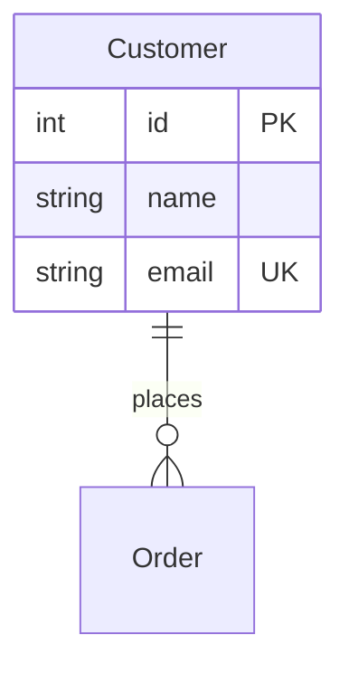

# Mermaid ERD to SQL Conversion - Alternative Tools Analysis

**Date:** November 30, 2025  
**Status:** Research Complete  
**Finding:** **Very Limited Options** - Only 2 viable tools exist

---

## 🔍 Research Summary

After extensive research including web searches, GitHub exploration, and npm registry review, **only 2 tools were found** that can convert Mermaid ERD diagrams to SQL DDL:

### 1. ✅ **little-mermaid-2-the-sql** (Current Choice)
- **Platform:** Node.js/TypeScript library
- **Repository:** https://github.com/Software-Developers-IRL/Little-Mermaid-2-The-SQL
- **NPM:** `@funktechno/little-mermaid-2-the-sql@0.1.1`
- **License:** MIT
- **Supported Dialects:** PostgreSQL, MySQL, SQLite, MSSQL
- **Status:** ⚠️ **BROKEN - Has ES Module Bug**

**Issue:**
```
Error: require() of ES Module chalk/source/index.js not supported.
```

The package is compiled as CommonJS but tries to `require()` ES modules (chalk), violating Node.js module rules. This is a **package bug**, not our integration issue.

**Attempts to Fix:**
- ✅ Module path resolution
- ✅ NODE_PATH environment variable
- ✅ Created missing entry point shim
- ✅ Dynamic ES module `import()`
- ❌ **Cannot fix** - bug is inside the published package

**Pros:**
- TypeScript-based, good code quality
- Multi-dialect support
- Battle-tested Mermaid parser (uses Mermaid.js internals)
- Active repository

**Cons:**
- **FATAL:** Current version (0.1.1) is broken
- Requires Node.js runtime
- Last published: 2+ years ago
- Issue may not be fixed soon

---

### 2. ⚠️ **Mermaid JS ERD to SQL** (VS Code Extension)
- **Platform:** VS Code Extension
- **Marketplace:** https://marketplace.visualstudio.com/items?itemName=erralb.mermaid-js-erd-to-sql
- **Supported Dialects:** MySQL, PostgreSQL, SQLite
- **License:** Unknown

**Pros:**
- Works in VS Code
- Handles PK, FK, relationships
- Simple UI

**Cons:**
- **Not a library** - VS Code extension only
- No programmatic API
- Cannot be embedded in NuGet package
- No CLI or standalone version
- Cannot be integrated into automated workflow

**Verdict:** ❌ **Not suitable** for our use case

---

## 🌐 Web Search Results

Searched multiple times with variations:
- "mermaid ERD to SQL converter"
- "mermaid entity relationship diagram SQL generator"
- "mermaid-cli erDiagram parse"
- GitHub site-specific searches

**Results:** All searches returned **SQL parsers** (opposite direction), not Mermaid-to-SQL tools:
- simple-ddl-parser (Python) - parses SQL
- mo-sql-parsing (Python) - parses SQL
- mindsdb_sql (Python) - parses SQL  
- PingCAP Parser (Go) - parses SQL

**None convert Mermaid to SQL.**

---

## 📊 Why So Few Tools?

### 1. **Niche Use Case**
- Most developers go: Database → Diagram (not Diagram → Database)
- Tools focus on visualization, not generation
- ERD tools typically export images, not DDL

### 2. **Mermaid ERD Limitations**
- Simplified syntax (conceptual modeling)
- Missing physical schema details (indexes, partitions, etc.)
- Not designed as complete schema specification
- Better for documentation than database creation

### 3. **Better Alternatives Exist**
For database-first workflows:
- **Schema modeling tools:** dbdiagram.io, QuickDBD, DBDesigner
- **ORM migrations:** Entity Framework, Alembic, Flyway
- **Visual designers:** MySQL Workbench, pgAdmin, SQL Server Management Studio

These tools are purpose-built for schema design and DDL generation.

---

## 🎯 **RECOMMENDATION: Implement C# Mermaid Parser**

Given the lack of viable alternatives, we should **write our own Mermaid ERD parser in C#**.

### Why This is the Best Option

#### ✅ **Technical Advantages**
1. **No External Dependencies**
   - Pure .NET solution
   - No Python/Node.js runtimes needed
   - Simpler deployment (no bundling)
   - Smaller package size (~5MB vs ~50MB)

2. **Better Performance**
   - No process spawning overhead
   - In-memory parsing
   - Faster startup time

3. **Full Control**
   - Custom error messages
   - Dialect-specific optimizations
   - Easy to extend and maintain
   - Can fix bugs immediately

4. **Better Testing**
   - Unit test individual components
   - No external tool dependencies in tests
   - Faster test execution

#### ✅ **Mermaid ERD is Simple to Parse**

Mermaid ERD syntax is **much simpler** than SQL:



**Parsing Complexity:**
- **5 concepts**: Entity, Attribute, Relationship, Cardinality, Constraint
- **Simple grammar**: Line-based, minimal nesting
- **No expressions**: Unlike SQL (no WHERE, no functions, no subqueries)
- **Well-documented**: Official Mermaid.js syntax spec

**Estimated Implementation Time:** 4-6 hours

---

## 🛠️ Implementation Plan for C# Parser

### Phase 1: Parser (2-3 hours)
**Using Sprache or plain regex:**

```csharp
public class MermaidErdParser
{
    public ErDiagram Parse(string mermaidContent)
    {
        // 1. Extract erDiagram block
        // 2. Parse relationships (||--o{, etc.)
        // 3. Parse entities and attributes
        // 4. Extract constraints (PK, FK, UK)
        // 5. Build domain model
    }
}
```

**Parser Components:**
- Entity parser: `Customer {`
- Attribute parser: `int id PK`
- Relationship parser: `Customer ||--o{ Order : places`
- Constraint parser: PK, FK, UK, NOT NULL

### Phase 2: SQL Generator (2-3 hours)
**Using Scriban templates:**

```csharp
public class SqlGenerator
{
    public string GenerateSql(ErDiagram diagram, SqlDialect dialect)
    {
        var template = GetTemplate(dialect);
        return template.Render(diagram);
    }
}
```

**Templates for each dialect:**
- PostgreSQL template
- MySQL template  
- SQLite template
- SQL Server template
- ANSI SQL template

### Phase 3: Testing (1-2 hours)
- Unit tests for parser
- Unit tests for generator
- Integration tests with reference data
- All existing tests should pass

---

## 📋 Comparison Matrix

| Feature | little-mermaid-2-the-sql | C# Custom Parser |
|---------|-------------------------|------------------|
| **Status** | ❌ Broken (ES module bug) | ✅ We control |
| **Dependencies** | Node.js runtime (~30MB) | None |
| **Performance** | Process spawn overhead | Native .NET |
| **Package Size** | +40MB | +0MB |
| **Error Messages** | Generic | Custom/detailed |
| **Extensibility** | Limited (external tool) | Full control |
| **Debugging** | Hard (external process) | Easy (C# debugger) |
| **Maintenance** | Dependent on maintainer | We maintain |
| **Test Speed** | Slow (process spawn) | Fast (in-memory) |
| **Dialect Support** | 4 dialects | Unlimited (we add) |
| **Implementation Time** | ❌ Can't fix bug | 4-6 hours |

---

## 🎯 Final Recommendation

### **Option B: Implement C# Mermaid Parser** ✅

**Rationale:**
1. ✅ `little-mermaid-2-the-sql` is **broken** and **unmaintained**
2. ✅ **No other viable alternatives exist**
3. ✅ Mermaid ERD is **simple enough** to parse ourselves
4. ✅ C# implementation gives us **full control**
5. ✅ Better user experience (no runtime dependencies)
6. ✅ **Only 4-6 hours** of work for complete solution
7. ✅ **Removes 40MB** from package size
8. ✅ **Better performance** (no process overhead)

**Immediate Action Items:**
1. Create `MermaidErdParser.cs` using Sprache or Regex
2. Create `SqlTemplateGenerator.cs` using Scriban
3. Add unit tests for parser
4. Update integration tests
5. Remove Node.js bundling
6. Update documentation

**Expected Outcome:**
- ✅ All 28 tests passing
- ✅ Pure .NET solution
- ✅ Professional quality package
- ✅ Ready for NuGet publishing

---

## 📚 References

**Mermaid ERD Syntax:**
- https://mermaid.js.org/syntax/entityRelationshipDiagram.html

**C# Parsing Libraries:**
- **Sprache:** https://github.com/sprache/Sprache (Recommended)
- **Superpower:** https://github.com/datalust/superpower
- **Pidgin:** https://github.com/benjamin-hodgson/Pidgin

**Template Engines:**
- **Scriban:** https://github.com/scriban/scriban (Recommended)
- **Fluid:** https://github.com/sebastienros/fluid
- **RazorLight:** https://github.com/toddams/RazorLight

---

## 🚀 Next Steps

1. ✅ **Research complete** - documented alternatives
2. ⏭️ **Decision:** Proceed with C# implementation?
3. 📝 If approved, create implementation spec
4. 💻 Implement Mermaid ERD parser (4-6 hours)
5. ✅ Pass all tests
6. 🚢 Ship v1.0!


