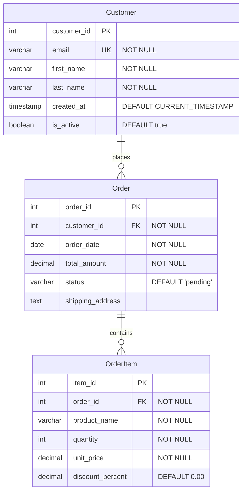

# Testing Strategy for SqlMermaidErdTools

## Overview

SqlMermaidErdTools uses a comprehensive automated testing strategy that validates bidirectional conversion between SQL DDL and Mermaid ERD diagrams. Tests use pre-generated reference files and automated comparison to ensure accuracy.

## Test Architecture

### Test Types

1. **Unit Tests**: Individual component testing (parsers, generators, models)
2. **Integration Tests**: End-to-end conversion scenarios
3. **Round-trip Tests**: SQL → MMD → SQL and MMD → SQL → MMD
4. **Comparison Tests**: Generated output vs. pre-validated reference files
5. **Dialect Tests**: Multi-dialect SQL generation and parsing
6. **Performance Tests**: Large schema conversion benchmarks

## Reference Test Data

### 3-Table E-commerce Schema

We use a standard 3-table e-commerce schema as our primary test fixture, representing common real-world scenarios with various relationship types and constraints.

#### Reference SQL File: `reference.sql`

```sql
-- Reference schema for SqlMermaidErdTools testing
-- 3-table structure with relationships

CREATE TABLE Customer (
    customer_id INT PRIMARY KEY,
    email VARCHAR(255) NOT NULL UNIQUE,
    first_name VARCHAR(100) NOT NULL,
    last_name VARCHAR(100) NOT NULL,
    created_at TIMESTAMP DEFAULT CURRENT_TIMESTAMP,
    is_active BOOLEAN DEFAULT true
);

CREATE TABLE Order (
    order_id INT PRIMARY KEY,
    customer_id INT NOT NULL,
    order_date DATE NOT NULL,
    total_amount DECIMAL(10, 2) NOT NULL,
    status VARCHAR(50) DEFAULT 'pending',
    shipping_address TEXT,
    FOREIGN KEY (customer_id) REFERENCES Customer(customer_id)
);

CREATE TABLE OrderItem (
    item_id INT PRIMARY KEY,
    order_id INT NOT NULL,
    product_name VARCHAR(200) NOT NULL,
    quantity INT NOT NULL,
    unit_price DECIMAL(10, 2) NOT NULL,
    discount_percent DECIMAL(5, 2) DEFAULT 0.00,
    FOREIGN KEY (order_id) REFERENCES Order(order_id)
);
```

#### Reference Mermaid File: `reference.mmd`



## Automated Test Routines

### Test 1: SQL → Mermaid Conversion

```csharp
[Fact]
public async Task SqlToMermaid_ReferenceSchema_ShouldMatchExpected()
{
    // Arrange
    var sqlContent = File.ReadAllText("TestData/reference.sql");
    var expectedMmd = File.ReadAllText("TestData/reference.mmd");
    var converter = new SqlToMmdConverter();
    
    // Act
    var actualMmd = await converter.ConvertAsync(sqlContent);
    
    // Save generated output for comparison
    var outputPath = "TestOutput/generated.mmd";
    File.WriteAllText(outputPath, actualMmd);
    
    // Assert - Semantic comparison
    var comparisonResult = CompareMermaidDiagrams(expectedMmd, actualMmd);
    
    // Auto-open files for visual inspection if test fails
    if (!comparisonResult.IsMatch)
    {
        OpenFileForComparison("TestData/reference.mmd", outputPath);
        Assert.Fail($"Mermaid diagrams do not match:\n{comparisonResult.Differences}");
    }
    
    Assert.True(comparisonResult.IsMatch);
}
```

### Test 2: Mermaid → SQL Conversion

```csharp
[Fact]
public async Task MermaidToSql_ReferenceSchema_ShouldMatchExpected()
{
    // Arrange
    var mmdContent = File.ReadAllText("TestData/reference.mmd");
    var expectedSql = File.ReadAllText("TestData/reference.sql");
    var converter = new MmdToSqlConverter();
    
    // Act
    var actualSql = await converter.ConvertAsync(mmdContent, SqlDialect.AnsiSql);
    
    // Save generated output for comparison
    var outputPath = "TestOutput/generated.sql";
    File.WriteAllText(outputPath, actualSql);
    
    // Assert - Semantic SQL comparison
    var comparisonResult = CompareSqlSchemas(expectedSql, actualSql);
    
    // Auto-open files for visual inspection if test fails
    if (!comparisonResult.IsMatch)
    {
        OpenFileForComparison("TestData/reference.sql", outputPath);
        Assert.Fail($"SQL schemas do not match:\n{comparisonResult.Differences}");
    }
    
    Assert.True(comparisonResult.IsMatch);
}
```

### Test 3: Round-trip Conversion (SQL → MMD → SQL)

```csharp
[Fact]
public async Task RoundTrip_SqlToMmdToSql_ShouldPreserveSchema()
{
    // Arrange
    var originalSql = File.ReadAllText("TestData/reference.sql");
    var sqlToMmdConverter = new SqlToMmdConverter();
    var mmdToSqlConverter = new MmdToSqlConverter();
    
    // Act - First conversion: SQL → MMD
    var mermaidDiagram = await sqlToMmdConverter.ConvertAsync(originalSql);
    File.WriteAllText("TestOutput/roundtrip_step1.mmd", mermaidDiagram);
    
    // Act - Second conversion: MMD → SQL
    var regeneratedSql = await mmdToSqlConverter.ConvertAsync(mermaidDiagram, SqlDialect.AnsiSql);
    File.WriteAllText("TestOutput/roundtrip_step2.sql", regeneratedSql);
    
    // Assert - Semantic equivalence (not exact text match)
    var comparisonResult = CompareSqlSchemas(originalSql, regeneratedSql);
    
    if (!comparisonResult.IsMatch)
    {
        OpenFileForComparison("TestData/reference.sql", "TestOutput/roundtrip_step2.sql");
        Assert.Fail($"Round-trip conversion lost information:\n{comparisonResult.Differences}");
    }
    
    Assert.True(comparisonResult.IsMatch);
}
```

### Test 4: Round-trip Conversion (MMD → SQL → MMD)

```csharp
[Fact]
public async Task RoundTrip_MmdToSqlToMmd_ShouldPreserveDiagram()
{
    // Arrange
    var originalMmd = File.ReadAllText("TestData/reference.mmd");
    var mmdToSqlConverter = new MmdToSqlConverter();
    var sqlToMmdConverter = new SqlToMmdConverter();
    
    // Act - First conversion: MMD → SQL
    var sqlDdl = await mmdToSqlConverter.ConvertAsync(originalMmd, SqlDialect.AnsiSql);
    File.WriteAllText("TestOutput/roundtrip_step1.sql", sqlDdl);
    
    // Act - Second conversion: SQL → MMD
    var regeneratedMmd = await sqlToMmdConverter.ConvertAsync(sqlDdl);
    File.WriteAllText("TestOutput/roundtrip_step2.mmd", regeneratedMmd);
    
    // Assert - Semantic equivalence
    var comparisonResult = CompareMermaidDiagrams(originalMmd, regeneratedMmd);
    
    if (!comparisonResult.IsMatch)
    {
        OpenFileForComparison("TestData/reference.mmd", "TestOutput/roundtrip_step2.mmd");
        Assert.Fail($"Round-trip conversion lost information:\n{comparisonResult.Differences}");
    }
    
    Assert.True(comparisonResult.IsMatch);
}
```

## File Comparison Utilities

### Automated File Opening

```csharp
private static void OpenFileForComparison(string expectedPath, string actualPath)
{
    // Open both files in default editor for visual comparison
    Process.Start(new ProcessStartInfo
    {
        FileName = expectedPath,
        UseShellExecute = true
    });
    
    Process.Start(new ProcessStartInfo
    {
        FileName = actualPath,
        UseShellExecute = true
    });
    
    // Optionally launch diff tool (VS Code, WinMerge, Beyond Compare, etc.)
    if (TryFindDiffTool(out var diffToolPath))
    {
        Process.Start(new ProcessStartInfo
        {
            FileName = diffToolPath,
            Arguments = $"\"{expectedPath}\" \"{actualPath}\"",
            UseShellExecute = true
        });
    }
}

private static bool TryFindDiffTool(out string path)
{
    // Try common diff tools
    var tools = new[]
    {
        @"C:\Program Files\Microsoft VS Code\bin\code.cmd", // VS Code
        @"C:\Program Files\WinMerge\WinMergeU.exe",
        @"C:\Program Files\Beyond Compare 4\BComp.exe"
    };
    
    foreach (var tool in tools)
    {
        if (File.Exists(tool))
        {
            path = tool;
            return true;
        }
    }
    
    path = null;
    return false;
}
```

### Semantic Comparison

```csharp
public class SchemaComparisonResult
{
    public bool IsMatch { get; set; }
    public List<string> Differences { get; set; } = new();
    public double SimilarityScore { get; set; }
}

private static SchemaComparisonResult CompareSqlSchemas(string expected, string actual)
{
    // Parse both SQL schemas into internal models
    var expectedModel = SqlParser.Parse(expected);
    var actualModel = SqlParser.Parse(actual);
    
    var result = new SchemaComparisonResult();
    
    // Compare tables
    if (!CompareTables(expectedModel.Tables, actualModel.Tables, result))
        return result;
    
    // Compare columns
    if (!CompareColumns(expectedModel, actualModel, result))
        return result;
    
    // Compare constraints
    if (!CompareConstraints(expectedModel, actualModel, result))
        return result;
    
    // Compare relationships
    if (!CompareRelationships(expectedModel, actualModel, result))
        return result;
    
    result.IsMatch = result.Differences.Count == 0;
    result.SimilarityScore = CalculateSimilarity(expectedModel, actualModel);
    
    return result;
}

private static SchemaComparisonResult CompareMermaidDiagrams(string expected, string actual)
{
    // Parse both Mermaid diagrams into internal models
    var expectedModel = MermaidParser.Parse(expected);
    var actualModel = MermaidParser.Parse(actual);
    
    var result = new SchemaComparisonResult();
    
    // Compare entities
    if (!CompareEntities(expectedModel.Entities, actualModel.Entities, result))
        return result;
    
    // Compare attributes
    if (!CompareAttributes(expectedModel, actualModel, result))
        return result;
    
    // Compare relationships
    if (!CompareRelationships(expectedModel.Relationships, actualModel.Relationships, result))
        return result;
    
    result.IsMatch = result.Differences.Count == 0;
    result.SimilarityScore = CalculateSimilarity(expectedModel, actualModel);
    
    return result;
}
```

## Multi-Dialect Testing

### Dialect-Specific Test Data

Create reference files for each supported SQL dialect:

```
tests/
└── SqlMermaidErdTools.Tests/
    └── TestData/
        ├── reference.mmd (common)
        ├── ANSI/
        │   └── reference.sql
        ├── SqlServer/
        │   └── reference.sql
        ├── PostgreSQL/
        │   └── reference.sql
        ├── MySQL/
        │   └── reference.sql
        └── SQLite/
            └── reference.sql
```

### Dialect Test Example

```csharp
[Theory]
[InlineData(SqlDialect.AnsiSql, "TestData/ANSI/reference.sql")]
[InlineData(SqlDialect.SqlServer, "TestData/SqlServer/reference.sql")]
[InlineData(SqlDialect.PostgreSql, "TestData/PostgreSQL/reference.sql")]
[InlineData(SqlDialect.MySql, "TestData/MySQL/reference.sql")]
[InlineData(SqlDialect.Sqlite, "TestData/SQLite/reference.sql")]
public async Task MermaidToSql_AllDialects_ShouldGenerateValidSql(
    SqlDialect dialect, 
    string expectedSqlPath)
{
    // Arrange
    var mmdContent = File.ReadAllText("TestData/reference.mmd");
    var expectedSql = File.ReadAllText(expectedSqlPath);
    var converter = new MmdToSqlConverter();
    
    // Act
    var actualSql = await converter.ConvertAsync(mmdContent, dialect);
    
    // Assert
    var outputPath = $"TestOutput/generated_{dialect}.sql";
    File.WriteAllText(outputPath, actualSql);
    
    var comparisonResult = CompareSqlSchemas(expectedSql, actualSql);
    
    if (!comparisonResult.IsMatch)
    {
        OpenFileForComparison(expectedSqlPath, outputPath);
        Assert.Fail($"Generated {dialect} SQL does not match expected:\n{comparisonResult.Differences}");
    }
    
    Assert.True(comparisonResult.IsMatch);
}
```

## Test Data Versioning

### Schema Evolution Tests

Track changes across versions:

```
TestData/
├── v1.0/
│   ├── reference.sql
│   └── reference.mmd
├── v1.1/  (added index support)
│   ├── reference.sql
│   └── reference.mmd
└── v2.0/  (added CHECK constraints)
    ├── reference.sql
    └── reference.mmd
```

## Continuous Integration

### GitHub Actions Workflow

```yaml
name: Test SqlMermaidErdTools

on: [push, pull_request]

jobs:
  test:
    runs-on: windows-latest
    
    steps:
    - uses: actions/checkout@v3
    
    - name: Setup .NET 10
      uses: actions/setup-dotnet@v3
      with:
        dotnet-version: '10.0.x'
    
    - name: Setup Python (for SQLGlot)
      uses: actions/setup-python@v4
      with:
        python-version: '3.11'
    
    - name: Setup Node.js (for little-mermaid-2-the-sql)
      uses: actions/setup-node@v3
      with:
        node-version: '18'
    
    - name: Install Python dependencies
      run: pip install sqlglot
    
    - name: Install Node.js dependencies
      run: npm install -g @funktechno/little-mermaid-2-the-sql
    
    - name: Restore .NET dependencies
      run: dotnet restore
    
    - name: Build
      run: dotnet build --configuration Release --no-restore
    
    - name: Run tests
      run: dotnet test --configuration Release --no-build --verbosity normal
    
    - name: Upload test outputs
      if: failure()
      uses: actions/upload-artifact@v3
      with:
        name: test-outputs
        path: tests/**/TestOutput/
```

## Test Coverage Requirements

- **Minimum Code Coverage**: 80%
- **Critical Paths**: 100% coverage for:
  - SQL parsing
  - Mermaid parsing
  - Relationship mapping
  - Constraint conversion
- **Edge Cases**: Test files with:
  - Empty schemas
  - Single table
  - Complex relationships (self-referencing, many-to-many)
  - All supported data types
  - All supported constraints

## Performance Benchmarks

```csharp
[Fact]
public void Benchmark_LargeSchema_ShouldCompleteInReasonableTime()
{
    // Schema with 100 tables, 1000 columns, 200 relationships
    var largeSql = GenerateLargeSchema(100, 1000, 200);
    var converter = new SqlToMmdConverter();
    
    var stopwatch = Stopwatch.StartNew();
    var result = converter.Convert(largeSql);
    stopwatch.Stop();
    
    // Should complete in under 5 seconds
    Assert.True(stopwatch.ElapsedMilliseconds < 5000, 
        $"Conversion took {stopwatch.ElapsedMilliseconds}ms, expected < 5000ms");
}
```

## Summary

The testing strategy ensures:

1. ✅ **Automated Validation**: Reference files are compared automatically
2. ✅ **Visual Inspection**: Files open automatically when tests fail
3. ✅ **Semantic Comparison**: Not just text matching, but schema equivalence
4. ✅ **Round-trip Testing**: Data integrity is preserved in both directions
5. ✅ **Multi-dialect Support**: All SQL dialects tested independently
6. ✅ **CI/CD Integration**: Tests run automatically on every commit
7. ✅ **Performance Monitoring**: Benchmarks track conversion speed
8. ✅ **High Coverage**: 80%+ code coverage with 100% on critical paths

