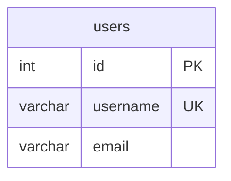
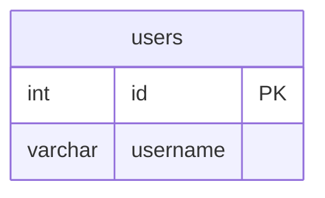

# SqlMermaidErdTools

[](https://dotnet.microsoft.com/)
[](LICENSE)
[](https://www.nuget.org/packages/SqlMermaidErdTools/)

**Bidirectional converter** between SQL DDL and Mermaid Entity Relationship Diagrams (ERD). Automatically generate beautiful visual documentation from your database schema, and convert diagrams back to SQL DDL!

> **✨ New in v0.2:** Full bidirectional conversion! Convert SQL → Mermaid **AND** Mermaid → SQL with multi-dialect support.

## Features

🔄 **Bidirectional Conversion**
- **SQL → Mermaid**: Convert SQL DDL to beautiful Mermaid ERD diagrams
- **Mermaid → SQL**: Convert Mermaid ERD back to SQL DDL (4 dialects)
- **Schema Diff**: Generate ALTER statements from Mermaid diagram changes
- Support for 31+ SQL dialects via SQLGlot (input) and 4 dialects (output)

📊 **Full Schema Support**
- Tables and columns with data types
- Primary keys (PK)
- Foreign keys (FK) with relationship visualization
- Unique constraints (UK)
- NOT NULL constraints
- DEFAULT values
- Indexes (documented as callouts on relationships)

🎯 **Multi-Dialect SQL Output**
- ANSI SQL (Standard)
- Microsoft SQL Server (T-SQL)
- PostgreSQL
- MySQL

📈 **Advanced Features**
- Foreign key relationships shown as lines between tables
- Index information displayed as callouts
- Automatic detection of one-to-many relationships
- Comprehensive index documentation in comments

## Quick Start

### Installation

```bash
dotnet add package SqlMermaidErdTools
```

### Basic Usage

#### SQL → Mermaid

```csharp
using SqlMermaidErdTools;

// Convert SQL to Mermaid ERD
var sqlDdl = @"
CREATE TABLE Customer (
    customer_id INT PRIMARY KEY,
    email VARCHAR(255) NOT NULL UNIQUE,
    first_name VARCHAR(100) NOT NULL
);

CREATE TABLE Order (
    order_id INT PRIMARY KEY,
    customer_id INT NOT NULL,
    order_date DATE NOT NULL,
    FOREIGN KEY (customer_id) REFERENCES Customer(customer_id)
);
";

var mermaid = SqlMermaidErdTools.ToMermaid(sqlDdl);
Console.WriteLine(mermaid);
// Output: Mermaid ERD diagram with Customer and Order tables and their relationship
```

#### Mermaid → SQL

```csharp
using SqlMermaidErdTools;
using SqlMermaidErdTools.Models;

// Convert Mermaid ERD to SQL
var mermaidErd = @"
erDiagram
    Customer ||--o{ Order : places
    Customer {
        int customer_id PK
        varchar email UK
        varchar first_name
    }
    Order {
        int order_id PK
        int customer_id FK
        date order_date
    }
";

// Convert to PostgreSQL
var sql = SqlMermaidErdTools.ToSql(mermaidErd, SqlDialect.PostgreSql);
Console.WriteLine(sql);
// Output: PostgreSQL CREATE TABLE statements with foreign keys
```

### Async Support

```csharp
// SQL → Mermaid (async)
var mermaid = await SqlMermaidErdTools.ToMermaidAsync(sqlDdl);

// Mermaid → SQL (async)
var sql = await SqlMermaidErdTools.ToSqlAsync(mermaidErd, SqlDialect.SqlServer);
```

### Using Dependency Injection

```csharp
using SqlMermaidErdTools.Converters;
using SqlMermaidErdTools.Models;

// Register in your DI container
services.AddSingleton<ISqlToMmdConverter, SqlToMmdConverter>();
services.AddSingleton<IMmdToSqlConverter, MmdToSqlConverter>();

// Use in your code
public class MyService
{
    private readonly ISqlToMmdConverter _sqlToMmd;
    private readonly IMmdToSqlConverter _mmdToSql;
    
    public MyService(ISqlToMmdConverter sqlToMmd, IMmdToSqlConverter mmdToSql)
    {
        _sqlToMmd = sqlToMmd;
        _mmdToSql = mmdToSql;
    }
    
    public async Task<string> ConvertToMermaid(string sql)
    {
        return await _sqlToMmd.ConvertAsync(sql);
    }
    
    public async Task<string> ConvertToSql(string mermaid, SqlDialect dialect)
    {
        return await _mmdToSql.ConvertAsync(mermaid, dialect);
    }
}
```

### Schema Diff and Migrations

```csharp
using SqlMermaidErdTools.Converters;
using SqlMermaidErdTools.Models;

var differ = new MmdDiffToSqlGenerator();

// Generate ALTER statements from diagram changes
var beforeMermaid = "..."; // Original schema
var afterMermaid = "...";  // Modified schema

var alterStatements = await differ.GenerateAlterStatementsAsync(
    beforeMermaid, 
    afterMermaid, 
    SqlDialect.PostgreSql
);

Console.WriteLine(alterStatements);
// Output: ALTER TABLE, DROP TABLE, CREATE TABLE statements to migrate schema
```

## Examples

### Example 1: SQL → Mermaid ERD

**Input (SQL):**
```sql
CREATE TABLE customers (
    customer_id INT PRIMARY KEY,
    email VARCHAR(255) NOT NULL UNIQUE,
    first_name VARCHAR(100) NOT NULL,
    last_name VARCHAR(100) NOT NULL,
    created_at TIMESTAMP DEFAULT CURRENT_TIMESTAMP
);

CREATE TABLE orders (
    order_id INT PRIMARY KEY,
    customer_id INT NOT NULL,
    order_date DATE NOT NULL,
    total_amount DECIMAL(10, 2) NOT NULL,
    FOREIGN KEY (customer_id) REFERENCES customers(customer_id)
);

CREATE INDEX idx_customer_email ON customers(email);
CREATE INDEX idx_order_customer ON orders(customer_id);
```

**Output (Mermaid):**
```mermaid
erDiagram
    customers ||--o{ orders : "customer_id (indexed: INDEX:idx_order_customer)"
    
    customers {
        int customer_id PK
        varchar email UK "NOT NULL"
        varchar first_name "NOT NULL"
        varchar last_name "NOT NULL"
        timestamp created_at "DEFAULT CURRENT_TIMESTAMP"
    }
    
    orders {
        int order_id PK
        int customer_id FK "NOT NULL"
        date order_date "NOT NULL"
        decimal total_amount "NOT NULL"
    }

%% ===========================================================
%% DATABASE INDEXES
%% ===========================================================
%% Total Indexes: 2
%%
%% customers (1 indexes)
%%   - idx_customer_email: (email)
%%     Pattern: Single-column index on email
%%
%% orders (1 indexes)
%%   - idx_order_customer: (customer_id)
%%     Pattern: Foreign key index on customer_id
```

### Example 2: Mermaid → SQL (Multiple Dialects)

**Input (Mermaid):**


**Output - ANSI SQL:**
```sql
CREATE TABLE users (
    id INT PRIMARY KEY,
    username VARCHAR,
    email VARCHAR,
    UNIQUE (username)
);
```

**Output - PostgreSQL:**
```sql
CREATE TABLE users (
    id INT PRIMARY KEY,
    username VARCHAR UNIQUE,
    email VARCHAR
);
```

**Output - SQL Server:**
```sql
CREATE TABLE users (
    id INT PRIMARY KEY,
    username VARCHAR(MAX) UNIQUE,
    email VARCHAR(MAX)
);
```

**Output - MySQL:**
```sql
CREATE TABLE users (
    id INT PRIMARY KEY,
    username VARCHAR(255) UNIQUE,
    email VARCHAR(255)
);
```

### Example 3: Schema Diff (Mermaid Changes → SQL Migration)

**Before:**


**After:**


**Generated Migration (PostgreSQL):**
```sql
ALTER TABLE users ADD COLUMN email VARCHAR;
ALTER TABLE users ADD CONSTRAINT users_username_unique UNIQUE (username);
```

## Supported SQL Dialects

### Input Dialects (SQL → Mermaid)

The converter can parse SQL DDL from **31+ different SQL dialects** thanks to [SQLGlot](https://github.com/tobymao/sqlglot). Common dialects include:

- ANSI SQL (Standard SQL)
- Microsoft SQL Server (T-SQL) - with automatic bracket removal
- PostgreSQL
- MySQL / MariaDB
- SQLite
- Oracle
- IBM DB2
- Snowflake
- BigQuery
- Redshift
- And 20+ more!

The tool automatically detects and handles dialect-specific syntax variations.

### Output Dialects (Mermaid → SQL)

The converter can generate SQL DDL for **4 major SQL dialects**:

- **AnsiSql**: Standard ANSI SQL (maximum compatibility)
- **SqlServer**: Microsoft SQL Server with T-SQL extensions (VARCHAR(MAX), etc.)
- **PostgreSql**: PostgreSQL with specific data types and syntax
- **MySql**: MySQL with dialect-specific features (VARCHAR(255), AUTO_INCREMENT, etc.)

Choose your target dialect when converting:
```csharp
var sql = SqlMermaidErdTools.ToSql(mermaidErd, SqlDialect.PostgreSql);
```

## Supported Data Types

### Numeric Types
- INT, INTEGER, BIGINT, SMALLINT
- DECIMAL, NUMERIC
- FLOAT, REAL, DOUBLE

### String Types
- VARCHAR, NVARCHAR
- CHAR, NCHAR
- TEXT

### Date/Time Types
- DATE, TIME
- DATETIME, TIMESTAMP

### Other Types
- BOOLEAN, BOOL
- BINARY, VARBINARY
- UUID, UNIQUEIDENTIFIER

## Architecture

SqlMermaidErdTools uses [SQLGlot](https://github.com/tobymao/sqlglot), a battle-tested open-source SQL parser and transpiler that supports 31+ SQL dialects.

**SQL → Mermaid Flow:**
1. Your SQL DDL is cleaned and normalized (removes T-SQL brackets, fixes syntax quirks)
2. SQLGlot parses the SQL into an Abstract Syntax Tree (AST)
3. The converter extracts tables, columns, constraints, relationships, and indexes
4. Mermaid ERD syntax is generated with proper formatting
5. Foreign keys become relationship lines, indexes are added as callouts

**Mermaid → SQL Flow:**
1. Mermaid ERD is parsed to extract entity definitions and relationships
2. Tables, columns, and constraints are identified
3. SQL DDL is generated for the target dialect (AnsiSql, SqlServer, PostgreSql, MySql)
4. Foreign keys are created from relationship lines
5. Constraints (PK, UK, FK, NOT NULL) are properly formatted

**Schema Diff Flow:**
1. Two Mermaid ERD diagrams are compared (before vs. after)
2. Tables to add, drop, and modify are identified
3. Column changes are detected (additions, removals, modifications)
4. ALTER statements are generated to migrate from before → after state

The package bundles a portable Python runtime with SQLGlot pre-installed, so **no external dependencies are required**!

## Limitations

### Current Version (v0.2.x)
- Views, stored procedures, and triggers are not supported
- Composite foreign keys have limited support  
- Some advanced constraints (CHECK, EXCLUSION, etc.) are not fully supported
- Indexes are shown as relationship callouts and comments, not as separate entities
- Mermaid → SQL conversion infers basic constraints from diagram annotations (PK, FK, UK)

### Planned for Future Releases
- **v0.3**: Enhanced foreign key detection from Mermaid relationship syntax
- **v0.4**: Support for views and materialized views
- **v0.5**: Enhanced index visualization options
- **v1.0**: Full schema migration tooling with rollback support
- Custom data type mapping and validation
- Support for stored procedures and triggers

## Requirements

- .NET 10.0 or later
- Windows, Linux, or macOS (x64)

**No manual installation of Python or Node.js required!** The package includes bundled runtimes with all dependencies pre-installed.

## Package Contents

The NuGet package includes:
- Core .NET libraries for conversion logic
- Python runtime with SQLGlot (for SQL parsing)
- Python scripts for Mermaid generation and SQL dialect translation
- All dependencies bundled - **zero configuration required**

## Contributing

Contributions are welcome! Please feel free to submit a Pull Request.

1. Fork the repository
2. Create your feature branch (`git checkout -b feature/AmazingFeature`)
3. Commit your changes (`git commit -m 'Add some AmazingFeature'`)
4. Push to the branch (`git push origin feature/AmazingFeature`)
5. Open a Pull Request

## License

This project is licensed under the MIT License - see the [LICENSE](LICENSE) file for details.

## Acknowledgments

- [SQLGlot](https://github.com/tobymao/sqlglot) by Toby Mao - Powerful SQL parser and transpiler supporting 31+ dialects
- [Mermaid.js](https://mermaid.js.org/) by Knut Sveidqvist - Beautiful diagram and flowchart rendering
- Python Software Foundation - For the embeddable Python runtime

## Third-Party Licenses

This package includes bundled runtimes and libraries. See [THIRD-PARTY-LICENSES.md](Docs/THIRD-PARTY-LICENSES.md) for complete license information.

## Support

- 📖 [Documentation](https://github.com/SqlMermaidErdTools/SqlMermaidErdTools/wiki)
- 🐛 [Issue Tracker](https://github.com/SqlMermaidErdTools/SqlMermaidErdTools/issues)
- 💬 [Discussions](https://github.com/SqlMermaidErdTools/SqlMermaidErdTools/discussions)

---

Made with ❤️ for the database and documentation community
