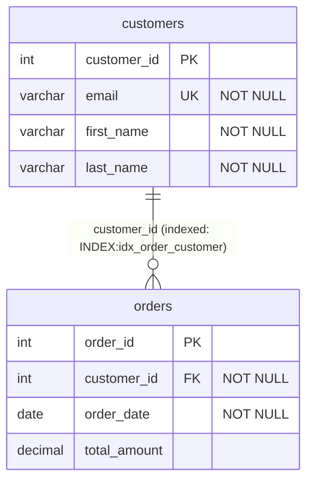

# 🚀 GET STARTED - CLI Tool

## Quick Installation & Test (5 Minutes)

### Step 1: Build & Install (2 minutes)

```powershell
# Navigate to project root
cd D:\opt\src\SqlMermaidErdTools

# Build the CLI project
dotnet build srcCLI/SqlMermaidErdTools.CLI.csproj -c Release

# Pack as NuGet tool
dotnet pack srcCLI/SqlMermaidErdTools.CLI.csproj -c Release

# Install globally from local source
dotnet tool install -g SqlMermaidErdTools.CLI --add-source ./srcCLI/bin/Release
```

**Output:**
```
Tool 'sqlmermaiderdtools.cli' (version '0.2.0') was successfully installed.
```

---

### Step 2: Verify Installation (30 seconds)

```powershell
# Check version
sqlmermaid version
```

**Output:**
```
SqlMermaid ERD Tools CLI
Version: 0.2.0
Runtime: .NET 10.0.0
Platform: Microsoft Windows NT 10.0.26200.0

https://github.com/yourusername/SqlMermaidErdTools
```

```powershell
# Check license (default: Free tier)
sqlmermaid license show
```

**Output:**
```
Current License:
  Tier:       Free
  Email:      N/A
  Max Tables: 10

ℹ️  You are using the Free tier.

╔══════════════════════════════════════════════════════════════════════╗
║                    UPGRADE TO PRO                                    ║
║  Individual: $99/year or $249 perpetual                             ║
╚══════════════════════════════════════════════════════════════════════╝
```

---

### Step 3: Test SQL → Mermaid (1 minute)

```powershell
# Convert test SQL file
sqlmermaid sql-to-mmd TestFiles/test.sql -o test_output.mmd
```

**Output:**
```
✅ Converted successfully: test_output.mmd
   Tables: 3
   License: Free
```

**View the result:**
```powershell
cat test_output.mmd
```

You'll see:


---

### Step 4: Test Mermaid → SQL (1 minute)

```powershell
# Convert back to SQL (PostgreSQL dialect)
sqlmermaid mmd-to-sql test_output.mmd --dialect PostgreSql -o test_postgres.sql
```

**Output:**
```
✅ Converted successfully: test_postgres.sql
   Dialect: PostgreSql
   Tables: 3
   License: Free
```

**View the result:**
```powershell
cat test_postgres.sql
```

You'll see PostgreSQL DDL!

---

### Step 5: Test All Dialects (30 seconds)

```powershell
# Generate SQL for all 4 dialects
sqlmermaid mmd-to-sql test_output.mmd -d AnsiSql -o test_ansi.sql
sqlmermaid mmd-to-sql test_output.mmd -d SqlServer -o test_sqlserver.sql
sqlmermaid mmd-to-sql test_output.mmd -d PostgreSql -o test_postgres.sql
sqlmermaid mmd-to-sql test_output.mmd -d MySql -o test_mysql.sql
```

**Compare the differences:**
```powershell
# SQL Server uses VARCHAR(MAX)
Select-String "VARCHAR" test_sqlserver.sql

# MySQL uses VARCHAR(255)
Select-String "VARCHAR" test_mysql.sql

# PostgreSQL uses VARCHAR
Select-String "VARCHAR" test_postgres.sql
```

---

## 🎯 Real-World Examples

### Example 1: Document Your Database

```powershell
# 1. Export your database schema
pg_dump -s mydb > mydb_schema.sql

# 2. Convert to Mermaid diagram
sqlmermaid sql-to-mmd mydb_schema.sql -o mydb_diagram.mmd

# 3. Add to your README.md
Add-Content README.md "`n``````mermaid"
Get-Content mydb_diagram.mmd | Add-Content README.md
Add-Content README.md "``````"

# Done! Your README now has a live ERD diagram!
```

---

### Example 2: Design a New Schema

```powershell
# 1. Create Mermaid ERD (use your favorite editor)
code new_schema.mmd

# Add this content:
# erDiagram
#     users {
#         int id PK
#         varchar email UK
#         varchar name
#     }
#     posts {
#         int id PK
#         int user_id FK
#         varchar title
#         text content
#     }

# 2. Generate SQL for your database
sqlmermaid mmd-to-sql new_schema.mmd -d PostgreSql -o create_schema.sql

# 3. Review and run
cat create_schema.sql
psql mydb < create_schema.sql
```

---

### Example 3: Schema Migration

```powershell
# 1. You have schema_v1.mmd (current production schema)
# 2. You create schema_v2.mmd (with new tables/columns)

# 3. Generate migration script
sqlmermaid diff schema_v1.mmd schema_v2.mmd -d PostgreSql -o migration_v1_to_v2.sql

# 4. Review changes
cat migration_v1_to_v2.sql

# Output shows ALTER statements:
# ALTER TABLE users ADD COLUMN created_at TIMESTAMP;
# CREATE TABLE comments (...);

# 5. Apply migration
psql mydb < migration_v1_to_v2.sql
```

---

## 🔐 Testing License Validation

### Test Free Tier Limits

Create a large SQL file with more than 10 tables:

```sql
-- test_large.sql
CREATE TABLE table01 (id INT PRIMARY KEY);
CREATE TABLE table02 (id INT PRIMARY KEY);
CREATE TABLE table03 (id INT PRIMARY KEY);
CREATE TABLE table04 (id INT PRIMARY KEY);
CREATE TABLE table05 (id INT PRIMARY KEY);
CREATE TABLE table06 (id INT PRIMARY KEY);
CREATE TABLE table07 (id INT PRIMARY KEY);
CREATE TABLE table08 (id INT PRIMARY KEY);
CREATE TABLE table09 (id INT PRIMARY KEY);
CREATE TABLE table10 (id INT PRIMARY KEY);
CREATE TABLE table11 (id INT PRIMARY KEY); -- 11th table - EXCEEDS FREE LIMIT
```

```powershell
# Try to convert (should fail)
sqlmermaid sql-to-mmd test_large.sql
```

**Output:**
```
❌ Table limit exceeded. Your Free license allows 10 tables, but this schema has 11 tables. Upgrade to Pro for unlimited tables.

╔══════════════════════════════════════════════════════════════════════╗
║                    UPGRADE TO PRO                                    ║
║  🚀 Unlimited Tables                                                 ║
║  Individual: $99/year or $249 perpetual                             ║
╚══════════════════════════════════════════════════════════════════════╝
```

**Exit code:** `2` (license validation failed)

---

### Test Pro License Activation

```powershell
# Activate a Pro license (fake key for testing)
sqlmermaid license activate --key SQLMMD-PRO-TEST-1234-5678 --email test@example.com
```

**Output:**
```
Activating license...
✅ License activated successfully! Tier: Pro

License Details:
  Email:      test@example.com
  Tier:       Pro
  Max Tables: Unlimited
  Expires:    2025-12-31
```

**Now try the large file again:**
```powershell
sqlmermaid sql-to-mmd test_large.sql -o test_large.mmd
```

**Output:**
```
✅ Converted successfully: test_large.mmd
   Tables: 11
   License: Pro
```

**It works! 🎉**

---

### Deactivate License

```powershell
# Revert to Free tier
sqlmermaid license deactivate
```

**Output:**
```
✅ License deactivated successfully.
   You are now using the Free tier.
```

---

## 🔌 Integration with VS Code Extensions

The VS Code extensions will automatically detect the CLI tool:

```powershell
# The extensions check:
dotnet tool list -g

# They look for:
sqlmermaiderdtools.cli

# If found, they use it!
# If not found, they show error or use API endpoint
```

**To update the CLI (when you make changes):**

```powershell
# Uninstall old version
dotnet tool uninstall -g SqlMermaidErdTools.CLI

# Rebuild and reinstall
dotnet pack srcCLI/SqlMermaidErdTools.CLI.csproj -c Release
dotnet tool install -g SqlMermaidErdTools.CLI --add-source ./srcCLI/bin/Release
```

---

## 📋 Command Cheat Sheet

### Conversion Commands

```powershell
# SQL → Mermaid (to stdout)
sqlmermaid sql-to-mmd schema.sql

# SQL → Mermaid (to file)
sqlmermaid sql-to-mmd schema.sql -o schema.mmd

# Mermaid → SQL (ANSI SQL)
sqlmermaid mmd-to-sql schema.mmd

# Mermaid → SQL (PostgreSQL)
sqlmermaid mmd-to-sql schema.mmd -d PostgreSql -o schema.sql

# Schema diff (migration)
sqlmermaid diff old.mmd new.mmd -d PostgreSql -o migration.sql
```

### License Commands

```powershell
# Show license
sqlmermaid license show

# Activate
sqlmermaid license activate --key SQLMMD-PRO-XXXX --email you@example.com

# Deactivate
sqlmermaid license deactivate
```

### Utility Commands

```powershell
# Version
sqlmermaid version

# Help
sqlmermaid --help
sqlmermaid sql-to-mmd --help
sqlmermaid license --help
```

---

## 🐛 Troubleshooting

### "sqlmermaid: command not found"

**Solution:**
```powershell
# Reinstall
dotnet tool install -g SqlMermaidErdTools.CLI --add-source ./srcCLI/bin/Release

# Or add to PATH
$env:PATH += ";$env:USERPROFILE\.dotnet\tools"
```

### "License file corrupted"

**Solution:**
```powershell
# Delete license file
Remove-Item "$env:USERPROFILE\.sqlmermaid-license"

# Check license (will create new Free tier)
sqlmermaid license show
```

### "Conversion failed: Python not found"

The CLI uses the bundled Python from `SqlMermaidErdTools.dll`. If this fails, check that the main NuGet package is properly built.

**Solution:**
```powershell
# Rebuild main project
dotnet build src/SqlMermaidErdTools/SqlMermaidErdTools.csproj

# Rebuild CLI
dotnet build srcCLI/SqlMermaidErdTools.CLI.csproj
```

---

## 📚 Next Steps

- Read [CLI_IMPLEMENTATION_GUIDE.md](CLI_IMPLEMENTATION_GUIDE.md) for technical details
- Read [README.md](README.md) for complete command reference
- Check [../Docs/LICENSING_MONETIZATION_GUIDE.md](../Docs/LICENSING_MONETIZATION_GUIDE.md) for license server implementation

---

**Enjoy the CLI tool!** 🚀

