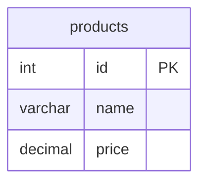
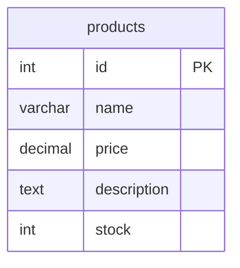

# REST API Automated Test Suite

Comprehensive test suite for the SqlMermaid REST API with baseline regression testing.

## 🚀 Quick Start

### Prerequisites
- REST API must be running at http://localhost:5001
- PowerShell 7.0 or higher

### Start the API
```powershell
cd srcREST
dotnet run
```

### Run Tests

**Create/Reset Baseline:**
```powershell
.\Tests\Run-RestApiTests.ps1 -ResetBaseline
```

**Run Regression Tests:**
```powershell
.\Tests\Run-RestApiTests.ps1
```

**Skip API Key Validation:**
```powershell
.\Tests\Run-RestApiTests.ps1 -SkipTokenCheck
```

---

## 🔍 What Gets Tested

### 1. API Availability
- Health check endpoint
- Service status verification

### 2. Authentication (if not skipped)
- API key generation
- API key validation
- Key info retrieval

### 3. SQL to Mermaid Conversion
- Simple SQL (single table)
- Complex SQL (multiple tables with relationships)

### 4. Mermaid to SQL Conversion
- All 4 SQL dialects: AnsiSql, SqlServer, PostgreSql, MySql
- Baseline comparison for each dialect

### 5. Migration Generation
- Diff detection between Mermaid diagrams
- Migration SQL generation for all 4 dialects
- Forward migrations (Before → After)

### 6. Error Handling
- Invalid SQL rejection
- Missing API key detection (if auth enabled)

---

## 📊 Test Modes

### Baseline Creation Mode (`-ResetBaseline`)
- Creates new baseline files from current API responses
- Saves all responses as `.json` files in `Tests/Baseline/`
- Use when:
  - First time running tests
  - API behavior has intentionally changed
  - Baseline files are corrupted

### Regression Test Mode (default)
- Compares current API responses against baseline files
- Reports any differences
- Fails if responses don't match exactly
- Use for:
  - Continuous integration
  - Pre-deployment validation
  - Development testing

---

## 🖥️ KRAKEN Development Mode

**Auto-enabled on computer named "KRAKEN"**

When running on the KRAKEN computer:
- ✅ API key validation automatically skipped
- ✅ Unlimited table access
- ✅ No rate limiting
- ✅ Faster test execution

This is detected automatically:
```powershell
$computerName = $env:COMPUTERNAME
if ($computerName -eq "KRAKEN") {
    # Auto-skip token validation
}
```

---

## 📁 Test Structure

```
srcREST/Tests/
├── Run-RestApiTests.ps1       ← Main test script
├── Baseline/                  ← Baseline response files
│   ├── sql_to_mmd_simple.json
│   ├── sql_to_mmd_complex.json
│   ├── mmd_to_sql_AnsiSql.json
│   ├── mmd_to_sql_SqlServer.json
│   ├── mmd_to_sql_PostgreSql.json
│   ├── mmd_to_sql_MySql.json
│   ├── migration_AnsiSql.json
│   ├── migration_SqlServer.json
│   ├── migration_PostgreSql.json
│   └── migration_MySql.json
├── Audit/                     ← Test run results (gitignored)
│   └── YYYYMMDD_HHMMSS/       ← Timestamped test run
│       ├── REST_API_TEST_REPORT.md
│       ├── *.json             ← Current test responses
│       └── DIFF_*.txt         ← Diff files for failed tests
└── README.md                  ← This file
```

---

## 📋 Test Report

After each run, a detailed report is generated:

**Location:** `Tests/Audit/YYYYMMDD_HHMMSS/REST_API_TEST_REPORT.md`

**Contents:**
- Test environment information
- API health status
- Individual test results
- Pass/fail summary
- Baseline comparison details
- Diff files for failures

**Example Report:**
```markdown
# SqlMermaid REST API Test Report

**Test Date:** 2025-12-01 21:52:29
**Computer:** KRAKEN
**API Base URL:** http://localhost:5001/api/v1
**Token Validation:** DISABLED (KRAKEN mode)

## Summary

| Metric | Value |
|--------|-------|
| **Total Tests** | 11 |
| **Passed** | 11 ✅ |
| **Failed** | 0 ✅ |
| **Pass Rate** | 100% |

### ✅ All Tests Passed!
```

---

## 🧪 Test Data

### Simple SQL
```sql
CREATE TABLE users (
    id INT PRIMARY KEY,
    name VARCHAR(100)
);
```

### Complex SQL
```sql
CREATE TABLE customers (
    customer_id INT PRIMARY KEY,
    email VARCHAR(255) NOT NULL UNIQUE,
    created_at TIMESTAMP DEFAULT CURRENT_TIMESTAMP
);

CREATE TABLE orders (
    order_id INT PRIMARY KEY,
    customer_id INT NOT NULL,
    total DECIMAL(10,2),
    FOREIGN KEY (customer_id) REFERENCES customers(customer_id)
);
```

### Mermaid Diagrams
Used for migration testing:

**Before:**


**After:**


---

## 🔧 Customization

### Change API Base URL
```powershell
.\Tests\Run-RestApiTests.ps1 -ApiBaseUrl "https://api.myserver.com/api/v1"
```

### Parameters

| Parameter | Type | Default | Description |
|-----------|------|---------|-------------|
| `ResetBaseline` | Switch | false | Create/reset baseline files |
| `ApiBaseUrl` | String | http://localhost:5001/api/v1 | API base URL |
| `SkipTokenCheck` | Switch | false | Skip API key validation |

---

## 🚦 Exit Codes

| Code | Meaning |
|------|---------|
| 0 | All tests passed |
| 1 | One or more tests failed OR baseline created |

**Note:** Baseline creation returns exit code 1 to prevent CI/CD from proceeding with untested baselines.

---

## 🔍 Troubleshooting

### API Not Running
```
❌ API is not running at http://localhost:5001/api/v1
ℹ️  Please start the API first: cd srcREST && dotnet run
```

**Solution:** Start the API in a separate terminal:
```powershell
cd srcREST
dotnet run
```

### Port Already in Use
```
Failed to bind to address http://127.0.0.1:5001: address already in use
```

**Solution:** Kill existing processes:
```powershell
Get-Process | Where-Object {$_.ProcessName -like "*dotnet*"} | Stop-Process -Force
```

### Baseline Not Found
```
❌ FAIL - Baseline not found (run with -ResetBaseline)
```

**Solution:** Create baseline files:
```powershell
.\Tests\Run-RestApiTests.ps1 -ResetBaseline
```

### Test Failures After Code Change
```
❌ FAIL - Response differs from baseline
```

**Solution:**
1. Check `DIFF_*.txt` files in audit folder
2. If change is intentional, reset baseline:
```powershell
.\Tests\Run-RestApiTests.ps1 -ResetBaseline
```

---

## 📝 Best Practices

### CI/CD Integration
```yaml
# GitHub Actions example
- name: Start REST API
  run: |
    cd srcREST
    dotnet run &
    sleep 10

- name: Run API Tests
  run: |
    cd srcREST
    pwsh -File Tests\Run-RestApiTests.ps1
```

### Development Workflow
1. Make code changes
2. Run tests to detect regressions
3. If tests fail, check diffs
4. Fix code OR reset baseline
5. Commit both code and baseline files

### Baseline Management
- ✅ Commit baseline files to git
- ✅ Review baseline changes in PRs
- ✅ Reset baseline when API contract changes
- ❌ Don't ignore baseline differences
- ❌ Don't commit audit folders

---

## 🎯 Integration with Main Regression Tests

This REST API test suite complements the main regression tests:

| Test Suite | Location | Tests |
|------------|----------|-------|
| **Main Regression** | `TestSuite/Scripts/Run-RegressionTests.ps1` | NuGet package, CLI, unit tests |
| **REST API Tests** | `srcREST/Tests/Run-RestApiTests.ps1` | REST API endpoints |
| **CLI Tests** | `srcCLI/Test-CLI.ps1` | CLI tool commands |

**Run all tests:**
```powershell
# 1. Main regression tests
.\TestSuite\Scripts\Run-RegressionTests.ps1

# 2. CLI tests
.\srcCLI\Test-CLI.ps1

# 3. REST API tests (start API first)
cd srcREST && dotnet run &
.\Tests\Run-RestApiTests.ps1
```

---

## 📊 Test Coverage

| Category | Tests | Coverage |
|----------|-------|----------|
| Health Check | 1 | API availability |
| Authentication | 2 | Key creation, validation |
| SQL → Mermaid | 2 | Simple & complex SQL |
| Mermaid → SQL | 4 | All dialects |
| Migration Gen | 4 | All dialects |
| Error Handling | 2 | Invalid input, auth |
| **Total** | **15** | **All endpoints** |

---

## 🔐 Security Notes

- API keys in test mode are temporary
- KRAKEN mode is for development only
- Never use `SkipTokenCheck` in production
- Baseline files contain sample data only
- Audit folders are gitignored

---

## 📚 Related Documentation

- [REST API README](../README.md) - API documentation
- [Main Regression Tests](../../TestSuite/Scripts/Run-RegressionTests.ps1) - Full test suite
- [CLI Tests](../../srcCLI/Test-CLI.ps1) - CLI testing

---

**Built for automated regression testing of the SqlMermaid REST API**

*Part of the SqlMermaidErdTools project - Professional SQL ↔ Mermaid ERD conversion tools*

