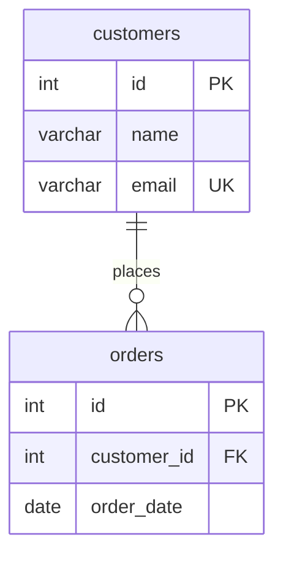

# SQL ↔ Mermaid ERD Tools

Bidirectional converter between SQL DDL and Mermaid Entity Relationship Diagrams for Visual Studio Code and Cursor.

## Features

### 🔄 Bidirectional Conversion
- **SQL → Mermaid**: Convert SQL DDL (CREATE TABLE statements) to Mermaid ERD diagrams
- **Mermaid → SQL**: Convert Mermaid ERD diagrams to SQL DDL in multiple dialects

### 🗄️ Multi-Dialect Support
- ANSI SQL (default)
- Microsoft SQL Server (T-SQL)
- PostgreSQL
- MySQL

### 📊 Live Preview
- Real-time Mermaid diagram preview
- Auto-updates as you edit `.mmd` files
- Beautiful rendering in side-by-side view

### ⚡ Quick Actions
- Right-click context menu integration
- Command palette access
- File explorer integration
- Keyboard shortcuts

## Installation

### Option 1: Install from VS Code Marketplace
1. Open VS Code/Cursor
2. Go to Extensions (Ctrl+Shift+X / Cmd+Shift+X)
3. Search for "SQL Mermaid ERD Tools"
4. Click Install

### Option 2: Install CLI Locally (Recommended)
To use the extension without an API key, install the .NET CLI tool:

```bash
dotnet tool install -g SqlMermaidErdTools.CLI
```

### Option 3: Use API Endpoint
Configure an API endpoint in settings if you're using the cloud service:

```json
{
  "sqlmermaid.apiEndpoint": "https://api.sqlmermaid.tools",
  "sqlmermaid.apiKey": "your-api-key"
}
```

## Usage

### Convert SQL to Mermaid

1. Open a `.sql` file
2. Right-click in the editor
3. Select **"Convert SQL to Mermaid ERD"**
4. A new `.mmd` file will be created with the diagram

**Or use Command Palette:**
- Press `Ctrl+Shift+P` (Windows/Linux) or `Cmd+Shift+P` (Mac)
- Type `SqlMermaid: Convert SQL to Mermaid ERD`

### Convert Mermaid to SQL

1. Open a `.mmd` file
2. Right-click in the editor
3. Select **"Convert Mermaid ERD to SQL"** (uses default dialect)
   - Or **"Convert Mermaid ERD to SQL (Choose Dialect)"** to select a specific SQL dialect
4. A new `.sql` file will be created

### Preview Mermaid Diagram

1. Open a `.mmd` file
2. Click the preview icon in the editor title bar
3. Or right-click and select **"Preview Mermaid Diagram"**

The preview will auto-update as you edit the file.

## Example

### Input SQL (`schema.sql`):
```sql
CREATE TABLE customers (
    id INT PRIMARY KEY,
    name VARCHAR(100) NOT NULL,
    email VARCHAR(255) UNIQUE
);

CREATE TABLE orders (
    id INT PRIMARY KEY,
    customer_id INT,
    order_date DATE,
    FOREIGN KEY (customer_id) REFERENCES customers(id)
);
```

### Output Mermaid (`schema.mmd`):


## Configuration

Open VS Code/Cursor settings and search for "sqlmermaid":

| Setting | Description | Default |
|---------|-------------|---------|
| `sqlmermaid.defaultDialect` | Default SQL dialect for conversions | `AnsiSql` |
| `sqlmermaid.autoOpenPreview` | Automatically open preview when converting to Mermaid | `true` |
| `sqlmermaid.outputFormat` | Where to output conversion results | `newFile` |
| `sqlmermaid.apiEndpoint` | Custom API endpoint URL (optional) | `""` |
| `sqlmermaid.apiKey` | API key for cloud service (optional) | `""` |
| `sqlmermaid.cliPath` | Custom path to CLI executable (optional) | `""` |

## Commands

| Command | Description |
|---------|-------------|
| `SqlMermaid: Convert SQL to Mermaid ERD` | Convert current SQL file to Mermaid |
| `SqlMermaid: Convert Mermaid ERD to SQL` | Convert current Mermaid file to SQL (default dialect) |
| `SqlMermaid: Convert Mermaid ERD to SQL (Choose Dialect)` | Convert with dialect selection |
| `SqlMermaid: Preview Mermaid Diagram` | Show live preview of Mermaid diagram |
| `SqlMermaid: Convert Current File` | Auto-detect file type and convert |

## Requirements

### Local Mode (No API Key)
- .NET 10 SDK or later
- SqlMermaidErdTools.CLI global tool

Install with:
```bash
dotnet tool install -g SqlMermaidErdTools.CLI
```

### API Mode
- No local requirements
- Requires API endpoint and key (configured in settings)

## Known Issues

- Large SQL files (>1000 tables) may take a few seconds to convert
- Some complex SQL features may not be fully supported in initial version

## Release Notes

### 0.1.0 (Initial Release)
- ✅ SQL to Mermaid conversion
- ✅ Mermaid to SQL conversion (4 dialects)
- ✅ Live Mermaid preview
- ✅ Context menu integration
- ✅ CLI and API support

## Contributing

Found a bug or have a feature request? 

- GitHub: [https://github.com/yourusername/SqlMermaidErdTools](https://github.com/yourusername/SqlMermaidErdTools)
- Issues: [https://github.com/yourusername/SqlMermaidErdTools/issues](https://github.com/yourusername/SqlMermaidErdTools/issues)

## License

MIT License - see [LICENSE](LICENSE) for details

## Support

- 📧 Email: support@sqlmermaid.tools
- 💬 Discord: [SqlMermaid Community](https://discord.gg/sqlmermaid)
- 📖 Documentation: [https://docs.sqlmermaid.tools](https://docs.sqlmermaid.tools)

---

**Enjoy!** 🎉

