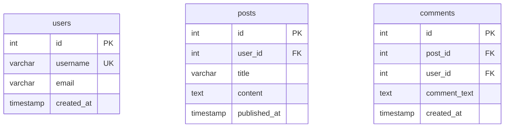

# 🚀 GET STARTED NOW - 5 Minutes to Live Demo!

## Step 1: Install Dependencies (1 minute)

```powershell
cd D:\opt\src\SqlMermaidErdTools\srcVSCADV
npm install
```

---

## Step 2: Compile TypeScript (30 seconds)

```powershell
npm run compile
```

---

## Step 3: Launch Extension (10 seconds)

1. Open `D:\opt\src\SqlMermaidErdTools\srcVSCADV` in **Cursor** or **VS Code**
2. Press **F5**
3. A new **"Extension Development Host"** window will open

---

## Step 4: Create Test File (1 minute)

In the Extension Development Host window, create `test.sql`:

```sql
CREATE TABLE customers (
    customer_id INT PRIMARY KEY,
    first_name VARCHAR(100) NOT NULL,
    last_name VARCHAR(100) NOT NULL,
    email VARCHAR(255) UNIQUE,
    created_at TIMESTAMP DEFAULT CURRENT_TIMESTAMP
);

CREATE TABLE orders (
    order_id INT PRIMARY KEY,
    customer_id INT NOT NULL,
    order_date DATE NOT NULL,
    total_amount DECIMAL(10, 2),
    status VARCHAR(20),
    FOREIGN KEY (customer_id) REFERENCES customers(customer_id)
);

CREATE TABLE order_items (
    item_id INT PRIMARY KEY,
    order_id INT NOT NULL,
    product_name VARCHAR(200) NOT NULL,
    quantity INT NOT NULL,
    unit_price DECIMAL(10, 2) NOT NULL,
    FOREIGN KEY (order_id) REFERENCES orders(order_id)
);

CREATE INDEX idx_customer_email ON customers(email);
CREATE INDEX idx_order_customer ON orders(customer_id);
CREATE INDEX idx_order_date ON orders(order_date);
```

---

## Step 5: Open in Split Editor (5 seconds)

1. **Right-click** on `test.sql` in the Explorer
2. Select **"Open in SQL ↔ Mermaid Split Editor"**

**🎉 YOU'RE NOW IN THE SPLIT EDITOR!**

---

## Step 6: See the Magic! (2 minutes)

### What You'll See:

```
┌────────────────────────────────────────────────────────────┐
│ ⇄ SQL → Mermaid | 👁 Preview ✓ | ▶ Convert | 💾 Save      │
├─────────────────────┬──────────────────────────────────────┤
│ Your SQL code here  │  LIVE PREVIEW                        │
│                     │  ┌──────────────┐                    │
│ (editable)          │  │  customers   │                    │
│                     │  │──────────────│                    │
│                     │  │ • id PK      │───┐                │
│                     │  │ • name       │   │ 1:N            │
│                     │  │ • email UK   │   │                │
│                     │  └──────────────┘   │                │
│                     │                     │                │
│                     │  ┌──────────────────▼────┐           │
│                     │  │      orders           │           │
│                     │  │──────────────────────│           │
│                     │  │ • id PK               │───┐       │
│                     │  │ • customer_id FK      │   │ 1:N   │
│                     │  │ • date                │   │       │
│                     │  └───────────────────────┘   │       │
│                     │                              │       │
│                     │  ┌──────────────────────────▼┐       │
│                     │  │    order_items            │       │
│                     │  │───────────────────────────│       │
│                     │  │ • id PK                   │       │
│                     │  │ • order_id FK             │       │
│                     │  │ • product_name            │       │
│                     │  └───────────────────────────┘       │
│                     ├──────────────────────────────────────┤
│                     │  Mermaid Code Output                 │
│                     │  erDiagram                           │
│                     │      customers ||--o{ orders ...     │
├─────────────────────┴──────────────────────────────────────┤
│ Converted in 48ms                                  48ms    │
└────────────────────────────────────────────────────────────┘
```

---

## Step 7: Try These Cool Features! (2 minutes)

### A. **Click "▶ Convert"**
- See the diagram appear instantly!
- See the Mermaid code in the bottom panel
- Notice the conversion time in status bar

### B. **Edit the SQL**
- Change `VARCHAR(100)` to `VARCHAR(200)`
- Wait 500ms → **Auto-converts!**
- See the diagram update automatically

### C. **Toggle Mode (Ctrl+M)**
- Click the **"⇄"** button
- Now you're in **"Mermaid → SQL"** mode
- Left panel shows Mermaid, right shows SQL
- Try selecting different SQL dialects!

### D. **Hide/Show Preview**
- Click **"👁 Preview"** button
- Preview disappears → More space for code
- Click again to bring it back

### E. **Copy Output**
- Click the **📋** button in right panel
- Mermaid code copied to clipboard!
- Paste into GitHub, documentation, etc.

---

## Step 8: Test Mermaid → SQL (1 minute)

Create `schema.mmd`:



1. **Open in Split Editor**
2. **Already in Mermaid → SQL mode!**
3. **Select "PostgreSQL"** from dropdown
4. **Click "▶ Convert"**
5. **See production-ready SQL!**

Now try:
- Select **"SQL Server"** → Convert → See T-SQL syntax
- Select **"MySQL"** → Convert → See MySQL syntax
- Compare the differences!

---

## 🎨 Visual Guide

### SQL → Mermaid Flow
```
Your SQL DDL
    ↓
Click Convert
    ↓
Python/SQLGlot parses SQL
    ↓
Generates Mermaid code
    ↓
Displays in right panel
    ↓
Mermaid.js renders diagram
    ↓
Beautiful ERD appears! ✨
```

### Mermaid → SQL Flow
```
Your Mermaid ERD
    ↓
Click Convert
    ↓
Python script parses Mermaid
    ↓
Generates SQL for chosen dialect
    ↓
SQL appears in right panel
    ↓
Copy and use! 🚀
```

---

## ⌨️ Keyboard Shortcuts to Remember

| Shortcut | Action |
|----------|--------|
| **Ctrl+S** | Save your changes |
| **Ctrl+Enter** | Convert immediately |
| **Ctrl+M** | Toggle SQL ↔ Mermaid |

---

## 🐛 Troubleshooting

### "CLI not found" error?

**Solution**: The extension will work with your existing CLI setup from the main project. If you get this error:

```powershell
# Navigate to main project
cd D:\opt\src\SqlMermaidErdTools

# The extension will use the bundled Python scripts
# No additional setup needed!
```

### Preview not showing?

**Check**:
1. Internet connection (Mermaid.js loads from CDN)
2. Click the **"👁 Preview"** button to ensure it's enabled
3. Look in the Developer Tools console for errors

### Conversion fails?

**Check**:
1. SQL syntax is valid
2. Mermaid syntax is valid
3. Look at the error message in red box

---

## 📚 Next Steps

### Learn More
- Read [README.md](README.md) for full feature list
- Check [VISUAL_GUIDE.md](VISUAL_GUIDE.md) for UI examples
- See [IMPLEMENTATION_SUMMARY.md](IMPLEMENTATION_SUMMARY.md) for technical details

### Package for Production
```powershell
npm run package
```

Creates: `sqlmermaid-erd-tools-advanced-1.0.0.vsix`

### Install in Your VS Code
```powershell
code --install-extension sqlmermaid-erd-tools-advanced-1.0.0.vsix
```

---

## 🎉 You're Done!

**Congratulations!** You now have:

✅ A professional split-view editor  
✅ Live Mermaid diagram preview  
✅ Bidirectional SQL ↔ Mermaid conversion  
✅ Multi-dialect SQL generation  
✅ Beautiful, modern UI  
✅ Auto-conversion on typing  
✅ Production-ready extension  

---

## 💡 Pro Tips

1. **Use auto-convert** for rapid prototyping
2. **Toggle preview off** when working with large schemas
3. **Compare SQL dialects** side-by-side for learning
4. **Copy Mermaid diagrams** to GitHub issues/READMEs
5. **Save frequently** with Ctrl+S

---

## 🚀 Share Your Experience!

If you love this extension:
- ⭐ Star the project
- 📢 Share with colleagues
- 🐛 Report bugs
- 💡 Suggest features

---

**NOW GO BUILD AMAZING DATABASE DIAGRAMS!** 🎨✨

---

Made with ❤️ and lots of ☕ for the SqlMermaidErdTools community

