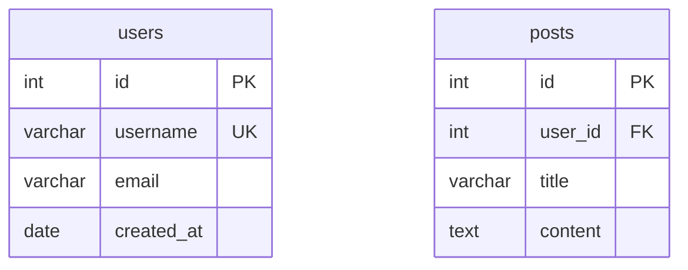

# Quick Start - SQL ↔ Mermaid Split Editor (Advanced)

## 🚀 Get Started in 3 Minutes

### Step 1: Install Dependencies

```bash
cd srcVSCADV
npm install
```

### Step 2: Compile TypeScript

```bash
npm run compile
```

### Step 3: Run the Extension

1. Open `srcVSCADV` folder in VS Code
2. Press `F5`
3. A new "Extension Development Host" window will open

---

## 🎯 Test the Split Editor

### Test 1: SQL → Mermaid (with Live Preview)

In the Extension Development Host window:

1. **Create `test.sql`**:
```sql
CREATE TABLE customers (
    id INT PRIMARY KEY,
    name VARCHAR(100) NOT NULL,
    email VARCHAR(255) UNIQUE
);

CREATE TABLE orders (
    id INT PRIMARY KEY,
    customer_id INT NOT NULL,
    order_date DATE,
    FOREIGN KEY (customer_id) REFERENCES customers(id)
);

CREATE INDEX idx_customer_email ON customers(email);
```

2. **Right-click on the file** in Explorer

3. **Select "Open in SQL ↔ Mermaid Split Editor"**

4. **You'll see**:
   - **Left panel**: Your SQL code (editable)
   - **Right panel top**: Live Mermaid diagram preview
   - **Right panel bottom**: Generated Mermaid code
   - **Toolbar**: Mode toggle, convert, save buttons

5. **Click "▶ Convert"** to see the magic!

6. **Try editing**: Change `VARCHAR(100)` to `VARCHAR(200)` and click Convert again

---

### Test 2: Mermaid → SQL (Multi-Dialect)

1. **Create `schema.mmd`**:


2. **Open in Split Editor** (right-click → "Open in SQL ↔ Mermaid Split Editor")

3. **You'll see**:
   - **Left panel**: Your Mermaid code
   - **Right panel**: Generated SQL (ANSI SQL by default)
   - **Toolbar**: Dialect selector, mode toggle

4. **Select different dialects**:
   - Choose "PostgreSQL" from dropdown
   - Click "▶ Convert"
   - See PostgreSQL-specific syntax!

5. **Try "SQL Server"**:
   - Switch to "SQL Server"
   - Click Convert
   - Notice `VARCHAR(MAX)` instead of `VARCHAR`

---

## ✨ Advanced Features to Try

### Feature 1: Auto-Convert on Type

1. Open any `.sql` file in split editor
2. Start typing SQL code
3. **Wait 500ms** → It auto-converts!
4. Disable in settings if you prefer manual conversion

### Feature 2: Toggle Mode

1. Open `test.sql` in split editor (SQL → Mermaid mode)
2. Click **"⇄"** button (or press `Ctrl+M`)
3. **Now you're in Mermaid → SQL mode!**
4. Click **"⇄"** again to toggle back

### Feature 3: Live Preview Toggle

1. In SQL → Mermaid mode
2. Click the **"👁 Preview"** button
3. Preview panel disappears → More space for code!
4. Click again to bring it back

### Feature 4: Copy & Export

1. After conversion, click **"📋"** (Copy)
2. Converted code is copied to clipboard
3. Paste anywhere!

---

## ⌨️ Keyboard Shortcuts

Try these while in the split editor:

- **`Ctrl+S`**: Save file
- **`Ctrl+Enter`**: Convert now (skip auto-convert delay)
- **`Ctrl+M`**: Toggle SQL ↔ Mermaid mode

---

## 🎨 The Interface

```
┌───────────────────────────────────────────────────────────────────┐
│ Toolbar                                                           │
│ ⇄ SQL→Mermaid | [PostgreSQL ▼] | 👁 Preview | ▶ Convert | 💾     │
├─────────────────────────┬─────────────────────────────────────────┤
│ SQL INPUT               │ LIVE PREVIEW                            │
│ ─────────────           │ ───────────────────                     │
│ 15 lines                │ ┌─────────────┐      ┌──────────┐       │
│                         │ │ customers   │      │  orders  │       │
│ CREATE TABLE customers  │ │ • id PK     │──────│ • id PK  │       │
│ (                       │ │ • name      │ 1:N  │ • cust.. │       │
│   id INT PRIMARY KEY,   │ │ • email UK  │      │ • date   │       │
│   name VARCHAR(100),    │ └─────────────┘      └──────────┘       │
│   email VARCHAR(255)    │                                         │
│ );                      │                                         │
│                         ├─────────────────────────────────────────┤
│ CREATE TABLE orders (   │ MERMAID OUTPUT                          │
│   id INT PRIMARY KEY,   │ ─────────────────                       │
│   customer_id INT,      │                                         │
│   FOREIGN KEY ...       │ erDiagram                               │
│ );                      │     customers ||--o{ orders : places    │
│                         │     customers {                         │
│                         │         int id PK                       │
│                         │         varchar name                    │
├─────────────────────────┴─────────────────────────────────────────┤
│ Ready                                     Converted in 45ms       │
└───────────────────────────────────────────────────────────────────┘
```

---

## 🔧 Configuration

### Settings Location

1. Open Settings: `File → Preferences → Settings`
2. Search: `sqlmermaid`
3. Configure:

```json
{
  "sqlmermaid.defaultDialect": "PostgreSql",
  "sqlmermaid.autoConvert": true,
  "sqlmermaid.showPreview": true,
  "sqlmermaid.conversionDelay": 300
}
```

---

## 📦 Build & Package

### Create VSIX Package

```bash
npm run package
```

### Install Locally

```bash
code --install-extension sqlmermaid-erd-tools-advanced-1.0.0.vsix
```

### Publish to Marketplace

1. Get publisher account: https://marketplace.visualstudio.com/manage
2. Get Personal Access Token
3. Login:
```bash
npx vsce login your-publisher-id
```
4. Publish:
```bash
npm run publish
```

---

## 🐛 Troubleshooting

### CLI Not Found

**Solution**: Install the CLI tool
```bash
dotnet tool install -g SqlMermaidErdTools.CLI
```

### Conversion Fails

**Check**:
1. Extension Output panel: `View → Output` → Select "SqlMermaid"
2. Verify SQL/Mermaid syntax is valid
3. Try simple example first

### Preview Not Rendering

**Check**:
1. Is Mermaid.js CDN accessible?
2. Is the diagram syntax valid?
3. Try toggling preview off/on

---

## 🎯 What's Next?

- Read [DEVELOPMENT.md](DEVELOPMENT.md) for detailed development guide
- Check [README.md](README.md) for full feature documentation
- Explore the code in `src/editors/splitEditorProvider.ts`

---

## 🌟 Pro Tips

1. **Use auto-convert** for rapid prototyping
2. **Toggle mode** to validate round-trip conversions
3. **Copy Mermaid diagrams** to GitHub issues/documentation
4. **Try different SQL dialects** to see syntax differences
5. **Use Ctrl+Enter** for instant conversion without waiting

---

**Happy Coding with the Advanced Split Editor!** 🚀
