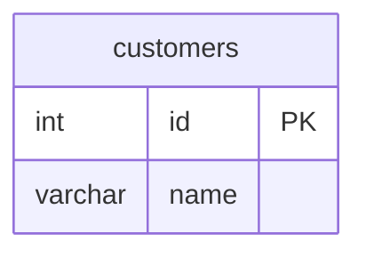

# SQL ↔ Mermaid ERD Tools (Advanced Split-View Editor)

**Professional split-view editor** for bidirectional SQL DDL and Mermaid ERD conversion with live preview and real-time synchronization.

## 🎨 Advanced Features

### Split-View Editor
- **Left Panel**: Edit SQL or Mermaid code
- **Right Panel**: See converted output in real-time
- **Live Preview**: Automatic Mermaid diagram rendering (SQL → Mermaid mode)
- **Mode Toggle**: Instantly switch between SQL → Mermaid and Mermaid → SQL
- **Professional UI**: Beautiful, VS Code-integrated interface

### Real-Time Conversion
- ⚡ **Auto-convert** as you type (debounced)
- 🔄 **Bidirectional**: Toggle between SQL ↔ Mermaid with one click
- 👁️ **Live Preview**: See diagram updates instantly
- 🎯 **Multi-Dialect**: Choose from 4 SQL dialects (AnsiSql, SQL Server, PostgreSQL, MySQL)

### Intelligent Features
- 📊 **Line counter** and conversion timing
- 🎨 **Syntax-aware** editing
- ⌨️ **Keyboard shortcuts** (Ctrl+S to save, Ctrl+Enter to convert, Ctrl+M to toggle mode)
- 📋 **Copy to clipboard** with one click
- 💾 **Auto-save** support

## Installation

### Option 1: Install from VSIX (Local Testing)
```bash
cd srcVSCADV
npm install
npm run package
code --install-extension sqlmermaid-erd-tools-advanced-1.0.0.vsix
```

### Option 2: Install from VS Code Marketplace
1. Open VS Code/Cursor
2. Go to Extensions (Ctrl+Shift+X / Cmd+Shift+X)
3. Search for "SQL Mermaid ERD Tools Advanced"
4. Click Install

## Usage

### Opening the Split Editor

#### Method 1: From File Explorer
1. Right-click on any `.sql` or `.mmd` file
2. Select **"Open in SQL ↔ Mermaid Split Editor"**

#### Method 2: From Open File
1. Open a `.sql` or `.mmd` file
2. Click the split editor icon in the title bar
3. Or use Command Palette: `SqlMermaid: Open in Split Editor`

#### Method 3: Set as Default Editor
1. Right-click on a `.sql` or `.mmd` file
2. Select **"Open With..."**
3. Choose **"SQL ↔ Mermaid Split Editor"**
4. Check "Configure default editor for..." for permanent default

### Using the Split Editor

#### Toolbar Controls

| Button | Function | Shortcut |
|--------|----------|----------|
| **⇄ SQL → Mermaid** | Toggle conversion mode | Ctrl+M |
| **Dialect Selector** | Choose output SQL dialect | - |
| **👁 Preview** | Toggle Mermaid preview panel | - |
| **▶ Convert** | Convert current code | Ctrl+Enter |
| **💾 Save** | Save changes to file | Ctrl+S |

#### SQL → Mermaid Mode

**Left Panel**: Edit SQL DDL
```sql
CREATE TABLE customers (
    id INT PRIMARY KEY,
    name VARCHAR(100) NOT NULL
);
```

**Right Panel Top**: Live Mermaid diagram preview  
**Right Panel Bottom**: Generated Mermaid code

#### Mermaid → SQL Mode

**Left Panel**: Edit Mermaid ERD


**Right Panel**: Generated SQL for selected dialect

## Features in Detail

### 1. Split-View Layout

```
┌─────────────────────────────────────────────────────────────┐
│ ⇄ SQL→Mermaid | [Dialect ▼] | 👁 Preview | ▶ Convert | 💾  │
├──────────────────────┬──────────────────────────────────────┤
│                      │  Live Preview (Mermaid Diagram)      │
│  SQL Editor          │  ┌────────────┐                      │
│                      │  │ Customers  │                      │
│  CREATE TABLE...     │  │ • id PK    │                      │
│                      │  │ • name     │                      │
│                      │  └────────────┘                      │
│                      ├──────────────────────────────────────┤
│                      │  Mermaid Code Output                 │
│                      │                                      │
│                      │  erDiagram                           │
│                      │      customers {                     │
│                      │          int id PK                   │
│                      │      }                               │
├──────────────────────┴──────────────────────────────────────┤
│ Ready                                        Converted: 45ms│
└─────────────────────────────────────────────────────────────┘
```

### 2. Auto-Convert on Type

The editor automatically converts your code as you type (with 500ms debounce by default). Disable in settings if you prefer manual conversion.

### 3. Dialect Selection

When in **Mermaid → SQL mode**, choose your target SQL dialect:
- **ANSI SQL**: Maximum compatibility
- **SQL Server**: T-SQL with VARCHAR(MAX), etc.
- **PostgreSQL**: PostgreSQL-specific syntax
- **MySQL**: MySQL dialect with VARCHAR(255), etc.

### 4. Live Preview

When in **SQL → Mermaid mode**, see your ERD diagram render in real-time using Mermaid.js. The preview updates automatically as you convert.

### 5. Professional UI

- **Dark theme** integration with VS Code
- **Responsive** layout with resizable splitter
- **Error display** with helpful messages
- **Status bar** showing conversion time
- **Line counter** for code metrics

## Configuration

### Settings

Open VS Code settings and search for "sqlmermaid":

| Setting | Description | Default |
|---------|-------------|---------|
| `sqlmermaid.defaultDialect` | Default SQL dialect | `AnsiSql` |
| `sqlmermaid.autoConvert` | Auto-convert as you type | `true` |
| `sqlmermaid.showPreview` | Show Mermaid preview panel | `true` |
| `sqlmermaid.conversionDelay` | Debounce delay (ms) | `500` |
| `sqlmermaid.cliPath` | Custom CLI path | `""` (auto-detect) |
| `sqlmermaid.apiEndpoint` | Custom API endpoint | `""` |
| `sqlmermaid.apiKey` | API key | `""` |

### Example settings.json

```json
{
  "sqlmermaid.defaultDialect": "PostgreSql",
  "sqlmermaid.autoConvert": true,
  "sqlmermaid.showPreview": true,
  "sqlmermaid.conversionDelay": 300
}
```

## Keyboard Shortcuts

| Shortcut | Action |
|----------|--------|
| `Ctrl+S` | Save file |
| `Ctrl+Enter` | Convert now |
| `Ctrl+M` | Toggle SQL ↔ Mermaid mode |

## Requirements

### Local Mode (No API Key)
- .NET 10 SDK or later
- SqlMermaidErdTools.CLI global tool

Install CLI:
```bash
dotnet tool install -g SqlMermaidErdTools.CLI
```

### API Mode
- No local requirements
- Requires API endpoint and key (configured in settings)

## Example Workflow

### Documenting an Existing Database

1. Export your database schema to SQL DDL
2. Open the `.sql` file in the split editor
3. Click **"▶ Convert"**
4. See the Mermaid ERD appear instantly
5. Copy the Mermaid code to your documentation

### Designing a New Schema

1. Create a new `.mmd` file
2. Open in split editor
3. Draw your ERD in Mermaid syntax
4. Click **"⇄"** to switch to Mermaid → SQL mode
5. Select your target SQL dialect
6. Click **"▶ Convert"**
7. Get production-ready SQL DDL!

## Known Issues

- Very large schemas (>100 tables) may render slowly in preview
- Some advanced SQL features are not fully supported in conversions

## Comparison: Basic vs. Advanced Edition

| Feature | Basic Edition | Advanced Edition |
|---------|---------------|------------------|
| SQL ↔ Mermaid conversion | ✅ | ✅ |
| Command-based conversion | ✅ | ✅ |
| Context menu integration | ✅ | ✅ |
| Split-view editor | ❌ | ✅ |
| Live preview | Separate panel | Integrated |
| Auto-convert on type | ❌ | ✅ |
| Real-time sync | ❌ | ✅ |
| Mode toggle | ❌ | ✅ |
| Professional UI | Basic | Advanced |

## Support

- 📖 [Documentation](https://github.com/yourusername/SqlMermaidErdTools/wiki)
- 🐛 [Issue Tracker](https://github.com/yourusername/SqlMermaidErdTools/issues)
- 💬 [Discussions](https://github.com/yourusername/SqlMermaidErdTools/discussions)

## License

MIT License - see [LICENSE](LICENSE) for details

---

**Enjoy the professional split-view editing experience!** 🎉
