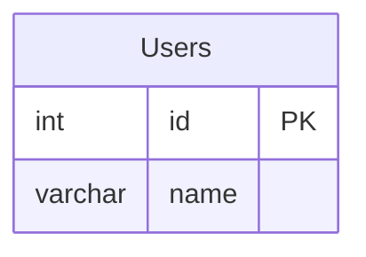

# Architecture - Who Does What?

## 🎯 Quick Answer

**SQLGlot parses SQL → WE create the Mermaid syntax → Mermaid.js renders it**

SQLGlot does **NOT** create Mermaid diagrams. It only parses SQL.

---

## 📊 Complete Flow

```
┌─────────────────┐
│  SQL DDL Input  │
│  (User's SQL)   │
└────────┬────────┘
         │
         ▼
┌─────────────────────────────────────┐
│  1. SQLGlot (Toby Mao)              │
│  • Parses SQL into AST              │
│  • Understands SQL syntax           │
│  • Extracts structure               │
│  • Does NOT know about Mermaid      │
└────────┬────────────────────────────┘
         │ (Abstract Syntax Tree)
         ▼
┌─────────────────────────────────────┐
│  2. OUR CODE (sql_to_mmd.py)        │
│  • Uses SQLGlot's parsed data       │
│  • Extracts tables, columns, FKs    │
│  • Generates Mermaid ERD syntax     │
│  • Formats as Mermaid text          │
└────────┬────────────────────────────┘
         │ (Mermaid ERD Text)
         ▼
┌─────────────────────────────────────┐
│  3. Mermaid.js (End User)           │
│  • Renders text into diagram        │
│  • Displays in browser/docs         │
│  • Not part of our package          │
└─────────────────────────────────────┘
```

---

## 🔍 Detailed Breakdown

### What SQLGlot Does (Toby Mao's Library)

SQLGlot is a **SQL parser**. It:

✅ **Parses SQL** into an Abstract Syntax Tree (AST)  
✅ **Understands SQL syntax** across 31+ dialects  
✅ **Provides structured data** about SQL statements  

❌ **Does NOT** know anything about Mermaid  
❌ **Does NOT** generate diagrams  
❌ **Does NOT** create Mermaid syntax  

**Example of what SQLGlot gives us:**

```python
# Input SQL:
CREATE TABLE Users (id INT PRIMARY KEY, name VARCHAR(100));

# SQLGlot parses it into:
Create(
  kind='TABLE',
  this=Schema(
    this=Table(name='Users'),
    expressions=[
      ColumnDef(name='id', type='INT', constraints=[PrimaryKey]),
      ColumnDef(name='name', type='VARCHAR(100)')
    ]
  )
)
```

---

### What WE Do (Your Package)

**Our `sql_to_mmd.py` script:**

1. ✅ **Calls SQLGlot** to parse SQL
2. ✅ **Extracts information** from SQLGlot's AST:
   - Table names
   - Column names and types
   - Primary keys
   - Foreign keys
   - Unique constraints
   - Default values
3. ✅ **Generates Mermaid ERD syntax** (this is OUR code!)
4. ✅ **Formats the output** as Mermaid text

**Our code that creates Mermaid syntax:**

```python
def generate_mermaid_erd(tables: List[Dict[str, Any]]) -> str:
    """Generate Mermaid ERD diagram from table definitions."""
    lines = ["erDiagram"]  # ← WE create this
    
    # Generate relationships
    for table in tables:
        for fk in table.get("foreign_keys", []):
            # WE create this Mermaid syntax:
            lines.append(f"    {to_table} ||--o{{ {from_table} : {rel_name}")
    
    # Generate entity definitions
    for table in tables:
        lines.append(f"    {table['name']} {{")  # ← WE create this
        for column in table.get("columns", []):
            # WE create this Mermaid syntax:
            lines.append(f"        {data_type} {col_name}{marker_str}")
        lines.append("    }")
    
    return "\n".join(lines)  # ← WE join it all together
```

---

### What Mermaid.js Does (Not Part of Our Package)

**Mermaid.js** (https://mermaid.js.org/) by **Knut Sveidqvist**

Mermaid.js is a **diagram renderer**. It:

✅ **Takes Mermaid text** (like our output)  
✅ **Renders it into SVG/PNG** diagrams  
✅ **Runs in browsers** or documentation tools  
✅ **Defines the ERD specification** we generate

❌ **Not bundled** in our package  
❌ **Not needed** for our conversion  
❌ **End-user's responsibility**  

**Credit:** We generate output compatible with Mermaid.js format.  

**Example:**



↑ This text is what **WE create**  
↓ The visual diagram is what **Mermaid.js creates**

---

## 📝 Code Ownership

| Component | Who Created It | What It Does |
|-----------|----------------|--------------|
| **SQLGlot** | Toby Mao | Parses SQL → AST |
| **sql_to_mmd.py** | You (Dedge AS) | AST → Mermaid text |
| **Mermaid.js** | Knut Sveidqvist | Mermaid text → Visual diagram |

---

## 🎯 Your Value Proposition

### What Makes Your Package Valuable:

1. ✅ **Integration** - You integrated SQLGlot for SQL parsing
2. ✅ **Mermaid Generation** - You wrote the code to generate Mermaid syntax
3. ✅ **Multi-Dialect Support** - You leverage SQLGlot's 31+ dialects
4. ✅ **Zero Configuration** - You bundled Python + SQLGlot
5. ✅ **.NET Integration** - You made it work in .NET ecosystem
6. ✅ **Foreign Keys** - You extract and format relationships
7. ✅ **Constraints** - You handle PK, FK, UK, NOT NULL, defaults

**You're the glue** that connects:
- SQL (via SQLGlot parsing)
- Mermaid ERD (via your generation code)
- .NET developers (via C# wrapper)

---

## 💡 Analogy

Think of it like a restaurant:

- **SQLGlot** = The food processor (breaks down ingredients)
- **Your Code** = The chef (combines ingredients into a dish)
- **Mermaid.js** = The presentation (makes it look beautiful)

You're the **chef** who:
1. Uses a food processor (SQLGlot) to prep ingredients (parse SQL)
2. Creates the recipe (writes the Mermaid generation code)
3. Serves it ready-to-present (outputs Mermaid text)

---

## 📄 Proper Attribution

### Current Description (Correct):

> "Powered by SQLGlot (https://github.com/tobymao/sqlglot) - a comprehensive SQL parser by Toby Mao."

This is **accurate** because:
- ✅ Credits SQLGlot for SQL parsing
- ✅ Credits Toby Mao as author
- ✅ Doesn't claim SQLGlot creates Mermaid (it doesn't)
- ✅ Implies we use it as a component (which we do)

---

## 🎓 Summary

**Q: Do we or SQLGlot create the Mermaid?**

**A: WE DO!**

- **SQLGlot**: Parses SQL → gives us structured data
- **We (Dedge AS)**: Take that data → generate Mermaid ERD syntax
- **Mermaid.js**: Takes our output → renders visual diagrams (end-user)

**SQLGlot knows SQL.** ✅  
**SQLGlot knows Mermaid.** ❌  
**We know both.** ✅  

That's your value! 🎉

---

## 🔧 Technical Details

If you want to see exactly where we create Mermaid syntax:

- **File**: `src/SqlMmdConverter/scripts/sql_to_mmd.py`
- **Function**: `generate_mermaid_erd()` (line 236)
- **Code**: 100% written by us
- **Input**: SQLGlot's parsed data
- **Output**: Mermaid ERD text

**We are the Mermaid generator.** SQLGlot is the SQL parser we depend on.

