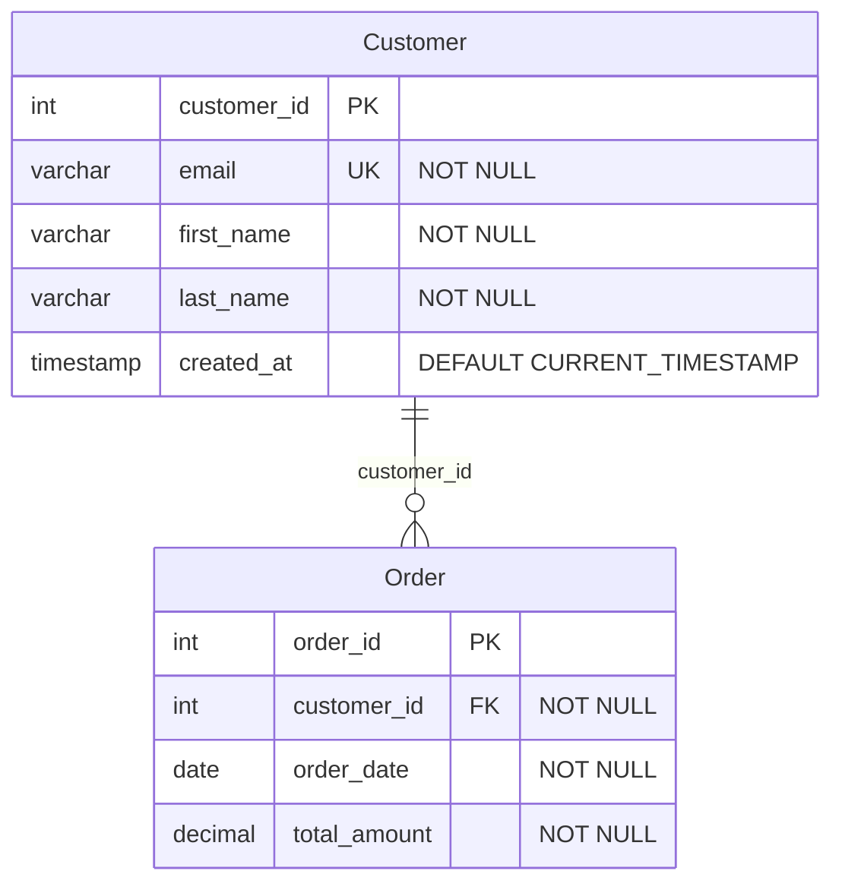

# Sql2MermaidErdConverter

[](https://dotnet.microsoft.com/)
[](LICENSE)
[](https://www.nuget.org/packages/Sql2MermaidErdConverter/)

Convert SQL DDL to Mermaid Entity Relationship Diagrams (ERD). Automatically generate beautiful visual documentation from your database schema!

> **Note:** Currently supports SQL → Mermaid conversion. Mermaid → SQL conversion is planned for a future release.

## Features

✨ **SQL to Mermaid ERD Conversion**
- Convert SQL DDL to beautiful Mermaid ERD diagrams
- Support for 31+ SQL dialects via SQLGlot
- Automatic relationship detection from foreign keys

📊 **Full Schema Support**
- Tables and columns
- Primary keys
- Foreign keys and relationships
- Unique constraints
- NOT NULL constraints
- DEFAULT values
- Data types

## Quick Start

### Installation

```bash
dotnet add package Sql2MermaidErdConverter
```

### Usage

```csharp
using Sql2MermaidErdConverter;

// Convert SQL to Mermaid ERD
var sqlDdl = @"
CREATE TABLE Customer (
    customer_id INT PRIMARY KEY,
    email VARCHAR(255) NOT NULL UNIQUE,
    first_name VARCHAR(100) NOT NULL
);

CREATE TABLE Order (
    order_id INT PRIMARY KEY,
    customer_id INT NOT NULL,
    order_date DATE NOT NULL,
    FOREIGN KEY (customer_id) REFERENCES Customer(customer_id)
);
";

var mermaid = Sql2MermaidErdConverter.ToMermaid(sqlDdl);
Console.WriteLine(mermaid);
// Output: Mermaid ERD diagram with Customer and Order tables and their relationship
```

### Async Support

```csharp
// Async conversion
var mermaid = await Sql2MermaidErdConverter.ToMermaidAsync(sqlDdl);
```

### Using Dependency Injection

```csharp
using Sql2MermaidErdConverter.Converters;

// Register in your DI container
services.AddSingleton<ISqlToMmdConverter, SqlToMmdConverter>();

// Use in your code
public class MyService
{
    private readonly ISqlToMmdConverter _converter;
    
    public MyService(ISqlToMmdConverter converter)
    {
        _converter = converter;
    }
    
    public async Task<string> ConvertSchema(string sql)
    {
        return await _converter.ConvertAsync(sql);
    }
}
```

## Examples

### SQL → Mermaid ERD

**Input (SQL):**
```sql
CREATE TABLE Customer (
    customer_id INT PRIMARY KEY,
    email VARCHAR(255) NOT NULL UNIQUE,
    first_name VARCHAR(100) NOT NULL,
    last_name VARCHAR(100) NOT NULL,
    created_at TIMESTAMP DEFAULT CURRENT_TIMESTAMP
);

CREATE TABLE Order (
    order_id INT PRIMARY KEY,
    customer_id INT NOT NULL,
    order_date DATE NOT NULL,
    total_amount DECIMAL(10, 2) NOT NULL,
    FOREIGN KEY (customer_id) REFERENCES Customer(customer_id)
);
```

**Output (Mermaid):**


## Supported SQL Dialects (Input)

The converter can parse SQL DDL from 31+ different SQL dialects thanks to [SQLGlot](https://github.com/tobymao/sqlglot). Common dialects include:

- ANSI SQL (Standard SQL)
- Microsoft SQL Server (T-SQL) - with automatic bracket removal
- PostgreSQL
- MySQL / MariaDB
- SQLite
- Oracle
- IBM DB2
- Snowflake
- BigQuery
- Redshift
- And 20+ more!

The tool automatically detects and handles dialect-specific syntax variations.

## Supported Data Types

### Numeric Types
- INT, INTEGER, BIGINT, SMALLINT
- DECIMAL, NUMERIC
- FLOAT, REAL, DOUBLE

### String Types
- VARCHAR, NVARCHAR
- CHAR, NCHAR
- TEXT

### Date/Time Types
- DATE, TIME
- DATETIME, TIMESTAMP

### Other Types
- BOOLEAN, BOOL
- BINARY, VARBINARY
- UUID, UNIQUEIDENTIFIER

## Architecture

Sql2MermaidErdConverter uses [SQLGlot](https://github.com/tobymao/sqlglot), a battle-tested open-source SQL parser and transpiler that supports 31+ SQL dialects.

**How it works:**
1. Your SQL DDL is cleaned and normalized (removes T-SQL brackets, fixes syntax quirks)
2. SQLGlot parses the SQL into an Abstract Syntax Tree (AST)
3. The converter extracts tables, columns, constraints, and relationships
4. Mermaid ERD syntax is generated with proper formatting

The package bundles a portable Python runtime with SQLGlot pre-installed, so **no external dependencies are required**!

## Limitations

### Current Version (v0.2.x)
- **One-way conversion only**: SQL → Mermaid (Mermaid → SQL planned for v1.0)
- Views, stored procedures, and triggers are not supported
- Composite foreign keys have limited support
- Some advanced constraints (CHECK, etc.) are not fully supported
- Indexes are documented as comments, not visualized in the diagram

### Planned for Future Releases
- **v1.0**: Mermaid → SQL conversion (bidirectional support)
- Support for views and stored procedures
- Enhanced index visualization
- Custom data type mapping
- Schema migration and diff tools

## Requirements

- .NET 10.0 or later
- Windows, Linux, or macOS (x64)

**No manual installation of Python required!** The package includes a bundled Python runtime.

## Contributing

Contributions are welcome! Please feel free to submit a Pull Request.

1. Fork the repository
2. Create your feature branch (`git checkout -b feature/AmazingFeature`)
3. Commit your changes (`git commit -m 'Add some AmazingFeature'`)
4. Push to the branch (`git push origin feature/AmazingFeature`)
5. Open a Pull Request

## License

This project is licensed under the MIT License - see the [LICENSE](LICENSE) file for details.

## Acknowledgments

- [SQLGlot](https://github.com/tobymao/sqlglot) by Toby Mao - Powerful SQL parser and transpiler supporting 31+ dialects
- [Mermaid.js](https://mermaid.js.org/) by Knut Sveidqvist - Beautiful diagram and flowchart rendering

## Support

- 📖 [Documentation](https://github.com/sqlmmdconverter/Sql2MermaidErdConverter/wiki)
- 🐛 [Issue Tracker](https://github.com/sqlmmdconverter/Sql2MermaidErdConverter/issues)
- 💬 [Discussions](https://github.com/sqlmmdconverter/Sql2MermaidErdConverter/discussions)

---

Made with ❤️ for the database and documentation community
