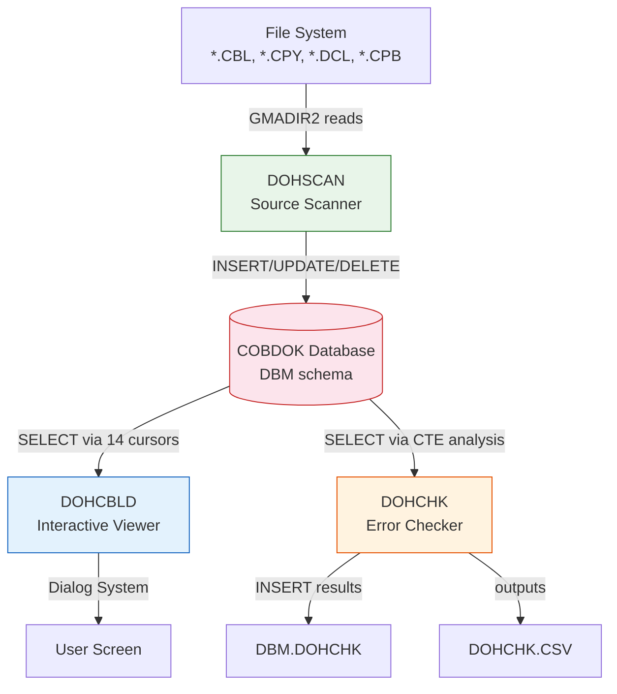
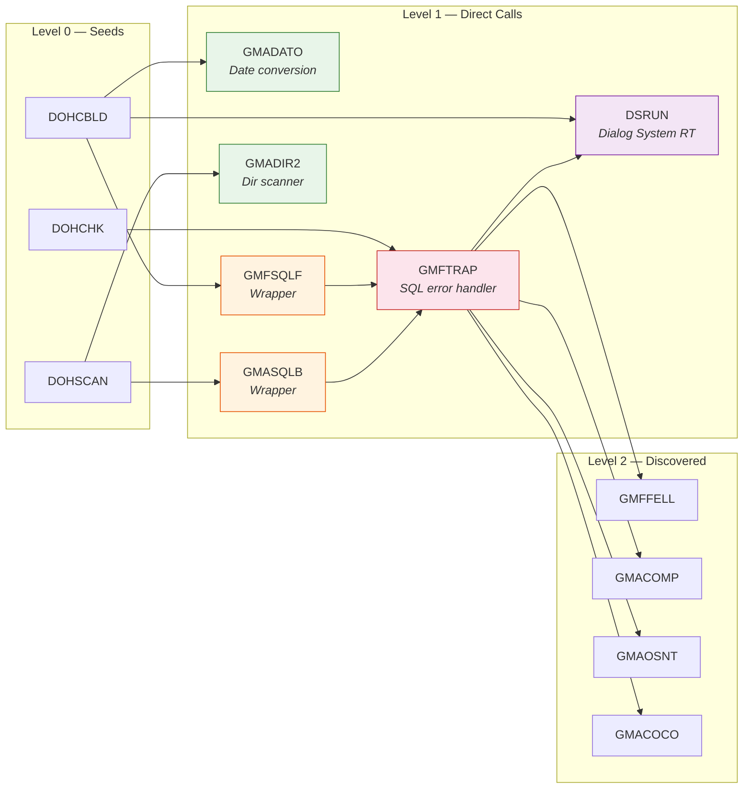
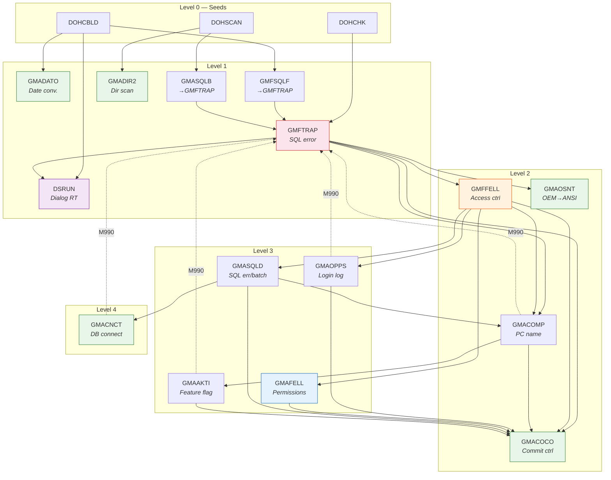

# CobDok Source Analysis — Seed Programs

Analysis of the three COBOL programs that form the CobDok documentation system.
All three connect to the `COBDOK` DB2 database and operate on tables in the `DBM` schema.

---

## DOHCBLD — Program Documentation Viewer

**Purpose**: Interactive viewer for program documentation stored in the COBDOK database. Displays systems, subsystems, modules, call structures, copysets, and SQL tables using Dialog System screens.

**Source**: `C:\opt\data\VisualCobol\Sources\cbl\DOHCBLD.CBL`

### Programs Called

| Program | How Called | Purpose |
|---------|-----------|---------|
| `CBL_EXIT_PROC` | `CALL 'CBL_EXIT_PROC'` | MF runtime: register exit handler |
| `CBL_TOUPPER` | `CALL 'CBL_TOUPPER'` | MF runtime: uppercase conversion |
| `GMADATO` | `CALL 'GMADATO'` | Date conversion utility (8-digit to 6-digit) |
| `GMFSQLF` | `CALL 'GMFSQLF'` | SQL error handler (formats SQLCA) |
| `DSRUN` | `CALL WW-DS` (variable = `'DSRUN'`) | Dialog System screen driver |
| `DB2API` | `CALL DB2API 'SQLGSTAR'` / `'SQLGINTR'` | DB2 call-convention 74 (not a real program) |
| `X'91'` | `CALL X'91'` | MF runtime: execute OS command (open Notepad) |
| `GEADSFE` | Commented out: `*CALL 'GEADSFE'` | Was: Dialog System error handler |

### SQL Tables

| Table | Operations | Usage |
|-------|-----------|-------|
| `DBM.SYSTEM` | SELECT | System overview (name, module count, line count) |
| `DBM.DELSYSTEM` | SELECT | Subsystem listing per system |
| `DBM.MODUL` | SELECT (many cursors) | Module details — name, description, SQL usage, date, lines, filename |
| `DBM.MODKOM` | SELECT | Module comments (documentation text lines) |
| `DBM.CALL` | SELECT (subquery) | Call relationships — who calls whom |
| `DBM.COPY` | SELECT | Copyset usage per module |
| `DBM.COPYSET` | SELECT | Copyset details — type, date, filename |
| `DBM.SQLXTAB` | SELECT | SQL table cross-reference — which module uses which table |
| `DBM.SQLLINJER` | SELECT | Actual SQL text stored per module |
| `DBM.TILTP_LOG` | SELECT (subquery + cursor) | Production deployment log — who deployed when |
| `DBM.COBDOK_MENY` | SELECT (LEFT JOIN) | Menu function descriptions for modules |

14 declared cursors for navigating various views. Purely a **read-only** reporting program.

### Declared Cursors

| Cursor | Tables Joined | Purpose |
|--------|--------------|---------|
| `SYSTEM_CUR` | SYSTEM | List all systems |
| `DELSYS_CUR` | DELSYSTEM | Subsystems for selected system |
| `START_CUR` | MODUL, COBDOK_MENY, TILTP_LOG | Module list with menu text and last deployer |
| `KALLES_IKKE_CUR` | MODUL, CALL, DELSYSTEM, TILTP_LOG | Modules never called by another module |
| `KALL_FRA_CUR` | MODUL, CALL, COBDOK_MENY, TILTP_LOG | Who calls a given module |
| `MODUL_CUR` | MODUL, CALL, COBDOK_MENY, TILTP_LOG | Modules called by a given module |
| `BRUKER_CPY_CUR` | COPY | Copysets used by a module |
| `MODUL_DET_CUR` | MODKOM | Module documentation lines |
| `COPY_TYPE_CUR` | COPYSET | Copyset types with counts |
| `COPY_CUR` | COPYSET | Copysets of a given type |
| `CURBC` | COPY, MODUL | Modules using a given copyset |
| `TAB_OVERSIKT_CUR` | SQLXTAB | Table overview with operation counts |
| `MODUL_TAB_CUR` | SQLXTAB | Tables used by a specific module |
| `TABMOD_CUR` | SQLXTAB, MODUL, COBDOK_MENY, TILTP_LOG | Modules using a specific table |
| `TILTP_CUR` | TILTP_LOG | Deployment history for a module |
| `NYLIG_PROD_CUR` | TILTP_LOG | Recently deployed modules |

---

## DOHCHK — SQL Error Handling Checker

**Purpose**: Batch program that scans stored COBOL source lines in the COBDOK database, looking for programs with incorrect or missing SQL error handling (SQLCA checks, WHENEVER statements, TRAP paragraphs). Outputs a CSV report and writes findings to `DBM.DOHCHK`.

**Source**: `C:\opt\data\VisualCobol\Sources\cbl\DOHCHK.CBL`

### Programs Called

| Program | How Called | Purpose |
|---------|-----------|---------|
| `CBL_EXIT_PROC` | `CALL 'CBL_EXIT_PROC'` | MF runtime: register exit handler |
| `CBL_TOUPPER` | `CALL 'CBL_TOUPPER'` | MF runtime: uppercase conversion |
| `GMFTRAP` | `CALL 'GMFTRAP'` | SQL trap/error handler |
| `DB2API` | `CALL DB2API 'SQLGINTR'` | DB2 call-convention 74 |
| `X'91'` | `CALL X'91'` | MF runtime: open CSV file |

### SQL Tables

| Table | Operations | Usage |
|-------|-----------|-------|
| `DBM.MODUL_LINJER` | SELECT | Stored source code lines — scanned for error patterns |
| `DBM.MODUL` | SELECT (join) | Module metadata (SQL usage flag, module type) |
| `DBM.TILTP_LOG` | SELECT (CTE) | Who last deployed each module |
| `DBM.CALL` | SELECT (CTE subquery) | Programs that are called (to detect orphans) |
| `DBM.COBDOK_MENY` | SELECT (CTE subquery) | Menu functions (to detect active programs) |
| `DBM.B_PROGRAMMER` | SELECT (CTE subquery) | Business programs list |
| `DBM.FEILHANDTERT` | SELECT (LEFT JOIN) | Known handled errors (suppressions) |
| `DBM.DOHCHK` | DELETE, INSERT | Output table — stores findings |

### Declared Cursors

| Cursor | Tables Joined | Purpose |
|--------|--------------|---------|
| `HOVED_CUR` | MODUL_LINJER, MODUL, TILTP_LOG (CTE), FEILHANDTERT, CALL (CTE), COBDOK_MENY (CTE), B_PROGRAMMER (CTE) | Main analysis cursor — scans source lines using `POSSTR()` pattern matching |
| `PROD_CUR` | TILTP_LOG (CTE aggregation) | Who deployed a module most often |

### Analysis Logic

The `HOVED_CUR` uses two CTEs:

- **TEMP_TILTP**: Latest deployer per program with date
- **TEMP_KALLES**: Union of programs from `DBM.CALL`, `DBM.COBDOK_MENY`, and `DBM.B_PROGRAMMER` — used to detect "UTGATT" (deprecated) modules

The cursor fetches source lines with `POSSTR()` checks for: `SQLKODE-FEIL`, `SQLCA`, `IF`, `MOVE`, `M9`, `TRAP`, `INITIALIZE`, `CALL`, `END-CALL`, `WHENEVER`, `SQLERROR`, `SQLWARNING`, `GO`, `TO`, `VMODUL-TRAP`, `PERFORM`, `.`

Detected errors:
1. Missing test or move of `SQLKODE-SQLCA` after SQL call
2. Missing PERFORM of TRAP module in M990 paragraph
3. Missing `WHENEVER SQLERROR` statement

---

## DOHSCAN — COBOL Source Scanner & DB Loader

**Purpose**: The core scanner. Reads COBOL source files from disk using `GMADIR2` directory listing, parses them for `COPY` statements, `CALL` statements, and embedded SQL, then loads all findings into the COBDOK database. This is the program that **populates** the database that DOHCBLD reads.

**Source**: `C:\opt\data\VisualCobol\Sources\cbl\DOHSCAN.CBL`

### Programs Called

| Program | How Called | Purpose |
|---------|-----------|---------|
| `CBL_TOUPPER` | `CALL 'CBL_TOUPPER'` (9 times) | MF runtime: uppercase all parsed text |
| `GMADIR2` | `CALL 'GMADIR2'` | Directory listing utility — iterates source files |
| `GMASQLB` | `CALL 'GMASQLB'` | SQL error handler |
| `DB2API` | `CALL DB2API "SQLGISIG"` | DB2 call-convention 74 |

### SQL Tables

| Table | Operations | Usage |
|-------|-----------|-------|
| `DBM.MODUL` | INSERT, UPDATE, SELECT | Insert/update scanned module metadata |
| `DBM.MODKOM` | INSERT | Store module documentation comment lines |
| `DBM.CALL` | INSERT, DELETE | Store discovered CALL relationships |
| `DBM.COPY` | INSERT, DELETE | Store discovered COPY references |
| `DBM.COPYSET` | INSERT, UPDATE, DELETE | Store/update copyset metadata |
| `DBM.SQLLINJER` | INSERT, DELETE | Store extracted SQL statement text |
| `DBM.SQLXTAB` | INSERT, DELETE | Store SQL table cross-references (table + operation + module) |
| `DBM.MODUL_LINJER` | DELETE (test mode) | Raw source lines (written via LOAD file, not SQL INSERT) |
| `DBM.SYSTEM` | UPDATE | Update system totals (module count, lines, last modified) |
| `DBM.TABCREATOR` | SELECT | Valid schema owners for validating `owner.table` references |

### Declared Cursors

| Cursor | Tables | Purpose |
|--------|--------|---------|
| `CREATOR_CUR` | TABCREATOR | Load valid table owners at startup |

### Parsing Logic

For each `.CBL`, `.DCL`, `.CPB`, `.CPY` file found by `GMADIR2`:

1. **Module registration**: Insert into `DBM.MODUL` with filename, date, size
2. **Comment extraction**: Lines starting with `*|` or `*Ø` → stored in `DBM.MODKOM`
3. **COPY detection**: `INSPECT ... TALLYING ... FOR ALL ' COPY '` → stored in `DBM.COPY`
4. **CALL detection**: `INSPECT ... TALLYING ... FOR ALL ' CALL '` → stored in `DBM.CALL` (filters out `CBL_`, `API`, `X'`, `PC_` prefixes)
5. **SQL extraction**: Tracks `EXEC SQL` / `END-EXEC` blocks, classifies as S/I/U/D (Select/Insert/Update/Delete), stores full SQL text in `DBM.SQLLINJER`
6. **Table detection**: Finds `owner.table` patterns in SQL, validates owner against `DBM.TABCREATOR`, stores in `DBM.SQLXTAB`
7. **Dynamic SQL**: Detects `PREPARE` statements and scans for table references outside `EXEC SQL` blocks
8. **Source lines**: Writes raw source to a LOAD file for bulk load into `DBM.MODUL_LINJER`
9. **System update**: Aggregates totals into `DBM.SYSTEM`

In test mode (`W-TEST <> SPACE`), all 8 data tables are deleted before re-population.

---

## Relationship Between Programs



- **DOHSCAN** is the ETL — scans `.CBL`/`.CPY`/`.DCL` files and loads the COBDOK database
- **DOHCBLD** is the UI — interactive Dialog System screen for browsing documentation
- **DOHCHK** is the QA tool — analyzes stored source lines for SQL error handling defects

---

## Complete SQL Table Cross-Reference

| Table | DOHSCAN | DOHCBLD | DOHCHK |
|-------|---------|---------|--------|
| `DBM.SYSTEM` | UPDATE | SELECT | — |
| `DBM.DELSYSTEM` | — | SELECT | — |
| `DBM.MODUL` | INSERT, UPDATE, SELECT | SELECT | SELECT |
| `DBM.MODKOM` | INSERT | SELECT | — |
| `DBM.CALL` | INSERT, DELETE | SELECT | SELECT |
| `DBM.COPY` | INSERT, DELETE | SELECT | — |
| `DBM.COPYSET` | INSERT, UPDATE, DELETE | SELECT | — |
| `DBM.SQLLINJER` | INSERT, DELETE | SELECT | — |
| `DBM.SQLXTAB` | INSERT, DELETE | SELECT | — |
| `DBM.MODUL_LINJER` | DELETE | — | SELECT |
| `DBM.TILTP_LOG` | — | SELECT | SELECT |
| `DBM.COBDOK_MENY` | — | SELECT | SELECT |
| `DBM.B_PROGRAMMER` | — | — | SELECT |
| `DBM.FEILHANDTERT` | — | — | SELECT |
| `DBM.DOHCHK` | — | — | DELETE, INSERT |
| `DBM.TABCREATOR` | SELECT | — | — |

**16 unique tables** across the three programs. DOHSCAN writes to 10, DOHCBLD reads from 11, DOHCHK reads from 7 and writes to 1.

---

## Copy Elements (DCL files for SQL host variables)

All three programs share several DCL copybooks for DB2 host variable declarations:

| Copybook | Used By | Defines Host Variables For |
|----------|---------|---------------------------|
| `DOKSYS.DCL` | DOHCBLD, DOHSCAN | `DBM.SYSTEM` |
| `DOKDSYS.DCL` | DOHCBLD, DOHSCAN | `DBM.DELSYSTEM` |
| `DOKMOD.DCL` | DOHCBLD, DOHSCAN | `DBM.MODUL` |
| `DOKMKOM.DCL` | DOHCBLD, DOHSCAN | `DBM.MODKOM` |
| `DOKCALL.DCL` | DOHCBLD, DOHSCAN | `DBM.CALL` |
| `DOKCOPY.DCL` | DOHCBLD, DOHSCAN | `DBM.COPY` |
| `DOKCPY.DCL` | DOHCBLD, DOHSCAN | `DBM.COPYSET` |
| `SQLLIN.DCL` | DOHCBLD, DOHSCAN | `DBM.SQLLINJER` |
| `SQLXTAB.DCL` | DOHCBLD, DOHSCAN | `DBM.SQLXTAB` |
| `TITP.DCL` | DOHCBLD | `DBM.TILTP_LOG` |
| `DOHC.DCL` | DOHCHK | `DBM.DOHCHK` |
| `CBLD.CPB` | DOHCBLD | Dialog System data block |
| `DS-CNTRL.MF` | DOHCBLD | Dialog System control block |
| `DEFCPY.CPY` | All three | Common SQL error definitions (`SQLKODE-FEIL`) |
| `GMADATO.CPY` | DOHCBLD | Date conversion parameters |
| `GMADIR.CPY` | DOHSCAN | Directory listing parameters |
| `DSSYSINF.CPY` | DOHCBLD | Dialog System info block |

---

---

## Call Level 1 — Programs Directly Called by Seeds

The three seed programs (DOHCBLD, DOHCHK, DOHSCAN) call a combined set of programs.
Excluding Micro Focus runtime calls (`CBL_*`, `X'91'`) and DB2 call-convention directives (`DB2API`),
the unique **application-level** call targets at level 1 are:

| # | Program | Called By | Source Found | Category |
|---|---------|-----------|:---:|----------|
| 1 | `GMADATO` | DOHCBLD | Yes | Utility — date conversion |
| 2 | `GMFSQLF` | DOHCBLD | Yes | Wrapper → GMFTRAP |
| 3 | `DSRUN` | DOHCBLD | No | MF Dialog System runtime |
| 4 | `GMFTRAP` | DOHCHK | Yes | SQL error handler (central) |
| 5 | `GMADIR2` | DOHSCAN | Yes | Utility — directory scanner |
| 6 | `GMASQLB` | DOHSCAN | Yes | Wrapper → GMFTRAP |
| 7 | `GEADSFE` | DOHCBLD (commented out) | No | Inactive — not in source tree |

---

### 1. GMADATO — Date Conversion Utility

**Source**: `C:\opt\data\VisualCobol\Sources\cbl\gmadato.cbl`
**Called by**: DOHCBLD
**Author**: SVI (04.05.1998)

**Purpose**: Converts dates between 6-digit (`DDMMYY`) and 8-digit (`CCYYMMDD`) formats, with leap year validation.

**Interface** (LINKAGE SECTION):

| Parameter | PIC | Direction |
|-----------|-----|-----------|
| `WL-KODE` | `99` | IN: 68 = 6→8, 86 = 8→6. OUT: 0 = OK, 88 = invalid, 99 = bad code |
| `DATO-6` | `9(6)` | IN/OUT: 6-digit date (DDMMYY) |
| `DATO-8` | `9(8)` | IN/OUT: 8-digit date (CCYYMMDD) |

**Logic**:
- Code 68 (6→8): Validates month (1–12), day (1–max for month), checks leap year. Century rule: YY > 50 → 19xx, else → 20xx.
- Code 86 (8→6): Simple extraction of YY, MM, DD from CCYYMMDD.
- Leap year: `DIVIDE YY BY 4 GIVING QUOTIENT REMAINDER` — if remainder = 0, February = 29 days.

| Programs Called | SQL Tables | Copy Elements |
|:---:|:---:|:---:|
| None | None | None |

**Call Level 2 expansion**: None — leaf program.

---

### 2. GMFSQLF — SQL Error Handler Wrapper

**Source**: `C:\opt\data\VisualCobol\Sources\cbl\GMFSQLF.CBL`
**Called by**: DOHCBLD
**Author**: ROA (20.04.2021)

**Purpose**: Thin wrapper that delegates directly to `GMFTRAP`. Exists so callers that historically used `GMFSQLF` don't need to be recompiled.

**Interface** (LINKAGE SECTION): Same `SQLKODE-FEIL` block as GMFTRAP.

**Entire procedure division**:
```cobol
M000-HOVED.
    CALL 'GMFTRAP' USING SQLKODE-FEIL
    GOBACK.
```

| Programs Called | SQL Tables | Copy Elements |
|:---:|:---:|:---:|
| **GMFTRAP** | None (delegated) | None |

**Call Level 2 expansion**: GMFTRAP (see #4 below).

---

### 3. DSRUN — Dialog System Screen Driver

**Source**: Not found in `C:\opt\data\VisualCobol\Sources\`
**Called by**: DOHCBLD (directly), GMFTRAP (for error dialog)

**Purpose**: Micro Focus Dialog System runtime. Drives screen-set presentation and interaction. Not a custom application program — ships as part of the Visual COBOL runtime.

**Call Level 2 expansion**: N/A — external runtime component.

---

### 4. GMFTRAP — Central SQL Error Handler

**Source**: `C:\opt\data\VisualCobol\Sources\cbl\GMFTRAP.CBL`
**Called by**: DOHCHK (directly), GMFSQLF (wrapper), GMASQLB (wrapper)
**Author**: ROA (original 16.09.2008, last modified 13.12.2023)

**Purpose**: Comprehensive SQL error handler for the entire Dedge system. Formats error messages, logs to `DBM.SQLFEIL`, displays Dialog System error screen (for F/H modules), performs ROLLBACK or STOP RUN depending on error code. Handles special cases like -818 (timestamp mismatch) and -911 (deadlock/timeout).

**Interface** (LINKAGE SECTION):

| Field | PIC | Purpose |
|-------|-----|---------|
| `SQLKODE-KODE` | `99` | 00 = ROLLBACK + STOP RUN, 01 = ROLLBACK + GOBACK, other = GOBACK only |
| `SQLKODE-PROGRAM` | `X(10)` | Calling program name |
| `SQLKODE-PARAGRAF` | `X(30)` | Failing paragraph |
| `SQLKODE-MELDING` | `X(214)` | Error message text |
| `SQLKODE-SQLCA` | `X(255)` | Raw SQLCA from caller |

**Programs Called**:

| Program | How Called | Purpose |
|---------|-----------|---------|
| `CBL_TOUPPER` | `CALL 'CBL_TOUPPER'` | MF runtime: uppercase input fields |
| `SQLGINTP` | `CALL CC1 'SQLGINTP'` | DB2 API: format SQLCA message buffer |
| `GMFFELL` | `CALL 'GMFFELL'` | Timeout check utility |
| `GMACOMP` | `CALL 'GMACOMP'` | Computer name lookup (avoids recursive call) |
| `GMAOSNT` | `CALL 'GMAOSNT'` (×11) | OEM-to-ANSI string converter for log output |
| `GMACOCO` | `CALL 'GMACOCO'` | COMMIT/ROLLBACK coordinator |
| `DSRUN` | `CALL 'DSRUN'` (×2) | Dialog System: display error screen + quit |

**SQL Tables**:

| Table | Operations | Usage |
|-------|-----------|-------|
| `DBM.SQLFEIL` | INSERT | Log error details (timestamp, db, client, user, sqlcode, program, paragraph, message, buffer) |
| `DBM.SQLFEIL` | SELECT (cursor `FEIL_CUR`) | Find related recent errors from same program (within 10 seconds) |
| `DBM.Z_AVDTAB` | SELECT | Look up department name and flag (Optima/Avdsys) for error display |

**SQL Operations**: `ROLLBACK`, `COMMIT`, `CONNECT`, `CONNECT RESET`

**Copy Elements**: `DS-CNTRL.MF`, `GMFTRAP.CPB`, `GMACOMP.CPY`, `REQFELL.CPY`, `GMAOSNT.CPY`, `AVD.DCL`, `SQLF.DCL`, `SQLCA`

**Error Handling Logic**:

| Module Type | Behavior |
|-------------|----------|
| A-modul (Application) | Log error only, return to caller |
| S-modul (Service) | Log error only, return to caller |
| F-modul (Front-end) | Log + show Dialog System screen; code 01 → ROLLBACK + GOBACK, else → STOP RUN |
| H-modul (Help/Handler) | Same as F-modul |
| B-modul (Batch) | Log + write `.LOG` file; code 00 → ROLLBACK + STOP RUN, 01 → ROLLBACK + EXIT, other → EXIT |

**Special Cases**:
- `-818` (timestamp mismatch): Forces code 00 (STOP RUN) unless B-modul or A-modul
- `-911` (deadlock/timeout): Appends reason code (68=Timeout, 02/2=Deadlock) to message, changes screen color

**Call Level 2 expansion**: `GMFFELL`, `GMACOMP`, `GMAOSNT`, `GMACOCO` (all exist in source tree).

---

### 5. GMADIR2 — Directory Scanner

**Source**: `C:\opt\data\VisualCobol\Sources\cbl\GMADIR2.cbl`
**Called by**: DOHSCAN
**Author**: TRU (21.11.2018)

**Purpose**: Wraps Micro Focus `CBL_DIR_SCAN_*` API into a simple START/NESTE/SLUTT interface. Iterates files in a directory, returning filename, size, date, and time for each file.

**Interface** (LINKAGE SECTION via `GMADIR.CPY`):

| Field | Purpose |
|-------|---------|
| `DIR-FUNK` | `'START'` = open directory, `'NESTE'` = next file, `'SLUTT'` = close |
| `DIR-STATUS` | `'OK'` = success, `'EOF'` = no more files, `'FEIL'` = error |
| `DIR-KOMMANDO` | Directory path with wildcard (e.g. `C:\SRC\*.CBL`) |
| `DIR-FILENAVN` | Returned: filename only |
| `DIR-FILENAVN-MP` | Returned: full path + filename |
| `DIR-FN-1` / `DIR-FN-2` | Returned: name before/after `.` |
| `DIR-LENGDE` | Returned: file size in bytes |
| `DIR-DATO-*` | Returned: file date (YYYYMMDD) |
| `DIR-KL-*` | Returned: file time (HHMMSS) |

**Programs Called**:

| Program | Purpose |
|---------|---------|
| `CBL_TOUPPER` | MF runtime: uppercase the directory command |
| `CBL_DIR_SCAN_START` | MF runtime: open directory scan |
| `CBL_DIR_SCAN_READ` | MF runtime: read next directory entry |
| `CBL_DIR_SCAN_END` | MF runtime: close directory scan |

| SQL Tables | Copy Elements |
|:---:|:---:|
| None | `GMADIR.CPY` |

**Call Level 2 expansion**: None — all calls are Micro Focus runtime. Leaf program.

---

### 6. GMASQLB — SQL Error Handler Wrapper (Batch)

**Source**: `C:\opt\data\VisualCobol\Sources\cbl\GMASQLB.CBL`
**Called by**: DOHSCAN
**Author**: ROA (20.04.2021)

**Purpose**: Identical thin wrapper to GMFSQLF. Delegates directly to `GMFTRAP`. Exists as a separate entry point so batch programs can distinguish their error handler name.

**Entire procedure division**:
```cobol
M000-HOVED.
    CALL 'GMFTRAP' USING SQLKODE-FEIL
    GOBACK.
```

| Programs Called | SQL Tables | Copy Elements |
|:---:|:---:|:---:|
| **GMFTRAP** | None (delegated) | None |

**Call Level 2 expansion**: GMFTRAP (see #4 above).

---

### 7. GEADSFE — Dialog System Error Handler (Inactive)

**Source**: Not found in `C:\opt\data\VisualCobol\Sources\`
**Called by**: DOHCBLD (commented out with `*CALL 'GEADSFE'`)

Appears to have been replaced by the GMFTRAP/GMFSQLF chain. No longer part of the active call tree.

---

## Call Level 1 Summary

### Call Tree (Level 0 → Level 1 → Level 2 targets)



### New SQL Tables Discovered at Level 1

| Table | Program | Operations |
|-------|---------|-----------|
| `DBM.SQLFEIL` | GMFTRAP | INSERT, SELECT |
| `DBM.Z_AVDTAB` | GMFTRAP | SELECT |

These 2 tables were **not** referenced by the 3 seed programs. Total unique tables is now **18** (16 from seeds + 2 from GMFTRAP).

### New Programs Discovered for Level 2

| Program | Called By | Source Exists |
|---------|-----------|:---:|
| `GMFFELL` | GMFTRAP | Yes |
| `GMACOMP` | GMFTRAP | Yes |
| `GMAOSNT` | GMFTRAP | Yes |
| `GMACOCO` | GMFTRAP | Yes |

All 4 call level 2 targets exist in the source tree and will be analyzed in the next level expansion.

### Call Level 1 Statistics

| Metric | Count |
|--------|------:|
| Unique application programs at Level 1 | 6 (+ 1 inactive) |
| Source files found | 5 of 6 |
| Leaf programs (no further calls) | 3 (GMADATO, GMADIR2, DSRUN) |
| Wrappers (delegate to GMFTRAP) | 2 (GMFSQLF, GMASQLB) |
| Programs with SQL | 1 (GMFTRAP) |
| New SQL tables discovered | 2 (SQLFEIL, Z_AVDTAB) |
| New call targets for Level 2 | 4 (GMFFELL, GMACOMP, GMAOSNT, GMACOCO) |

---

---

## Call Level 2 — Programs Called by Level 1

Level 1 program **GMFTRAP** introduced 4 new call targets. Two are leaf programs, two expand the tree significantly.

| # | Program | Called By | Source Found | Category |
|---|---------|-----------|:---:|----------|
| 1 | `GMFFELL` | GMFTRAP | Yes | Access control & timeout checker |
| 2 | `GMACOMP` | GMFTRAP | Yes | Computer name resolver |
| 3 | `GMAOSNT` | GMFTRAP | Yes | OEM→ANSI character converter (leaf) |
| 4 | `GMACOCO` | GMFTRAP | Yes | COMMIT/ROLLBACK tracker (leaf) |

---

### L2-1. GMFFELL — Access Control & Timeout Checker

**Source**: `C:\opt\data\VisualCobol\Sources\cbl\GMFFELL.CBL`
**Called by**: GMFTRAP
**Authors**: RHE (11.09.1995), AKA, TRU, ROA (last 09.12.2020)

**Purpose**: Central access control module for the Dedge system. On first call, establishes DB2 connection, reads user credentials from `DBM.TILGBRUKER`, loads access rights via `GMAFELL`, and checks timeouts. Handles department switching, favorites, and permission lookups. Conditionally calls `GMAOPPS` for login logging.

**Interface** (LINKAGE via `REQFELL.CPY`): Request block with command codes for timeout check, access check, department switch, favorites, etc.

**Programs Called**:

| Program | Purpose |
|---------|---------|
| `GMAOPPS` | Login event logger — **NEW Level 3** |
| `GMAFELL` | Permission/menu data loader — **NEW Level 3** |
| `GMACOMP` | Computer name resolver (already Level 2) |
| `GMASQLD` | SQL error display (non-DS variant) — **NEW Level 3** |
| `GMACOCO` | COMMIT/ROLLBACK tracker (already Level 2) |
| `CBL_GET_OS_INFO` | MF runtime |

**SQL Tables**:

| Table | Operations |
|-------|-----------|
| `DBM.TILGBRUKER` | SELECT — read user credentials, department, transport mode |

**Copy Elements**: `DEFCPY.CPY`, `GMFFELL.CPB`, `DS-CNTRL.MF`, `DSSYSINF.CPY`, `GMACNCT.CPY`, `REQFELL.CPY`, `FELLMENY.CPY`, `GMAFELL.CPY`, `GMACOMP.CPY`, `DEFMNY.CPY`, `USR.CPY`, `TBRU.DCL`

**Request Commands**: `78-SJEKK-TIMEOUT`, `78-SJEKK-TIMEOUT-UL`, `78-SJEKK-TILGANG`, `78-SKRIV-TILGANG`, `78-AVBRYT-SYSTEMET`, `78-UPD-MASKINNAVN`, `78-BYTT-REQ-AVD-LOKAL`, `78-BYTT-REQ-AVD-SENTRAL`, `78-FAVORITTER`, `78-BYTT-ILAGNR`

---

### L2-2. GMACOMP — Computer Name Resolver

**Source**: `C:\opt\data\VisualCobol\Sources\cbl\GMACOMP.CBL`
**Called by**: GMFTRAP, GMFFELL
**Authors**: TRU (10.03.2003), ROA (last 07.09.2020)

**Purpose**: Determines the actual client machine name in terminal server environments. Checks environment variables (`Dedge2_PRINT`, `CLIENTNAME`, `COMPUTERNAME`) to resolve the true workstation identity. Handles thin-client, NFUSE/WTS, and local scenarios. If the resolved name starts with `GMACOMP` (error state), calls `GMAAKTI` to check if error logging is activated, then logs to `DBM.SQLFEIL`.

**Programs Called**:

| Program | Purpose |
|---------|---------|
| `CBL_TOUPPER` | MF runtime |
| `GMAAKTI` | Feature activation checker — **NEW Level 3** |
| `GMACOCO` | COMMIT/ROLLBACK tracker (already Level 2) |
| `GMFTRAP` | SQL error handler (already Level 1, in M990-SQL-TRAP) |

**SQL Tables**:

| Table | Operations |
|-------|-----------|
| `DBM.TILGBRUKER` | SELECT — read `NETADRESSE` for thin-client fallback |
| `DBM.SQLFEIL` | INSERT — log machine name resolution errors |

**Copy Elements**: `GMAAKTI.CPY`, `GMACOMP.CPY`, `TBRU.DCL`, `SQLF.DCL`

---

### L2-3. GMAOSNT — OEM-to-ANSI Character Converter

**Source**: `C:\opt\data\VisualCobol\Sources\cbl\GMAOSNT.CBL`
**Called by**: GMFTRAP (×11 times)
**Author**: RHE (26.08.1998)

**Purpose**: Converts Norwegian special characters from OEM code page to Windows NT ANSI encoding. Replaces hex values for Æ, Ø, Å, æ, ø, å, and the paragraph sign (§).

**Character Mapping**:
| Char | OEM (hex) | ANSI (hex) |
|------|-----------|------------|
| Æ | C6 | 92 |
| Ø | D8 | 9D |
| Å | C5 | 8F |
| æ | E6 | 91 |
| ø | F8 | 9B |
| å | E5 | 86 |
| § | A7 | F5 |

| Programs Called | SQL Tables | Copy Elements |
|:---:|:---:|:---:|
| `CBL_GET_OS_INFO` (runtime) | None | `GMAOSNT.CPY` |

**Leaf program** — no further expansion.

---

### L2-4. GMACOCO — COMMIT/ROLLBACK Control Tracker

**Source**: `C:\opt\data\VisualCobol\Sources\cbl\GMACOCO.CBL`
**Called by**: GMFTRAP, GMFFELL, GMACOMP, GMAOPPS, GMAFELL, GMASQLD (ubiquitous)
**Authors**: TRU (original), ROA

**Purpose**: Tracks SQL DML operations to determine whether a COMMIT is needed before returning control. Called before every `EXEC SQL` with the SQL verb as parameter. Maintains counters for SELECT, UPDATE, DELETE, INSERT, PREPARE, OPEN, CLOSE. When asked `'COMMIT?'`, returns `'JA'` if any write operations occurred, `'NEI'` otherwise. On `'COMMIT'` or `'ROLLBACK'`, resets all counters.

**Interface**: Single `PIC X(15)` parameter — the SQL verb or query command.

**Tracked Operations**: `SELECT`, `UPDATE`, `DELETE`, `INSERT`, `PREPARE`, `OPEN`, `CLOSE`, `COMMIT`, `ROLLBACK`, `CONNECT`, `CONNECT RESET`, `DECLARE`, `FETCH`

| Programs Called | SQL Tables |
|:---:|:---:|
| None | None |

**Leaf program** — no further expansion.

---

### Call Level 2 Summary

| Metric | Count |
|--------|------:|
| Programs analyzed | 4 |
| Leaf programs | 2 (GMAOSNT, GMACOCO) |
| New SQL tables | 1 (TILGBRUKER) |
| Running total tables | 19 |
| New programs for Level 3 | 4 (GMAOPPS, GMAFELL, GMASQLD, GMAAKTI) |

---

## Call Level 3 — Programs Called by Level 2

Level 2 programs GMFFELL and GMACOMP introduced 4 new programs.

| # | Program | Called By | Source Found | Category |
|---|---------|-----------|:---:|----------|
| 1 | `GMAOPPS` | GMFFELL | Yes | User login event logger |
| 2 | `GMAFELL` | GMFFELL | Yes | Permission/menu data loader |
| 3 | `GMASQLD` | GMFFELL | Yes | SQL error display (non-DS) |
| 4 | `GMAAKTI` | GMACOMP | Yes | Feature activation checker |

---

### L3-1. GMAOPPS — User Login Event Logger

**Source**: `C:\opt\data\VisualCobol\Sources\cbl\GMAOPPS.CBL`
**Called by**: GMFFELL
**Author**: ROA (31.08.2020)

**Purpose**: Logs each user login to `DBM.OPPSTART`. Captures CLIENT, SERVER, and Dedge2 environment variables. Looks up user's full name from `DBM.TILGBRUKER` and phone/mobile from `DBM.AD_BRUKER`.

**Programs Called**:

| Program | Purpose |
|---------|---------|
| `GMACOCO` | COMMIT/ROLLBACK tracker (already Level 2) |
| `GMFTRAP` | SQL error handler (already Level 1, in M990-SQL-TRAP) |

**SQL Tables**:

| Table | Operations | Notes |
|-------|-----------|-------|
| `DBM.TILGBRUKER` | SELECT | User name lookup (already known) |
| `DBM.AD_BRUKER` | SELECT | **NEW** — Active Directory user details (phone, mobile) |
| `DBM.OPPSTART` | INSERT | **NEW** — Login event log |

**Copy Elements**: `ADB.DCL`, `TBRU.DCL`, `OPPS.DCL`, `REQFELL.CPY`, `DEFCPY.CPY`

**New programs for Level 4**: None — all calls are to already-analyzed programs.

---

### L3-2. GMAFELL — Permission & Menu Data Loader

**Source**: `C:\opt\data\VisualCobol\Sources\cbl\GMAFELL.CBL`
**Called by**: GMFFELL
**Authors**: RHE (21.06.2000), TRU, ROA

**Purpose**: The core authorization module. Fetches user access rights by joining 7+ tables through the `RETTIG_CUR` cursor — a triple-UNION query that combines "most used functions" (via `TILGANALYSE`/`TILGFAV_KRITERIER`), F-module menu entries, and full function lists. Also loads menu headings via `MENY_CUR`. Returns a sorted table of functions with access levels and menu text.

**Programs Called**:

| Program | Purpose |
|---------|---------|
| `GMACOCO` | COMMIT/ROLLBACK tracker (already Level 2) |

**SQL Tables** — the most table-rich program in the entire call tree:

| Table | Operations | Notes |
|-------|-----------|-------|
| `DBM.TILGPROF_FUNK` | SELECT | **NEW** — Profile-to-function mapping |
| `DBM.TILGBRUK_GRP_PROF` | SELECT | **NEW** — User-group-profile assignment |
| `DBM.TILGBRUKER` | SELECT | User details (already known) |
| `DBM.TILGGRP_AVD` | SELECT | **NEW** — Group-to-department mapping |
| `DBM.Z_AVDTAB` | SELECT | Department table (already known) |
| `DBM.TILGFUNKSJON` | SELECT | **NEW** — Function/menu definitions |
| `DBM.TILGMENY` | SELECT (join + separate cursor) | **NEW** — Menu text and headings |
| `DBM.TILGANALYSE` | SELECT (EXISTS subquery) | **NEW** — Usage analytics per user |
| `DBM.TILGFAV_KRITERIER` | SELECT (EXISTS subquery) | **NEW** — Favorite thresholds |
| `DBM.TILGFAVORITTER` | SELECT | **NEW** — Per-user favorite settings |

**Declared Cursors**:

| Cursor | Tables Joined | Purpose |
|--------|--------------|---------|
| `RETTIG_CUR` | TILGPROF_FUNK, TILGBRUK_GRP_PROF, TILGBRUKER, TILGGRP_AVD, Z_AVDTAB, TILGFUNKSJON, TILGMENY + subquery on TILGANALYSE, TILGFAV_KRITERIER (3×UNION) | Full permission/function set |
| `MENY_CUR` | TILGMENY | Menu heading lines |

**Copy Elements**: `GMACNCT.CPY`, `FELLMENY.CPY`, `TBRU.DCL`, `TGRP.DCL`, `TFUN.DCL`, `TPRO.DCL`, `TNIV.DCL`, `AVD.DCL`, `TMEN.DCL`, `TFV.DCL`, `DEFCPY.CPY`, `GMAFELL.CPY`

**Note**: M990-SQL-TRAP does NOT call GMFTRAP — it sets SQLKODE-SQLCA and GOBACKs, returning the error to the caller (GMFFELL).

**New programs for Level 4**: None.

---

### L3-3. GMASQLD — SQL Error Display (Non-Dialog System)

**Source**: `C:\opt\data\VisualCobol\Sources\cbl\GMASQLD.CBL`
**Called by**: GMFFELL
**Authors**: RHE (01.01.1998), TRU, ROA

**Purpose**: SQL error handler for modules that cannot use Dialog System screens. Displays error information to the console via SCREEN SECTION, performs ROLLBACK/COMMIT/STOP RUN logic identical to GMFTRAP, and logs to `DBM.SQLFEIL`. The "batch-friendly" counterpart to GMFTRAP.

**Programs Called**:

| Program | Purpose |
|---------|---------|
| `GMACNCT` | DB2 connection helper — **NEW Level 4** |
| `GMACOMP` | Computer name resolver (already Level 2) |
| `GMACOCO` | COMMIT/ROLLBACK tracker (already Level 2) |

**SQL Tables**:

| Table | Operations |
|-------|-----------|
| `DBM.SQLFEIL` | INSERT — log error (already known) |

**SQL Operations**: `ROLLBACK`, `COMMIT`

**Copy Elements**: `GMACOMP.CPY`, `GMACNCT.CPY`, `SQLF.DCL`, `DEFCPY.CPY`, `SQLCA`

**New programs for Level 4**: `GMACNCT`

---

### L3-4. GMAAKTI — Feature Activation Checker

**Source**: `C:\opt\data\VisualCobol\Sources\cbl\GMAAKTI.CBL`
**Called by**: GMACOMP
**Author**: ROA (11.06.2008)

**Purpose**: Checks if a specific program/feature is activated by querying `DBM.AKTIVISER`. Returns `'J'` (active) or `'N'` (inactive) in the `GMAAKTI-AKTIV` field. Used as a feature toggle mechanism.

**Interface** (LINKAGE via `GMAAKTI.CPY`):

| Field | Purpose |
|-------|---------|
| `GMAAKTI-PROGRAM` | Program name to check |
| `GMAAKTI-PARAM` | Parameter/feature name |
| `GMAAKTI-AKTIV` | OUT: `'J'` = active, `'N'` = inactive |

**Programs Called**:

| Program | Purpose |
|---------|---------|
| `GMACOCO` | COMMIT/ROLLBACK tracker (already Level 2) |
| `GMFTRAP` | SQL error handler (already Level 1, in M990-SQL-TRAP) |

**SQL Tables**:

| Table | Operations | Notes |
|-------|-----------|-------|
| `DBM.AKTIVISER` | SELECT | **NEW** — Feature activation flags |

**Copy Elements**: `AKTI.DCL`, `GMAAKTI.CPY`, `DEFCPY.CPY`

**New programs for Level 4**: None.

---

### Call Level 3 Summary

| Metric | Count |
|--------|------:|
| Programs analyzed | 4 |
| New SQL tables | 11 (AD_BRUKER, OPPSTART, TILGPROF_FUNK, TILGBRUK_GRP_PROF, TILGGRP_AVD, TILGFUNKSJON, TILGMENY, TILGANALYSE, TILGFAV_KRITERIER, TILGFAVORITTER, AKTIVISER) |
| Running total tables | 30 |
| New programs for Level 4 | 1 (GMACNCT) |

---

## Call Level 4 — Programs Called by Level 3

Only one new program was discovered at Level 3.

| # | Program | Called By | Source Found | Category |
|---|---------|-----------|:---:|----------|
| 1 | `GMACNCT` | GMASQLD | Yes | DB2 connection helper |

---

### L4-1. GMACNCT — DB2 Connection Helper

**Source**: `C:\opt\data\VisualCobol\Sources\cbl\GMACNCT.CBL`
**Called by**: GMASQLD
**Authors**: RHE (25.09.1998), TRU, ROA (last 17.06.2015)

**Purpose**: Performs `EXEC SQL CONNECT`, parses the `SQLERRMC` response to extract the current user ID and database name. Returns these in the `CNCT-BLOKK` structure. This is the shared "who am I connected as, and to what database" utility.

**Connection Parsing Logic**: Searches `SQLERRMC` for the `QDB2/NT` marker, then extracts the userid and database name from the preceding substring using UNSTRING.

**Programs Called**:

| Program | Purpose |
|---------|---------|
| `GMFTRAP` | SQL error handler (already Level 1, in M990-SQL-TRAP) |

**SQL Tables**: None (only `EXEC SQL CONNECT`)

**Copy Elements**: `GMACNCT.CPY`, `DEFCPY.CPY`, `SQLCA`

**New programs for Level 5**: None — only calls GMFTRAP which is already Level 1.

---

### Call Level 4 Summary

| Metric | Count |
|--------|------:|
| Programs analyzed | 1 |
| New SQL tables | 0 |
| Running total tables | 30 |
| New programs for Level 5 | 0 |

**The call tree is now fully exhausted.** No new programs were discovered beyond Level 4.

---

## Complete Call Tree — All Levels



*Dashed lines (-.->)* = M990-SQL-TRAP back-edges to GMFTRAP (error handling, not forward expansion)

---

## Final Statistics

### Programs by Level

| Level | Programs | New SQL Tables |
|:-----:|:--------:|:--------------:|
| 0 (Seeds) | 3 | 16 |
| 1 | 6 (+1 inactive) | 2 |
| 2 | 4 | 1 |
| 3 | 4 | 11 |
| 4 | 1 | 0 |
| **Total** | **18 (+1 inactive)** | **30** |

### Complete SQL Table Registry (30 tables)

| # | Table | First Seen | Operations |
|---|-------|:----------:|------------|
| 1 | `DBM.SYSTEM` | L0 DOHSCAN | UPDATE, SELECT |
| 2 | `DBM.DELSYSTEM` | L0 DOHCBLD | SELECT |
| 3 | `DBM.MODUL` | L0 DOHSCAN | INSERT, UPDATE, SELECT |
| 4 | `DBM.MODKOM` | L0 DOHSCAN | INSERT, SELECT |
| 5 | `DBM.CALL` | L0 DOHSCAN | INSERT, DELETE, SELECT |
| 6 | `DBM.COPY` | L0 DOHSCAN | INSERT, DELETE, SELECT |
| 7 | `DBM.COPYSET` | L0 DOHSCAN | INSERT, UPDATE, DELETE, SELECT |
| 8 | `DBM.SQLLINJER` | L0 DOHSCAN | INSERT, DELETE, SELECT |
| 9 | `DBM.SQLXTAB` | L0 DOHSCAN | INSERT, DELETE, SELECT |
| 10 | `DBM.MODUL_LINJER` | L0 DOHCHK | DELETE, SELECT |
| 11 | `DBM.TILTP_LOG` | L0 DOHCBLD | SELECT |
| 12 | `DBM.COBDOK_MENY` | L0 DOHCBLD | SELECT |
| 13 | `DBM.B_PROGRAMMER` | L0 DOHCHK | SELECT |
| 14 | `DBM.FEILHANDTERT` | L0 DOHCHK | SELECT |
| 15 | `DBM.DOHCHK` | L0 DOHCHK | DELETE, INSERT |
| 16 | `DBM.TABCREATOR` | L0 DOHSCAN | SELECT |
| 17 | `DBM.SQLFEIL` | L1 GMFTRAP | INSERT, SELECT |
| 18 | `DBM.Z_AVDTAB` | L1 GMFTRAP | SELECT |
| 19 | `DBM.TILGBRUKER` | L2 GMFFELL | SELECT |
| 20 | `DBM.AD_BRUKER` | L3 GMAOPPS | SELECT |
| 21 | `DBM.OPPSTART` | L3 GMAOPPS | INSERT |
| 22 | `DBM.TILGPROF_FUNK` | L3 GMAFELL | SELECT |
| 23 | `DBM.TILGBRUK_GRP_PROF` | L3 GMAFELL | SELECT |
| 24 | `DBM.TILGGRP_AVD` | L3 GMAFELL | SELECT |
| 25 | `DBM.TILGFUNKSJON` | L3 GMAFELL | SELECT |
| 26 | `DBM.TILGMENY` | L3 GMAFELL | SELECT |
| 27 | `DBM.TILGANALYSE` | L3 GMAFELL | SELECT |
| 28 | `DBM.TILGFAV_KRITERIER` | L3 GMAFELL | SELECT |
| 29 | `DBM.TILGFAVORITTER` | L3 GMAFELL | SELECT |
| 30 | `DBM.AKTIVISER` | L3 GMAAKTI | SELECT |

### Table Categories

| Category | Tables | Count |
|----------|--------|:-----:|
| **CobDok domain** (documentation system) | SYSTEM, DELSYSTEM, MODUL, MODKOM, CALL, COPY, COPYSET, SQLLINJER, SQLXTAB, MODUL_LINJER, TILTP_LOG, COBDOK_MENY, B_PROGRAMMER, FEILHANDTERT, DOHCHK, TABCREATOR | 16 |
| **Access control** (TILG* permission system) | TILGBRUKER, TILGPROF_FUNK, TILGBRUK_GRP_PROF, TILGGRP_AVD, TILGFUNKSJON, TILGMENY, TILGANALYSE, TILGFAV_KRITERIER, TILGFAVORITTER | 9 |
| **Infrastructure** (error logging, config) | SQLFEIL, Z_AVDTAB, AD_BRUKER, OPPSTART, AKTIVISER | 5 |

---

*Call Level 2–4 analysis generated by Cursor AI — 2026-03-26*
