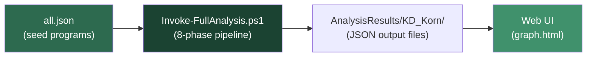
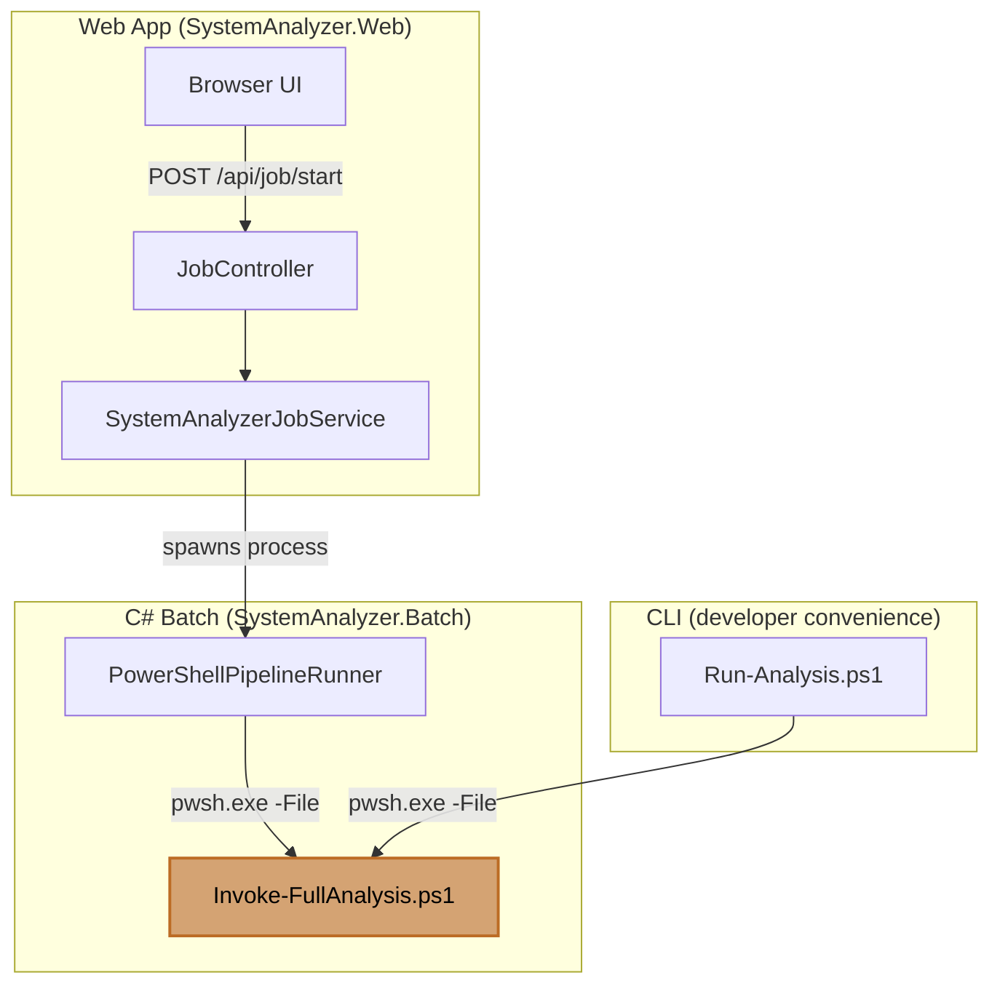
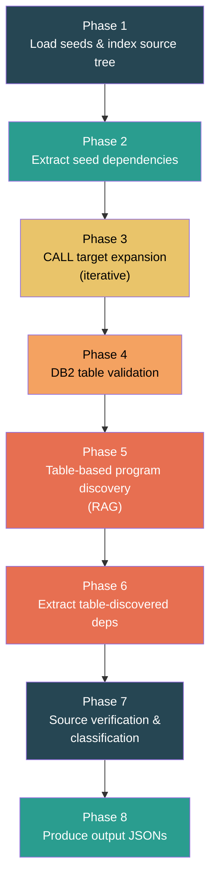
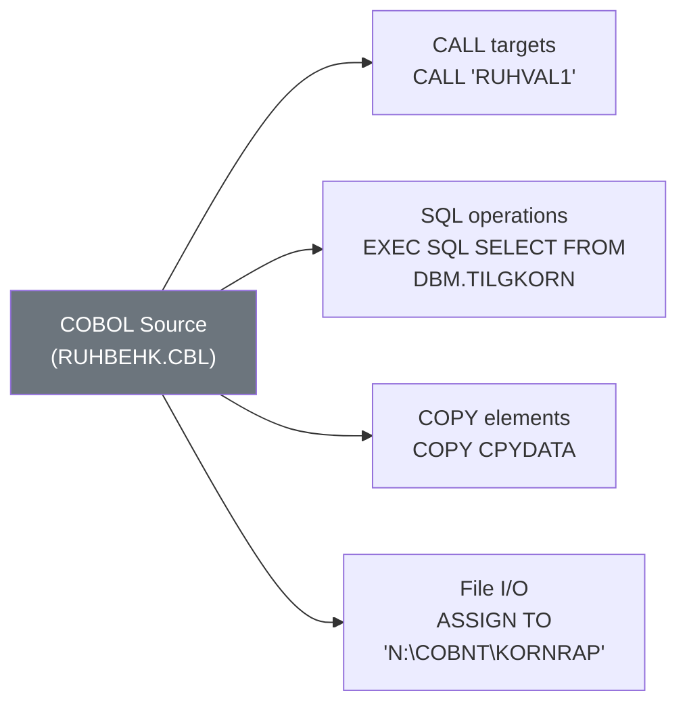
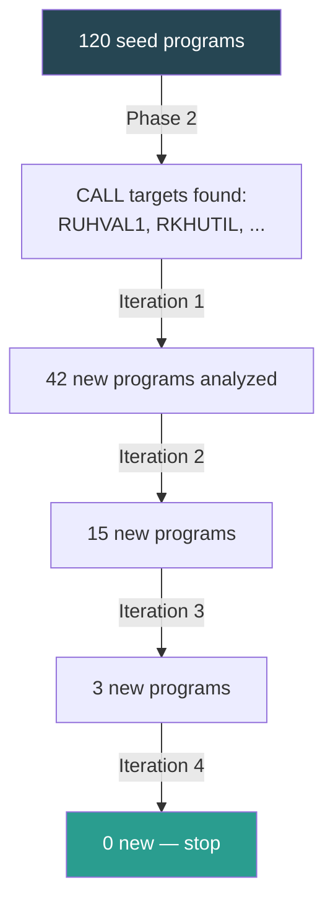
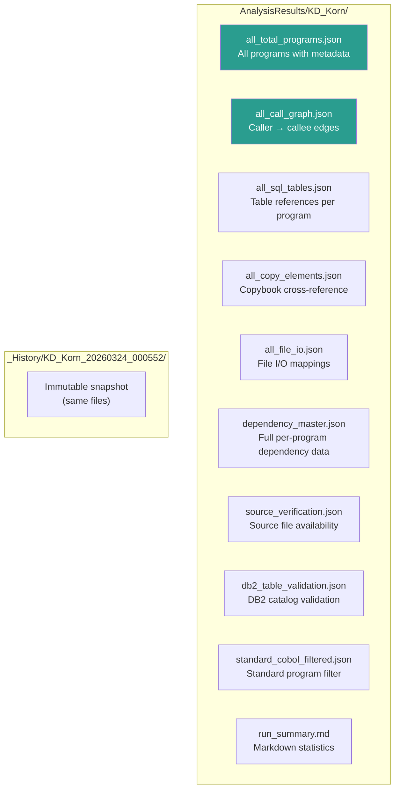
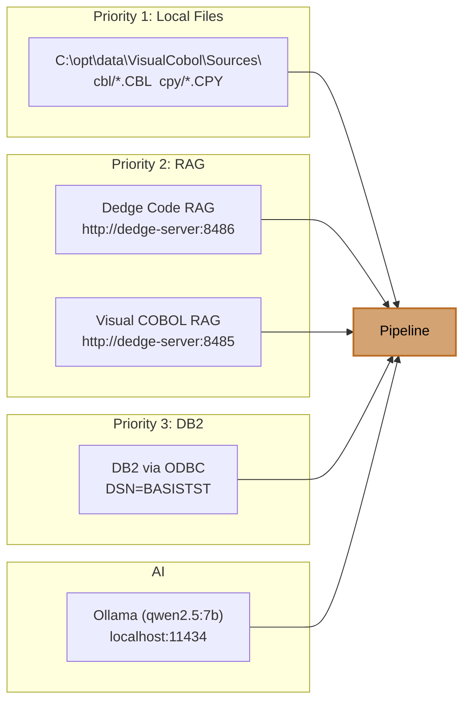

# How the Batch Analyzer Works

This document explains the SystemAnalyzer analysis pipeline using the **KD_Korn** profile as a running example.

## Overview

SystemAnalyzer is a COBOL dependency analysis tool. Given a list of seed programs (e.g. menu screens and batch jobs from the Grain/Seed system), it discovers the full dependency chain — every program called, every DB2 table accessed, every copybook included, and every file I/O operation — then produces structured JSON output for visualization in the web UI.



## Input: `all.json`

The analysis starts with a seed file that lists the COBOL programs belonging to a functional area. For KD_Korn, this covers two sub-areas:

| Area | Description | Example Programs |
|------|------------|-----------------|
| **Korn** | Grain handling — batch numbers, inventory, quality, storage | RUHBEHK, RKHPNUM, RKHFLYB |
| **KD** | Seed contract growers — contracts, deliveries, settlements | RSKKART, RSKKONT, RSKRPST |

Each entry has metadata from the Dedge menu system:

```json
{
  "type": "screen",
  "menuChoice": "C11",
  "area": "Korn",
  "descriptionNorwegian": "Vedlikehold - Behandlingskoder",
  "description": "Maintenance - Processing codes",
  "program": "RUHBEHK",
  "filetype": "cbl"
}
```

KD_Korn's `all.json` contains **~120 seed programs** extracted from the `DBM.TILGMENY` table (menu codes starting with `C**` and `D**`).

## Pipeline Architecture

The pipeline can be triggered two ways:



Both paths end up calling the same PowerShell script: `Invoke-FullAnalysis.ps1` (located in `src/SystemAnalyzer.Batch/Scripts/`).

## The 8-Phase Pipeline



### Phase 1 — Load Seeds & Index Source Tree

Reads `all.json` and builds an in-memory index of the entire Visual COBOL source repository at `C:\opt\data\VisualCobol\Sources`.

Three indexes are built:
- **cblIndex** — `.CBL` files from the `cbl/` folder (main programs)
- **copyIndex** — `.CPY`, `.CPB`, `.DCL` files from `cpy/` (copybooks/declarations)
- **fullIndex** — all files from both folders (fallback)

Files in `*_uncertain/` folders are tracked separately as fallback sources.

### Phase 2 — Extract Seed Program Dependencies

For each of the ~120 seed programs, the pipeline extracts:



Data sources are tried in priority order:
1. **Local source files** — parsed directly from `.CBL` with regex
2. **RAG semantic search** — HTTP queries to the Dedge code RAG service
3. **AutoDocJson** — pre-parsed program data from the batch documentation tool

For file I/O operations, **Ollama AI** resolves variable-based filenames (e.g. when the ASSIGN clause uses a COBOL variable instead of a literal path).

### Phase 3 — CALL Target Expansion (Iterative)

Programs found in Phase 2's CALL targets that aren't already known are analyzed in turn. This repeats up to `MaxCallIterations` (default: 5) rounds until no new programs are discovered.



This is how the pipeline grows from ~120 seeds to potentially 200+ total programs — by following the call chain.

### Phase 4 — DB2 Table Validation

Every SQL table name found in COBOL sources is validated against the **DB2 system catalog** (`SYSCAT.TABLES`) via ODBC. This confirms which tables actually exist in the database and which might be typos, renamed tables, or deprecated references.

### Phase 5 — Table-Based Program Discovery (RAG)

For each unique SQL table found so far, the pipeline queries the RAG service: *"Which other programs also access this table?"*. Programs not yet in the analysis are added as **table-reference** discoveries.

### Phase 6 — Extract Table-Discovered Dependencies

Newly discovered programs from Phase 5 go through the same dependency extraction as Phase 2.

### Phase 7 — Source Verification & Classification

Three sub-steps:

1. **Source verification** — checks which programs have a confirmed `.CBL` source file in the source tree (including U/V fuzzy matching for OCR artefacts in program names)
2. **Standard COBOL filter** — uses RAG + Ollama to identify programs that are standard/utility COBOL (not business logic)
3. **Rule-based classification** — tags programs by naming convention (e.g. `RUH*` = Korn maintenance, `RSK*` = Seed/KD)

If COBDOK metadata (from `modul.csv`) is available, programs are enriched with system/sub-system classification and deprecated (`UTGATT`) status.

### Phase 8 — Produce Output JSONs

All collected data is serialized into cross-reference JSON files.

## Output Files



| File | Purpose | Used by Web UI |
|------|---------|:-:|
| `all_total_programs.json` | Every program with source layer, classification, COBDOK metadata, area, menu choice | Yes |
| `all_call_graph.json` | Directed edges: program A calls program B | Yes (graph) |
| `all_sql_tables.json` | Which programs access which DB2 tables, with operation type (SELECT/INSERT/UPDATE/DELETE) | Yes |
| `all_copy_elements.json` | Which copybooks are included by which programs | Yes |
| `all_file_io.json` | File I/O: ASSIGN paths, DD names, file types, resolved filenames | Yes |
| `dependency_master.json` | Complete per-program dependency record (superset of all above) | Backup/debug |
| `source_verification.json` | Whether each program has a confirmed local source file | Yes |
| `db2_table_validation.json` | DB2 catalog lookup results per table | Yes |
| `standard_cobol_filtered.json` | Programs identified as standard/utility COBOL | No |
| `run_summary.md` | Human-readable run statistics | No |

## Disk Layout

```
C:\opt\data\SystemAnalyzer\
  AnalysisResults\
    analyses.json                          ← index of all profiles
    KD_Korn\
      all_total_programs.json              ← latest results (alias snapshot)
      all_call_graph.json
      all_sql_tables.json
      ...
      _History\
        KD_Korn_20260316_170304\           ← immutable run 1
        KD_Korn_20260324_000552\           ← immutable run 2
    Vareregister\
      ...
```

Each run creates a timestamped folder under `_History/`. After the run completes, the latest results are copied up to the alias folder (excluding `_History`), so the web API always serves the most recent data from `AnalysisResults/KD_Korn/`.

## Data Sources



## Running an Analysis

### From the command line

```powershell
pwsh.exe -NoProfile -File .\Run-Analysis.ps1 `
  -AllJsonPath .\AnalysisProfiles\KD_Korn\all.json `
  -Alias KD_Korn
```

### With local execution (faster I/O, local GPU for Ollama)

```powershell
pwsh.exe -NoProfile -File .\Run-Analysis.ps1 `
  -AllJsonPath .\AnalysisProfiles\KD_Korn\all.json `
  -Alias KD_Korn `
  -LocalExecution
```

### Skip resource-intensive phases

```powershell
pwsh.exe -NoProfile -File .\Run-Analysis.ps1 `
  -AllJsonPath .\AnalysisProfiles\KD_Korn\all.json `
  -Alias KD_Korn `
  -SkipPhases "5,6" `
  -SkipClassification
```

### From the web UI

`POST /api/job/start` with:

```json
{
  "alias": "KD_Korn",
  "allJsonPath": "\\dedge-server\\opt\\data\\SystemAnalyzer\\_uploads\\KD_Korn_20260324\\all.json"
}
```

## Typical KD_Korn Run

| Metric | Value |
|--------|-------|
| Seed programs | ~120 |
| After CALL expansion | ~180 |
| After table discovery | ~200+ |
| Unique SQL tables | ~80 |
| Call graph edges | ~350 |
| Copy elements | ~150 |
| File I/O refs | ~60 |
| Runtime (with Ollama) | 60–90 min |
| Runtime (skip classification) | 15–30 min |
