# SystemAnalyzer

**Authors:** Geir Helge Starholm <geir.helge.starholm@Dedge.no>
**Created:** 2026-03-17
**Updated:** 2026-03-27
**Technology:** C# (.NET 10) + PowerShell 7 + JavaScript

---

## Overview

SystemAnalyzer is a COBOL dependency analysis platform for the Dedge ecosystem. Starting from a small set of "seed" programs (menu screens, batch jobs), it iteratively discovers the full dependency chain — every program called, every DB2 table accessed, every copybook included, and every file I/O operation — then produces structured JSON consumed by an interactive web UI with GoJS/Mermaid graph rendering.

The platform also uses AI (Ollama + RAG) to generate modern CamelCase C# names for legacy DB2 tables, columns, and COBOL programs, and infers implicit foreign key relationships from column name patterns and COBOL JOIN evidence.

---

## Architecture

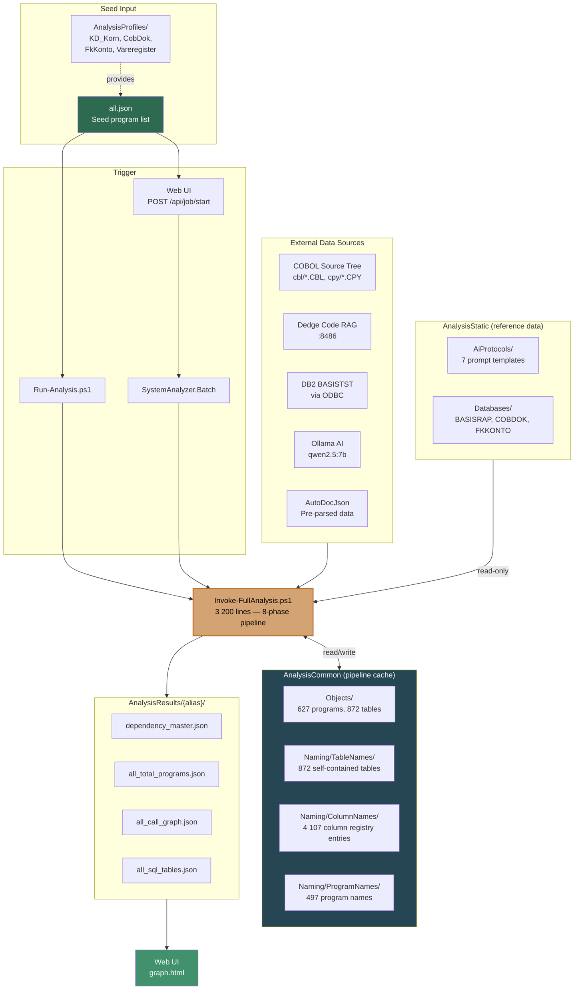

---

## Projects

| Project | Description |
|---|---|
| **SystemAnalyzer.Web** | ASP.NET Core 10 web application — serves the UI and REST API |
| **SystemAnalyzer.Core** | Shared models, services, and option classes |
| **SystemAnalyzer.Batch** | C# process that spawns the PowerShell analysis pipeline |

## Web UI Pages

| Page | Purpose |
|---|---|
| `index.html` | Landing page — analysis selector dropdown |
| `graph.html` | Interactive dependency graph (GoJS / Mermaid) with drill-down, context menus, filter panel |
| `viewer.html` | Raw JSON viewer for analysis result files |
| `doc.html` | Documentation viewer |

---

## Quick Start — Running Locally

```powershell
.\Run-Local.ps1
```

This starts the app on `http://localhost:5042` with **DedgeAuth disabled** and analysis results served directly from the repo's `AnalysisResults/` folder. The repo ships with pre-built results for all four analysis profiles — no external data, no server access required.

### Options

```powershell
.\Run-Local.ps1 -Port 8080       # Custom port
.\Run-Local.ps1 -NoBrowser       # Don't auto-open browser
.\Run-Local.ps1 -NoBuild         # Skip build, use previous output
```

### What you get immediately

After `Run-Local.ps1`, open the browser and select an analysis profile from the dropdown:

| Profile | Seeds | Programs | Tables | Call Edges | Copy Elements | File I/O | Description |
|---|---|---|---|---|---|---|---|
| **KD_Korn** | 100 | 508 | 1 826 | 2 637 | 1 464 | 224 files | Grain contracts & seed system (menu codes C**, D**) |
| **Vareregister** | 39 | 161 | 853 | 759 | 727 | 82 files | Product/item master registry (Y-menu, varedata) |
| **CobDok** | 3 | 18 | 30 | 574 | 701 | 62 files | COBDOK documentation handling (DOHSCAN, DOHCHK, DOHCBLD) |
| **FkKonto** | 10 | 82 | 520 | 324 | 365 | 57 files | FkKonto/Innlan accounting programs |

> **CobDok**: 18 programs and 30 tables are the verified direct call chain (Levels 0–4). The pipeline's RAG expansion (Phase 5–6) inflates these to 103 programs / 956 tables by pulling in shared infrastructure — see `AnalysisProfiles/CobDok/CobDok-SourceAnalysis.md`.

Each profile provides interactive dependency graphs, drill-down context menus, table/column naming details, and full call chain visualization.

---

## Run-Local vs Build-And-Publish

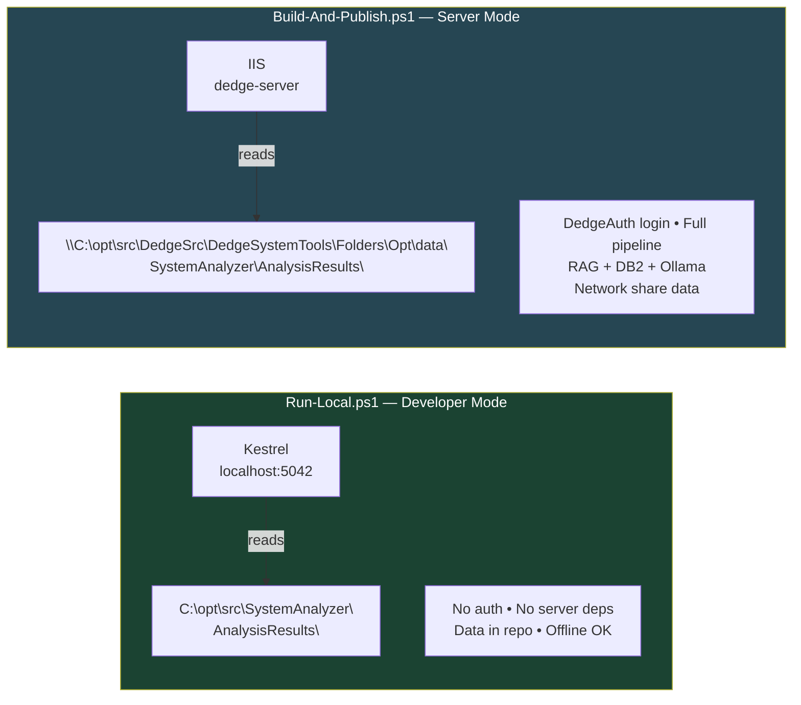

| Setting | Run-Local | Build-And-Publish |
|---|---|---|
| Environment | Development | Production |
| DedgeAuth | Disabled | Enabled |
| DataRoot | Repo folder | `dedge-server\...` |
| Batch pipeline | Not available | Full pipeline via web UI |
| External deps | None | DB2, RAG, Ollama, DedgeAuth |

---

## The 8-Phase Analysis Pipeline

The core engine is `Invoke-FullAnalysis.ps1` (3 200 lines). It takes a seed list and iteratively expands outward until the full dependency graph is mapped.

```mermaid
flowchart TD
    P1["<b>Phase 1 — Load & Index</b><br/>Read all.json seeds<br/>Index COBOL source tree<br/>Initialize caches"]
    P2["<b>Phase 2 — Extract Seed Dependencies</b><br/>For each seed: regex parse for<br/>CALL targets, SQL tables,<br/>COPY elements, File I/O"]
    P3["<b>Phase 3 — CALL Expansion</b><br/>Iteratively analyze new CALL targets<br/>(up to 5 rounds) until stable"]
    P4["<b>Phase 4 — DB2 Validation</b><br/>Validate every table against<br/>SYSCAT.TABLES via ODBC<br/>Bulk-fetch column metadata"]
    P5["<b>Phase 5 — Table Discovery (RAG)</b><br/>Ask RAG: 'Which programs use this table?'<br/>Discover programs not in CALL chain"]
    P6["<b>Phase 6 — Extract New Dependencies</b><br/>Run Phase 2 extraction on<br/>programs discovered in Phase 5"]
    P7["<b>Phase 7 — Verify & Classify</b><br/>Source verification • Standard filter<br/>Rule-based classification<br/>COBDOK metadata enrichment"]
    P8["<b>Phase 8a-e — Produce Output</b><br/>Serialize to JSON files:<br/>programs, call graph, SQL tables,<br/>copy elements, file I/O"]
    P8F["<b>Phase 8f — Naming Pipeline</b><br/>Ollama AI naming:<br/>CamelCase table + column + program names<br/>FK inference + conflict resolution"]
    P8P["<b>Publish</b><br/>Copy to alias folder + _History<br/>Update analyses.json index"]

    P1 --> P2 --> P3 --> P4 --> P5 --> P6 --> P7 --> P8 --> P8F --> P8P

    style P1 fill:#264653,color:#fff
    style P2 fill:#2a9d8f,color:#fff
    style P3 fill:#e9c46a,color:#000
    style P4 fill:#f4a261,color:#000
    style P5 fill:#e76f51,color:#fff
    style P6 fill:#e76f51,color:#fff
    style P7 fill:#264653,color:#fff
    style P8 fill:#2a9d8f,color:#fff
    style P8F fill:#1d4e89,color:#fff
    style P8P fill:#40916c,color:#fff
```

### Phase 2–3: Dependency Extraction Detail

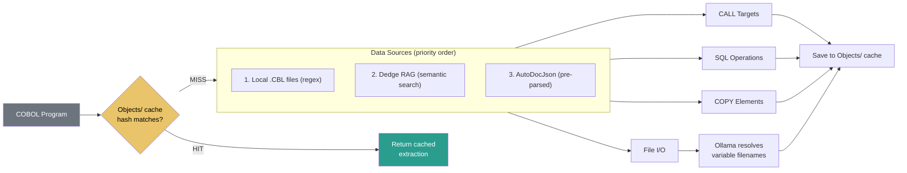

### Phase 3: Iterative CALL Expansion

The pipeline starts from seed programs and follows outgoing `CALL` statements level by level, validating each target against known `.CBL` source files to eliminate false positives.

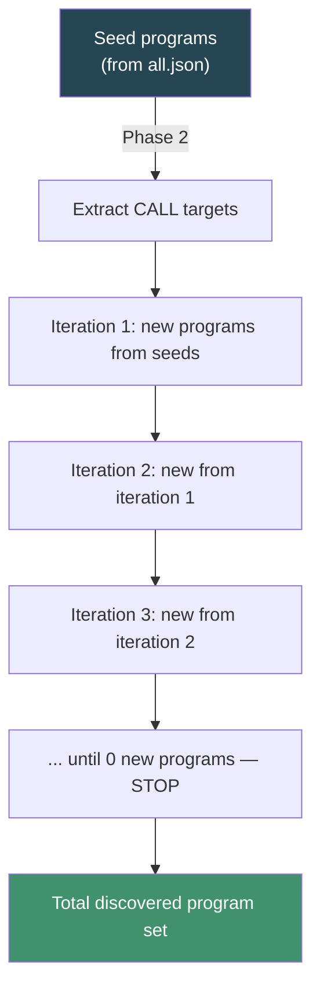

### Phase 8f: Modern CamelCase Naming Pipeline

Phase 8f uses a three-layer architecture to produce AI-generated modern names with full context:

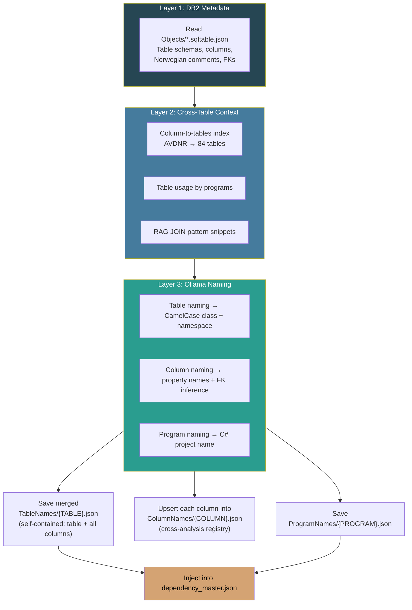

### Cross-Analysis Column Conflict Resolution

When multiple analysis profiles encounter the same column name (e.g. `AVDNR` appears in 84 tables across CobDok, FkKonto, Vareregister, KD_Korn), they may produce different descriptions. The pipeline uses Ollama to resolve conflicts:

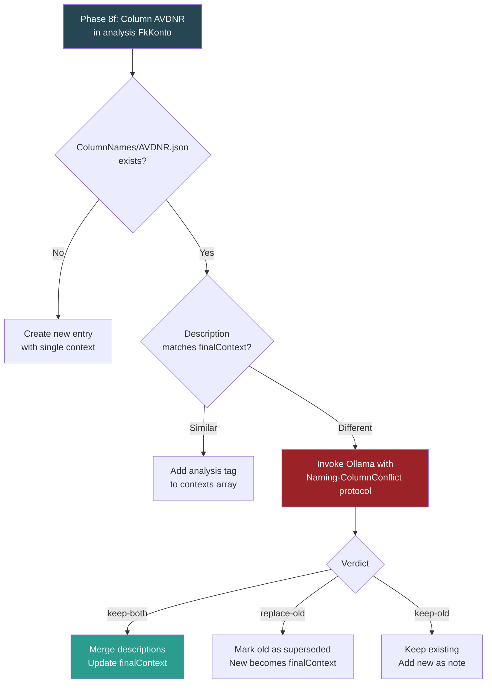

---

## AnalysisCommon — Shared Knowledge Base

`AnalysisCommon/` is the pipeline's read/write cache — regenerated content that prevents redundant work. `AnalysisStatic/` is read-only reference data that the pipeline consumes but never modifies.

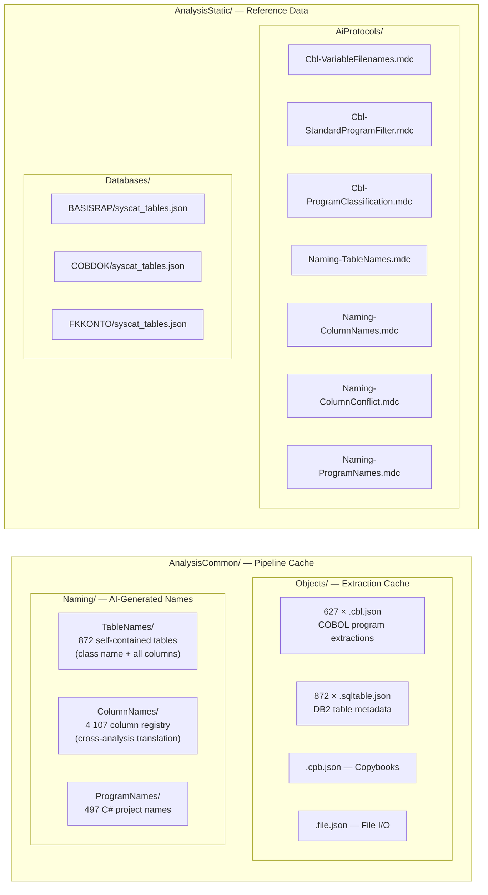

### Cache-First Strategy

The pipeline uses SHA256 hashing on COBOL source text. If `Objects/{PROGRAM}.cbl.json` has a matching `extraction.sourceHash`, the full regex+Ollama extraction is skipped. Since legacy COBOL rarely changes, most programs are cache hits after the first run — re-runs complete in minutes instead of hours.

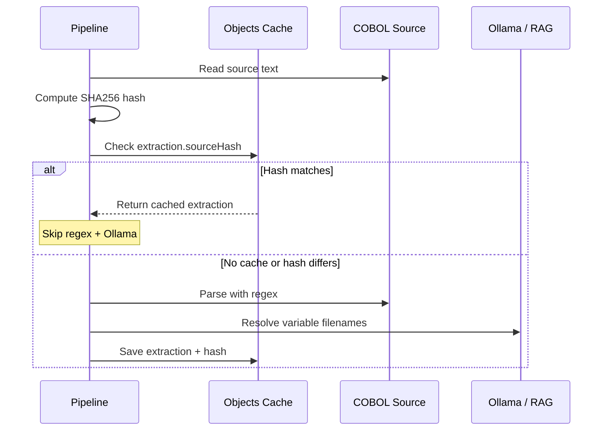

### Naming Cache Architecture

**TableNames/{TABLE}.json** — Self-contained: table-level class name + namespace + all column property names + FK inference. One file = one complete entity definition.

**ColumnNames/{COLUMN}.json** — Cross-analysis translation registry: each file maps one DB2 column name to its C# equivalent with a unified `finalContext` description resolved across all analyses. Example: `AVDNR.json` tracks 84 tables and merges CobDok + FkKonto + Vareregister + KD_Korn perspectives into one description.

**ProgramNames/{PROGRAM}.json** — C# project name + namespace + description per COBOL program.

---

## Analysis Profiles

Seed definitions live in `AnalysisProfiles/` — each subfolder has an `all.json` listing the programs in a functional area.

| Profile | Seeds | Programs | Tables | Call Edges | Copy Elements | File I/O | Area |
|---|---|---|---|---|---|---|---|
| **KD_Korn** | 100 | 508 | 1 826 | 2 637 | 1 464 | 224 files | Grain contracts, seed system, KD menus (C**, D**) |
| **Vareregister** | 39 | 161 | 853 | 759 | 727 | 82 files | Product registry, item master (Y-menu, varedata) |
| **CobDok** | 3 | 18 | 30 | 574 | 701 | 62 files | COBDOK documentation handling (DOHSCAN, DOHCHK, DOHCBLD) |
| **FkKonto** | 10 | 82 | 520 | 324 | 365 | 57 files | FkKonto/Innlan accounting programs |

> **CobDok**: 18 programs / 30 tables from verified call chain. Pipeline RAG expansion inflates to 103 / 956 via shared infrastructure.

### Understanding Pipeline Expansion (Phase 5–6)

The pipeline produces more programs and tables than a manual call-chain trace because Phase 5 asks the RAG: *"Which other programs use this table?"* For every SQL table discovered in Phases 2–4, the pipeline finds all programs in the Dedge codebase that reference it, then extracts *their* dependencies in Phase 6.

This means shared infrastructure tables like `DBM.TILGBRUKER` (user credentials), `DBM.SQLFEIL` (error log), and `DBM.AKTIVISER` (feature flags) — which appear in nearly every Dedge program — cause massive expansion. The result is a **transitive closure** over shared dependencies, not just the application's direct call tree.

**Example — CobDok**:

| Scope | Programs | SQL Tables | Source |
|---|---|---|---|
| Direct call chain (Levels 0–4) | 18 | 30 | Manual trace in `CobDok-SourceAnalysis.md` |
| Pipeline output (with RAG expansion) | 103 | 956 | `AnalysisResults/CobDok/` JSON files |

The 85 extra programs and 926 extra tables are mostly shared infrastructure and other Dedge subsystems that happen to reference the same common tables.

### Running a New Analysis

```powershell
# Full analysis (requires DB2, RAG, Ollama, COBOL source tree)
pwsh.exe -NoProfile -File .\Run-Analysis.ps1 `
  -AllJsonPath .\AnalysisProfiles\KD_Korn\all.json `
  -Alias KD_Korn

# Local execution (output to temp, then sync)
pwsh.exe -NoProfile -File .\Run-Analysis.ps1 `
  -AllJsonPath .\AnalysisProfiles\CobDok\all.json `
  -Alias CobDok -LocalExecution

# Regenerate all four profiles
pwsh.exe -NoProfile -File .\Regenerate-All-Analyses.ps1
```

### Program Discovery Breakdown

How each profile's programs were discovered across the pipeline phases:

| Profile | Seeds (original) | Call Expansion | Table Reference (RAG) | Total | Deprecated | Shared Infra |
|---|---|---|---|---|---|---|
| **KD_Korn** | 99 | 111 | 298 | 508 | 4 | 54 |
| **Vareregister** | 39 | 37 | 85 | 161 | 2 | 31 |
| **CobDok** | 3 | 18 | 82 | 103 | 1 | 21 |
| **FkKonto** | 10 | 27 | 45 | 82 | 4 | 27 |

### Source Verification

| Profile | Programs in Master | CBL Found | Truly Missing | Found % | Copy Total | Copy Found | Copy % |
|---|---|---|---|---|---|---|---|
| **KD_Korn** | 508 | 478 | 8 | 98.4% | 1464 | 466 | 31.8% |
| **Vareregister** | 161 | 159 | 2 | 98.8% | 727 | 186 | 25.6% |
| **CobDok** | 103 | 103 | 0 | 100% | 701 | 125 | 17.8% |
| **FkKonto** | 82 | 82 | 0 | 100% | 365 | 59 | 16.2% |

### DB2 Table Validation

| Profile | Tables Checked | Validated (exist in DB2) | Not Found | Validation % |
|---|---|---|---|---|
| **KD_Korn** | 331 | 172 | 159 | 52% |
| **Vareregister** | 85 | 49 | 36 | 57.6% |
| **CobDok** | 52 | 14 | 38 | 26.9% |
| **FkKonto** | 58 | 30 | 28 | 51.7% |

### Cross-Analysis Overlap

| Scope | Total Unique | In 1 Profile | In 2 Profiles | In 3 Profiles | In All 4 |
|---|---|---|---|---|---|
| Programs | 627 | 478 | 95 | 30 | 24 |
| SQL Tables | 1 696 | 710 | 432 | 255 | 299 |

---

## Scripts

| Script | Purpose |
|---|---|
| `Run-Local.ps1` | Start local dev server (no auth, reads from repo) |
| `Run-Analysis.ps1` | Run analysis pipeline for one profile |
| `Build-And-Publish.ps1` | Build + publish Web + Batch to IIS staging |
| `Regenerate-All-Analyses.ps1` | Re-run all analysis profiles in sequence |
| `Seed-AnalysisCommon.ps1` | Populate Objects/ cache from existing results |
| `Migrate-NamingCache.ps1` | Migrate naming cache to new self-contained format |
| `Migrate-DataToAnalysisResults.ps1` | One-time migration from flat layout to `_History/` structure |
| `Invoke-CursorAgentProtocol.ps1` | AI agent protocol for batch orchestration |
| `Gather-AnalysisStats.ps1` | Collect statistics from all analysis data into `AnalysisStats/` |
| `Regenerate-All-Analyses.cmd` | Windows batch wrapper for `Regenerate-All-Analyses.ps1` |

### Script Relationship

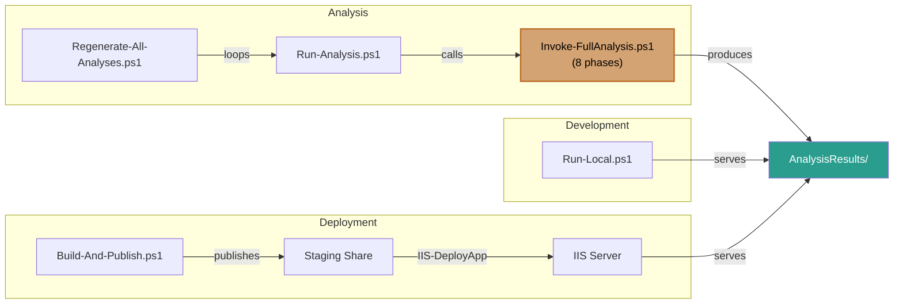

### Run-Analysis.ps1

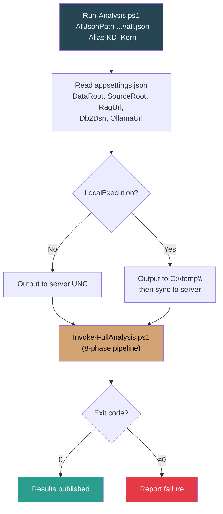

| Parameter | Default | Description |
|---|---|---|
| `-AllJsonPath` | (required) | Path to seed program list JSON |
| `-Alias` | auto-derived | Analysis alias name |
| `-SkipPhases` | none | Comma-separated phases to skip (e.g. `"5,6"`) |
| `-SkipClassification` | off | Skip Ollama classification phase |
| `-LocalExecution` | off | Write to local temp, then sync to server |
| `-SettingsFile` | `appsettings.json` | Override config file path |

### Build-And-Publish.ps1

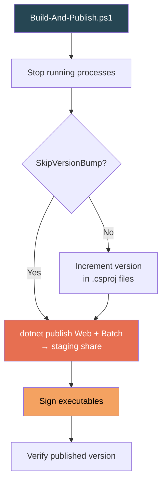

| Parameter | Default | Description |
|---|---|---|
| `-VersionPart` | `Patch` | Which part to increment: `Major`, `Minor`, `Patch` |
| `-SkipVersionBump` | off | Don't increment version |
| `-SkipBuild` | off | Skip straight to summary |

Publish targets:

| Project | Staging Path |
|---|---|
| SystemAnalyzer.Web | `C:\opt\src\DedgeSrc\DedgeSystemTools\Folders\DedgeCommon\Software\DedgeWinApps\SystemAnalyzer` |
| SystemAnalyzer.Batch | `C:\opt\src\DedgeSrc\DedgeSystemTools\Folders\DedgeCommon\Software\DedgeWinApps\SystemAnalyzer-Batch` |

After publishing: `IIS-DeployApp.ps1 -SiteName SystemAnalyzer`

---

## Output Files

Each analysis profile produces these JSON files:

| File | Content |
|---|---|
| `dependency_master.json` | Complete superset — all programs with calls, SQL, copy, file I/O, naming |
| `all_total_programs.json` | All programs with metadata, classification, shared infrastructure flag |
| `all_call_graph.json` | Directed call edges (caller → callee) |
| `all_sql_tables.json` | DB2 table references per program with operation type |
| `all_copy_elements.json` | Copybook cross-reference |
| `all_file_io.json` | File I/O mappings (ASSIGN paths, DD names) |
| `source_verification.json` | Source file availability confirmation |
| `db2_table_validation.json` | DB2 catalog validation results |
| `run_summary.md` | Human-readable run statistics |

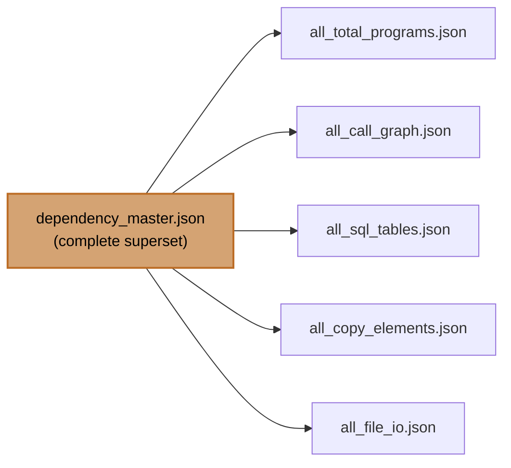

---

## AI Protocols

Prompt templates and response contracts for Ollama are stored in `AnalysisStatic/AiProtocols/`:

| Protocol | Purpose | Used In |
|---|---|---|
| `Cbl-VariableFilenames.mdc` | Resolve variable ASSIGN paths from COBOL source | Phase 2/3/6 |
| `Cbl-StandardProgramFilter.mdc` | Determine if a program is standard vs application code | Phase 7 |
| `Cbl-ProgramClassification.mdc` | Classify program role (UI, batch, service, utility) | Phase 7 |
| `Naming-TableNames.mdc` | CamelCase C# class name + namespace per table | Phase 8f |
| `Naming-ColumnNames.mdc` | CamelCase property names + FK inference per column | Phase 8f |
| `Naming-ColumnConflict.mdc` | Resolve conflicting column descriptions across analyses | Phase 8f |
| `Naming-ProgramNames.mdc` | Descriptive C# project name per COBOL program | Phase 8f |

---

## Configuration

Options are defined in `SystemAnalyzerOptions.cs` and configured via `appsettings.json`:

| Setting | Server Default | Local Dev |
|---|---|---|
| `DataRoot` | `C:\opt\src\DedgeSrc\DedgeSystemTools\Folders\Opt\data\SystemAnalyzer` | `C:\opt\src\SystemAnalyzer` |
| `AnalysisCommonPath` | `C:\opt\src\SystemAnalyzer\AnalysisCommon` | Same |
| `BatchRoot` | `C:\opt\DedgeWinApps\SystemAnalyzer-Batch` | `""` (auto-detect) |
| `Db2Dsn` | `BASISTST` | Same |
| `OllamaUrl` | `http://localhost:11434` | Same |
| `OllamaModel` | `qwen2.5:7b` | Same |
| `RagUrl` | `http://dedge-server:8486/query` | Same |
| `DedgeAuth.Enabled` | `true` | `false` |

---

## External Dependencies

| Dependency | Purpose | Location |
|---|---|---|
| Ollama (qwen2.5:7b) | AI classification, naming, variable resolution | `http://localhost:11434` |
| Dedge Code RAG | Semantic search over COBOL codebase | `http://dedge-server:8486` |
| Visual COBOL RAG | Documentation search | `http://dedge-server:8485` |
| DB2 (BASISTST) | Table validation, column metadata | ODBC via `BASISTST` alias |
| AutoDocJson | Pre-parsed program documentation | `C:\opt\src\DedgeSrc\DedgeSystemTools\Folders\Opt\Webs\AutoDocJson` |
| DedgeAuth | Authentication (server mode only) | `http://localhost/DedgeAuth` |
| GoJS 3.1 | Graph rendering (evaluation license) | `wwwroot/lib/go.js` |
| Mermaid.js | Flowchart rendering | `wwwroot/lib/mermaid.min.js` |

---

## Tech Stack

| Component | Technology |
|---|---|
| Backend | .NET 10, ASP.NET Core |
| Frontend | Vanilla JS, GoJS (evaluation), Mermaid.js |
| Auth | DedgeAuth (disabled in Development) |
| API docs | Scalar (OpenAPI) |
| Analysis pipeline | PowerShell 7+ (3 200 lines) |
| AI | Ollama qwen2.5:7b, Dedge Code RAG |
| Data sources | DB2 via ODBC, RAG services |

---

## Repository Structure

```
SystemAnalyzer/
├── src/
│   ├── SystemAnalyzer.Web/           ASP.NET Core web app (UI + API)
│   │   └── wwwroot/js/              graph.js, viewer.js, doc.js
│   ├── SystemAnalyzer.Core/          Shared models and options
│   └── SystemAnalyzer.Batch/         Batch pipeline runner
│       └── Scripts/
│           └── Invoke-FullAnalysis.ps1   The 8-phase engine (3 200 lines)
├── AnalysisCommon/                    Pipeline cache (read/write)
│   ├── Objects/                      1 499 cached element files
│   └── Naming/
│       ├── TableNames/               872 self-contained table definitions
│       ├── ColumnNames/              4 107 cross-analysis column registry
│       └── ProgramNames/             497 program name mappings
├── AnalysisStatic/                    Reference data (read-only)
│   ├── AiProtocols/                  7 prompt templates (.mdc)
│   └── Databases/                    DB2 catalog exports per database
│       ├── BASISRAP/                 Dedge (2 852 tables)
│       ├── COBDOK/                   CobDok (62 tables)
│       └── FKKONTO/                  FkKonto (99 tables)
├── AnalysisProfiles/                  Seed definitions per area
│   ├── KD_Korn/all.json              100 seeds → 508 programs, 1 826 tables
│   ├── Vareregister/all.json         39 seeds → 161 programs, 853 tables
│   ├── CobDok/all.json               3 seeds → 18 programs, 30 tables (direct call chain)
│   └── FkKonto/all.json              10 seeds → 82 programs, 520 tables
├── AnalysisResults/                   Pre-built output (committed to repo)
│   ├── KD_Korn/                      Latest + _History/
│   ├── Vareregister/
│   ├── CobDok/
│   └── FkKonto/
├── Run-Local.ps1                      Start locally (no auth, repo data)
├── Run-Analysis.ps1                   Run analysis for one profile
├── Build-And-Publish.ps1              Build + publish to IIS staging
├── Regenerate-All-Analyses.ps1        Re-run all profiles
├── Regenerate-All-Analyses.cmd        Windows batch wrapper
├── Gather-AnalysisStats.ps1           Collect stats into AnalysisStats/
├── Invoke-CursorAgentProtocol.ps1     AI agent protocol for batch orchestration
├── Migrate-NamingCache.ps1            Naming cache format migration
├── Migrate-DataToAnalysisResults.ps1  One-time migration to _History/ layout
├── Seed-AnalysisCommon.ps1            Populate cache from existing results
├── Analysis-Pipeline-Overview.md      Detailed Mermaid diagrams
└── GoJS-Free-Evaluation-License-Summary.md  GoJS license notes
```
