# SystemAnalyzer — Improvements (2026-03-27)

This document covers all changes made on March 27, 2026 across the analysis pipeline, backend APIs, and the graph viewer frontend.

---

## Summary of Changes

| Area | Change | Impact |
|------|--------|--------|
| Pipeline | Strict database boundary filtering | Programs outside the designated database catalog are rejected |
| Pipeline | Phase 8g — Business Area Classification | Ollama classifies programs into fine-grained business domains |
| Architecture | `AnalysisStatic/` folder separation | Static reference data decoupled from mutable `AnalysisCommon/` |
| Orchestration | `Regenerate-All-Analyses.ps1` overhaul | Auto-discovers profiles, supports `-ResetResults` / `-ResetCache` |
| Backend | `LayoutController` | Save, load, list, and delete graph layouts via REST API |
| Backend | `ProfileController` | Create focused analysis profiles from visible graph nodes |
| Backend | `AnalysisIndexService` auto-discovery | Analysis dropdown works without `analyses.json` manifest |
| Frontend | Isolate + Expand mode | Right-click a node to isolate it and progressively expand neighbors |
| Frontend | AutoDoc Flowchart overlay | Inline Mermaid-to-GoJS flowcharts from AutoDocJson in fullscreen overlay |
| Frontend | Save/Load Layout | Persist and restore graph state (positions, filters, zoom) to server |
| Frontend | Create Focused Profile | Generate a new `all.json` seed profile from visible programs |
| Frontend | Business Area integration | Color-coded nodes, filter box, and detail panel tags |
| Data | 279 new naming cache files | Column and table name translations from Vareregister/FkKonto runs |

---

## 1. Strict Database Boundary Filtering

Each analysis profile is now tagged with a database alias (e.g., `COBDOK`, `BASISRAP`, `FKKONTO`). Programs are only included if **all** their SQL table references resolve to a `qualifiedName` found in the designated database catalog stored in `AnalysisStatic/Databases/{DB_ALIAS}/syscat_tables.json`.

```mermaid
flowchart LR
    subgraph "Phase 3 — SQL Table Extraction"
        A[Parse COBOL source] --> B[Extract SQL table references]
        B --> C{Table in catalog?}
        C -- "SCHEMA.TABLE found in\nsyscat_tables.json" --> D[✅ Keep reference]
        C -- "Not found" --> E[❌ Strip reference]
    end

    subgraph "Phase 4 — Program Validation"
        D --> F{Program has\nany valid tables?}
        E --> F
        F -- Yes --> G[✅ Include program]
        F -- "No — all stripped" --> H{Called by\nvalid program?}
        H -- Yes --> I[✅ Keep as call-only]
        H -- No --> J[❌ Reject program]
    end

    style D fill:#1a3a2e,stroke:#34d399
    style G fill:#1a3a2e,stroke:#34d399
    style I fill:#1a3a2e,stroke:#34d399
    style E fill:#3a1a1a,stroke:#f87171
    style J fill:#3a1a1a,stroke:#f87171
```

**Files changed:**
- `src/SystemAnalyzer.Batch/Scripts/Invoke-FullAnalysis.ps1` — +297 lines of boundary filtering logic
- `AnalysisProfiles/*/all.json` — Added `"database": "..."` field to each profile

---

## 2. AnalysisStatic Architecture

Static reference data (AI protocols, database catalogs) was moved from `AnalysisCommon/` to a new `AnalysisStatic/` folder. This separates immutable reference data from mutable analysis cache.

```mermaid
flowchart TD
    subgraph "Before"
        AC1["AnalysisCommon/"]
        AC1 --> AIP["AiProtocols/"]
        AC1 --> DB["Databases/"]
        AC1 --> NM["Naming/"]
        AC1 --> OB["Objects/"]
    end

    subgraph "After"
        AS["AnalysisStatic/"]
        AS --> AIP2["AiProtocols/ (8 .mdc files)"]
        AS --> DB2["Databases/\nBASISRAP/ COBDOK/ FKKONTO/"]

        AC2["AnalysisCommon/"]
        AC2 --> NM2["Naming/\nColumnNames/ TableNames/ ProgramNames/"]
        AC2 --> OB2["Objects/\n*.program.json *.table.json"]
    end

    style AS fill:#1e3a5f,stroke:#4f8cff
    style AC2 fill:#2a2544,stroke:#a78bfa
```

**Key principle:** `AnalysisStatic/` is committed to git and never regenerated. `AnalysisCommon/` is built up incrementally by analysis runs and can be safely reset.

---

## 3. Regenerate-All-Analyses.ps1 Overhaul

The orchestration script was rewritten to:
- Auto-discover profiles by scanning `AnalysisProfiles/` for `all.json` files
- Support `-ResetResults` to clear `AnalysisResults/` before regeneration
- Support `-ResetCache` to clear `AnalysisCommon/` before regeneration
- No longer depend on a remote `analyses.json` manifest

```mermaid
flowchart TD
    START([Regenerate-All-Analyses.ps1]) --> P1{ResetResults?}
    P1 -- Yes --> DEL1[Delete AnalysisResults/*]
    P1 -- No --> P2
    DEL1 --> P2{ResetCache?}
    P2 -- Yes --> DEL2[Delete AnalysisCommon/*]
    P2 -- No --> SCAN
    DEL2 --> SCAN

    SCAN["Scan AnalysisProfiles/\nfor all.json files"] --> LOOP

    LOOP["For each profile:"] --> RUN["Invoke-FullAnalysis.ps1\n-AllJsonPath profile/all.json"]
    RUN --> NEXT{More profiles?}
    NEXT -- Yes --> LOOP
    NEXT -- No --> DONE([Complete])

    style START fill:#1e3a5f,stroke:#4f8cff
    style SCAN fill:#2a2544,stroke:#a78bfa
    style DONE fill:#1a3a2e,stroke:#34d399
```

---

## 4. Phase 8g — Business Area Classification

A new pipeline phase uses Ollama to classify programs into detailed business domains (e.g., `grain-quality-control`, `order-management`, `common-infrastructure`).

```mermaid
flowchart LR
    subgraph "Phase 8g — Business Area Classification"
        M["dependency_master.json"] --> CTX["Build program context\n(name, futureProjectName,\nSQL tables, call targets)"]
        CTX --> PR["Format prompt\nusing BusinessAreaClassification.mdc"]
        PR --> OL["Invoke Ollama\n(qwen2.5:7b)"]
        OL --> PARSE{Valid JSON?}
        PARSE -- Yes --> OUT["business_areas.json\n{ areas: [...], programAreaMap: {...} }"]
        PARSE -- No --> FB["Fallback: group by\nexisting area field or\nprogram prefix patterns"]
        FB --> OUT
    end

    subgraph "Caching"
        OUT --> CACHE["AnalysisCommon/BusinessAreas/\n{alias}_business_areas.json"]
        CACHE -.->|"Next run:\nprogram set unchanged"| SKIP["Skip Ollama,\nuse cache"]
    end

    style OL fill:#2a2544,stroke:#a78bfa
    style OUT fill:#1a3a2e,stroke:#34d399
    style CACHE fill:#1e3a5f,stroke:#4f8cff
```

**Output format:**
```json
{
  "areas": [
    { "id": "grain-quality-control", "name": "Grain Quality Control", "description": "..." }
  ],
  "programAreaMap": {
    "RKQUAL01": "grain-quality-control",
    "GMADATO": "common-infrastructure"
  }
}
```

---

## 5. New Backend API Controllers

### LayoutController (`/api/layout`)

Manages saved graph layouts on the server at `{DataRoot}/SavedLayouts/{alias}/`.

```mermaid
flowchart LR
    subgraph "LayoutController"
        SAVE["POST /{alias}/save\nbody: { comment, nodePositions,\nfilters, ui, visiblePrograms }"]
        LIST["GET /{alias}/list"]
        LOAD["GET /{alias}/load?file=..."]
        DEL["DELETE /{alias}/{fileName}"]
    end

    SAVE --> DISK["SavedLayouts/{alias}/\n{user}_{timestamp}_{comment}.json"]
    LIST --> DISK
    LOAD --> DISK
    DEL --> DISK

    style SAVE fill:#1a3a2e,stroke:#34d399
    style DISK fill:#1e3a5f,stroke:#4f8cff
```

### ProfileController (`/api/profile`)

Creates new focused analysis profiles from a subset of visible programs.

```mermaid
flowchart LR
    REQ["POST /api/profile/create-focused\n{ sourceAlias, newAlias,\ncomment, programs[] }"] --> READ["Read source\nall.json"]
    READ --> FILTER["Match programs\nto seed entries"]
    FILTER --> GEN["Generate new all.json\nwith database + parentProfile"]
    GEN --> WRITE["Write to\nAnalysisProfiles/{newAlias}/"]
    WRITE --> RESP["{ alias, path,\nprogramCount }"]

    style REQ fill:#2a2544,stroke:#a78bfa
    style WRITE fill:#1a3a2e,stroke:#34d399
```

### AnalysisIndexService Auto-Discovery

When `analyses.json` doesn't exist (common in local development), the service now scans subdirectories of `AnalysisResults/` for `dependency_master.json` to build the analysis list dynamically.

---

## 6. Graph Viewer Frontend Features

All frontend changes are in `graph.html`, `graph.js`, and `app.css`.

### Feature Overview

```mermaid
flowchart TD
    subgraph "New Context Menu Items"
        CM1["🔍 Drill Down"]
        CM2["🌍 Isolate + Expand"]
        CM3["📊 Show Flowchart"]
        CM4["➕ Expand from Here\n(isolation mode only)"]
    end

    subgraph "New Toolbar Buttons"
        TB1["Save Layout"]
        TB2["Load Layout"]
        TB3["Focused Profile"]
    end

    subgraph "New Overlays & Modals"
        OV1["Flowchart Overlay\n(fullscreen GoJS)"]
        MD1["Save Layout Modal"]
        MD2["Load Layout Modal"]
        MD3["Focused Profile Modal"]
    end

    subgraph "New Filter Box"
        FB1["Business Areas\n(color-coded checkboxes)"]
    end

    CM2 --> ISO["Isolation Mode\nfloating badge + progressive expansion"]
    CM3 --> OV1
    TB1 --> MD1
    TB2 --> MD2
    TB3 --> MD3

    style CM2 fill:#1e3a5f,stroke:#4f8cff
    style CM3 fill:#2a2544,stroke:#a78bfa
    style ISO fill:#1a3a2e,stroke:#34d399
    style OV1 fill:#2a2544,stroke:#a78bfa
```

### Isolate + Expand Flow

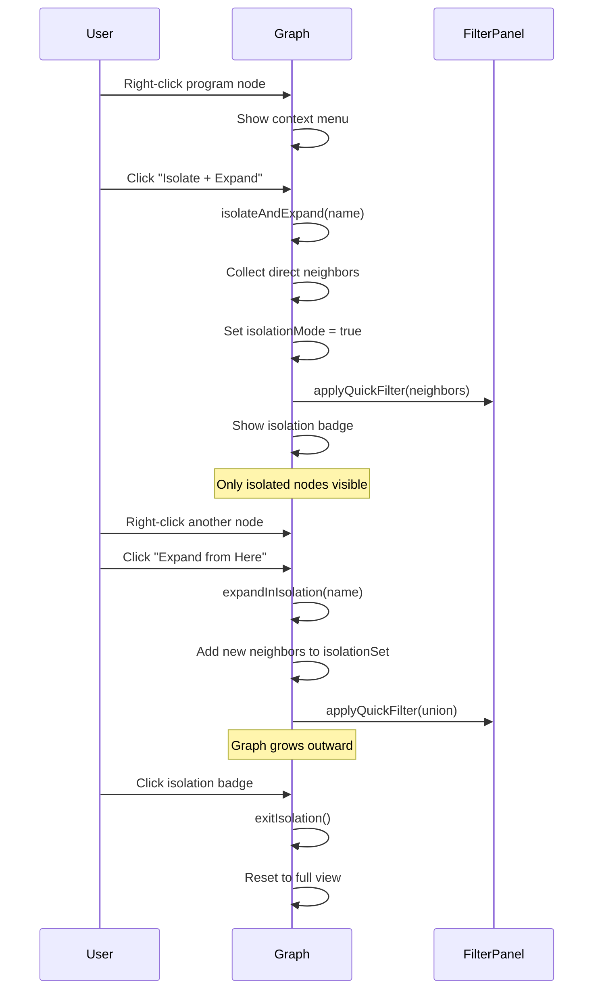

### AutoDoc Flowchart Overlay

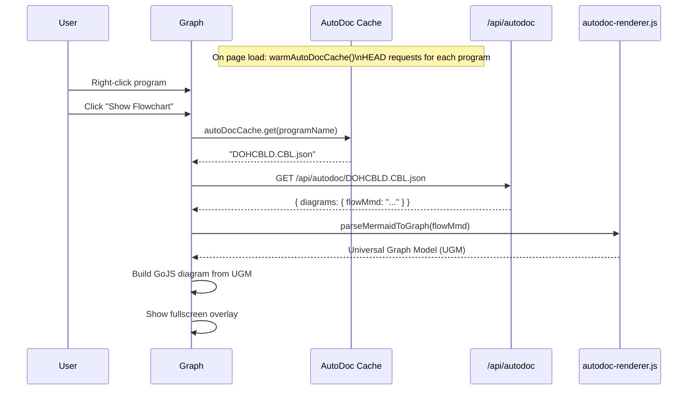

### Save/Load Layout Data Flow

```mermaid
flowchart TD
    subgraph "Save"
        S1["Capture GoJS node positions"] --> S2["Capture filter state"]
        S2 --> S3["Capture UI settings\n(renderer, layout, threshold)"]
        S3 --> S4["Capture visible programs\n+ drill stack + isolation state"]
        S4 --> S5["POST /api/layout/{alias}/save"]
        S5 --> S6["Stored as\n{user}_{timestamp}_{comment}.json"]
    end

    subgraph "Load"
        L1["GET /api/layout/{alias}/list"] --> L2["User selects layout"]
        L2 --> L3["GET /api/layout/{alias}/load"]
        L3 --> L4["Restore filters"]
        L4 --> L5["Restore UI settings"]
        L5 --> L6["Rebuild graph"]
        L6 --> L7["Restore node positions\nvia GoJS transactions"]
    end

    style S6 fill:#1e3a5f,stroke:#4f8cff
    style L7 fill:#1a3a2e,stroke:#34d399
```

---

## 7. Business Area Integration in UI

When `business_areas.json` is available, the graph viewer:

1. **Colors program nodes** by business area instead of default program color
2. **Adds a filter box** in the Filter Panel for toggling business areas
3. **Shows a tag** in the detail panel with the area name and color
4. **Updates node text** to show `PROGRAM_NAME\n(FutureProjectName)`

```mermaid
flowchart LR
    BA["business_areas.json"] --> IDX["businessAreaIndex\n{ PROGRAM: 'area-id' }"]
    BA --> SET["businessAreaSet\n{ 'grain-quality', 'infrastructure', ... }"]

    IDX --> NODES["Node coloring\ngetAreaColor(areaId)"]
    SET --> FP["Filter Panel\nbusinessAreas checkbox group"]
    IDX --> DP["Detail Panel\n'Business Area: ...' tag"]

    style BA fill:#2a2544,stroke:#a78bfa
    style NODES fill:#1e3a5f,stroke:#4f8cff
    style FP fill:#1a3a2e,stroke:#34d399
```

---

## 8. Files Changed Summary

### New Files (13)

| File | Purpose |
|------|---------|
| `Export-DatabaseCatalogs.ps1` | Script to export DB2 syscat.tables to CSV/JSON |
| `AnalysisStatic/AiProtocols/BusinessAreaClassification.mdc` | Ollama prompt protocol for business area classification |
| `AnalysisStatic/Databases/BASISRAP/syscat_tables.json` | DB2 catalog for BASISRAP (27,965 lines) |
| `AnalysisStatic/Databases/COBDOK/syscat_tables.json` | DB2 catalog for COBDOK (807 lines) |
| `AnalysisStatic/Databases/FKKONTO/syscat_tables.json` | DB2 catalog for FKKONTO (1,139 lines) |
| `src/SystemAnalyzer.Web/Controllers/LayoutController.cs` | REST API for saved graph layouts |
| `src/SystemAnalyzer.Web/Controllers/ProfileController.cs` | REST API for focused profile creation |
| `src/SystemAnalyzer.Web/wwwroot/lib/autodoc-renderer.js` | Mermaid-to-GoJS conversion library (1,261 lines) |

### Modified Files (5 key)

| File | Lines Changed | What Changed |
|------|:---:|------|
| `Invoke-FullAnalysis.ps1` | +420 | Database boundary filter + Phase 8g business areas |
| `graph.js` | +614 | Isolation, flowcharts, layout, focused profile, business areas |
| `graph.html` | +60 | Flowchart overlay, modals, toolbar buttons, script refs |
| `app.css` | +136 | Styles for overlay, modals, badges, tags |
| `Regenerate-All-Analyses.ps1` | +84 | Profile auto-discovery, reset parameters |
| `AnalysisIndexService.cs` | +28 | Auto-discover analyses from folders |

### Naming Cache (279 new files)

Column and table name translations generated by the Vareregister and FkKonto analysis pipelines, stored in `AnalysisCommon/Naming/ColumnNames/` and `AnalysisCommon/Naming/TableNames/`.

---

## Complete Pipeline After Changes

```mermaid
flowchart TD
    START([Invoke-FullAnalysis.ps1]) --> P1["Phase 1: Load all.json\n+ resolve database"]
    P1 --> P2["Phase 2: Source verification\n(locate .cbl files)"]
    P2 --> P3["Phase 3: SQL table extraction\n+ database boundary filter 🆕"]
    P3 --> P4["Phase 4: Call graph expansion\n(up to 5 iterations)"]
    P4 --> P5["Phase 5: File I/O mapping"]
    P5 --> P6["Phase 6: Copy element analysis"]
    P6 --> P7["Phase 7: Classification + filtering"]
    P7 --> P8a["Phase 8a: Accumulate Objects"]
    P8a --> P8b["Phase 8b: DB2 table metadata"]
    P8b --> P8c["Phase 8c: Build dependency_master.json"]
    P8c --> P8d["Phase 8d: db2_table_validation.json"]
    P8d --> P8e["Phase 8e: Publish to alias folder"]
    P8e --> P8f["Phase 8f: Modern CamelCase naming\n+ FK inference (Ollama)"]
    P8f --> P8g["Phase 8g: Business Area Classification 🆕\n(Ollama)"]
    P8g --> DONE([Output: 11 JSON files + run_summary.md])

    style P3 fill:#1e3a5f,stroke:#4f8cff
    style P8g fill:#2a2544,stroke:#a78bfa
    style DONE fill:#1a3a2e,stroke:#34d399
```

---

*Generated: 2026-03-28*
