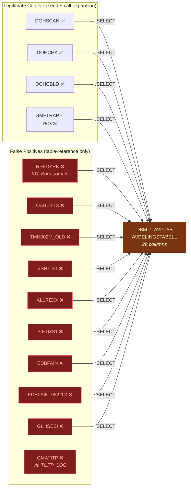
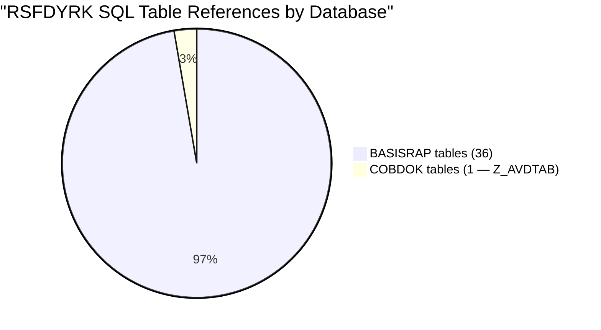
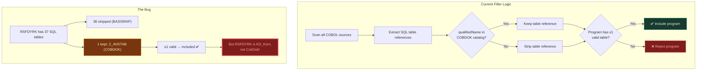
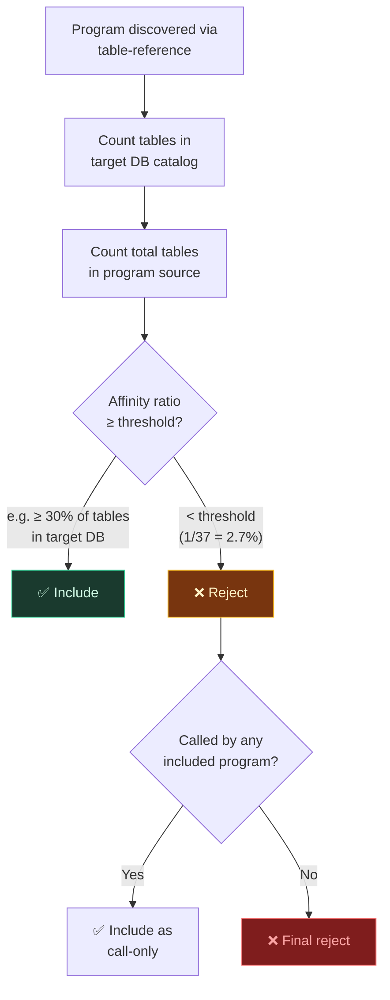

# RSFDYRK in CobDok — False Positive Analysis

**Date:** 2026-03-28
**Analysis Profile:** CobDok
**Database Boundary:** COBDOK (19 DBM tables, 98 total objects)
**Seed Programs:** DOHSCAN, DOHCHK, DOHCBLD

---

## Verdict

**RSFDYRK does not belong in the CobDok analysis.** It is a grain/grower management program (KD_Korn domain) that was incorrectly pulled in because it reads one shared lookup table (`DBM.Z_AVDTAB`) that happens to exist in the COBDOK database.

---

## How RSFDYRK Entered the Analysis

```mermaid
flowchart TD
    subgraph "CobDok Seed Programs"
        DOHSCAN["DOHSCAN<br/><i>source: original</i>"]
        DOHCHK["DOHCHK<br/><i>source: original</i>"]
        DOHCBLD["DOHCBLD<br/><i>source: original</i>"]
    end

    subgraph "Call Expansion (legitimate)"
        DOHSCAN -->|calls| GMACOCO
        DOHSCAN -->|calls| GMACOMP
        DOHSCAN -->|calls| GMADATO
        DOHSCAN -->|calls| GMADIR
        DOHCBLD -->|calls| GMADIR2
        DOHCBLD -->|calls| GMALSQL
        DOHSCAN -->|calls| GMAOSNT
        DOHSCAN -->|calls| GMARANDO
        DOHSCAN -->|calls| GMASQLB
        DOHSCAN -->|calls| GMFSQLF
        DOHSCAN -->|calls| GMFTRAP
    end

    subgraph "Table Reference (the leak)"
        AVDTAB["DBM.Z_AVDTAB<br/><i>exists in COBDOK catalog</i>"]
        RSFDYRK["RSFDYRK<br/><i>source: table-reference</i>"]
        RSFDYRK -.->|SELECT| AVDTAB
    end

    DOHSCAN -.->|also reads| AVDTAB
    DOHCHK -.->|also reads| AVDTAB
    DOHCBLD -.->|also reads| AVDTAB

    style RSFDYRK fill:#7f1d1d,stroke:#f87171,stroke-width:3px,color:#fca5a5
    style AVDTAB fill:#78350f,stroke:#fbbf24,color:#fef3c7
    style DOHSCAN fill:#1a3a2e,stroke:#34d399,color:#d1fae5
    style DOHCHK fill:#1a3a2e,stroke:#34d399,color:#d1fae5
    style DOHCBLD fill:#1a3a2e,stroke:#34d399,color:#d1fae5
```

**Key observation:** No seed program calls RSFDYRK. No program in the entire CobDok call graph calls RSFDYRK. It was discovered solely because it reads `DBM.Z_AVDTAB`, which passes the database boundary filter.

---

## The Shared Table Problem: DBM.Z_AVDTAB

`Z_AVDTAB` ("AVDELINGSTABELL" — department lookup table) is a **generic infrastructure table**. It exists in the COBDOK catalog but is used by programs across many different business domains. In this analysis alone, **10 programs** reference it — and most have nothing to do with CobDok:

---

## RSFDYRK's Actual Domain: KD_Korn (Grain/Grower Management)

The Object cache reveals that RSFDYRK references **37 SQL tables** in its source code. After database boundary filtering, only **1 table** matched COBDOK. The other 36 belong to BASISRAP (the main Dedge production database).

### Tables Actually Used by RSFDYRK

```mermaid
flowchart TD
    RSFDYRK["RSFDYRK<br/><i>AvdelingManagement</i><br/><i>secondary-ui</i>"]

    subgraph "KD_Korn Tables (BASISRAP) — Primary Domain"
        KD1["DBM.KD_DYRKER<br/>SELECT, INSERT,<br/>UPDATE, DELETE"]
        KD2["DBM.KD_KONTRAKT<br/>SELECT, DELETE"]
        KD3["DBM.KD_KONTRAKT_LIN<br/>DELETE"]
        KD4["DBM.KD_KONTRAKT_STATUS<br/>DELETE"]
        KD5["DBM.KD_DYRKER_STATUS<br/>SELECT, INSERT, DELETE"]
        KD6["DBM.KD_DYRKER_LOGG<br/>DELETE"]
        KD7["DBM.KD_DYRKER_INFO<br/>DELETE"]
        KD8["DBM.KD_EIENDOM<br/>SELECT, DELETE"]
        KD9["DBM.KD_EIEND_OVERDR<br/>DELETE"]
        KD10["DBM.KD_EIENDOM_LOGG<br/>DELETE"]
        KD11["DBM.KD_FLOGH_STATUS<br/>DELETE"]
        KD12["DBM.KD_UTS_LOGG<br/>DELETE"]
        KD13["DBM.KD_KONT_LIN_LOGG<br/>DELETE"]
        KD14["DBM.KD_KONTROLLDYRKING<br/>SELECT"]
    end

    subgraph "General Lookup Tables (BASISRAP)"
        G1["DBM.TEKSTER"]
        G2["DBM.ART"]
        G3["DBM.ARTSORT"]
        G4["DBM.KUNDER"]
        G5["DBM.VARER"]
    end

    subgraph "COBDOK — Only Match"
        AVDTAB["DBM.Z_AVDTAB<br/><i>Shared lookup table</i>"]
    end

    RSFDYRK --> KD1
    RSFDYRK --> KD2
    RSFDYRK --> KD5
    RSFDYRK --> KD8
    RSFDYRK --> KD14
    RSFDYRK -.-> G1
    RSFDYRK -.-> G2
    RSFDYRK -.-> AVDTAB

    style RSFDYRK fill:#1e3a5f,stroke:#4f8cff,color:#bfdbfe
    style AVDTAB fill:#78350f,stroke:#fbbf24,color:#fef3c7
    style KD1 fill:#2a2544,stroke:#a78bfa,color:#ddd6fe
    style KD2 fill:#2a2544,stroke:#a78bfa,color:#ddd6fe
    style KD5 fill:#2a2544,stroke:#a78bfa,color:#ddd6fe
    style KD8 fill:#2a2544,stroke:#a78bfa,color:#ddd6fe
    style KD14 fill:#2a2544,stroke:#a78bfa,color:#ddd6fe
```

---

## Current vs Expected CobDok Programs

```mermaid
flowchart TD
    subgraph "Expected: Seed + Call-Expansion Only"
        direction TB
        S1["DOHSCAN ✅ seed"]
        S2["DOHCHK ✅ seed"]
        S3["DOHCBLD ✅ seed"]
        C1["GMACOCO ✅ call"]
        C2["GMACOMP ✅ call"]
        C3["GMADATO ✅ call"]
        C4["GMADIR ✅ call"]
        C5["GMADIR2 ✅ call"]
        C6["GMALSQL ✅ call"]
        C7["GMAOSNT ✅ call"]
        C8["GMARANDO ✅ call"]
        C9["GMASQLB ✅ call"]
        C10["GMFSQLF ✅ call"]
        C11["GMFTRAP ✅ call"]
    end

    subgraph "Should Be Excluded: table-reference only via Z_AVDTAB/SQLFEIL/TILTP_LOG"
        direction TB
        X1["ALLREXX ❌"]
        X2["BIFTMS1 ❌"]
        X3["EDBFAIN ❌"]
        X4["EDBFAIN_982209 ❌"]
        X5["GLHSESI ❌"]
        X6["GMATITP ❌"]
        X7["OABUTTS ❌"]
        X8["RSFDYRK ❌"]
        X9["TMH002M_OLD ❌"]
        X10["VSHTIST ❌"]
    end

    style S1 fill:#1a3a2e,stroke:#34d399,color:#d1fae5
    style S2 fill:#1a3a2e,stroke:#34d399,color:#d1fae5
    style S3 fill:#1a3a2e,stroke:#34d399,color:#d1fae5
    style X1 fill:#7f1d1d,stroke:#f87171,color:#fca5a5
    style X2 fill:#7f1d1d,stroke:#f87171,color:#fca5a5
    style X3 fill:#7f1d1d,stroke:#f87171,color:#fca5a5
    style X4 fill:#7f1d1d,stroke:#f87171,color:#fca5a5
    style X5 fill:#7f1d1d,stroke:#f87171,color:#fca5a5
    style X6 fill:#7f1d1d,stroke:#f87171,color:#fca5a5
    style X7 fill:#7f1d1d,stroke:#f87171,color:#fca5a5
    style X8 fill:#7f1d1d,stroke:#f87171,color:#fca5a5
    style X9 fill:#7f1d1d,stroke:#f87171,color:#fca5a5
    style X10 fill:#7f1d1d,stroke:#f87171,color:#fca5a5
```

| Program | Source | Sole COBDOK Table | Legitimate? |
|---------|--------|-------------------|-------------|
| DOHSCAN | original (seed) | MODUL, CALL, COPY, COPYSET, ... | **Yes** |
| DOHCHK | original (seed) | MODUL_LINJER, DOHCHK, B_PROGRAMMER, ... | **Yes** |
| DOHCBLD | original (seed) | MODUL, COBDOK_MENY, COPY, ... | **Yes** |
| GMACOCO | call-expansion | — (no SQL) | **Yes** (called by seeds) |
| GMACOMP | call-expansion | SQLFEIL | **Yes** (called by DOHSCAN) |
| GMFTRAP | call-expansion | SQLFEIL, Z_AVDTAB | **Yes** (called by DOHSCAN) |
| GMATITP | table-reference | TILTP_LOG | **No** — not called by any seed |
| ALLREXX | table-reference | Z_AVDTAB | **No** |
| BIFTMS1 | table-reference | Z_AVDTAB | **No** |
| EDBFAIN | table-reference | Z_AVDTAB | **No** |
| EDBFAIN_982209 | table-reference | Z_AVDTAB | **No** |
| GLHSESI | table-reference | Z_AVDTAB | **No** |
| OABUTTS | table-reference | Z_AVDTAB | **No** |
| **RSFDYRK** | **table-reference** | **Z_AVDTAB** | **No** — 36 of 37 tables are BASISRAP |
| TMH002M_OLD | table-reference | Z_AVDTAB | **No** |
| VSHTIST | table-reference | Z_AVDTAB | **No** |

---

## The Root Cause: Database Boundary Filter Gap

### Proposed Fix: Affinity Score

Programs discovered via `table-reference` (not via call expansion from seeds) should require a **meaningful affinity** with the target database, not just a single shared table hit:

**Example for RSFDYRK:**
- Total SQL tables in source: 37
- Tables matching COBDOK catalog: 1 (Z_AVDTAB)
- Affinity: 1/37 = **2.7%** → far below any reasonable threshold → **reject**

**Example for DOHSCAN (seed, but hypothetically):**
- Total SQL tables in source: ~15
- Tables matching COBDOK catalog: ~12 (MODUL, CALL, COPY, COPYSET, ...)
- Affinity: 12/15 = **80%** → clearly belongs → **accept**

---

## Summary

The COBDOK database contains 19 DBM-schema tables. Three of those (`Z_AVDTAB`, `SQLFEIL`, `TILTP_LOG`) are generic shared infrastructure tables present in many databases. The current boundary filter admits any program that touches even one COBDOK table, which causes **10 unrelated programs** to leak into the CobDok analysis purely through these shared tables. An affinity-based threshold or a shared-table exclusion list would eliminate these false positives.

---

*Generated from SystemAnalyzer CobDok analysis results, 2026-03-28*
