# Analysis Pipeline Overview

Visual overview of the SystemAnalyzer analysis pipeline — from seed input to web visualization.

## End-to-End Flow

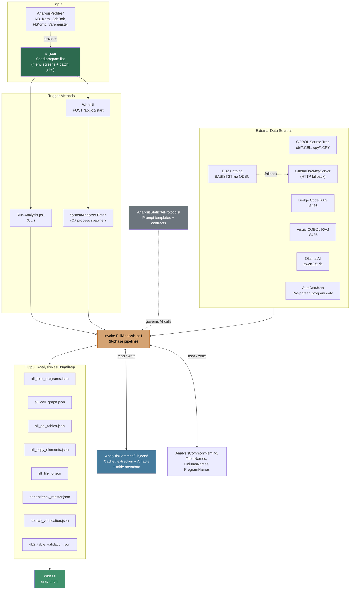

## Pre-run cleanup and publish targets (SystemAnalyzer2)

- **Default** (`CleanBeforeRun`, on unless `--no-clean-before-run`): before creating a new `_History` run folder, removes prior **published** outputs for the alias at each distinct results root: all `*.json` and `*.md` in `{root}/{alias}/`, and the `{root}/{alias}/autodoc/` tree. **`_History` is kept.**
- **AnalysisCommon2**: when the profile declares `databases` for multi-DB discovery, `AnalysisCommon2/Databases/*.json` is deleted before re-export (same default).
- **Dual publish**: the latest run is copied to **both** `DataRoot/{alias}` and `AnalysisResultsRoot/{alias}` when those paths differ, so the web API (which reads `AnalysisResultsRoot`) stays aligned with batch history under `DataRoot`.
- **AutoDoc in web**: `GET /api/autodoc/{file}?alias={alias}` resolves `{AnalysisResultsRoot}/{alias}/autodoc/{file}` and `{DataRoot}/{alias}/autodoc/{file}` before the central `AutoDocJsonPath`.
- **Technology catalog in web**: `GET /api/technology/analysis/{alias}` returns `wwwroot/data/supported-technologies.json` plus profile technology rows from `all.json` (and `profileDatabases`).

## The 8-Phase Pipeline

```mermaid
flowchart TD
    P1["<b>Phase 1 — Load & Index</b><br/>Read all.json seed list<br/>Index COBOL source tree<br/>(cblIndex, copyIndex, fullIndex)"]
    P2["<b>Phase 2 — Extract Seed Dependencies</b><br/>For each seed program, extract:<br/>CALL targets, SQL tables,<br/>COPY elements, File I/O"]
    P3["<b>Phase 3 — CALL Expansion</b><br/>Iteratively analyze newly discovered<br/>CALL targets (up to 5 rounds)<br/>until no new programs found"]
    P4["<b>Phase 4 — DB2 Validation</b><br/>Validate every SQL table name<br/>against SYSCAT.TABLES via ODBC"]
    P5["<b>Phase 5 — Table Discovery (RAG)</b><br/>For each table, ask RAG:<br/>'Which other programs use this table?'<br/>Add undiscovered programs"]
    P6["<b>Phase 6 — Extract New Dependencies</b><br/>Run Phase 2 extraction on<br/>programs discovered in Phase 5"]
    P7["<b>Phase 7 — Verify & Classify</b><br/>1. Source verification (.CBL exists?)<br/>2. Standard COBOL filter (RAG+Ollama)<br/>3. Rule-based classification<br/>4. COBDOK metadata enrichment"]
    P8["<b>Phase 8a-e — Produce Output</b><br/>Serialize all data to JSON files"]
    P8F["<b>Phase 8f — Naming Pipeline</b><br/>Context-enriched Ollama calls:<br/>CamelCase table/column/program names<br/>+ FK inference"]
    P8P["<b>Phase 8 — Publish</b><br/>Copy to alias folder + _History"]

    P1 --> P2
    P2 --> P3
    P3 --> P4
    P4 --> P5
    P5 --> P6
    P6 --> P7
    P7 --> P8
    P8 --> P8F
    P8F --> P8P

    style P1 fill:#264653,color:#fff
    style P2 fill:#2a9d8f,color:#fff
    style P3 fill:#e9c46a,color:#000
    style P4 fill:#f4a261,color:#000
    style P5 fill:#e76f51,color:#fff
    style P6 fill:#e76f51,color:#fff
    style P7 fill:#264653,color:#fff
    style P8 fill:#2a9d8f,color:#fff
    style P8F fill:#1d4e89,color:#fff
    style P8P fill:#40916c,color:#fff
```

## Phase 2–3: Dependency Extraction Detail

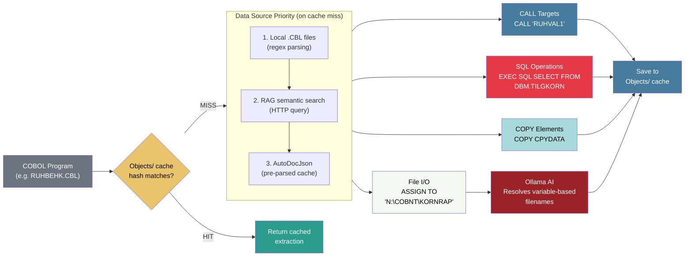

## Phase 3: Iterative CALL Expansion

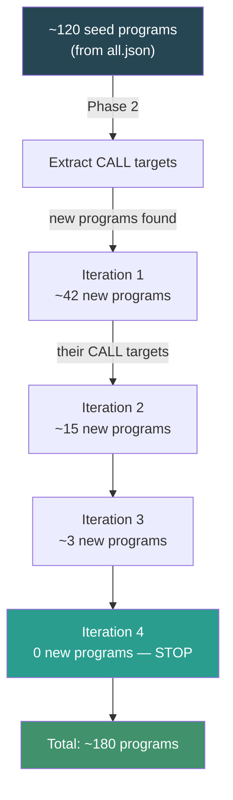

## Phase 7: Verification & Classification

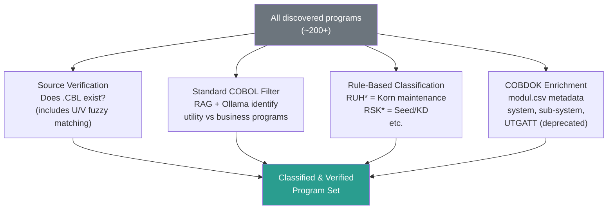

## Output File Relationships

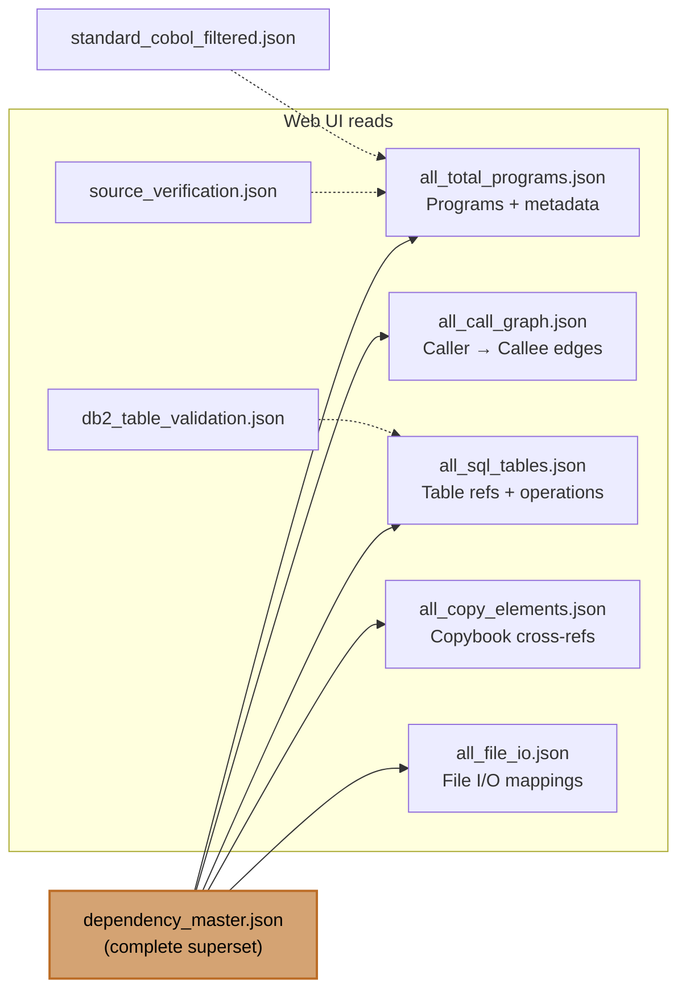

## AnalysisCommon — Object Cache Layer

The pipeline uses a persistent cache (`AnalysisCommon/Objects/`) to avoid redundant work.
Since the COBOL source being analyzed is legacy code that rarely changes, each program only
needs to be fully extracted and AI-analyzed once.

### Cache-First Extraction

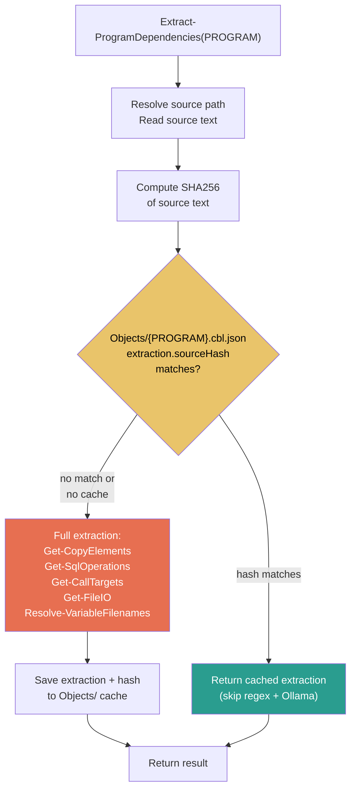

### Accumulated Facts Per Object

Each `Objects/{NAME}.{type}.json` file accumulates facts from different pipeline steps.
A fact is only computed if it is not already present in the cached file.

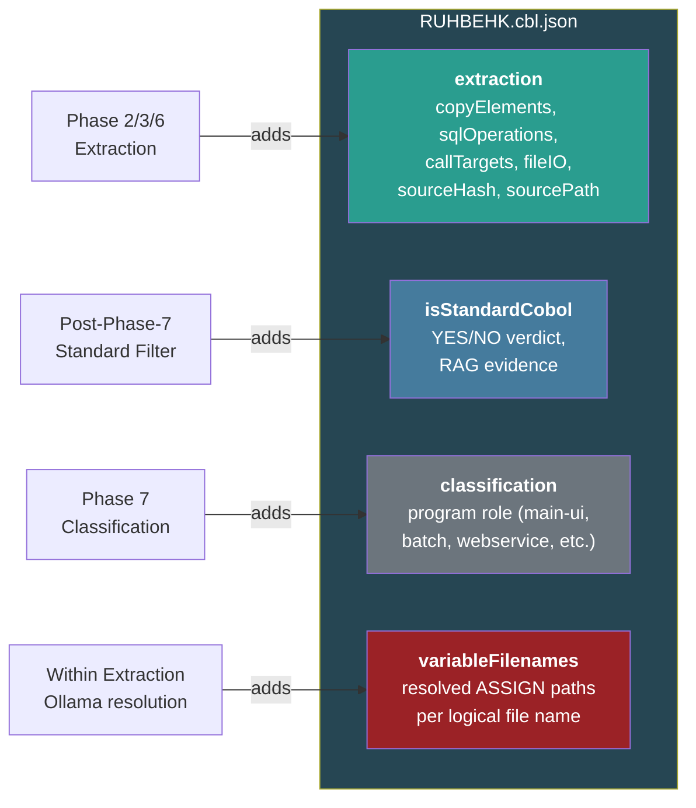

### Element Type Suffixes

Files use a dot-suffix to disambiguate elements with the same base name:

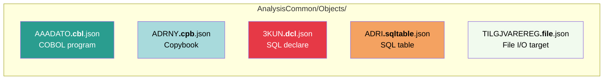

### AI Protocols

Prompt templates and response contracts are stored in `AnalysisStatic/AiProtocols/`:

| Protocol File | Purpose | AI Model |
|---|---|---|
| `Cbl-VariableFilenames.mdc` | Resolve variable ASSIGN paths from COBOL source | Ollama (qwen2.5:7b) |
| `Cbl-StandardProgramFilter.mdc` | Determine if a program is standard COBOL or application code | RAG + Ollama |
| `Cbl-ProgramClassification.mdc` | Classify program role (UI, batch, service, utility) | Rule-based (future: AI) |

Each `.mdc` file defines the prompt template, expected JSON response format, examples,
and model guidance. These protocols enable upgrading individual facts with more capable
models (e.g. Claude Opus) without re-running the full pipeline.

### Table Metadata Cache (Objects/*.sqltable.json)

During Phase 4, when tables are validated against DB2, the pipeline also bulk-fetches
full catalog metadata (table comments, column names/types/comments, explicit foreign keys)
and caches it per table. After Phase 6, newly discovered tables are also cached.

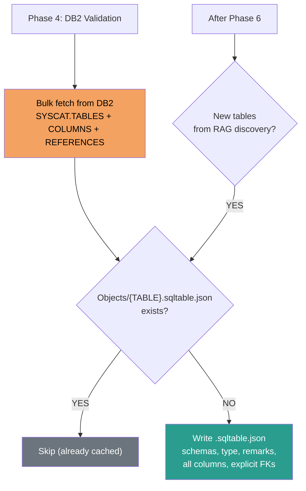

### Naming Cache (AnalysisCommon/Naming/)

AI-generated modern names are stored in three subfolders:

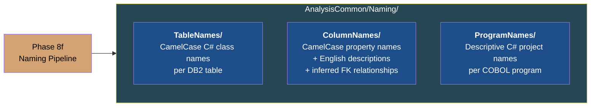

### Phase 8f: Modern CamelCase Naming Pipeline

Phase 8f runs after the file I/O output (8e) and before the run summary. It uses a
three-layer architecture to produce context-aware names:

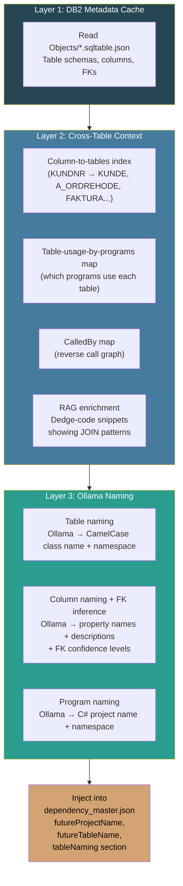

### FK Inference Signals

For each column, three signals are combined to determine foreign key relationships:

| Signal | Source | Confidence |
|--------|--------|------------|
| Explicit DB2 FK | SYSCAT.REFERENCES | `high` |
| Column name match + RAG JOIN evidence | Cross-table index + Dedge-code RAG | `high` |
| Column name match + consistent type | Cross-table index + SYSCAT.COLUMNS | `medium` |
| Column name match only | Cross-table index | `low` |

### Naming AI Protocols

| Protocol File | Purpose | Input Context |
|---|---|---|
| `Naming-TableNames.mdc` | CamelCase C# class name per table | Table remarks, columns, program usage, RAG snippets |
| `Naming-ColumnNames.mdc` | CamelCase property names + FK inference | Column metadata, cross-table index, explicit FKs, RAG JOINs |
| `Naming-ProgramNames.mdc` | Descriptive C# project name per program | Classification, COBDOK, tables used, call graph, RAG |

### Cache Interaction With the Pipeline

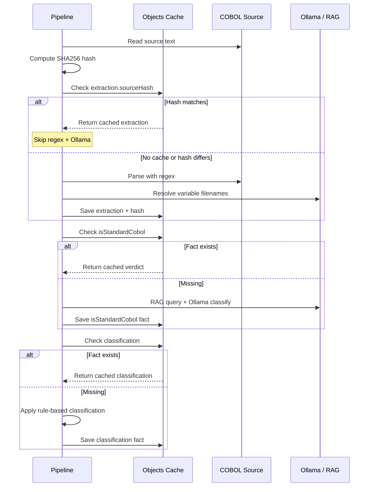

## Deployment Modes

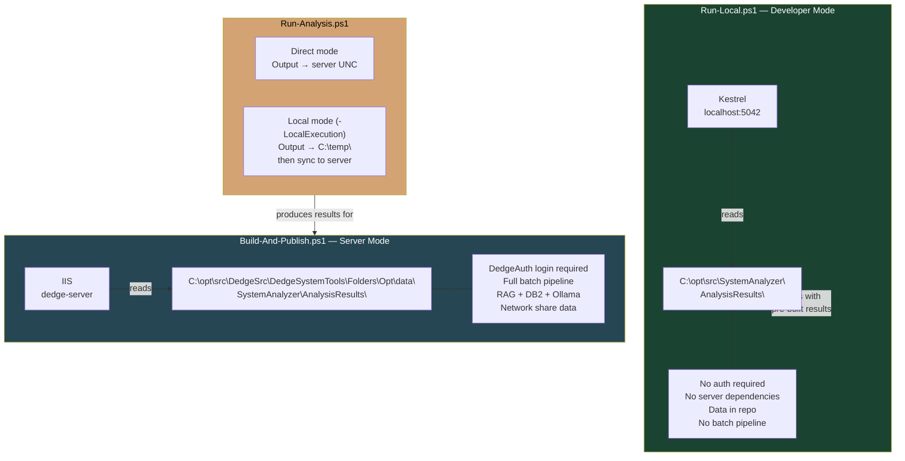

## History & Versioning

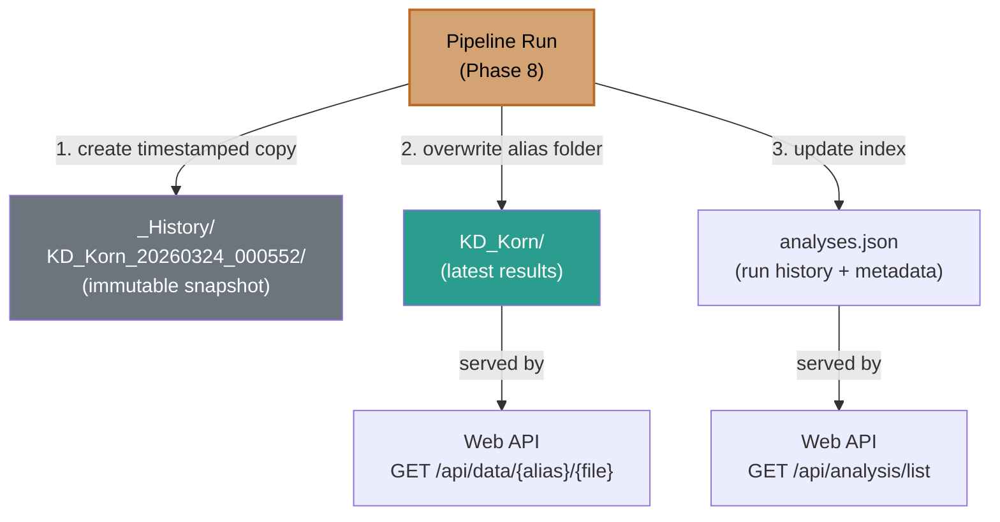
