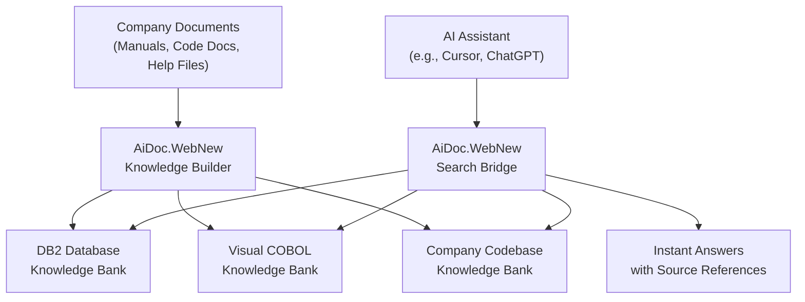

# AiDoc.WebNew — The Smart Search Engine Builder for Company Knowledge

## What It Does (The Elevator Pitch)

AiDoc.WebNew turns your company's scattered documents — manuals, technical guides, help files, code documentation — into a single, searchable brain that AI assistants can tap into instantly. Think of it as building a private Google that *only* knows about your company's information, and can answer questions about it in seconds.

## The Problem It Solves

Every company has mountains of institutional knowledge buried in documents that nobody can find. A new employee asks "How does our billing system work?" and the answer exists *somewhere* — maybe in a PDF from 2018, a help file from 2021, and a database manual from last year. Finding it means hours of digging through folders, SharePoint sites, and asking five different colleagues.

**The real-world analogy:** Imagine a brilliant librarian who has memorized every single document your company has ever created. You walk up, ask a question in plain English, and the librarian instantly pulls the exact paragraphs that answer it — from any document, any year, any department. That's what AiDoc.WebNew builds for you, except the "librarian" is an AI that never forgets, never takes vacation, and works 24/7.

## How It Works

AiDoc.WebNew works in two stages. First, the **Knowledge Building** stage: your company documents are fed into the system, which reads, understands, and stores them in a special kind of database called ChromaDB (a database designed specifically for AI-powered search — unlike regular databases that match exact keywords, this one understands *meaning*). Documents are organized into three separate knowledge banks: one for DB2 database documentation, one for Visual COBOL program documentation, and one for the company's codebase.

Second, the **Search & Answer** stage: when an AI assistant needs information — say, a developer asks "What does the CUSTMAINT program do?" — the AI sends that question through AiDoc.WebNew's search bridge. The bridge searches across all three knowledge banks, finds the most relevant passages, and sends them back to the AI, which crafts a clear answer with references to the original documents.

The web admin portal gives administrators a simple, visual way to manage everything: add new documents, remove outdated ones, rebuild knowledge banks when major updates happen, and monitor the health of each knowledge bank — all through a browser, no technical skills required.

## Key Features

- **Three separate knowledge banks** covering databases, legacy programs, and the company codebase — so searches are fast and focused
- **Web-based admin portal** — manage all knowledge banks through a browser, no command line needed
- **Add, remove, and rebuild** knowledge banks with a few clicks when documentation changes
- **AI-ready search bridge** (called MCP endpoints) — any compatible AI assistant can plug in and start asking questions immediately
- **Understands meaning, not just keywords** — ask "How do we handle customer refunds?" and it finds relevant content even if no document uses the word "refunds"
- **Source references included** — every answer tells you exactly which document and section it came from, so you can verify and trust the results
- **Self-hosted and private** — all company knowledge stays on your own servers, never sent to external cloud services

## How It Compares to Competitors

| Feature | **Dedge AiDoc.WebNew** | AnythingLLM | Vectara | Vector Admin | Strative Connect | Chroma (raw) |
|---|---|---|---|---|---|---|
| **Purpose-built admin portal** | Yes | General chat UI | Enterprise console | DB admin only | Enterprise platform | No UI |
| **AI assistant bridge (MCP)** | Built-in | No | No | No | No | No |
| **ChromaDB management** | Native | Supported | Proprietary DB | Supported | Configurable | Is the DB |
| **Multiple knowledge banks** | 3 pre-configured | Manual setup | Manual setup | N/A | Manual setup | Manual setup |
| **Self-hosted / Private** | Yes | Yes | On-premise option | Yes | VPC deployment | Yes |
| **Pricing** | One-time license | Free/Open Source | Custom enterprise | Free/Open Source | Custom enterprise | Free/Open Source |

**Dedge's advantage:** While open-source tools like AnythingLLM and Vector Admin require significant technical expertise to set up and maintain, and enterprise platforms like Vectara and Strative Connect come with high recurring costs, AiDoc.WebNew hits the sweet spot. It provides the ease-of-use of an enterprise product (web portal, pre-configured knowledge banks, one-click rebuilds) with the cost advantages of self-hosting (one-time license, your servers, your data). The built-in MCP bridge is unique — no competitor offers native plug-and-play connectivity with AI coding assistants.

## Screenshots

## Revenue Potential

**Target Market:** Mid-to-large enterprises with legacy systems, particularly those in banking, insurance, government, and manufacturing where decades of accumulated documentation need to be made searchable.

**Pricing Model Ideas:**

| Tier | Price | Includes |
|---|---|---|
| **Starter** | $5,000 one-time + $1,200/year support | 1 knowledge bank, up to 10,000 documents |
| **Professional** | $12,000 one-time + $2,400/year support | 3 knowledge banks, unlimited documents |
| **Enterprise** | $25,000 one-time + $5,000/year support | Unlimited knowledge banks, priority support, custom integrations |

**Revenue Projection:** With the RAG (Retrieval-Augmented Generation — AI search powered by your own documents) market expected to reach $40 billion by 2030, even capturing a small niche in legacy system documentation could generate $500K–$2M annually from 50–100 enterprise customers.

## What Makes This Special

1. **Built for the real world, not the lab.** While competitors focus on generic AI search, AiDoc.WebNew is purpose-built for the specific challenge of legacy enterprise environments — DB2 databases, COBOL programs, and complex codebases that most AI tools simply don't understand.

2. **The MCP bridge is a game-changer.** MCP (Model Context Protocol — a standard way for AI assistants to access external tools) means that any developer using an AI-powered coding assistant can instantly query all company knowledge without switching tools. This is like giving every developer a senior colleague who knows everything.

3. **Your data never leaves your building.** In industries like banking and government where data sovereignty matters, AiDoc.WebNew runs entirely on your own servers. No cloud dependency, no data leaks, no compliance headaches.

4. **Three knowledge banks, one portal.** Competitors make you manage everything through code or CLI. AiDoc.WebNew gives you a visual admin portal where non-technical staff can manage document libraries, trigger rebuilds, and monitor system health.
