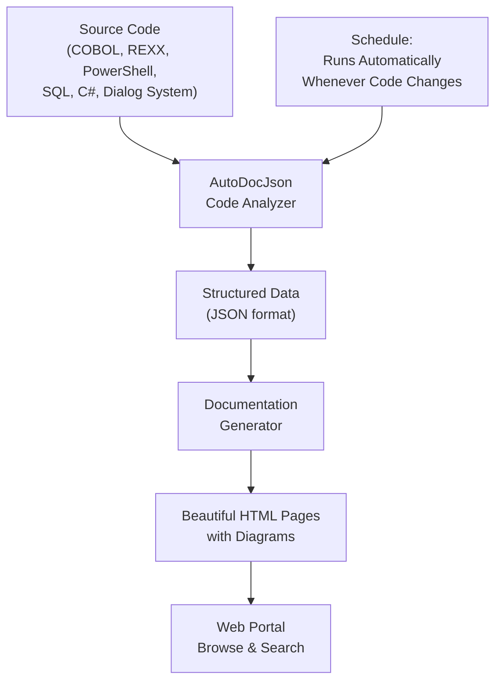

# AutoDocJson — The 24/7 Documentation Factory for Legacy Programs

## What It Does (The Elevator Pitch)

AutoDocJson automatically reads source code written in 6 different programming languages — including 40-year-old COBOL programs — and produces beautifully formatted, easy-to-read documentation complete with diagrams. It's like hiring a documentation team that works around the clock, never makes mistakes, and can read languages that most modern programmers have never seen.

## The Problem It Solves

Legacy systems — the old programs that run core business operations — are notoriously undocumented. The original programmers retired years ago, the code was written before documentation standards existed, and nobody currently on staff fully understands how it all works. When something breaks, or when the business wants to modernize, everyone asks: "What does this program actually do?" And nobody has a good answer.

Manual documentation is painfully slow and expensive. A skilled analyst might document 2–3 programs per day. With thousands of programs in a legacy estate, that's *years* of work at a cost of hundreds of thousands of dollars — and the documentation starts going stale the moment it's finished.

**The real-world analogy:** Imagine inheriting a factory full of machines built in the 1980s. None of them have user manuals. Your staff is afraid to touch anything because they don't know what each machine does or how it connects to the others. Now imagine a robot that can walk up to each machine, examine every component, and write a complete, illustrated manual — in hours, not years. That's AutoDocJson.

## How It Works

AutoDocJson works in three phases. First, the **Analysis** phase: the system reads each source code file and extracts everything important — what the program does, what data it uses, what other programs it calls, what database tables it reads or writes to. This works across six languages: COBOL (the 60-year-old language still running most banking systems), REXX (a scripting language common on mainframes), PowerShell (Windows automation), SQL (database queries), C# (modern application code), and Dialog System (screen/form definitions).

Second, the **Structuring** phase: all that extracted information is organized into a clean, structured format (JSON — think of it as a standardized template that any tool can read). This structured data becomes the "single source of truth" for each program's documentation.

Third, the **Presentation** phase: the structured data is transformed into beautifully formatted HTML documentation pages with flowcharts, dependency diagrams, and clear explanations. These pages are served through a web portal where anyone in the organization can browse and search — no technical skills needed.

The entire process runs automatically. Set it up once, and it regenerates documentation whenever source code changes. Your documentation is always up to date.

## Key Features

- **Six programming languages supported** — COBOL, REXX, PowerShell, SQL, C#, and Dialog System, covering both legacy and modern codebases
- **Automatic diagrams** — flowcharts and dependency maps are generated automatically, showing how programs connect to each other
- **Always up-to-date** — runs on a schedule so documentation refreshes whenever code changes
- **Web portal for browsing** — anyone can search and read documentation through a browser, no special tools needed
- **Structured JSON output** — documentation data is stored in a standardized format that other tools (including AI assistants) can consume
- **Batch processing** — can document an entire codebase of thousands of programs in a single automated run
- **Error tracking** — flags programs that couldn't be fully analyzed, so your team knows where manual review is needed

## How It Compares to Competitors

| Feature | **Dedge AutoDocJson** | Fujitsu App Transform | CodeAura | iBEAM IntDoc | CobolBreaker |
|---|---|---|---|---|---|
| **Languages supported** | 6 (COBOL, REXX, PS, SQL, C#, Dialog) | COBOL only | COBOL only | COBOL only | COBOL only |
| **Fully automated** | Yes | Yes | Yes | No (needs reviewers) | Yes |
| **Structured JSON output** | Yes | No | No (PDF/Markdown) | No | No |
| **Auto-generated diagrams** | Yes (Mermaid) | No | Yes (sequence) | No | Yes (Mermaid) |
| **Web portal** | Built-in | SaaS | Enterprise | Managed service | No |
| **Self-hosted** | Yes | Cloud only | Cloud only | Services-based | Yes |
| **Pricing** | One-time license | Enterprise SaaS | Enterprise | Per-engagement | Free (immature) |

**Dedge's advantage:** AutoDocJson is the only tool on the market that documents across *six* programming languages in a single automated pipeline. Every competitor focuses exclusively on COBOL, leaving organizations to find separate tools for their REXX scripts, PowerShell automation, SQL stored procedures, C# applications, and Dialog System definitions. AutoDocJson provides one tool, one output format, one searchable portal — for everything. The structured JSON output also means the documentation data can feed into other Dedge products (like AiDoc.WebNew for AI-powered search), creating a value chain no competitor can match.

## Screenshots

## Revenue Potential

**Target Market:** Any organization maintaining legacy COBOL, REXX, or mixed-language systems — primarily banking, insurance, government, healthcare, and transportation. Fujitsu estimates 775 billion lines of COBOL are still in active use globally.

**Pricing Model Ideas:**

| Tier | Price | Includes |
|---|---|---|
| **Starter** | $8,000 one-time + $1,600/year | Up to 5,000 source files, 2 languages |
| **Professional** | $18,000 one-time + $3,600/year | Up to 25,000 source files, all 6 languages |
| **Enterprise** | $40,000 one-time + $8,000/year | Unlimited source files, all languages, custom templates, priority support |

**Revenue Projection:** The legacy modernization market is valued at $16 billion (2025) and growing 16% annually. Documentation is the first step of every modernization project. With 10,000+ organizations worldwide running legacy COBOL systems, capturing just 0.5% at the Professional tier generates $900K+ in first-year revenue, plus recurring support.

## What Makes This Special

1. **Six languages, one tool.** No stitching together separate COBOL analyzers, PowerShell documenters, and SQL parsers. One tool reads everything, one portal shows everything, one JSON format structures everything.

2. **Documentation that never goes stale.** Because AutoDocJson runs automatically whenever code changes, your documentation is always current. This alone saves thousands of hours of manual maintenance per year.

3. **The JSON backbone enables an ecosystem.** The structured JSON output isn't just for reading — it's a data format that feeds into AI search (AiDoc.WebNew), system analysis (SystemAnalyzer), and future Dedge products. Buying AutoDocJson is buying into a platform, not just a tool.

4. **Built by people who live in legacy environments.** Unlike Silicon Valley startups that treat COBOL as a curiosity, Dedge builds tools for organizations where COBOL, REXX, and DB2 are the daily reality. AutoDocJson handles the real-world messiness — non-standard coding patterns, missing copybooks, mixed-language systems — that academic tools choke on.
