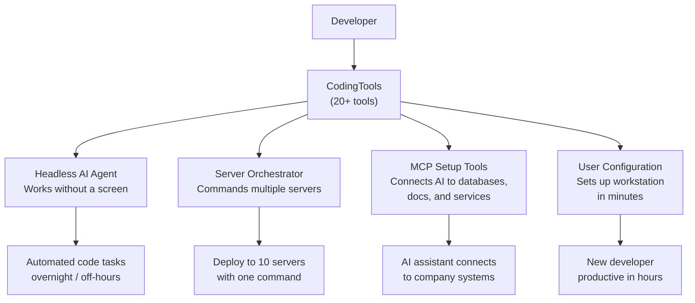

# CodingTools (DedgePsh) — The Swiss Army Knife for AI-Assisted Development

## What It Does (The Elevator Pitch)

Think of a Swiss Army knife — one tool that contains a blade, screwdriver, scissors, and a dozen other tools you didn't know you needed. **CodingTools** is exactly that, but for developers working with AI assistants.

It's a collection of 20+ specialized tools that supercharge how developers work with AI. The standout tools include a **headless AI agent** (an AI that can work on tasks without anyone watching the screen — like a virtual employee that works overnight), a **server orchestrator** (a coordinator that sends commands to multiple computers at once, like a manager delegating tasks to a team), and setup utilities that configure developer environments in minutes instead of hours.

## The Problem It Solves

Modern development teams juggle dozens of tools, servers, and AI assistants. Setting up a new developer's workstation takes days. Running a task across 10 servers means logging into each one individually. AI assistants are powerful but need careful configuration to work with company systems.

CodingTools eliminates this friction:
- **New developer setup**: Instead of a 3-day onboarding process, a single command configures everything
- **Multi-server operations**: Instead of repeating the same task on 10 servers, issue one command that runs everywhere
- **AI agent automation**: Instead of a developer manually asking an AI to do tasks, the headless agent runs unattended — processing work overnight or during off-hours

## How It Works

Here's how the key components work:

1. **Headless AI Agent** — Imagine hiring a very fast intern who can read code, follow instructions, and work 24/7 without supervision. The headless agent is that intern. You give it a task ("update all log files to use the new format"), and it works through the codebase on its own.
2. **Server Orchestrator** — Picture a conductor leading an orchestra. Instead of telling each musician individually what to play, the conductor gives one signal and everyone plays together. The orchestrator sends commands to multiple servers simultaneously.
3. **MCP Setup Tools** — MCP (Model Context Protocol) is a way for AI assistants to talk to external systems like databases and documentation. These tools set up those connections automatically — like plugging cables into the right sockets.
4. **User Configuration** — A single tool that installs required software, sets up folder structures, configures security settings, and connects to company resources. What used to take a technician 2–3 days now takes 30 minutes.

## Key Features

- **20+ specialized tools** covering development, deployment, AI configuration, and system administration
- **Headless AI agent** that runs unattended for batch processing and overnight automation
- **Multi-server orchestration** — issue one command, execute on many machines
- **MCP configuration** — automatically connects AI assistants to databases, documentation, and internal services
- **One-command developer setup** — new team members are productive in hours, not days
- **PowerShell-native** — works natively on Windows Server environments without additional runtime dependencies (PowerShell is a task automation language built into Windows)
- **Modular design** — use only the tools you need; each tool works independently

## How It Compares to Competitors

> **Note:** No competitor JSON file was found for this product. The comparison below is based on the general market landscape.

| Feature | CodingTools | Ansible/Puppet | Custom Scripts | AI IDE Plugins |
|---|---|---|---|---|
| **Headless AI agent** | Built-in | No | Must build | No |
| **Server orchestration** | Built-in | Core feature | Must build | No |
| **AI assistant configuration** | Automated MCP setup | No | Must build | Partial |
| **Developer onboarding** | One command | Playbook-based | Must build | No |
| **Windows Server focus** | Native | Add-on | Varies | No |
| **Learning curve** | Low (PowerShell) | High (YAML/DSL) | Varies | Low |
| **Cost** | License fee | Free–Enterprise | Developer time | Plugin fees |

**Key takeaway:** Ansible and Puppet are powerful server management tools, but they don't include AI integration. AI IDE plugins add AI features but can't manage servers. CodingTools bridges both worlds — AI automation *and* infrastructure management in one toolkit.

## Screenshots

## Revenue Potential

### Licensing Model
- **Per-team license** — covers all developers on a team
- **Enterprise license** — organization-wide deployment
- **Support tier** — includes configuration assistance and custom tool development

### Target Market
- **Development teams** (5–100+ developers) using AI-assisted development on Windows infrastructure
- **DevOps teams** managing fleets of Windows Servers
- **Organizations** with complex onboarding processes that want to reduce new-developer ramp-up time

### Revenue Drivers
- Developer onboarding costs average $10,000–$25,000 per new hire (time, training, lost productivity). Reducing this by 50–80% has clear ROI
- Headless AI agent enables "overnight automation" — work that was previously impossible without human presence
- Server orchestration replaces expensive enterprise tools or fragile custom scripts

### Estimated Pricing
- **Team** (up to 10 developers): $3,000/year
- **Department** (up to 50 developers): $10,000/year
- **Enterprise** (unlimited): $25,000+/year

## What Makes This Special

1. **AI-first design** — Unlike traditional DevOps tools that had AI bolted on later, CodingTools was built from the ground up for AI-assisted workflows. The headless agent and MCP configuration are core features, not afterthoughts.
2. **The overnight worker** — The headless AI agent is a genuine differentiator. No competitor offers an unattended AI that can process codebases, apply changes, and report results without human supervision.
3. **Windows Server expertise** — Most DevOps tooling targets Linux. CodingTools is purpose-built for Windows Server environments, filling a significant gap in the market.
4. **One toolkit, many problems** — Instead of buying separate tools for onboarding, server management, and AI configuration, teams get everything in one integrated package.
5. **Real-world origins** — Every tool in the collection was built to solve a real problem in production environments, not as a theoretical exercise.
