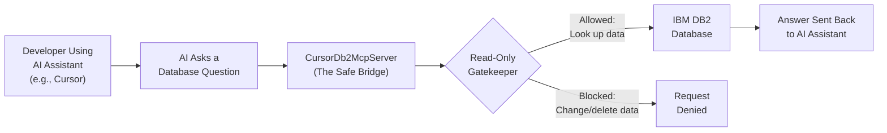

# CursorDb2McpServer — The Safe Translator Between AI Assistants and Your Database

## What It Does (The Elevator Pitch)

CursorDb2McpServer is a secure bridge that lets AI coding assistants — like Cursor — look up information in IBM DB2 databases without any risk of changing or deleting data. Think of it as a "read-only translator" that lets the AI ask questions about your data, but *never* touch it.

## The Problem It Solves

Developers spend enormous amounts of time manually looking up database information. "What columns are in the CUSTOMER table?" "What's the relationship between ORDERS and INVOICES?" "Show me the last 50 transactions." Each question means switching to a database tool, writing a query, copying the results, and pasting them back into the coding environment. Multiply that by dozens of lookups per day across a team, and you've got thousands of hours wasted on what should be instant.

**The real-world analogy:** Imagine a secure glass window at a bank vault. A customer (the AI assistant) can walk up to the window and ask "How many gold bars are in vault 7?" The banker (CursorDb2McpServer) looks, counts, and reports back. But the glass window means the customer can never reach in and take or move anything. The bridge gives the AI *eyes* into the database, but no *hands*.

## How It Works

When a developer is working in an AI coding assistant like Cursor, they often need to understand the database they're writing code for. Instead of switching to a separate database tool, the developer simply asks the AI: "What does the CUSTOMER table look like?" or "Show me the indexes on the ORDERS table."

The AI routes this question through CursorDb2McpServer, which acts as a translator. It converts the AI's question into something the IBM DB2 database understands, sends it through, and brings back the answer — all in the background, in seconds. The developer never leaves their coding environment.

The critical safety feature is the **read-only gatekeeper**. Every single request is checked before it reaches the database. If the AI (or the developer) accidentally tries to run something that would change data — an UPDATE, DELETE, INSERT, or any modification — the gatekeeper blocks it immediately. This means the database is 100% safe from accidental AI-driven changes.

## Key Features

- **Read-only by design** — physically impossible for the AI to modify, delete, or corrupt any data
- **Works inside the developer's AI assistant** — no need to switch tools or copy-paste between applications
- **Understands DB2 natively** — built specifically for IBM DB2, the database used by banks, governments, and major enterprises worldwide
- **Instant answers** — database lookups happen in seconds, not the minutes it takes to manually write and run queries
- **Secure connection** — uses the same enterprise-grade security as your existing database connections
- **Zero configuration for developers** — once set up by an administrator, developers simply ask questions in plain English
- **MCP standard** — uses the Model Context Protocol (MCP — a universal standard for connecting AI assistants to tools), meaning it works with any MCP-compatible AI assistant, not just Cursor

## How It Compares to Competitors

| Feature | **Dedge CursorDb2McpServer** | DBeaver AI | DataGrip AI | Chat2DB | VS Code + Copilot |
|---|---|---|---|---|---|
| **AI-native database access** | Built-in MCP bridge | Separate AI add-on | Separate subscription | Built-in AI | Separate Copilot sub |
| **Works inside AI assistant** | Yes (seamless) | No (separate app) | No (separate app) | No (separate app) | Partial |
| **Read-only safety guarantee** | Enforced at bridge level | User responsibility | User responsibility | User responsibility | User responsibility |
| **Native DB2 support** | First-class | Enterprise tier only | Limited | No | No |
| **MCP standard** | Yes | No | No | No | No |
| **Cost** | One-time license | $249–$499/year | $109–$259/year | Free–Enterprise | $10–19/month |

**Dedge's advantage:** No other product offers a dedicated, read-only AI-to-database bridge. Competitors either require developers to use a separate application (defeating the purpose of AI integration) or rely on the developer to avoid running destructive queries (a risk in production environments). CursorDb2McpServer is the *only* product that enforces safety at the infrastructure level while living natively inside the AI assistant workflow. For organizations running IBM DB2 — which has limited support in most competitor tools — this is a critical differentiator.

## Screenshots

## Revenue Potential

**Target Market:** Any enterprise running IBM DB2 databases with development teams using AI-powered coding tools. This includes virtually all major banks, insurance companies, government agencies, and airlines — industries where DB2 is the backbone of operations.

**Pricing Model Ideas:**

| Tier | Price | Includes |
|---|---|---|
| **Team** | $3,000 one-time + $600/year support | Up to 10 developers, 1 DB2 instance |
| **Department** | $8,000 one-time + $1,500/year support | Up to 50 developers, 5 DB2 instances |
| **Enterprise** | $20,000 one-time + $4,000/year support | Unlimited developers, unlimited instances, priority support |

**Revenue Projection:** As AI-assisted coding becomes standard (projected 90% developer adoption by 2028), every DB2-dependent organization will need a safe bridge. With an estimated 5,000+ enterprises running DB2 globally, even 2% market penetration at the Department tier generates $800K+ annually in recurring support revenue alone.

## What Makes This Special

1. **Safety is not optional, it's architectural.** Other tools ask developers to be careful. CursorDb2McpServer makes it *impossible* to accidentally damage data. For regulated industries like banking, this is the difference between "we hope nothing goes wrong" and "nothing *can* go wrong."

2. **The developer never leaves their flow.** Context-switching (moving between different applications) is the #1 productivity killer for developers. By bringing database knowledge directly into the AI assistant, developers stay focused and productive.

3. **Built for DB2, the enterprise workhorse.** While competitors treat DB2 as an afterthought (if they support it at all), CursorDb2McpServer is built from the ground up for DB2's unique features, data types, and query language.

4. **MCP is the future.** The Model Context Protocol is becoming the standard for AI tool integration. Being MCP-native means CursorDb2McpServer will work with tomorrow's AI assistants just as well as today's — it's future-proof.
