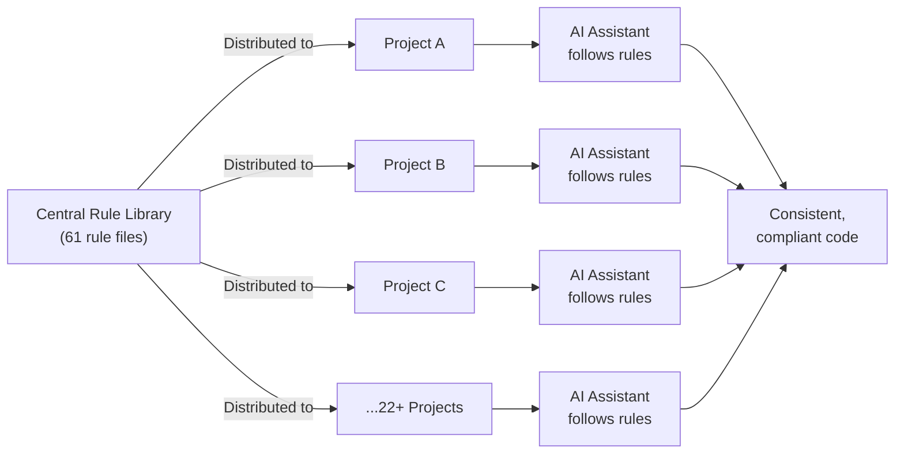

# CursorRulesLibrary — The Company Policy Handbook for AI Assistants

## What It Does (The Elevator Pitch)

Imagine every new employee at your company gets a thick handbook on Day 1: "Here's how we name files. Here's how we handle customer data. Here's our coding style." Now imagine that every AI coding assistant in your organization gets the same handbook — automatically, across every project, with zero effort from the developers.

**CursorRulesLibrary** is that handbook. It's a collection of 61 rule files that tell AI assistants (tools like Cursor, GitHub Copilot, and similar) exactly how to behave when writing code for your organization. These rules are distributed across 22+ projects, ensuring every AI assistant follows the same standards — whether it's writing a database query, building a web page, or deploying software to a server.

## The Problem It Solves

Without CursorRulesLibrary, every developer configures their AI assistant differently. One developer's AI writes code using American date formats; another uses European. One AI creates files in the wrong folder. Another ignores security best practices. The result? Inconsistent code, wasted time fixing AI mistakes, and potential security vulnerabilities.

It's like having 50 employees, each following a different set of company policies — chaos.

CursorRulesLibrary solves this by giving every AI assistant across the organization the same playbook, updated centrally and distributed automatically.

## How It Works

Here's the step-by-step:

1. **A standards team creates rules** — These are plain-English instructions stored in small files. Example: "Always use encrypted connections to databases" or "Name log files with the date and computer name."
2. **Rules are stored centrally** — All 61 rules live in one place (a version-controlled repository — think of it as a shared folder with full change tracking).
3. **Rules are distributed to every project** — When a project is set up or updated, it automatically receives the latest rules. No manual copying required.
4. **AI assistants read the rules** — When a developer uses an AI assistant (like Cursor) in any of those projects, the AI reads the rules and follows them automatically.
5. **Updates flow outward** — Change a rule in the central library, and the next time projects sync, every AI assistant across the organization gets the update.

## Key Features

- **61 specialized rule files** covering coding standards, database handling, security, deployment, file naming, and more
- **Cross-project consistency** — distributed to 22+ projects simultaneously
- **Includes Skills** — pre-built AI workflows (like recipes for complex tasks) that AI assistants can follow step-by-step
- **Includes MCP configurations** — settings that let AI assistants connect to external tools (databases, documentation systems, etc.)
- **Version-controlled** — every change is tracked, so you can see who changed what and when, and roll back if needed
- **Zero runtime cost** — the rules are just text files; they don't slow anything down or require servers
- **Works with multiple AI tools** — primarily Cursor, but the patterns apply to any AI coding assistant that supports rule files

## How It Compares to Competitors

| Feature | CursorRulesLibrary | CRules CLI | Veritos | Cursor Team Rules | Community Templates |
|---|---|---|---|---|---|
| **Number of rules** | 61 battle-tested | User-created | User-created | User-created | Generic templates |
| **Domain-specific depth** | Deep (DB2, COBOL, .NET, deployment) | Generic | Varies | Basic | Shallow |
| **Distribution method** | Git-native, self-hosted | GitHub sync | SaaS (cloud) | Built into Cursor | Manual copy |
| **Includes AI Skills** | Yes | No | No | No | No |
| **Includes MCP configs** | Yes | No | No | No | No |
| **Pricing** | License fee | Free | Enterprise SaaS | Included with Cursor Teams | Free |
| **Requires cloud service** | No (self-hosted) | No | Yes | No | No |
| **Audit trail** | Git history | Git history | Built-in | Limited | None |

**Key takeaway:** Competitors provide the *mechanism* to distribute rules, but CursorRulesLibrary provides the *content* — 61 proven, production-tested rules covering real enterprise scenarios. It's the difference between selling an empty filing cabinet versus selling a complete, organized set of company policies.

## Screenshots

## Revenue Potential

### Licensing Model
- **Per-organization license** — sold to companies adopting AI-assisted development
- **Tiered pricing** based on number of developers/seats
- **Annual subscription** for ongoing rule updates and new domain additions

### Target Market
- **Mid-to-large enterprises** (50–5,000+ developers) adopting AI coding tools
- **Regulated industries** (finance, healthcare, government) that need AI governance
- **Companies with legacy systems** (COBOL, DB2) where specialized AI rules are critical

### Revenue Drivers
- Organizations spend $500–$2,000+ per developer per year on AI coding tools — adding a $50–$200/developer/year governance layer is a natural upsell
- Regulatory compliance pressure is growing: AI governance will become mandatory in many industries
- The library grows more valuable over time as more rules and domains are added

### Estimated Pricing
- **Starter** (up to 25 developers): $2,500/year
- **Professional** (up to 100 developers): $7,500/year
- **Enterprise** (unlimited): $20,000+/year
- **Custom rule development**: $5,000–$15,000 per engagement

## What Makes This Special

1. **Content, not just infrastructure** — While competitors sell empty frameworks, CursorRulesLibrary includes 61 production-tested rules built from real enterprise experience. Customers get immediate value on Day 1.
2. **Enterprise-domain expertise** — Rules cover specialized areas like DB2 databases, COBOL integration, and Windows Server deployment that no competitor addresses.
3. **Skills and MCP integration** — Goes beyond simple rules to include multi-step AI workflows and external tool connections, creating a complete AI governance ecosystem.
4. **Self-hosted and private** — No company data leaves the organization. Rules are text files in Git — no cloud dependency, no third-party access to your standards.
5. **Battle-tested** — Every rule exists because a real problem occurred in production. These aren't theoretical best practices — they're lessons learned from operating enterprise software at scale.
