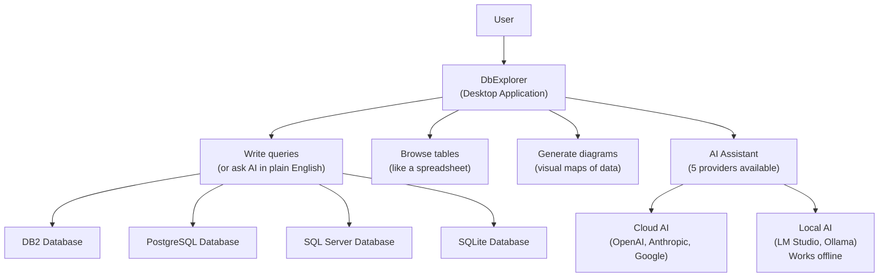

# DbExplorer — Your AI-Powered Window into Any Database

## What It Does (The Elevator Pitch)

Imagine a smart spreadsheet that connects to your company's databases and comes with a built-in AI assistant. You can browse data like a spreadsheet, but you can also ask the AI questions in plain English: "Show me all customers who haven't ordered in 6 months," and it writes the technical query for you, runs it, and displays the results.

**DbExplorer** is a desktop application that lets anyone — from database experts to curious business analysts — explore, query, and understand databases. It supports four major database systems (DB2, PostgreSQL, SQL Server, and SQLite) and includes five different AI providers, including options that work completely offline for sensitive environments.

## The Problem It Solves

Databases hold the most valuable data in any organization, but accessing that data is frustrating:
- **Business people can't query databases** — They need to ask a developer to write a query, wait hours or days for results, and hope they asked the right question
- **Developers juggle multiple tools** — One tool for DB2, another for PostgreSQL, a third for SQL Server. Each has different interfaces, shortcuts, and quirks
- **Understanding relationships is hard** — "How does the Customers table relate to Orders, which connects to Products?" requires reading documentation or asking someone who built the system
- **AI tools require internet** — In secure environments (banking, government, military), sending database information to cloud-based AI services is forbidden

DbExplorer solves all of this with one desktop app that works with multiple databases and multiple AI providers — including ones that run entirely on your local machine.

## How It Works

Here's the step-by-step:

1. **Connect to your databases** — Add connection details for your DB2, PostgreSQL, SQL Server, or SQLite databases. DbExplorer remembers them for next time.
2. **Browse like a spreadsheet** — Click on a table name and see its data in a familiar grid view. Sort, filter, and scroll through records.
3. **Ask the AI** — Don't know SQL? Just type a question in plain English: "Show me the top 10 customers by revenue last quarter." The AI writes the query, you approve it, and the results appear.
4. **Generate visual diagrams** — Click a button and DbExplorer generates a Mermaid ERD (Entity Relationship Diagram — a visual map showing how tables connect to each other). Perfect for documentation or presentations.
5. **Switch AI providers** — Choose from 5 AI providers depending on your needs: cloud-based for power (OpenAI, Anthropic, Google), or local for privacy (LM Studio, Ollama — these run entirely on your machine with no internet required).

## Key Features

- **4 database systems** — DB2, PostgreSQL, SQL Server, and SQLite in one application
- **5 AI providers** — OpenAI, Anthropic (Claude), Google (Gemini), LM Studio, and Ollama. Mix cloud power with local privacy.
- **Natural language queries** — Ask questions in plain English; the AI writes the SQL
- **Offline AI capability** — LM Studio and Ollama run entirely on your machine. No data leaves your computer — critical for secure environments.
- **Mermaid ERD generation** — Automatically visualize how database tables relate to each other
- **AI explains data** — The AI can explain what it found, spot patterns, and suggest follow-up questions
- **Desktop application** — Runs natively on Windows. No browser, no web server, no cloud dependency.
- **First-class DB2 support** — DB2 is a major enterprise database (used in banking, insurance, government) that many tools poorly support or ignore entirely

## How It Compares to Competitors

| Feature | DbExplorer | DBeaver | DataGrip | Chat2DB | VS Code + MSSQL | DbVisualizer |
|---|---|---|---|---|---|---|
| **AI providers** | 5 (cloud + local) | 4 (cloud only in Pro) | Requires separate subscription | Own AI service | Copilot ($10–19/mo extra) | 1 |
| **Offline/local AI** | Yes (LM Studio, Ollama) | No | No | No | No | No |
| **DB2 support** | First-class | Enterprise tier only | Limited | No | No | Yes |
| **Mermaid ERD** | Built-in | No | No | Yes | No | No |
| **Natural language queries** | Yes | Yes (Pro) | Yes (paid add-on) | Yes | Yes (Copilot) | Yes (Pro) |
| **Pricing** | License fee | Free–$499/yr | $109–$259/yr | Free–Enterprise | Free + $10–19/mo Copilot | Free–$199/yr |
| **Platform** | Windows desktop | Cross-platform | Cross-platform | Cross-platform | Cross-platform | Cross-platform |

**Key takeaway:** DBeaver is the market leader but charges for AI features and DB2. DataGrip requires a separate AI subscription. Chat2DB ties you to their AI service. DbExplorer is unique in offering 5 switchable AI providers (including offline-capable local models), built-in Mermaid ERD, and first-class DB2 support — all in one desktop application.

## Screenshots

## Revenue Potential

### Licensing Model
- **Individual license** — per-seat for professional use
- **Team license** — discounted multi-seat packages
- **Enterprise license** — organization-wide with volume pricing
- **Free trial** — time-limited or feature-limited to drive adoption

### Target Market
- **Enterprise IT teams** working with DB2 (banking, insurance, government — a large, underserved market)
- **Database administrators** who manage multiple database types
- **Business analysts** who need data access without SQL knowledge
- **Secure environments** (government, defense, healthcare) where cloud AI is prohibited — local AI capability is the selling point

### Revenue Drivers
- DBeaver Pro costs $249–$499/year and has millions of users — the database tools market is large and proven
- DB2 shops are historically underserved by modern tooling — DbExplorer fills a real gap
- The "offline AI" capability opens the secure/government market that cloud-only tools cannot reach
- Natural language queries democratize database access, expanding the user base from developers to business users

### Estimated Pricing
- **Individual**: $99/year
- **Team** (5 seats): $399/year
- **Enterprise** (25 seats): $1,499/year
- **Enterprise unlimited**: $4,999/year

## What Makes This Special

1. **Five AI providers, including offline** — No other database tool offers 5 switchable AI providers with local/offline options. For government and finance clients who cannot send data to the cloud, this is the only game in town.
2. **First-class DB2 support** — DB2 is used by 97% of Fortune 500 companies for critical workloads, yet most modern database tools treat it as an afterthought. DbExplorer makes DB2 a first-class citizen.
3. **Mermaid ERD built in** — One-click visual database diagrams using the Mermaid standard. Paste them into GitHub, Confluence, or Notion and they render automatically.
4. **Democratizes data access** — Business analysts who never learned SQL can now query databases in plain English. This shifts data access from a bottleneck (waiting for a developer) to self-service.
5. **Desktop-first privacy** — Everything runs on the user's machine. No web server, no cloud service, no data exfiltration risk. The application and its AI can operate in a completely air-gapped environment (a network with no internet connection).
