# Dedge Product Portfolio — Complete Business Guide

> **CONFIDENTIAL** — For internal Dedge stakeholders only.
> Last updated: 2026-03-31

---

## About This Document

This is the complete business guide to every product in the Dedge portfolio. It is written for someone with **no programming experience** who needs to understand, market, and sell all 39 Dedge products.

Every technical concept is explained in plain language the first time it appears. A full glossary at the end defines every technical term used anywhere in the document. Diagrams are included throughout — these are generated from a simple text format called **Mermaid** that renders as visual charts in most modern documentation tools (GitHub, Notion, Confluence, and many others).

This document covers:
- What each product does and why businesses need it
- Who the competitors are and how Dedge wins
- How to price, position, and sell each product
- The overall business strategy, market opportunities, and revenue models

If you can read a restaurant menu, you can read this document.

---

## Quick Reference Card

| # | Product Name | Category | One-Line Pitch | Revenue Potential | Top Competitor |
|---|---|---|---|---|---|
| 1 | AiDoc.WebNew | Enterprise AI | Turns company documents into an AI-searchable knowledge brain | $500K–$2M/yr | AnythingLLM |
| 2 | CursorDb2McpServer | Enterprise AI | Safe, read-only bridge between AI assistants and DB2 databases | $800K+/yr recurring | DBeaver AI |
| 3 | AutoDocJson | Enterprise AI | Automatically documents legacy code in 6 languages with diagrams | $900K+ first year | Fujitsu App Transform |
| 4 | SystemAnalyzer | Enterprise AI | AI-powered X-ray machine for legacy code — maps every connection | $2M–$5M/yr (3-year) | CAST Imaging |
| 5 | ServerMonitor | Enterprise AI | One-screen health dashboard for all your servers with DB2 awareness | $1.2M licenses + $240K recurring | Datadog |
| 6 | GenericLogHandler | Enterprise AI | Centralized log management using your existing database | $1.5M licenses + $300K recurring | Splunk |
| 7 | GitHist | Enterprise AI | Turns developer commit history into business-readable timelines | $2M+ licenses + $400K recurring | SumGit |
| 8 | CursorRulesLibrary | Developer Tools | 61-rule policy handbook for AI coding assistants across 22+ projects | $20K+/yr per enterprise | Veritos |
| 9 | CodingTools | Developer Tools | Swiss Army knife: headless AI agent, server orchestrator, setup tools | $25K+/yr per enterprise | Ansible/Puppet |
| 10 | DevDocs | Developer Tools | Internal company Wikipedia with web viewer, no per-user fees | $10K/yr per organization | Confluence |
| 11 | DedgeCommon | Developer Tools | Shared foundation layer powering every Dedge application | Platform enabler | N/A (unique) |
| 12 | DedgeAuth | Developer Tools | One login for every app — password, magic link, or Windows SSO | $30K+/yr per enterprise | Auth0 (Okta) |
| 13 | Pwsh2CSharp | Developer Tools | Automatic PowerShell-to-C# code translator (80–90% automated) | $100K+ per engagement | CodePorting AI |
| 14 | **SqlMermaidErdTools** | **Commercial** | Bidirectional SQL-to-diagram converter, 31+ database dialects | **SaaS recurring** | dbdiagram.io |
| 15 | **SqlMmdConverter** | **Commercial** | NuGet package for SQL-to-Mermaid conversion (predecessor product) | **Freemium gateway** | mermerd |
| 16 | **DbExplorer** | **Commercial** | AI-powered database explorer with 5 AI providers including offline | **SaaS recurring** | DBeaver |
| 17 | Pdf2Markdown | Utility | Converts PDFs to clean Markdown with embedded images | Bundled / consulting | Marker |
| 18 | VcHelpExport | Utility | Digitizes legacy Visual COBOL help docs for AI search | Consulting enabler | Pandoc (DIY) |
| 19 | SiteGrabber | Utility | Downloads entire websites for offline browsing (JavaScript-aware) | $499/yr enterprise | HTTrack |
| 20 | MouseJiggler | Utility | Keeps your computer awake with Bluetooth proximity detection | $4.99–$14.99 per user | Arkane MouseJiggler |
| 21 | RemoteConnect | Utility | Address book for remote desktop connections with encrypted passwords | $999/yr enterprise | Royal TS |
| 22 | Html2Markdown | Utility | Converts HTML content into clean, structured Markdown | Bundled / consulting | Pandoc |
| 23 | OnePager | Web Property | Professional one-page WordPress business theme with 13 sections | White-label service | Elementor |
| 24 | Lillestrøm Osteopati (Static) | Web Property | Live healthcare clinic website — static HTML version | Client project fee | Squarespace |
| 25 | Lillestrøm Osteopati (WordPress) | Web Property | Live healthcare clinic website — client-editable WordPress version | Repeatable template | Wix |
| 26 | DedgePsh Module Library | Platform Foundation | 37 reusable PowerShell modules powering the entire Dedge ecosystem | $15K–$30K/yr complete library | N/A (unique) |
| 27 | DedgePsh AdminTools | DevTools Suite | 42 tools for user management, deployment, monitoring, and server admin | $15K–$50K/yr enterprise | PDQ Deploy |
| 28 | DedgePsh AI Tools | DevTools Suite | 3 tools for private on-premises AI deployment and testing | $5K–$15K/yr | N/A (unique) |
| 29 | DedgePsh AzureTools | DevTools Suite | 10 tools for Azure storage, DevOps, Key Vault, and work tracking | $8K–$25K/yr | Azure CLI (DIY) |
| 30 | DedgePsh DatabaseTools | DevTools Suite | 41 tools for Db2/PostgreSQL backup, setup, security, and diagnostics | $25K–$75K/yr | IBM Data Studio |
| 31 | DedgePsh FixJobs | DevTools Suite | 7 migration and repair scripts for infrastructure transitions | Consulting accelerator | N/A (unique) |
| 32 | DedgePsh GitTools | DevTools Suite | 4 tools for automated Git sync, code search, and ServiceNow integration | $150K–$400K/engagement | Git LFS (DIY) |
| 33 | DedgePsh InfrastructureTools | DevTools Suite | 24 tools for server provisioning, deployment, monitoring, and AI infra | $30K–$80K/yr | Ansible |
| 34 | DedgePsh LegacyCodeTools | DevTools Suite | 17 tools for COBOL compilation, deployment, and documentation | $300K–$800K/engagement | Micro Focus |
| 35 | DedgePsh LogTools | DevTools Suite | 3 tools for fleet-wide log collection, POS investigation, and cleanup | $100K–$250K/yr | Splunk |
| 36 | DedgePsh SystemTools | DevTools Suite | 2 tools for Windows dark mode and wallpaper policy fixes | Brand builder (free) | N/A |
| 37 | DedgePsh UtilityTools | DevTools Suite | 14 tools for PDF conversion, RAM disks, file locks, and IDE repair | $100K–$300K/enterprise | N/A (unique) |
| 38 | DedgePsh WebSites | DevTools Suite | 4 tools for IIS deployment, authentication, logging, and icon browsing | $400K–$1M/enterprise | Octopus Deploy |

---

## How to Read This Guide

This guide is organized into **eleven parts**:

1. **The Big Picture** — A 30-second summary of what Dedge does and how the products connect
2. **Enterprise AI & Monitoring** — The heavy-hitters: AI-powered tools for large companies with old systems
3. **Developer Productivity** — Tools that make software developers faster and more consistent
4. **Commercial Products** — The direct money-makers with online stores and subscriptions
5. **Utility Tools** — Smaller, focused tools that solve everyday problems
6. **Web Properties** — Websites and templates that demonstrate and sell Dedge's capabilities
7. **PowerShell Module Library** — The 37 reusable building blocks that power every Dedge application
8. **DevTools Suite** — 201 operational tools across 12 categories that manage the entire infrastructure lifecycle
9. **Business Strategy** — Revenue models, pricing, go-to-market, and market opportunities
10. **How to Demo Each Product** — Demo scripts and talking points for sales conversations
11. **Screenshot Gallery** — Visual references for every product

**About the diagrams:** Throughout this document, you'll see blocks of text labeled with "mermaid" that render as visual flowcharts, org charts, and relationship maps. If you're reading this in GitHub, Notion, or a Markdown viewer, they'll appear as interactive diagrams. If you're reading in a plain text editor, the text itself describes the flow — read it like a list of connections.

**About competitor tables:** Each product section includes the top 3 competitors with pricing and key differences. The full competitor research lives in the `competitors/` folder as JSON files.

---

# Part 1: The Big Picture

## What Dedge Does (The 30-Second Elevator Pitch)

Dedge builds software tools that help companies manage, understand, and modernize their technology — especially companies running older systems (called "legacy systems") that still power critical operations like banking, insurance, and government services.

Think of it this way: many large companies have computer systems from the 1980s and 1990s that still handle millions of transactions every day. Nobody fully understands how these systems work anymore because the people who built them retired years ago. Dedge builds the tools that let companies see inside these old systems, document what they do, connect them to modern AI, and eventually modernize them — all without breaking anything.

On top of that, Dedge builds tools that software developers use every day to be more productive, plus a handful of commercial products sold directly to customers through online stores.

## The Product Categories

```mermaid
flowchart TD
    DEDGE["🏢 Dedge Product Portfolio\n39 Products"]
    
    DEDGE --> EA["Enterprise AI &\nMonitoring\n7 products"]
    DEDGE --> DP["Developer\nProductivity\n6 products"]
    DEDGE --> CP["Commercial\nProducts\n3 products"]
    DEDGE --> UT["Utility\nTools\n6 products"]
    DEDGE --> WP["Web\nProperties\n3 products"]
    DEDGE --> ML["PowerShell\nModule Library\n37 modules"]
    DEDGE --> DT["DevTools\nSuite\n201 tools / 12 categories"]
    
    EA --> EA1["AiDoc.WebNew"]
    EA --> EA2["CursorDb2McpServer"]
    EA --> EA3["AutoDocJson"]
    EA --> EA4["SystemAnalyzer"]
    EA --> EA5["ServerMonitor"]
    EA --> EA6["GenericLogHandler"]
    EA --> EA7["GitHist"]
    
    DP --> DP1["CursorRulesLibrary"]
    DP --> DP2["CodingTools"]
    DP --> DP3["DevDocs"]
    DP --> DP4["DedgeCommon"]
    DP --> DP5["DedgeAuth"]
    DP --> DP6["Pwsh2CSharp"]
    
    CP --> CP1["SqlMermaidErdTools"]
    CP --> CP2["SqlMmdConverter"]
    CP --> CP3["DbExplorer"]
    
    UT --> UT1["Pdf2Markdown"]
    UT --> UT2["VcHelpExport"]
    UT --> UT3["SiteGrabber"]
    UT --> UT4["MouseJiggler"]
    UT --> UT5["RemoteConnect"]
    UT --> UT6["Html2Markdown"]
    
    WP --> WP1["OnePager Theme"]
    WP --> WP2["Lillestrøm Osteopati\n(Static + WordPress)"]

    ML --> ML1["Database (3)"]
    ML --> ML2["Infrastructure (7)"]
    ML --> ML3["AI & Automation (3)"]
    ML --> ML4["Security (3)"]
    ML --> ML5["Communication (3)"]

    DT --> DT1["AdminTools (42)"]
    DT --> DT2["DatabaseTools (41)"]
    DT --> DT3["InfrastructureTools (24)"]
    DT --> DT4["LegacyCodeTools (17)"]
    DT --> DT5["+ 8 more categories"]
```

## How the Products Connect to Each Other

The Dedge products are not isolated — many of them work together as a platform. Here's how the ecosystem flows:

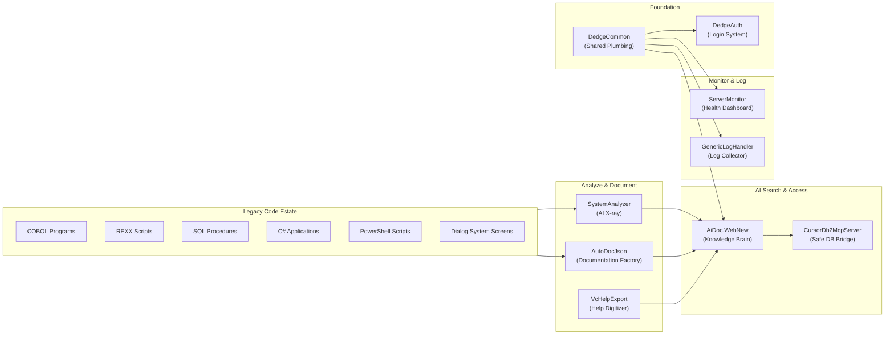

## The Dedge Ecosystem Advantage

One of Dedge's strongest competitive advantages is that the products work *together* as a platform. Here's a real-world example of how a customer journey might look:

**Scenario: A Norwegian bank wants to modernize their COBOL systems**

1. **Week 1:** They buy **SystemAnalyzer** to scan their 15,000 COBOL programs and understand what they have. The AI produces plain-English explanations of every program.
2. **Week 3:** They add **AutoDocJson** to generate permanent, web-browsable documentation for every program, in every language (COBOL, REXX, SQL, PowerShell, C#, Dialog System).
3. **Month 2:** They deploy **AiDoc.WebNew** to make all that documentation searchable by their AI assistants. Now any developer can ask "How does the mortgage calculation work?" and get an instant answer.
4. **Month 3:** They install **CursorDb2McpServer** so developers using AI coding tools can safely query their DB2 databases while writing new code.
5. **Month 4:** They adopt **CursorRulesLibrary** to ensure all AI assistants across the bank follow consistent coding and security standards.
6. **Month 5:** They deploy **ServerMonitor** to monitor their Windows Server fleet and DB2 databases from a single dashboard.
7. **Month 6:** They add **GenericLogHandler** to centralize logging from all applications into their existing DB2 database.
8. **Month 7:** They implement **DedgeAuth** as the single login for all internal tools, replacing a patchwork of separate authentication systems.

**Result:** The bank went from "nobody understands our legacy systems" to "we have complete documentation, AI-powered search, safe database access, consistent AI governance, centralized monitoring, unified logging, and a single sign-on system" — all from one vendor, all working together, all self-hosted on their own servers.

**The competitor comparison:** To achieve the same result with individual best-of-breed tools, the bank would need CAST Imaging ($108K/year) + custom documentation tools ($50K+ consulting) + custom RAG setup ($100K+ consulting) + Datadog ($15/host/month × 200 hosts = $36K/year) + Splunk ($150/GB/day) + Auth0 ($14.40/user/month × 1,000 users = $172K/year). Total: well over $500K in the first year. With Dedge: under $200K for the complete platform.

## Total Addressable Market

Dedge operates at the intersection of three massive, growing markets:

| Market | Size (2025) | Growth Rate | Dedge's Position |
|---|---|---|---|
| Legacy Modernization | $16 billion | 16% annually | Core focus — SystemAnalyzer, AutoDocJson, VcHelpExport |
| AI-Assisted Development | $12 billion | 25% annually | AI bridges — AiDoc.WebNew, CursorDb2McpServer, CursorRulesLibrary |
| Infrastructure Monitoring | $6 billion | 14% annually | Windows/DB2 niche — ServerMonitor, GenericLogHandler |
| Database Tooling | $500 million+ | 12% annually | Commercial products — SqlMermaidErdTools, DbExplorer |
| Identity Management | $20 billion | 13% annually | Self-hosted niche — DedgeAuth |

**Key insight:** Most of these markets are dominated by either expensive enterprise vendors (IBM, Micro Focus, CAST) or complex open-source tools (Prometheus, ELK Stack, Keycloak). Dedge occupies the "sweet spot" — professional-grade tools at reasonable prices, purpose-built for Windows Server environments running DB2 databases. This is a large, underserved audience.

---

# Part 2: Enterprise AI & Monitoring

These seven products are the flagship offerings — the tools that solve the biggest, most expensive problems for the largest companies.

---

## 2.1 AiDoc.WebNew — The Smart Search Engine Builder for Company Knowledge

### Elevator Pitch
AiDoc.WebNew turns scattered company documents — manuals, guides, code docs — into a single, searchable brain that AI assistants can tap into instantly. It's a private Google that only knows about *your* company's information.

### How It Works

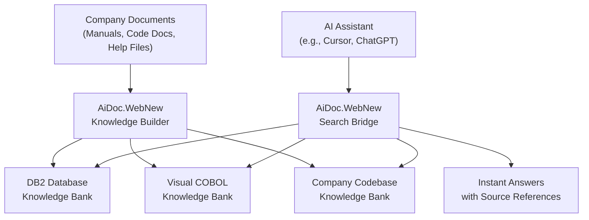

**In plain English:** The system reads all your company documents, understands them, and stores them in a special AI-friendly database called ChromaDB (a database designed for meaning-based search, not just keyword matching). When an AI assistant needs to answer a question, it searches through these documents and provides answers with references to the exact source.

### Key Selling Points
- **Three separate knowledge banks** for databases, legacy programs, and company codebase
- **Web-based admin portal** — manage everything through a browser
- **AI-ready search bridge** (MCP endpoints) — any compatible AI assistant plugs in instantly
- **Self-hosted** — all company knowledge stays on your own servers

### Top 3 Competitors

| Competitor | Price | Key Difference |
|---|---|---|
| **AnythingLLM** | Free / Open Source | General-purpose chat; needs technical setup. AiDoc.WebNew is purpose-built with admin portal. |
| **Vectara** | Enterprise custom pricing | Managed cloud service with high recurring costs. AiDoc.WebNew is self-hosted, one-time license. |
| **Vector Admin** | Free / Open Source | Database admin only — no search pipeline or AI bridge. AiDoc.WebNew combines admin + search + AI. |

### Revenue Idea
- **Starter:** $5,000 one-time + $1,200/year (1 knowledge bank, 10,000 documents)
- **Professional:** $12,000 one-time + $2,400/year (3 knowledge banks, unlimited)
- **Enterprise:** $25,000 one-time + $5,000/year (unlimited, priority support)
- **Projection:** $500K–$2M annually from 50–100 enterprise customers

---

## 2.2 CursorDb2McpServer — The Safe Translator Between AI and Your Database

### Elevator Pitch
A secure, read-only bridge that lets AI coding assistants look up information in IBM DB2 databases without any risk of changing or deleting data. Think of a glass window at a bank vault — the AI can see inside, but can never reach in.

### How It Works

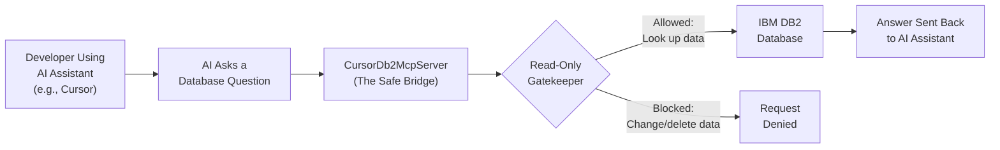

**In plain English:** When a developer asks their AI assistant about the database, the request goes through CursorDb2McpServer, which translates the question into database language, gets the answer, and sends it back — all while ensuring nothing can ever be changed or deleted.

### Key Selling Points
- **Read-only by design** — impossible for the AI to modify data
- **Works inside the developer's existing AI tool** — no switching between applications
- **Built specifically for IBM DB2** — the database used by banks and governments worldwide
- **MCP standard** — works with any compatible AI assistant, not just one brand

### Top 3 Competitors

| Competitor | Price | Key Difference |
|---|---|---|
| **DBeaver AI** | $249–$499/year | Separate application — developer must switch tools. No read-only guarantee. |
| **DataGrip AI** | $109–$259/year + AI subscription | Requires separate AI subscription. Limited DB2 support. |
| **Chat2DB** | Free–Enterprise | Ties you to their AI service. No DB2 support. |

### Revenue Idea
- **Team:** $3,000 one-time + $600/year (10 developers, 1 DB2 instance)
- **Department:** $8,000 one-time + $1,500/year (50 developers, 5 instances)
- **Enterprise:** $20,000 one-time + $4,000/year (unlimited)
- **Projection:** $800K+ annually in recurring support from 2% of the 5,000+ DB2 enterprises globally

---

## 2.3 AutoDocJson — The 24/7 Documentation Factory for Legacy Programs

### Elevator Pitch
Automatically reads source code written in 6 different programming languages — including 40-year-old COBOL programs — and produces beautifully formatted documentation with diagrams. Like hiring a documentation team that works around the clock and never makes mistakes.

### How It Works

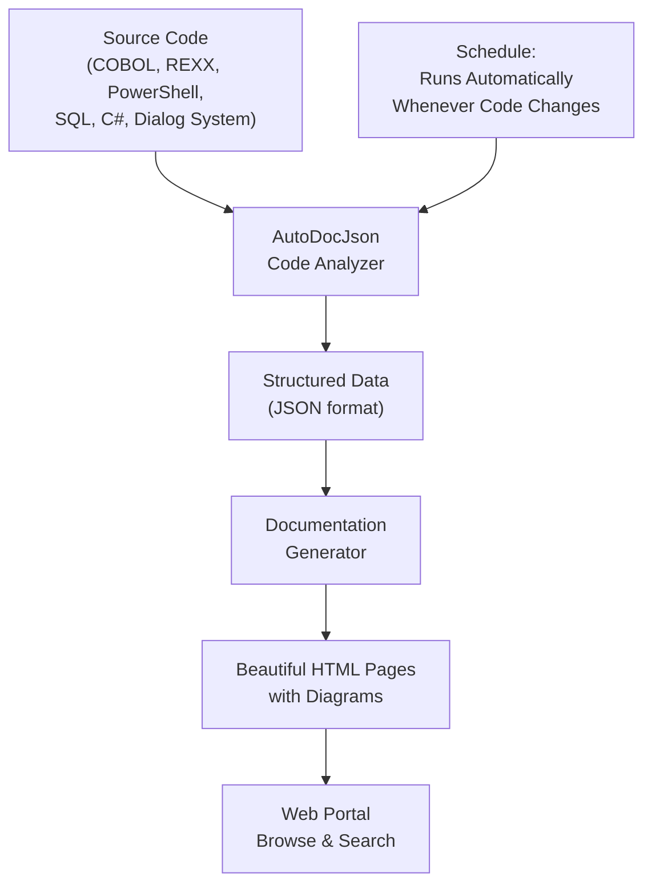

**In plain English:** The system reads code files in six languages, extracts everything important (what the program does, what data it uses, what other programs it calls), organizes it into a standard format, and produces professional web pages with flowcharts and diagrams. It runs automatically whenever code changes, so documentation is always current.

### Key Selling Points
- **Six programming languages** — COBOL, REXX, PowerShell, SQL, C#, Dialog System
- **Automatic diagrams** — flowcharts and dependency maps generated automatically
- **Always up-to-date** — runs on a schedule, so docs refresh with code changes
- **Structured JSON output** — feeds into other Dedge products (AiDoc.WebNew, SystemAnalyzer)

### Top 3 Competitors

| Competitor | Price | Key Difference |
|---|---|---|
| **Fujitsu Application Transform** | Enterprise SaaS | COBOL-only, cloud-only, no JSON output. AutoDocJson handles 6 languages, self-hosted. |
| **CodeAura** | Enterprise custom | COBOL-only, no structured JSON with AI integration. AutoDocJson's JSON feeds the whole ecosystem. |
| **CobolBreaker** | Free / Open Source | COBOL-only, immature (created Jan 2026). AutoDocJson is production-proven across 6 languages. |

### Revenue Idea
- **Starter:** $8,000 one-time + $1,600/year (5,000 files, 2 languages)
- **Professional:** $18,000 one-time + $3,600/year (25,000 files, all 6 languages)
- **Enterprise:** $40,000 one-time + $8,000/year (unlimited, custom templates)
- **Projection:** $900K+ first-year from legacy modernization market (0.5% of 10,000+ COBOL organizations)

---

## 2.4 SystemAnalyzer — The AI-Powered X-Ray Machine for Legacy Code

### Elevator Pitch
Scans thousands of legacy COBOL programs, maps out every relationship between them, and uses AI to explain what each one does — in plain English. An X-ray that reveals how every piece connects, what each piece does, and where the risks are hiding.

### How It Works

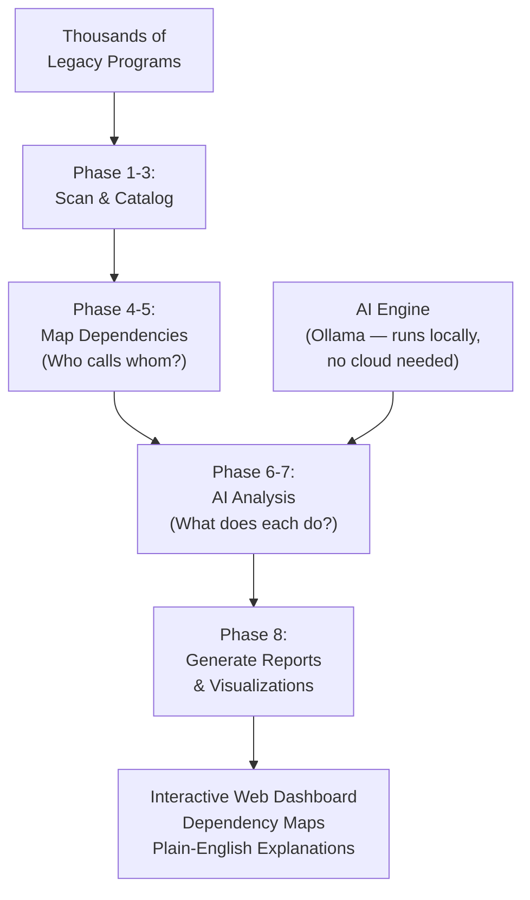

**In plain English:** SystemAnalyzer examines a company's entire codebase through 8 structured phases — inventorying every program, mapping every connection between them, using AI to write plain-English explanations, and producing interactive web dashboards where you can click on any program and instantly see what it does and what depends on it. The AI runs entirely on the company's own servers (using Ollama), so sensitive code never leaves the building.

### Key Selling Points
- **8-phase deep analysis** — methodical, reproducible, auditable
- **AI-powered plain-English explanations** — business people can understand the results
- **Interactive dependency maps** — click any program to see its connections
- **Runs entirely on-premise** — source code never leaves your building
- **Impact analysis** — instantly see what would break if you changed a program

### Top 3 Competitors

| Competitor | Price | Key Difference |
|---|---|---|
| **CAST Imaging** | $10,200–$108,000/year | Expensive, no AI explanations, no structured 8-phase workflow. |
| **Micro Focus Enterprise Analyzer** | $50K+/year | No AI, legacy UI, heavyweight installation. |
| **IBM watsonx for Z** | Six-figure annual contracts | Cloud-only (dealbreaker for banks/government), migration-focused not analysis-focused. |

### Revenue Idea
- **Assessment:** $15,000 one-time (up to 5,000 programs, PDF report)
- **Professional:** $30,000 one-time + $6,000/year (25,000 programs, web dashboard)
- **Enterprise:** $60,000 one-time + $12,000/year (unlimited, integration with AutoDocJson)
- **Projection:** $2M–$5M annually within 3 years (direct sales + OEM licensing)

---

## 2.5 ServerMonitor — The Health Dashboard for Your Company's Servers

### Elevator Pitch
A single screen showing the health of every server in your organization — which ones are online, which are struggling, and which need attention — with a system tray icon that turns red the moment something goes wrong. The car dashboard for your server fleet.

### How It Works

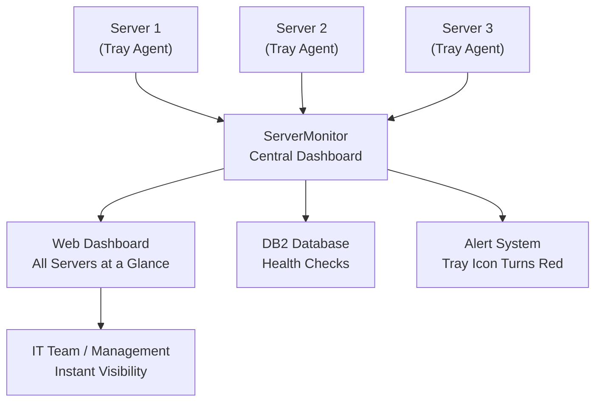

**In plain English:** A tiny agent runs on each server (visible as a small icon near the clock). These agents continuously check CPU, memory, disk, and network health, sending data to a central web dashboard. For companies running IBM DB2 databases, ServerMonitor also checks database health as a first-class feature. Green means healthy, yellow means watch out, red means act now.

### Key Selling Points
- **System tray agent** — unique feature no major competitor offers
- **Native DB2 monitoring** — built-in, not a plugin afterthought
- **Minutes to deploy** — versus days or weeks for competitors
- **Windows Server native** — purpose-built, not a Linux tool awkwardly ported

### Top 3 Competitors

| Competitor | Price | Key Difference |
|---|---|---|
| **Datadog** | $15/host/month | Cloud SaaS, costs spiral with more servers. No native DB2. No tray agent. |
| **Zabbix** | Free | Powerful but requires a dedicated administrator and weeks of configuration. |
| **PRTG** | $179–$1,492/month | Sensor-based pricing scales per metric. No native DB2 awareness. |

### Revenue Idea
- **Small Business:** $2,000 one-time + $400/year (10 servers)
- **Professional:** $6,000 one-time + $1,200/year (50 servers, DB2 monitoring)
- **Enterprise:** $15,000 one-time + $3,000/year (unlimited, custom alerts)
- **Projection:** $1.2M in licenses + $240K recurring from 200 Professional customers

---

## 2.6 GenericLogHandler — The Centralized Security Camera for Software Events

### Elevator Pitch
Collects activity records from every application in your organization into one searchable place, with a visual dashboard and automatic alerts when something goes wrong. A centralized security camera system for all your software.

### How It Works

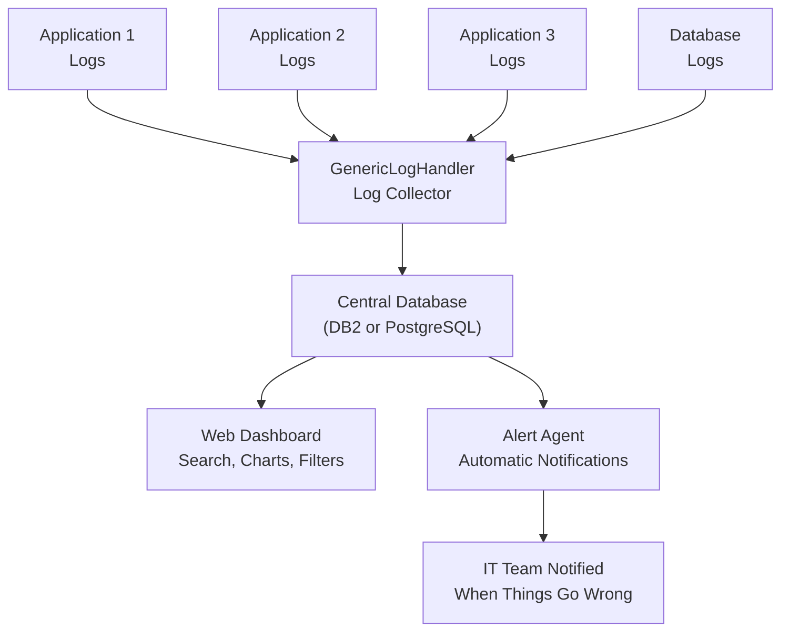

**In plain English:** GenericLogHandler gathers log entries from every application, normalizes them into a consistent format, and stores them in your existing database (DB2 or PostgreSQL — no new database infrastructure needed). A web dashboard lets you search, filter, and chart all logs. A built-in alert agent watches for problems and notifies your team immediately.

### Key Selling Points
- **Uses your existing database** — DB2 or PostgreSQL, no Elasticsearch clusters needed
- **Flat pricing** — unlike Splunk's per-gigabyte model that punishes you for logging more
- **Built-in alert agent** — not a separate product or complex add-on
- **Windows-native** — built for the reality of Windows Server environments

### Top 3 Competitors

| Competitor | Price | Key Difference |
|---|---|---|
| **Splunk** | ~$150/GB/day | Extremely expensive at scale. Proprietary database. Splunk alone generates $3.8B revenue. |
| **Graylog** | Free–$1,250/month | Requires MongoDB + Elasticsearch backends — new infrastructure to maintain. |
| **ELK Stack** | Free (complex) | Three separate services to manage (Elasticsearch, Logstash, Kibana). Memory-hungry. |

### Revenue Idea
- **Starter:** $4,000 one-time + $800/year (5 applications, 90-day retention)
- **Professional:** $10,000 one-time + $2,000/year (25 applications, 1-year retention)
- **Enterprise:** $25,000 one-time + $5,000/year (unlimited, custom alerts)
- **Projection:** $1.5M in licenses + $300K recurring from 150 Professional customers

---

## 2.7 GitHist — The Storyteller for Your Development Team's Work

### Elevator Pitch
Takes the technical record of every code change and transforms it into beautiful, business-readable summaries and visual timelines. Answers the question every executive asks: "What has the development team actually built?" — without anyone needing to understand code.

### How It Works

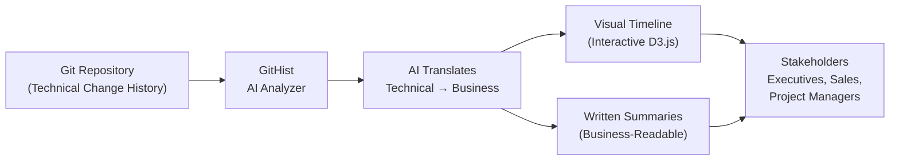

**In plain English:** Developers track every code change in a system called Git (think "Track Changes" in Word, but for software). These entries are written in developer shorthand that business people can't understand. GitHist uses AI to translate these entries into business language and produces interactive timelines showing what was built and when.

### Key Selling Points
- **AI-powered translation** — technical notes become clear business English
- **Interactive D3.js timelines** — presentation-grade for boardrooms
- **Runs locally** — no cloud dependency, no credit limits
- **Works with any Git repository** — language-agnostic

### Top 3 Competitors

| Competitor | Price | Key Difference |
|---|---|---|
| **SumGit** | $9–$19/month + credits | Cloud SaaS with per-credit charges. Developer-focused, not business-stakeholder-focused. |
| **Git History Visualizer** | Free | No AI translation — just charts for developers. |
| **What The LOG** | Free–$9/month | Generates developer changelogs, not business summaries. AI features "planned." |

### Revenue Idea
- **Team:** $2,000 one-time + $400/year (5 repositories)
- **Organization:** $6,000 one-time + $1,200/year (25 repositories, custom branding)
- **Enterprise:** $15,000 one-time + $3,000/year (unlimited, API access)
- **Projection:** $2M+ in licenses + $400K recurring from 500 Team/Organization licenses

---

# Part 3: Developer Productivity

These six products make software developers faster, more consistent, and more productive. While they're not the most glamorous products in the portfolio, they're the tools developers use every single day.

---

## 3.1 CursorRulesLibrary — The Company Policy Handbook for AI Assistants

### Elevator Pitch
A collection of 61 rule files that tell AI coding assistants exactly how to behave — like a company handbook, but for AI. Distributed across 22+ projects so every AI assistant follows the same standards.

### How It Works

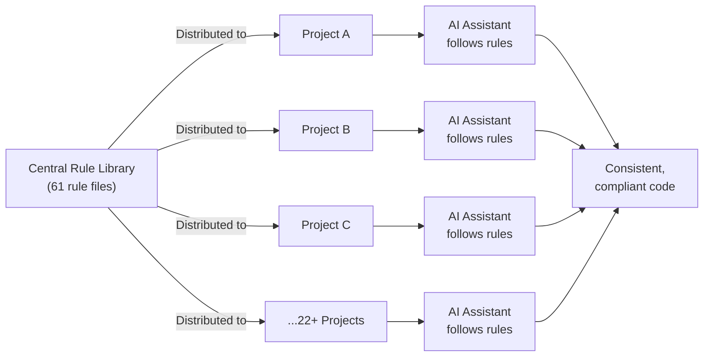

**In plain English:** Without this, every developer's AI assistant behaves differently — one uses American date formats, another European; one creates files in the wrong folder. CursorRulesLibrary provides 61 tested rules covering coding standards, database handling, security, and deployment. Update a rule centrally, and every AI across the organization follows it.

### Key Selling Points
- **61 battle-tested rules** — built from real production problems, not theory
- **Includes AI Skills** — pre-built workflows for complex tasks
- **Zero runtime cost** — just text files, no servers needed
- **Self-hosted** — no company data leaves the organization

### Top 3 Competitors

| Competitor | Price | Key Difference |
|---|---|---|
| **CRules CLI** | Free | Empty framework — no curated content. CursorRulesLibrary ships with 61 proven rules. |
| **Veritos** | Enterprise SaaS | Cloud-based, adds overhead. CursorRulesLibrary is self-hosted and Git-native. |
| **Cursor Team Rules** | Included with Cursor | Basic rules only. No domain-specific depth for DB2, COBOL, or Windows Server. |

### Revenue Idea
- **Starter** (25 developers): $2,500/year
- **Professional** (100 developers): $7,500/year
- **Enterprise** (unlimited): $20,000+/year
- **Custom rule development:** $5,000–$15,000 per engagement

---

## 3.2 CodingTools (DedgePsh) — The Swiss Army Knife for AI-Assisted Development

### Elevator Pitch
A collection of 20+ specialized tools including a headless AI agent (an AI that works without supervision, like a virtual employee that processes tasks overnight), a server orchestrator (sends commands to multiple computers at once), and setup utilities that configure developer workstations in minutes instead of hours.

### How It Works

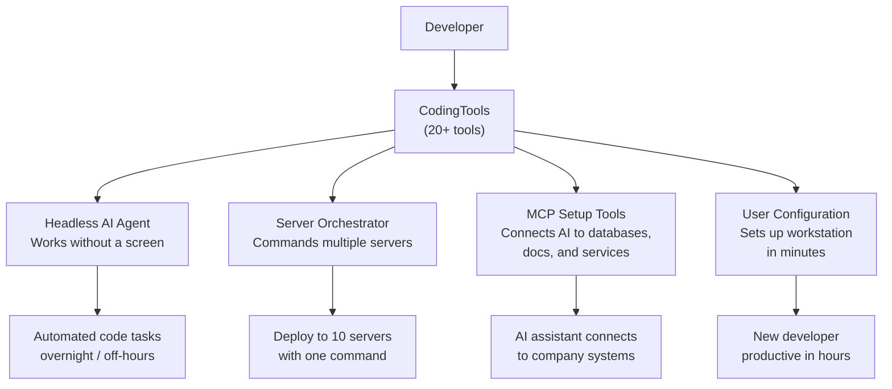

**In plain English:** Instead of buying separate tools for onboarding, server management, and AI configuration, teams get everything in one integrated package. The headless AI agent is the standout — an AI that works unattended, processing codebases overnight without human supervision.

### Key Selling Points
- **Headless AI agent** — genuine differentiator, no competitor offers unattended AI
- **Multi-server orchestration** — one command, execute on many machines
- **One-command developer setup** — new team members productive in hours, not days
- **PowerShell-native** — works on Windows Server without additional dependencies

### Top 3 Competitors

| Competitor | Price | Key Difference |
|---|---|---|
| **Ansible/Puppet** | Free–Enterprise | No AI integration. High learning curve (YAML/DSL). Linux-centric. |
| **AI IDE Plugins** | Plugin fees | Can't manage servers. Only add AI features to the editor. |
| **Custom Scripts** | Developer time | Must build everything from scratch. Fragile and inconsistent. |

### Revenue Idea
- **Team** (10 developers): $3,000/year
- **Department** (50 developers): $10,000/year
- **Enterprise** (unlimited): $25,000+/year

---

## 3.3 DevDocs — Your Company's Internal Wikipedia for Developers

### Elevator Pitch
Captures institutional knowledge — the unwritten rules, the tribal knowledge — in one searchable, browsable web viewer. Write documentation in simple text files, and they're automatically published to a professional website.

### How It Works

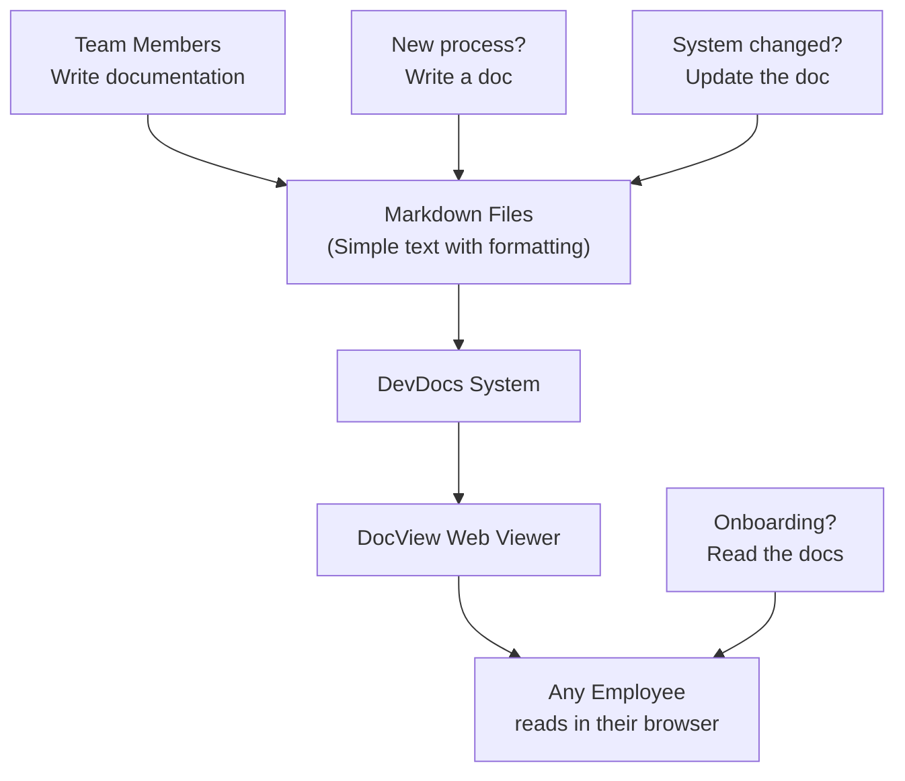

**In plain English:** Teams write documentation using Markdown (a simple text format where `**bold**` makes text bold). DevDocs publishes these files to a professional web viewer called DocView that anyone can access through their browser. No special tools, no per-user fees, no cloud dependency.

### Key Selling Points
- **Write in plain text** — takes 10 minutes to learn Markdown
- **No per-user fees** — flat organizational license
- **Git-powered audit trail** — every change tracked with who, what, when, why
- **Self-hosted** — documentation never leaves the company network

### Top 3 Competitors

| Competitor | Price | Key Difference |
|---|---|---|
| **Confluence** | $6–$12/user/month | At 200 users = $28,800/year. Cloud-dependent. Per-user fees add up fast. |
| **Notion** | $8–$15/user/month | Cloud-only. At 200 users = $36,000/year. |
| **SharePoint** | Part of Microsoft 365 | Powerful but complex. High learning curve for contributors. |

### Revenue Idea
- **Small team** (50 users): $2,000/year
- **Organization** (500 users): $5,000/year
- **Enterprise** (unlimited): $10,000/year

---

## 3.4 DedgeCommon — The Invisible Foundation That Powers Every Application

### Elevator Pitch
The plumbing and electrical wiring of the Dedge software ecosystem. Every other Dedge application sits on top of it. It handles database connections, security, email, SMS, logging, and even bridges modern applications to old COBOL programs.

### How It Works

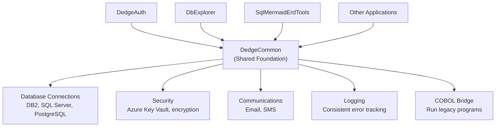

**In plain English:** Instead of every application building its own way to connect to databases, send emails, or manage passwords, DedgeCommon provides one consistent, tested, secure way to do all of these things. The COBOL bridge is especially valuable — it lets modern applications call 60-year-old COBOL programs without rewriting them.

### Key Selling Points
- **Multi-database support** — DB2, SQL Server, PostgreSQL through one interface
- **COBOL bridge** — call legacy programs from modern applications
- **Azure Key Vault integration** — secure password management without plaintext files
- **Every Dedge product depends on it** — mandatory platform component

### Revenue Idea
- **Bundled with Dedge platform:** Included
- **Standalone foundation license:** $10,000/year
- **COBOL bridge consulting:** $15,000–$50,000 per engagement
- **Custom integration support:** $200/hour

---

## 3.5 DedgeAuth — One Login to Rule Them All

### Elevator Pitch
A centralized login system for every application in the organization. Supports passwords, magic links (click a link in your email to log in), Windows single sign-on (already logged into Windows? You're automatically logged in everywhere), and Active Directory sync.

### How It Works

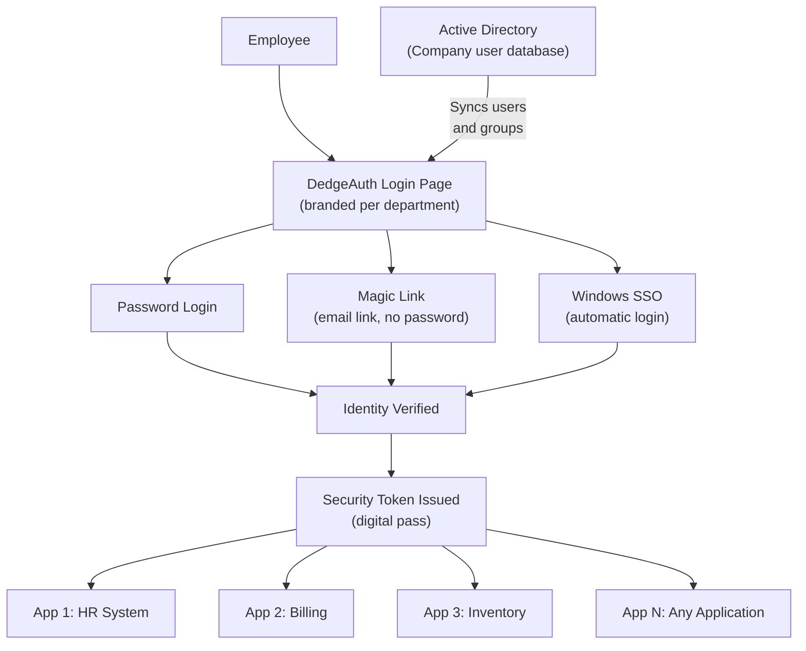

**In plain English:** Instead of 15 different logins for 15 different applications, DedgeAuth provides one login that works everywhere. When verified, it issues a "digital pass" (JWT token) that every application trusts. Each department or client can have their own branded login page.

### Key Selling Points
- **No per-user fees** — flat pricing while Auth0 charges $2.76–$14.40/user/month
- **Self-hosted** — user credentials never leave the organization's network
- **Windows-native** — built for Windows Server, not awkwardly ported from Linux
- **Multi-tenant branding** — each department gets their own login page look

### Top 3 Competitors

| Competitor | Price | Key Difference |
|---|---|---|
| **Auth0 (Okta)** | Free tier → $23/month+ | Cloud-only, per-user pricing. 500 users = $16,560–$86,400/year. |
| **Keycloak** | Free (complex) | Java-based, significant operational complexity. Requires Java expertise. |
| **Authentik** | Free–$5/user/month | Docker-based, Python stack. Per-user enterprise pricing. |

### Revenue Idea
- **Standard** (500 users): $5,000/year
- **Professional** (2,000 users, SSO + AD): $15,000/year
- **Enterprise** (unlimited, multi-tenant branding): $30,000+/year
- **Implementation consulting:** $10,000–$25,000

---

## 3.6 Pwsh2CSharp — The Automatic Translator from Scripts to Applications

### Elevator Pitch
Automatically converts PowerShell scripts (quick automation programs) into C# applications (professional, enterprise-grade software). Combines structural analysis (understanding code grammar) with AI refinement (making the translation read naturally) to automate 80–90% of conversion work.

### How It Works

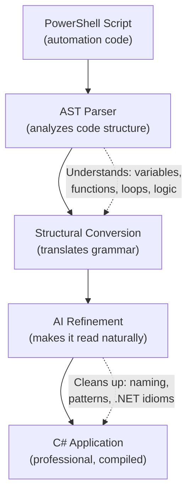

**In plain English:** Many companies have hundreds of PowerShell scripts that handle critical tasks but are slow, hard to distribute, and insecure. Converting them to C# applications manually costs $1,000–$5,000 per script. Pwsh2CSharp automates 80–90% of this work, turning a weeks-long project into hours of review.

### Key Selling Points
- **AST + AI combination** — deep structural understanding plus AI polishing
- **Batch processing** — convert entire folders, not one file at a time
- **Cross-file consistency** — maintains shared context across related scripts
- **Purpose-built** — laser-focused on PowerShell-to-C#, not a generic translator

### Top 3 Competitors

| Competitor | Price | Key Difference |
|---|---|---|
| **CodePorting AI** | $10–$25/month | AI-only, no structural analysis. Misses subtle patterns. |
| **CodeConversion (Ironman)** | Free | Basic AST only, no AI refinement. Misses complex patterns. |
| **ChatGPT/Claude** | $20–$200/month | No batch processing, no cross-file consistency. Can't handle large codebases. |

### Revenue Idea
- **Starter** (50 scripts): $5,000 one-time
- **Professional** (500 scripts): $15,000 one-time
- **Enterprise subscription** (unlimited): $10,000/year
- **Managed migration service:** $25,000–$100,000 per engagement

---

# Part 4: Commercial Products

These are the **direct money-makers** — products sold through online stores with subscription pricing. They have the broadest market appeal because they solve problems faced by millions of software developers worldwide, not just large enterprises.

---

## 4.1 SqlMermaidErdTools — See Your Database, Understand Your Database

### Elevator Pitch
Takes database structure definitions (SQL) and turns them into visual diagrams that anyone can understand — and works in reverse too. Supports 31+ database types, ships as four different tools (library, command line, web API, editor extension), and is already sold through a Stripe-powered online store.

### How It Works

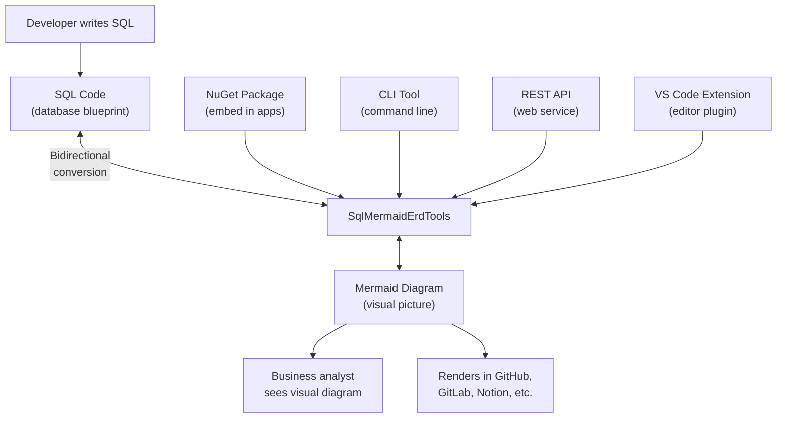

**In plain English:** Databases are described in a technical language called SQL that looks like dense code. SqlMermaidErdTools instantly converts this into a visual diagram showing tables, columns, and how they connect — like turning an architect's technical specifications into a floor plan anyone can understand. It's bidirectional: draw a diagram, and it generates the SQL code too.

### Why This Is a Money-Maker

SqlMermaidErdTools has the broadest market of any Dedge product. **Every software developer and database administrator on the planet** needs to visualize database structures at some point. The market leader, dbdiagram.io, has millions of users and charges up to $75/month — proving demand exists and customers will pay.

### Competitive Deep Dive

| Feature | **SqlMermaidErdTools** | dbdiagram.io | ChartDB | SchemaCrawler | XDevUtilities |
|---|---|---|---|---|---|
| **Direction** | **Bidirectional** | One-way only | One-way only | One-way only | One-way only |
| **SQL dialects** | **31+** | Limited (DBML) | 5 | JDBC databases | 4 |
| **NuGet package** | **Yes** | No | No | No (Java) | No |
| **CLI tool** | **Yes** | No | No | Yes | No |
| **REST API** | **Yes** | No | No | No | No |
| **VS Code extension** | **Yes** | No | No | No | No |
| **Requires live database** | **No** | No | No | **Yes** | No |
| **Output format** | **Mermaid (open standard)** | DBML (proprietary) | Proprietary | Graphviz/Mermaid | Mermaid |
| **Pricing** | Subscription | Free–$75/mo | Free | Free | Free |

**Killer differentiators:**
1. **Bidirectional** — The only tool that goes both directions (SQL to diagram AND diagram to SQL)
2. **31+ dialects** — Works with virtually every database in existence
3. **Four delivery surfaces** — NuGet, CLI, API, VS Code — customers choose their workflow
4. **Open standard output** — Mermaid renders natively in GitHub, GitLab, Notion, Confluence

### Detailed Pricing Strategy

| Tier | Price | Target Customer | Projected Volume |
|---|---|---|---|
| **Individual** (NuGet + CLI) | $9/month or $89/year | Freelance developers, solo DBAs | High volume, low touch |
| **Team** (all surfaces, 10 devs) | $49/month or $479/year | Small development teams | Medium volume |
| **Enterprise** (unlimited, priority support) | $199/month or $1,899/year | Large organizations | Low volume, high value |
| **VS Code Extension** | Free tier + $4.99/month Pro | VS Code users | Very high volume |

**Market size indicator:**
- dbdiagram.io: millions of users, up to $75/month team plans
- Database documentation tools market: $500M+ annually
- Mermaid.js: 75,000+ GitHub stars = massive ecosystem adoption

### Revenue Projection
- Year 1: 500 Individual + 100 Team + 20 Enterprise = ~$150K ARR
- Year 2: 2,000 Individual + 400 Team + 80 Enterprise = ~$500K ARR
- Year 3: 5,000 Individual + 1,000 Team + 200 Enterprise = ~$1.2M ARR

---

## 4.2 SqlMmdConverter — The Foundation That Proved the Concept

### Elevator Pitch
A code library (NuGet package) that converts database definitions into Mermaid diagrams. The predecessor to SqlMermaidErdTools — the prototype that validated the idea and is still available for developers who want to embed conversion in their own applications.

### How It Works

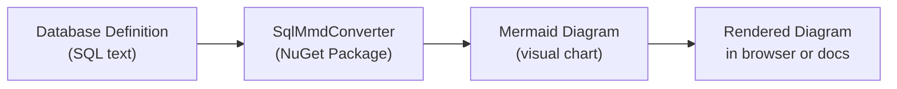

**In plain English:** Give it the text that describes your database tables, and it produces a visual diagram. It supports 31+ database types and ships as a self-contained package that developers can embed in their own software — meaning it can be built into automated documentation pipelines that regenerate diagrams every time the database changes.

### Why This Matters Commercially

SqlMmdConverter serves three strategic purposes:
1. **Gateway product** — free/low-cost, establishes Dedge's credibility in the database tools market
2. **Upsell path** — users who outgrow it naturally move to SqlMermaidErdTools
3. **Published on NuGet.org** — visible presence in the .NET developer ecosystem

### Competitive Deep Dive

| Feature | **SqlMmdConverter** | mermerd | sql2mermaid-cli | SchemaCrawler | XDevUtilities |
|---|---|---|---|---|---|
| **.NET integration** | **NuGet package** | No (Go binary) | No (Python) | No (Java) | No |
| **SQL dialects** | **31+** | 4 | Limited | JDBC databases | 4 |
| **Requires live database** | **No** | Yes | No | Yes | No |
| **Self-contained** | **Yes (bundled runtime)** | Yes | Needs Python | Needs Java | Browser only |

### Pricing Strategy
- **Free tier** on NuGet.org — drives adoption and brand awareness
- **Premium features** (batch processing, custom formatting) — monetized
- **Enterprise documentation contracts** — bundled into consulting engagements
- **CI/CD pipeline component** — "database diagrams update every time your schema changes"

---

## 4.3 DbExplorer — Your AI-Powered Window into Any Database

### Elevator Pitch
A smart database tool with a built-in AI assistant that speaks 5 different AI languages (including offline options). Browse data like a spreadsheet, ask questions in plain English, and generate visual database diagrams — all in one desktop application supporting DB2, PostgreSQL, SQL Server, and SQLite.

### How It Works

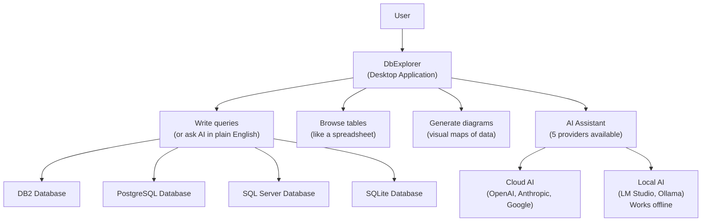

**In plain English:** DbExplorer connects to four types of databases and lets you browse data like a spreadsheet. Don't know the technical query language? Ask the AI in plain English: "Show me all customers who haven't ordered in 6 months." It writes the query, you approve it, results appear. Choose from 5 AI providers — including two that work completely offline for sensitive environments.

### Why This Is a Money-Maker

The database tools market is proven and large. DBeaver (the market leader) has millions of users and charges $249–$499/year for its professional tier. DbExplorer differentiates on three fronts that no competitor matches:

1. **5 AI providers including offline** — government and finance clients who can't send data to the cloud have no other option
2. **First-class DB2 support** — 97% of Fortune 500 companies use DB2, yet most tools treat it as an afterthought
3. **Mermaid ERD built-in** — one-click visual database diagrams

### Competitive Deep Dive

| Feature | **DbExplorer** | DBeaver | DataGrip | Chat2DB | DbVisualizer |
|---|---|---|---|---|---|
| **AI providers** | **5 (cloud + local)** | 4 (Pro only) | Separate subscription | Own AI service | 1 |
| **Offline/local AI** | **Yes** | No | No | No | No |
| **DB2 support** | **First-class** | Enterprise tier only | Limited | No | Yes |
| **Mermaid ERD** | **Built-in** | No | No | Yes | No |
| **Natural language queries** | Yes | Yes (Pro) | Yes (paid) | Yes | Yes (Pro) |
| **Pricing** | License fee | Free–$499/yr | $109–$259/yr | Free–Enterprise | Free–$199/yr |

### Detailed Pricing Strategy

| Tier | Price | Target Customer | Value Proposition |
|---|---|---|---|
| **Individual** | $99/year | Solo developers, DBAs | Cheaper than DBeaver Pro, more AI options |
| **Team** (5 seats) | $399/year | Small teams | $80/seat — significant discount from DBeaver |
| **Enterprise** (25 seats) | $1,499/year | Departments | $60/seat, volume pricing |
| **Enterprise unlimited** | $4,999/year | Large organizations | Flat fee, no seat counting |

### Revenue Projection
- Year 1: 1,000 Individual + 200 Team + 50 Enterprise = ~$250K ARR
- Year 2: 3,000 Individual + 600 Team + 150 Enterprise = ~$800K ARR
- Year 3: Target $1.5M ARR as the go-to DB2 tool for AI-assisted development

---

# Part 5: Utility Tools

These six products solve specific, everyday problems. They're smaller in scope but serve as portfolio fillers, consulting add-ons, and brand-building tools.

---

## 5.1 Pdf2Markdown — Turn Any PDF Into a Clean, Readable Text Document

### Elevator Pitch
Converts PDFs into Markdown with embedded images and a cleaned-up table of contents. One command, one output file. No cloud, no AI bills, no subscriptions.

### How It Works

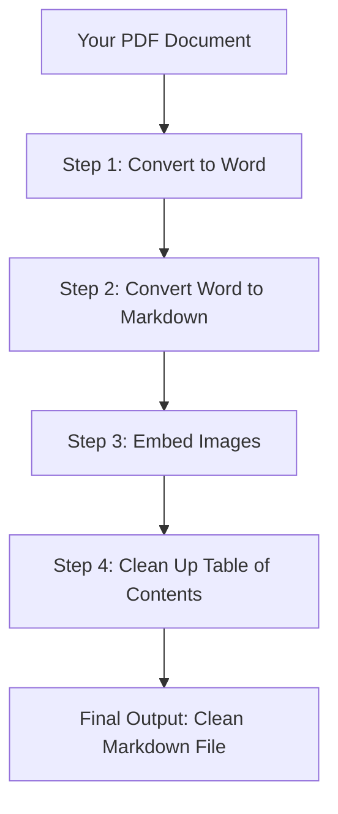

**In plain English:** You give it a PDF (or a whole folder of PDFs), and it produces clean, readable text files with all images embedded and the table of contents rebuilt. Runs with a single command, no internet needed.

### Key Selling Points
- **Embedded images** — images stay inside the document (biggest frustration with competitors)
- **Table of contents cleanup** — no other tool does this automatically
- **Zero cloud dependency** — confidential documents stay confidential
- **Batch-ready** — convert 500 PDFs by pointing at a folder

### Top 3 Competitors

| Competitor | Price | Key Difference |
|---|---|---|
| **Marker** | Free | No image embedding, no TOC cleanup. General-purpose. |
| **Docling (IBM)** | Free + $4/month hosted | Enterprise RAG focus, heavier setup. Requires AI pipeline. |
| **MinerU** | Free | CJK specialist, no embedded images, no TOC cleanup. |

### Revenue Idea
Part of AI/RAG pipeline offering. Essential preprocessing step for knowledge bases. Bundled with consulting engagements.

**Time savings comparison:**

| Task | Manual | Pdf2Markdown |
|---|---|---|
| Convert 1 PDF (50 pages) | 2–4 hours | Under 30 seconds |
| Convert 100 PDFs | 200–400 hours | ~50 minutes |
| Convert 500 PDFs (regulatory archive) | 1,000–2,000 hours | ~4 hours |

At $50/hour labor cost, converting 500 PDFs manually costs $50,000–$100,000 in staff time. Pdf2Markdown does it in an afternoon.

---

## 5.2 VcHelpExport — Digitize Legacy Software Documentation for AI Search

### Elevator Pitch
Converts Visual COBOL help documentation (trapped in proprietary formats) into modern, searchable Markdown files that AI tools can index. The only tool that handles the complete pipeline from proprietary help archives to AI-ready output.

### How It Works

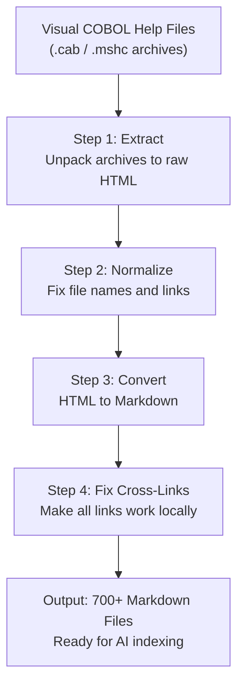

**In plain English:** Many companies still run critical systems written in COBOL. The reference documentation for their tools is locked in old help viewer formats that modern search tools and AI can't read. VcHelpExport unlocks this documentation, converting 700+ help topics into individual searchable files.

### Key Selling Points
- **Only tool that handles the complete pipeline** from `.cab`/`.mshc` to AI-ready Markdown
- **Cross-link preservation** — the knowledge network stays intact
- **700+ topics** converted in a single run

### Top 3 Competitors

| Competitor | Price | Key Difference |
|---|---|---|
| **coboldoc** | Free | Generates docs from source code comments — not from help viewer content. |
| **Pandoc** | Free | Generic converter — requires extensive manual preprocessing for help formats. |
| **httrack + custom scripts** | Free (DIY) | Requires building your own pipeline. No cross-link preservation. |

### Revenue Idea
AI knowledge base enablement. Consulting service: "We'll make your legacy documentation AI-searchable." Natural add-on for COBOL modernization projects.

**Market context:**
- 220 billion lines of COBOL still in production worldwide
- Every organization with COBOL has this documentation locked in proprietary formats
- The consulting pitch is simple: "Your developers can ask AI questions about Visual COBOL and get accurate answers from the official documentation — instead of guessing or asking colleagues who may have left the company"
- Estimated consulting engagement price: $10,000–$25,000 per client (includes setup, conversion, AI indexing, and knowledge transfer)

---

## 5.3 SiteGrabber — Download Any Website for Offline Viewing

### Elevator Pitch
Downloads an entire website for offline browsing using a real browser engine (Playwright), which means it captures modern JavaScript-heavy websites that traditional tools miss. Resumable downloads pick up where they left off if interrupted.

### How It Works

```mermaid
flowchart TD
    U["User"] --> S["SiteGrabber"]
    S --> P["Playwright Browser Engine\n(renders pages like a real browser)"]
    P --> W["Target Website"]
    
    W --> R["Pages are fully rendered\n(including JavaScript content)"]
    R --> D["Downloaded to local folder"]
    D --> L["Links remapped\n(work offline)"]
    L --> O["Browse offline\n(open in any browser)"]
    
    X["Interrupted?"] -->|"Resume"| S
```

**In plain English:** Unlike traditional download tools that miss content built by JavaScript (most modern websites), SiteGrabber uses a real browser engine to see and capture everything. If the download gets interrupted, it picks up right where it left off.

### Key Selling Points
- **JavaScript rendering** — captures modern websites that traditional tools miss
- **Resumable downloads** — large site downloads don't start over on interruption
- **Link remapping** — navigate the saved site naturally offline
- **Fills the HTTrack vacuum** — the classic tool hasn't been updated since 2017

### Top 3 Competitors

| Competitor | Price | Key Difference |
|---|---|---|
| **HTTrack** | Free | Abandoned since 2017. Can't render JavaScript. |
| **Cyotek WebCopy** | Free | Explicitly lacks JavaScript support. |
| **websitedownloader.org** | Free (10 pages) / Paid | Cloud-based with page limits. |

### Revenue Idea
- **Individual:** $29 one-time or $19/year
- **Professional** (5 seats): $99/year
- **Enterprise** (unlimited): $499/year

---

## 5.4 MouseJiggler — Keep Your Computer Awake, Intelligently

### Elevator Pitch
Prevents your computer from locking by gently moving the mouse cursor — with a unique Bluetooth proximity feature that knows when you're at your desk and when you've walked away. Security-friendly, not security-defeating.

### How It Works

```mermaid
flowchart TD
    A["MouseJiggler<br/>runs in system tray"] --> B{"Bluetooth device<br/>detected nearby?"}
    B -->|"Yes — you're at your desk"| C["Jiggle mouse cursor\n(tiny, invisible movements)"]
    B -->|"No — you walked away"| D["Stop jiggling\n(screen locks normally)"]
    
    C --> E["Computer stays awake"]
    E --> F["Downloads continue"]
    E --> G["Sessions stay connected"]
    E --> H["Status shows 'Active'"]
    
    D --> I["Computer locks\n(security maintained)"]
```

**In plain English:** Every competitor is a simple on/off switch. MouseJiggler is the first to add intelligence: it knows when you're at your desk (via Bluetooth from your phone or smartwatch) and when you've walked away. Present? Computer stays awake. Gone? Computer locks normally. Security teams can actually endorse this.

### Key Selling Points
- **Bluetooth proximity** — the only jiggler that knows when you're physically present
- **Security-friendly** — supports (not defeats) security policy
- **Low friction, high volume** — impulse purchase at $4.99–$14.99

### Top 3 Competitors

| Competitor | Price | Key Difference |
|---|---|---|
| **Arkane MouseJiggler** | Free | No Bluetooth proximity. Easily detected by monitoring software. |
| **Move Mouse** | Free | More features but no Bluetooth. Just a dumb on/off switch. |
| **PowerToys Awake** | Free | Prevents sleep but doesn't prevent screen lock (different problem). |

### Revenue Idea
- **Individual (basic):** Free or $4.99 one-time
- **Individual Pro (Bluetooth):** $14.99 one-time
- **Team** (10+ seats): $9.99/seat
- **Enterprise** (100+ seats): $4.99/seat
- Market: millions of remote workers dealing with screen timeout daily

---

## 5.5 RemoteConnect — Your Address Book for Remote Computers

### Elevator Pitch
A phone contacts app, but for remote computers. Stores all server connections in one organized, encrypted catalog. Double-click a connection and you're in — no typing, no remembering passwords.

### How It Works

```mermaid
flowchart TD
    A["IT Administrator"] --> B["RemoteConnect\n(Desktop Application)"]
    B --> C["Connection Catalog\n(JSON file, organized & encrypted)"]
    
    C --> D["Production Servers"]
    C --> E["Test Servers"]
    C --> F["Development Machines"]
    C --> G["Client Environments"]
    
    D --> H["Double-click to connect\n(password auto-filled)"]
    E --> H
    F --> H
    G --> H
    
    H --> I["Remote Desktop Session\n(via Windows mstsc.exe)"]
```

**In plain English:** IT administrators connect to dozens of remote computers daily. RemoteConnect stores all connections in one encrypted JSON file — organized by groups, searchable, one-click to connect. Passwords are encrypted using Windows security (DPAPI), so they're protected without extra master passwords.

### Key Selling Points
- **JSON storage** — Git-friendly, easy to back up (unlike XML or proprietary databases)
- **DPAPI encryption** — uses Windows built-in security for passwords
- **Fills the RDCMan vacuum** — Microsoft's tool was discontinued
- **Simple and focused** — does RDP exceptionally well, nothing else

### Top 3 Competitors

| Competitor | Price | Key Difference |
|---|---|---|
| **Royal TS** | Free (10 connections)–€1,699 | Powerful but complex and expensive. |
| **mRemoteNG** | Free | XML storage prone to corruption. Complex for most users. |
| **Remote Desktop Manager** | Free–$249.99/year | Enterprise-grade complexity. 200+ integrations most people don't need. |

### Revenue Idea
- **Individual:** Free or $9.99 one-time
- **Professional** (shared catalogs): $29.99/year
- **Team** (10 seats): $199/year
- **Enterprise** (unlimited, audit logging): $999/year

---

## 5.6 Html2Markdown — Convert HTML Content to Clean Markdown

### Elevator Pitch
The reverse of Pdf2Markdown — takes HTML web content and converts it into clean, structured Markdown. Essential for migrating web documentation into modern knowledge bases, or converting old internal web pages into editable text.

### How It Works

```mermaid
flowchart LR
    A["HTML Content\n(web pages, docs)"] --> B["Html2Markdown\nConverter"]
    B --> C["Clean Markdown\n(structured text)"]
    C --> D["Knowledge bases,\nAI indexing,\neditable docs"]
```

**In plain English:** Many companies have documentation stored as HTML web pages — old intranet sites, internal wikis, web-based help systems. Html2Markdown converts this content into clean Markdown files that can be fed into modern documentation systems, AI tools, or simply edited in any text editor.

### Key Selling Points
- **Structure preservation** — headings, lists, tables, and links survive conversion
- **Offline operation** — runs on your machine, no cloud dependency
- **Pairs with other Dedge tools** — feeds into AiDoc.WebNew, DevDocs, and AI pipelines

### Top 3 Competitors

| Competitor | Price | Key Difference |
|---|---|---|
| **Pandoc** | Free | Generic converter — powerful but requires command-line expertise. |
| **Turndown** | Free | JavaScript library — requires programming to use. |
| **html2text** | Free | Python library — minimal structure preservation. |

### Revenue Idea
Bundled with consulting engagements and the Dedge document conversion pipeline. Pairs with Pdf2Markdown and VcHelpExport for complete document modernization offerings.

**The "Document Modernization" package:** Combine Pdf2Markdown + Html2Markdown + VcHelpExport into a single "Document Modernization Service" — convert all of a customer's legacy documentation (PDFs, HTML intranet pages, proprietary help files) into clean, AI-searchable Markdown. Price: $15,000–$40,000 per engagement depending on document volume. Feed the output into AiDoc.WebNew for the full AI knowledge base experience.

---

# Part 6: Web Properties

These three products demonstrate Dedge's web design capabilities and generate direct client revenue.

---

## 6.1 OnePager WordPress Theme — A Professional One-Page Business Website in Minutes

### Elevator Pitch
A WordPress theme that builds a complete, professional one-page business website without writing any code. 13 ready-made sections, every piece of text and image is editable through the visual editor. It powers Dedge.no itself.

### How It Works

```mermaid
flowchart TD
    H["Hero Banner"] --> AB["About Us"]
    AB --> EX["Expertise"]
    EX --> SV["Services"]
    SV --> PR["Process Steps"]
    PR --> TM["Team Members"]
    TM --> PT["Partners"]
    PT --> EN["Enterprise / B2B"]
    EN --> PRC["Pricing"]
    PRC --> CT["Contact Form"]
    CT --> FAQ["FAQ Accordion"]
    FAQ --> CTA["Call to Action"]
    CTA --> TY["Thank You Page"]
```

**In plain English:** Install the theme, open the WordPress visual editor, change the text and images, publish. 13 sections cover everything a business needs. Leave a section empty and it disappears automatically — the layout reorganizes itself.

### Key Selling Points
- **13 built-in sections** — complete business website out of the box
- **Conditional rendering** — empty sections disappear automatically (rare feature)
- **No page builder needed** — no Elementor, no Divi, no bloat
- **Real-world proven** — powers Dedge.no

### Top 3 Competitors

| Competitor | Price | Key Difference |
|---|---|---|
| **Elementor + any theme** | Free–$399/year | Heavy page builder creates slow sites and vendor lock-in. OnePager is lightweight and standard WordPress. |
| **Divi (Elegant Themes)** | $89/year | Another page builder with proprietary format. Content trapped if you switch. |
| **Custom development** | $3,000–$20,000+ | Weeks of development time. OnePager delivers the same result in 2–4 hours. |

### Revenue Idea
- **Client website delivery:** Build client sites in hours instead of days — bill $2,000–$5,000 per site for what takes 2–4 hours of work
- **Theme marketplace:** Sell on ThemeForest, WordPress.org — passive income from downloads
- **White-label service:** Rebrand for specific industries (clinics, consultancies, agencies) — sell the "website-in-a-box" concept
- **Maintenance contracts:** $100–$300/month for hosting, backups, updates, and minor content changes
- **Time savings math:** Custom equivalent takes 40–80 hours × $100/hour = $4,000–$8,000. OnePager: 2–4 hours × $100/hour = $200–$400. The margin is enormous.

---

## 6.2 & 6.3 Lillestrøm Osteopati — A Real-World Healthcare Client Website

### Elevator Pitch
A complete, professional website built for a real osteopathy clinic in Lillestrøm, Norway. Exists in two versions: a lightweight static HTML version (fastest loading, cheapest hosting) and a full WordPress version (client can edit their own content). This is a live client delivery for [lillestrom-osteopati.no](https://lillestrom-osteopati.no/).

### How It Works

```mermaid
flowchart TD
    A["Client Brief\nClinic needs, branding, content"] --> B["Design & Build\nStatic HTML version"]
    B --> C["Client Review\nFeedback and revisions"]
    C --> D["WordPress Migration\nConvert to editable CMS"]
    D --> E["Handover\nClient manages their own content"]

    B2["Static Version\nHTML + CSS + JS\n(fast, simple hosting)"]
    D2["WordPress Version\nOnePager theme\n(client-editable)"]

    B --> B2
    D --> D2
```

**In plain English:** The client gets two versions: a static HTML site for maximum speed and minimum cost, plus a WordPress version they can edit themselves. 10 content sections covering everything a healthcare clinic needs, written in proper Norwegian medical terminology (not machine-translated).

### Key Selling Points
- **Two versions for one price** — static for speed, WordPress for self-service
- **Domain-specific content** — proper Norwegian healthcare terminology and regulations
- **No ongoing platform fees** — unlike Squarespace or Wix
- **Norwegian admin guide included** — client documentation in their own language
- **Portfolio piece** — demonstrates real-world client delivery capability

### Top 3 Competitors (for clinic website delivery)

| Competitor | Price | Key Difference |
|---|---|---|
| **Squarespace/Wix** | $16–$49/month ongoing | Template-based, generic. No Norwegian medical terminology. Platform lock-in. |
| **Custom agency** | $5,000–$15,000 | 4–12 weeks delivery. Expensive for a small clinic. |
| **DIY WordPress + free theme** | Free + hosting | 1–4 weeks learning curve. Result looks amateur without design skills. |

### Revenue Idea
- **Client project fee:** $2,000–$5,000 one-time delivery (competitive vs $5K–$15K agency rates)
- **Repeatable template:** Same approach reusable for other clinics — 1–3 days per site. At 4 sites per month = $8K–$20K/month
- **Maintenance retainer:** $150–$300/month for hosting, backups, updates, minor content changes
- **Industry vertical:** Healthcare clinics in Norway are underserved — most have poor websites or none at all. Physiotherapy, dental, chiropractic, psychology practices all need the same type of site.
- **Scalability math:** 50 clinic websites × $3,000 avg project fee = $150,000 + 50 × $200/month maintenance = $120,000/year recurring

### Why This Is Strategically Important

The Lillestrøm Osteopati project isn't just a website — it's **proof of capability**. When approaching new clients, you can say: "Here's a live website we built for a real healthcare clinic. Visit it. It's professional, fast, mobile-friendly, and the clinic staff manage their own content." That credibility is worth far more than a portfolio of mockups or demos.

---

# Part 7: PowerShell Module Library (37 Modules)

> **See [DedgePsh-Modules.md](DedgePsh-Modules.md) for the full module-by-module documentation.**

## What Are Modules? (The LEGO Brick Analogy)

Think of modules as **LEGO bricks for software**. Each brick does one specific job really well. When a developer builds an application, they don't write everything from scratch — they snap together the bricks they need. Need to send an email? Snap in the **email module**. Need to talk to a database? Snap in the **database module**. Need to deploy software to 20 servers? Snap in the **deployment module**.

This means **faster development** (don't reinvent the wheel), **fewer bugs** (each brick is tested across dozens of real applications), **consistency** (every product works the same way under the hood), and **one fix benefits all** (improve a module once, every product that uses it gets better).

The DedgePsh Module Library contains **37 production-grade modules** refined over years of real-world enterprise use. It is the foundation that everything else in the Dedge ecosystem runs on.

## The 10 Module Categories

```mermaid
flowchart TD
    subgraph DB["Database Modules (3)"]
        Db2[Db2-Handler]
        Pg[PostgreSql-Handler]
        Odbc[OdbcHandler]
    end

    subgraph COMM["Communication (3)"]
        Email[DedgeSendEmail]
        SMS[DedgeSendSMS]
        Snow[ServiceNow-Handler]
    end

    subgraph SEC["Security & Identity (3)"]
        Sign[DedgeSign]
        Token[AzureTokenStore]
        Id[Identity-Handler]
    end

    subgraph AI["AI & Automation (3)"]
        Ollama[OllamaHandler]
        Cursor[Cursor-Handler]
        AutoDoc[AutoDocFunctions]
    end

    subgraph INFRA["Infrastructure & Deployment (7)"]
        Deploy[Deploy-Handler]
        IIS[IIS-Handler]
        Infra[Infrastructure]
        Sched[ScheduledTask-Handler]
        Ram[Handle-RamDisk]
        Soft[SoftwareUtils]
        SSH[SSH-RemoteExecution]
    end

    subgraph LEGACY["Legacy Code (5)"]
        Cbl[CblRun]
        Cobol[Cobol-Handler]
        Check[CheckLog]
        WK[WKMon]
        Alert[AlertWKMon]
    end

    subgraph CLOUD["Azure Cloud (1)"]
        Az[AzureFunctions]
    end

    subgraph DATA["Data Conversion (4)"]
        Ansi[ConvertAnsi1252ToUtf8]
        Exp[Export-Array]
        Md[MarkdownToHtml]
        Ico[ImageToIcon]
    end

    subgraph LOG["Logging & Monitoring (2)"]
        GF[GlobalFunctions]
        Log[Logger]
    end

    subgraph DEV["Developer Utilities (1)"]
        GetFn[Get-FunctionsFromPsm1]
    end

    GF --> DB
    GF --> COMM
    GF --> INFRA
    GF --> LEGACY
    GF --> AI
    GF --> SEC
    GF --> DATA
```

## Complete Module Catalog

| # | Module | Category | One-Line Description |
|---|---|---|---|
| 1 | GlobalFunctions | Logging & Monitoring | The foundation layer — 200+ utility functions used by every other module |
| 2 | Db2-Handler | Database | Universal remote control for IBM DB2: connect, query, manage, diagnose |
| 3 | PostgreSql-Handler | Database | Auto-detect, install, configure, backup, restore, and repair PostgreSQL |
| 4 | OdbcHandler | Database | Bridge to any ODBC-compatible database with transaction safety |
| 5 | DedgeSendEmail | Communication | Send emails with HTML bodies and attachments from any script |
| 6 | DedgeSendSMS | Communication | Send SMS text messages for critical alerts and notifications |
| 7 | ServiceNow-Handler | Communication | Complete ITSM automation: create, update, resolve ServiceNow cases |
| 8 | DedgeSign | Security | Digital code signing via Azure Trusted Signing (40+ file types) |
| 9 | AzureTokenStore | Security | Secure vault for API keys and access tokens across environments |
| 10 | Identity-Handler | Security | Active Directory and Entra ID user/group management |
| 11 | OllamaHandler | AI & Automation | Full local AI integration: chat, templates, file context, model management |
| 12 | Cursor-Handler | AI & Automation | Bridge between Cursor AI IDE and Azure DevOps work items |
| 13 | AutoDocFunctions | AI & Automation | Engine for automatic documentation generation with Mermaid diagrams |
| 14 | Deploy-Handler | Infrastructure | Delivery truck: digitally signed, hash-tracked multi-server deployment |
| 15 | IIS-Handler | Infrastructure | Health inspector for IIS web applications with actionable fix suggestions |
| 16 | Infrastructure | Infrastructure | Master control panel: server inventory, AD, initialization, credentials |
| 17 | ScheduledTask-Handler | Infrastructure | Alarm clock manager: create, monitor, and report on scheduled tasks |
| 18 | Handle-RamDisk | Infrastructure | Create ultra-fast RAM drives (100x faster than SSD) for batch processing |
| 19 | SoftwareUtils | Infrastructure | App store manager: install, update, and track software across server fleets |
| 20 | SSH-RemoteExecution | Infrastructure | Secure tunnel for running commands on remote servers via SSH |
| 21 | CblRun | Legacy Code | Launchpad for COBOL programs with return-code checking and logging |
| 22 | Cobol-Handler | Legacy Code | COBOL environment detective: find and configure all MicroFocus versions |
| 23 | CheckLog | Legacy Code | Watchdog for COBOL execution: reads return codes, triggers alerts |
| 24 | WKMon | Legacy Code | Message sender for the WKMonitor operational monitoring platform |
| 25 | AlertWKMon | Legacy Code | Smart alerting: only creates monitor files when something goes wrong |
| 26 | AzureFunctions | Azure Cloud | Swiss Army knife for Azure and Azure DevOps REST APIs |
| 27 | ConvertAnsi1252ToUtf8 | Data Conversion | Translator between legacy ANSI 1252 and modern UTF-8 encoding |
| 28 | ConvertFileFromAnsi1252ToUtf8 | Data Conversion | File-level ANSI-to-UTF8 conversion for legacy data migration |
| 29 | ConvertStringFromAnsi1252ToUtf8 | Data Conversion | String-level encoding conversion for in-memory text processing |
| 30 | ConvertUtf8ToAnsi1252 | Data Conversion | Reverse conversion: UTF-8 back to ANSI 1252 for legacy system input |
| 31 | Export-Array | Data Conversion | Universal report generator: CSV, HTML, JSON, Markdown, XML, and text |
| 32 | MarkdownToHtml | Data Conversion | Converts Markdown to styled HTML with Mermaid diagram support |
| 33 | ImageToIcon | Data Conversion | Converts images to multi-size Windows .ico files (7 standard sizes) |
| 34 | Logger | Logging & Monitoring | Standardized timestamped logging with dual-file and severity support |
| 35 | Get-FunctionsFromPsm1 | Developer Utilities | Module analyzer: resolve dependency chains and generate combined scripts |
| 36 | ConvertStringUtf8ToAnsi1252 | Data Conversion | String-level reverse encoding for legacy system output |
| 37 | ConvertFileUtf8ToAnsi1252 | Data Conversion | File-level reverse encoding for feeding data to legacy systems |

## Key Revenue Insight

The Module Library is the **foundation everything else runs on**. No competitor has a 37-module PowerShell library covering DB2, COBOL, AI, Azure, PostgreSQL, and infrastructure management in a single cohesive ecosystem. All 37 modules share the same logging system (Write-LogMessage), configuration system (GlobalSettings.json), credential system (AzureAccessTokens.json), and deployment system (Deploy-Handler).

### Revenue Packaging

| Product Package | Modules Included | Target Market | Estimated Annual License |
|---|---|---|---|
| **Dedge DB2 PowerShell Toolkit** | Db2-Handler, GlobalFunctions, Infrastructure | DB2 administrators on Windows | $2,000–$5,000/server |
| **Dedge AI PowerShell Toolkit** | OllamaHandler, GlobalFunctions | Enterprises wanting local AI | $3,000–$8,000/org |
| **Dedge ServiceNow Automation** | ServiceNow-Handler, AzureTokenStore, GlobalFunctions | ServiceNow + Windows shops | $2,000–$5,000/org |
| **Dedge Infrastructure Automation** | Deploy-Handler, Infrastructure, ScheduledTask-Handler, SoftwareUtils, DedgeSign, IIS-Handler, SSH-RemoteExecution, Handle-RamDisk, GlobalFunctions | Windows Server fleet management | $5,000–$15,000/org |
| **DedgePsh Complete Library** | All 37 modules | Enterprise IT departments | $15,000–$30,000/org |

---

# Part 8: DevTools Suite (201 Tools Across 12 Categories)

> The operational backbone of the Dedge ecosystem. While the Module Library provides the building blocks, the DevTools Suite provides the finished tools that IT teams use every day — from setting up new servers to backing up databases to deploying COBOL programs to 150 workstations overnight.

```mermaid
flowchart TD
    DT["DedgePsh DevTools Suite\n201 Tools"]

    DT --> Admin["AdminTools\n42 tools"]
    DT --> AI["AI Tools\n3 tools"]
    DT --> Azure["AzureTools\n10 tools"]
    DT --> DB["DatabaseTools\n41 tools"]
    DT --> Fix["FixJobs\n7 tools"]
    DT --> Git["GitTools\n4 tools"]
    DT --> Infra["InfrastructureTools\n24 tools"]
    DT --> Legacy["LegacyCodeTools\n17 tools"]
    DT --> Log["LogTools\n3 tools"]
    DT --> Sys["SystemTools\n2 tools"]
    DT --> Util["UtilityTools\n14 tools"]
    DT --> Web["WebSites\n4 tools"]

    Admin --> AdminOut["User management, deployment,\nmonitoring, backup, security"]
    DB --> DBOut["Db2 + PostgreSQL: backup,\nsetup, security, diagnostics,\nperformance, data management"]
    Infra --> InfraOut["Server provisioning, deployment,\nmonitoring, AI infrastructure"]
    Legacy --> LegacyOut["COBOL compilation, deployment,\ndocumentation, monitoring"]
```

---

## 8.1 AdminTools — Your IT Department in a Box (42 Tools)

> **See [DedgePsh-AdminTools.md](DedgePsh-AdminTools.md) for full details.**

**Elevator pitch:** 42 expert IT administrators who never sleep, never make typos, and can configure hundreds of servers in minutes instead of days. These tools automate user management, software deployment, system configuration, security, monitoring, and backup across entire server fleets.

```mermaid
flowchart TD
    Admin["IT Administrator"] --> Suite["DedgePsh Admin Tools Suite"]

    Suite --> UM["User & Identity\n8 tools"]
    Suite --> AD["App Deployment\n9 tools"]
    Suite --> SC["System Config\n10 tools"]
    Suite --> SEC["Security\n4 tools"]
    Suite --> MON["Monitoring\n5 tools"]
    Suite --> BAK["Backup\n3 tools"]
    Suite --> MISC["Utilities\n3 tools"]
```

**Top sellable tools:**
1. **Chg-Pass** — Changes a service account password and updates every Windows Service across the fleet simultaneously. Prevents the "changed password, broke 50 services" outage scenario.
2. **Get-App** — Interactive enterprise app store unifying internal tools, Windows features, and winget packages in one menu. Competes with PDQ Deploy and Chocolatey for Business.
3. **Auto-PatchHandler** — Gives application teams control over Windows Update patching with maintenance windows, rollback, and notifications. Competes with WSUS and Ivanti.
4. **Get-EventLog** — Pre-built patterns for common crises (unexpected reboots, DB crashes, system failures) — finds needles in the event log haystack automatically.
5. **Agent-HandlerAutoDeploy** — Zero-touch daily deployment of latest tool versions to all servers overnight.

**Revenue potential:** $15,000–$50,000/year for the full suite. Identity & Access Audit Pack alone: $5,000–$15,000/year for compliance-driven organizations.

---

## 8.2 AI Tools — Private AI Made Simple (3 Tools)

> **See [DedgePsh-AI.md](DedgePsh-AI.md) for full details.**

**Elevator pitch:** Run powerful AI models entirely on your own hardware — no data leaves your building, no monthly API fees, no vendor lock-in. These three tools handle setup, security, and proof-of-value for on-premises AI.

```mermaid
flowchart TD
    Tools["DedgePsh AI Tools"] --> MCP["MCP Inspector\nDebug AI integrations"]
    Tools --> FW["Ollama-ConfigureFirewall\nSecure network access"]
    Tools --> TPL["Ollama-TemplateTest\nAI-powered report generation"]

    MCP --> Ollama["Ollama AI Engine\n(your own server)"]
    TPL --> Ollama
    Ollama --> Models["AI Models\n(Llama, Mistral, Phi)"]
```

**Top sellable tools:**
1. **MCP Inspector** — Visual dashboard for testing AI tool communications (MCP protocol). One-click install, browser-based. As MCP becomes the industry standard, this becomes essential.
2. **Ollama-TemplateTest** — Proves the business case: feed raw data to local AI, get polished reports back. The "AI Report Factory" pattern is generalizable to any data.
3. **Ollama-ConfigureFirewall** — Precision firewall configuration for Ollama. Eliminates the trial-and-error of deploying AI on Windows.

**Revenue potential:** $5,000–$15,000/year as "Private AI Deployment Kit." The MCP Inspector alone has standalone market appeal as MCP adoption accelerates.

---

## 8.3 AzureTools — Your Cloud Operations Command Center (10 Tools)

> **See [DedgePsh-AzureTools.md](DedgePsh-AzureTools.md) for full details.**

**Elevator pitch:** Turns 15-minute Azure Portal clicks into 15-second command-line automations. Covers cloud storage, project management in Azure DevOps, secret management in Key Vault, and cross-repository work tracking.

```mermaid
flowchart LR
    Admin["Operations Team"] --> Suite["DedgePsh Azure Tools"]

    Suite --> Storage["Cloud Storage\n4 tools"]
    Suite --> DevOps["Project Management\n4 tools"]
    Suite --> Security["Secret Management\n1 tool"]
    Suite --> Tracking["Work Tracking\n1 tool"]
```

**Top sellable tools:**
1. **Azure-DevOpsItemCreator** — Bulk-creates hundreds of Azure DevOps work items from hierarchical JSON templates. Solves the "we need 500 tasks for our migration" problem.
2. **Azure-KeyVaultManager** — Complete Key Vault CLI with bulk import/export. TSV import alone saves hours during environment setup.
3. **Azure-DevOpsTemplateGenerator** — Expands server-specific templates into hundreds of personalized tasks with proper relationships. Infrastructure migration planning in minutes.
4. **Azure-DevOpsPAT-Manager** — Per-user PAT management with secure storage, validation, and guided setup. Eliminates shared-token security risks.

**Revenue potential:** $8,000–$25,000/year for the full suite. Migration Planner bundle (TemplateGenerator + ItemCreator): $5,000–$15,000 per migration project.

---

## 8.4 DatabaseTools — Self-Driving Toolkit for Your Database Fleet (41 Tools)

> **See [DedgePsh-DatabaseTools.md](DedgePsh-DatabaseTools.md) for full details.**

**Elevator pitch:** 41 automation tools managing IBM Db2 and PostgreSQL databases on Windows Server. Covers the entire lifecycle: installation, configuration, backup, restore, security, diagnostics, performance tuning, data management, and daily maintenance.

```mermaid
flowchart TB
    subgraph ToolSuite["DedgePsh Database Tools (41 tools)"]
        BK["Backup & Restore (5)"]
        SS["Server Setup (5)"]
        SEC["Security & Access (4)"]
        DIAG["Diagnostics (7)"]
        PERF["Performance (2)"]
        DATA["Data Management (3)"]
        MAINT["Maintenance (15)"]
    end

    ToolSuite -->|"Automated Operations"| Servers["Db2 & PostgreSQL Servers"]
    ToolSuite -->|"Alerts"| SMS["SMS Notifications"]
    ToolSuite -->|"Reports"| LOG["Audit Logs & HTML Reports"]
```

**Top sellable tools:**
1. **Db2-ShadowDatabase** — Complete shadow pipeline: restore production backup to test, compare object by object, produce a zero-diff report. Mathematical proof of environment parity.
2. **Db2-LargeTableYearSplit** — Splits billion-row tables into year partitions, recreating all indexes, views, FKs, and grants. Automated equivalent of a $10K+ consulting engagement.
3. **Db2-SetBufferPoolsByMemory** — Automatic memory optimization for Db2 buffer pools. Finds the sweet spot between "too small" (slow) and "too large" (crashes).
4. **Db2-GrantHandler** — Applies the complete permission standard with HTML audit reports. Compliance requirement for regulated industries.
5. **Db2-DiagnoseConnect** — Comprehensive database health check: recovery status, active databases, configuration, services. Replaces hours of manual diagnosis.

**Revenue potential:** $25,000–$75,000/year for the full suite. Tier 1 premium tools (ShadowDatabase, LargeTableYearSplit, SetBufferPoolsByMemory) command individual premium pricing.

---

## 8.5 FixJobs — One-Time Migrations and Surgical Repairs (7 Tools)

> **See [DedgePsh-FixJobs.md](DedgePsh-FixJobs.md) for full details.**

**Elevator pitch:** The moving crew for infrastructure transitions. 7 scripts that handle one-time migration tasks: converting scheduled tasks between server generations, cleaning up deprecated applications, copying data between servers, and repairing broken configurations.

```mermaid
graph TB
    subgraph "Scheduled Task Migration"
        B[ConvertXmlFiles\nFull Conversion Engine]
        D[AddServerTasks\nImport to Servers]
    end

    subgraph "System Cleanup"
        F[Remove-AllDeprecated\nClean Old App Folders]
    end

    B -->|Generate XML| D
```

**Top sellable tools:**
1. **ScheduledTasks-ConvertXmlFiles** — Rewrites hundreds of scheduled task XML definitions when migrating between server generations. Encodes months of path-mapping knowledge.
2. **Remove-AllDeprecatedFkPshApps** — Maintains explicit deprecation lists for systematic server cleanup. Turns ad-hoc cleanup into a repeatable process.

**Revenue potential:** $50K–$150K per migration engagement. Saves 40–80 hours per server cleanup project.

---

## 8.6 GitTools — Automated Source Control That Never Sleeps (4 Tools)

> **See [DedgePsh-GitTools.md](DedgePsh-GitTools.md) for full details.**

**Elevator pitch:** A night-shift librarian that automatically collects source code from network shares, commits to Git, and pushes to Azure DevOps — every night, zero human interaction, no dialog boxes, no password prompts.

```mermaid
graph LR
    subgraph "Source Files"
        A[COBOL\nNetwork Shares]
        B[PowerShell\nServer Files]
    end

    subgraph "Git Tools"
        D[AzureDevOpsGitCheckIn\nAutomated Nightly Sync]
        F[AzureDevCodeSearch\nCross-Repo Search]
        G[FkStack\nServiceNow Integration]
    end

    A --> D
    B --> D
    D -->|Push| Cloud["Azure DevOps"]
    F -->|Search API| Cloud
```

**Top sellable tools:**
1. **AzureDevOpsGitCheckIn** — Fully unattended nightly Git sync from legacy file systems. Addresses the "source code on file servers" problem that plagues COBOL shops.
2. **FkStack** — ServiceNow change request integration with Git deployments. ITIL-compliant change management for regulated industries.

**Revenue potential:** $150K–$400K per enterprise engagement. The "Legacy Source Control Agent" concept has significant standalone market appeal.

---

## 8.7 InfrastructureTools — Factory Assembly Line for Servers (24 Tools)

> **See [DedgePsh-InfrastructureTools.md](DedgePsh-InfrastructureTools.md) for full details.**

**Elevator pitch:** A blank server arrives; these 24 tools transform it into a fully configured, monitored, secured production machine — and keep it that way. Covers provisioning, deployment, monitoring, AI infrastructure, and ongoing management.

```mermaid
flowchart TB
    subgraph Provisioning["Server Provisioning"]
        Bicep["Azure Bicep Templates\n(20 server templates)"]
        Init["Init-Machine\n(first-time setup)"]
        Std["Standardize-ServerConfig"]
    end

    subgraph Monitoring["Health Monitoring"]
        Monitor["ServerMonitorAgent\n(24/7 health checks)"]
        Alert["Server-AlertOnShutdown\n(SMS on shutdown)"]
        Port["PortCheckTool"]
    end

    Bicep --> Init --> Std
    Std --> Monitor
```

**Top sellable tools:**
1. **Init-Machine** — Transforms a blank Windows Server into a fully operational machine in minutes. Manual equivalent takes 4–8 hours and hundreds of steps.
2. **ServerMonitorAgent** — 24/7 health monitoring with REST API, installed as a Windows Service. Flagship monitoring product.
3. **OllamaChat** — On-premises AI chat with 8+ roles, file context, and privacy guarantees. High commercial value for regulated industries.
4. **Bicep Templates** — 20 Azure Infrastructure-as-Code templates for consistent, repeatable server provisioning. High-value consulting deliverable.
5. **Server-AlertOnShutdown** — Instant SMS notification when database servers shut down. Critical for SLA-driven managed services.

**Revenue potential:** $30,000–$80,000/year for the full suite. Init-Machine + ServerMonitorAgent alone form the core of a "Managed Infrastructure" offering.

---

## 8.8 LegacyCodeTools — Keeping 40-Year-Old Systems Running (17 Tools)

> **See [DedgePsh-LegacyCodeTools.md](DedgePsh-LegacyCodeTools.md) for full details.**

**Elevator pitch:** 17 tools that handle the complete COBOL lifecycle: compilation, deployment to 150 workstations, emergency hotfixes, automated documentation, environment management, and runtime monitoring. The bridge between 1960s code and modern Windows servers.

```mermaid
graph TB
    subgraph "Documentation"
        A[AutoDoc\nAutomatic Flowcharts]
    end

    subgraph "Build & Deploy"
        D[VisualCobol\n8-Step Build Pipeline]
        G[Cob-Push\nMulti-Server Deploy]
        H[EmergencyDeployment\nHotfix Push]
    end

    subgraph "Monitoring"
        P[MicroFocus-SOA-Status\nThread Monitor + SMS]
    end

    D --> G
    D --> H
    P -->|SMS Alert| H
```

**Top sellable tools:**
1. **VisualCobol** — The crown jewel: an 8-step automated pipeline (copy → validate → compile → bind → report → deploy → distribute) for COBOL modernization. Productizable as a migration framework.
2. **AutoDoc** — Reads code in 6 languages and generates HTML flowchart documentation with Mermaid diagrams. Runs nightly, processes thousands of files.
3. **CobolEmergencyDeployment** — Pushes hotfixes to 150 AVD workstations using 32 parallel threads. Safety-first: read-only source, never deletes.

**Revenue potential:** $300K–$800K per enterprise engagement as "Legacy Modernization Toolkit." The COBOL modernization market exceeds $3 billion annually and is growing as COBOL experts retire.

---

## 8.9 LogTools — Finding Needles in Haystacks (3 Tools)

> **See [DedgePsh-LogTools.md](DedgePsh-LogTools.md) for full details.**

**Elevator pitch:** Three tools that search, collect, and clean log files across 30+ servers. One finds specific POS transactions in millions of log lines. One collects logs from every server to your desk in seconds. One prevents disk-full crashes by cleaning up old files with DB2-safe exclusions.

```mermaid
graph LR
    subgraph "30+ Servers"
        A1[Server 1]
        A2[Server N]
    end

    B[Pull-PwshLogs\nCollect All] --> E[VS Code Analysis]
    C[DedgePosLogSearch\nTransaction Detective] --> F[Search Results]
    D[LogFile-Remover\nDB2-Safe Cleanup] --> G[Disk Space Reclaimed]

    A1 --> B
    A2 --> B
```

**Top sellable tools:**
1. **DedgePosLogSearch** — Transaction detective for POS systems: search by transaction ID, terminal, IO exceptions, reversals, and free text across compressed archives. Every retail chain needs this.
2. **LogFile-Remover** — DB2-aware automated cleanup that knows which log directories to never touch. Prevents the catastrophic "cleaned logs, destroyed database" scenario.

**Revenue potential:** $100K–$250K/year. DedgePosLogSearch has the highest standalone value — $80K–$200K as "POS Transaction Investigator."

---

## 8.10 SystemTools — Windows Usability Fixes (2 Tools)

> **See [DedgePsh-SystemTools.md](DedgePsh-SystemTools.md) for full details.**

**Elevator pitch:** Two tools that fix Windows annoyances Microsoft forgot: removing corporate wallpaper lockdowns and applying dark mode to legacy MMC snap-ins (Task Scheduler, Event Viewer, Services) that still blind you with white backgrounds.

**Top tools:**
1. **Legacy-DarkMode** — JSON-configurable dark theme for legacy Win32 components with automatic backup and revert. Solves a widely-felt frustration Microsoft has ignored for over a decade.
2. **Fix-WallpaperPolicy** — Removes Intune/GPO wallpaper restrictions with CheckOnly safety mode.

**Revenue potential:** Best used as brand-building free downloads that demonstrate engineering quality. Bundled with a "Developer Workstation Setup" suite: $10K–$30K.

---

## 8.11 UtilityTools — The Swiss Army Knife Drawer (14 Tools)

> **See [DedgePsh-UtilityTools.md](DedgePsh-UtilityTools.md) for full details.**

**Elevator pitch:** 14 everyday tools for IT operations: PDF-to-Markdown conversion, ultra-fast RAM disks, file lock detection, Windows registry search, SMS alerting, IDE repair, environment snapshots, Nerdio migration, and module comparison.

```mermaid
graph TB
    subgraph "Document & File"
        A[Convert-PdfToMarkdown]
        B[OrganizeFiles]
        C[DeleteFilesOlderThan]
    end

    subgraph "Performance"
        E[New-RamDisk]
        F[Handle-RamDisk]
    end

    subgraph "Diagnostics"
        G[FileLockDetectionHandler]
        H[Find-RegistryEntries]
    end

    subgraph "Developer"
        K[Repair-CursorPowerShell]
        N[Nerdio-Shorcut-Converter]
    end
```

**Top sellable tools:**
1. **Convert-PdfToMarkdown** — End-to-end pipeline: PDF → PNG → Markdown with OCR. Auto-installs Python and dependencies. Differentiator: fully automated from install to output.
2. **Nerdio-Shorcut-Converter** — Converts Windows shortcuts to Nerdio Scripted Actions for AVD migrations. Niche but high-value; few competitors exist.
3. **FileLockDetectionHandler** — Finds exactly which process has a file locked, using Sysinternals Handle + WMI. Essential for deployment automation.

**Revenue potential:** $100K–$300K per enterprise deployment. The cumulative time savings (700+ hours/year across a 20-person team) justifies the investment.

---

## 8.12 WebSites — From Code to Live Website in One Command (4 Tools)

> **See [DedgePsh-WebSites.md](DedgePsh-WebSites.md) for full details.**

**Elevator pitch:** Deploy any web application to IIS, set up authentication, connect centralized logging, and browse icon libraries — all through PowerShell automation. Profile-driven deployment eliminates human error: pick a profile, run the command, get a verified live application.

```mermaid
graph TB
    subgraph "Web Sites Tools"
        B[IIS-DeployApp\nUniversal Deployer]
        C[DedgeAuth\nAuth Platform]
        D[GenericLogHandler\nCentralized Logging]
        E[IconBrowser\nIcon Reference]
    end

    B -->|Deploy| Apps["Live Applications"]
    C -->|Authenticate| Apps
    D -->|Collect Logs| Apps
```

**Top sellable tools:**
1. **IIS-DeployApp** — Profile-based IIS deployment with full teardown-and-recreate, digital signing, health verification, and anonymous access control. The 100th deployment is identical to the 1st.
2. **DedgeAuth** — Self-hosted multi-tenant authentication with auto-detection wizard. Point it at a project folder and it finds project type, DLL, port, roles, and settings automatically.
3. **GenericLogHandler** — Centralized logging API with automatic PostgreSQL provisioning.

**Revenue potential:** $400K–$1M per enterprise deployment. IIS-DeployApp + DedgeAuth + GenericLogHandler form a complete "Web Application Platform" that competes with Octopus Deploy and Auth0 combined.

---

## DevTools Suite — Combined Revenue Summary

| Category | Tools | Key Revenue Driver | Estimated Annual Value |
|---|---|---|---|
| AdminTools | 42 | Full Admin Suite | $15,000–$50,000/yr |
| AI Tools | 3 | Private AI Deployment Kit | $5,000–$15,000/yr |
| AzureTools | 10 | Azure Operations Suite | $8,000–$25,000/yr |
| DatabaseTools | 41 | Database Managed Service | $25,000–$75,000/yr |
| FixJobs | 7 | Migration Consulting | $50,000–$150,000/project |
| GitTools | 4 | Enterprise Git Automation | $150,000–$400,000/engagement |
| InfrastructureTools | 24 | Managed Infrastructure | $30,000–$80,000/yr |
| LegacyCodeTools | 17 | Legacy Modernization Toolkit | $300,000–$800,000/engagement |
| LogTools | 3 | POS Transaction Investigator | $100,000–$250,000/yr |
| SystemTools | 2 | Brand-building freeware | Lead generation |
| UtilityTools | 14 | IT Operations Toolkit | $100,000–$300,000/enterprise |
| WebSites | 4 | Web Application Platform | $400,000–$1,000,000/enterprise |
| **Total** | **201** | **Complete DevTools Platform** | **$1.2M–$3.2M/yr potential** |

---

# Part 9: Business Strategy

## Revenue Models by Category

```mermaid
flowchart TD
    REV["Dedge Revenue\nStreams"]
    
    REV --> LIC["License Revenue\n(one-time purchases)"]
    REV --> SUB["Subscription Revenue\n(annual recurring)"]
    REV --> SAAS["SaaS Revenue\n(monthly subscriptions)"]
    REV --> CON["Consulting Revenue\n(per-engagement)"]
    REV --> CLIENT["Client Project Revenue\n(web development)"]
    
    LIC --> L1["SystemAnalyzer: $15K-$60K"]
    LIC --> L2["AutoDocJson: $8K-$40K"]
    LIC --> L3["GenericLogHandler: $4K-$25K"]
    
    SUB --> S1["CursorRulesLibrary: $2.5K-$20K/yr"]
    SUB --> S2["CodingTools: $3K-$25K/yr"]
    SUB --> S3["DedgeAuth: $5K-$30K/yr"]
    
    SAAS --> SA1["SqlMermaidErdTools: $9-$199/mo"]
    SAAS --> SA2["DbExplorer: $99-$4,999/yr"]
    SAAS --> SA3["MouseJiggler: $4.99-$14.99"]
    
    CON --> C1["COBOL bridge: $15K-$50K"]
    CON --> C2["Managed migration: $25K-$100K"]
    CON --> C3["Implementation: $10K-$25K"]
    
    CLIENT --> CL1["OnePager sites: project fee"]
    CLIENT --> CL2["Industry templates: repeatable"]
```

## Pricing Recommendations

### Tier 1: Enterprise Products (High Touch, High Value)
These products require sales conversations, demos, and potentially consulting support. Price for value, not cost.

| Product | Recommended Starting Price | Annual Recurring | Notes |
|---|---|---|---|
| SystemAnalyzer | $15,000 | $6,000 | Price per engagement; upsell to dashboard |
| AutoDocJson | $8,000 | $1,600 | Ladder up to $40K enterprise |
| AiDoc.WebNew | $5,000 | $1,200 | Bundle with AutoDocJson for $15K |
| CursorDb2McpServer | $3,000 | $600 | Volume discount at 50+ developers |
| ServerMonitor | $2,000 | $400 | Price below Datadog's per-host model |
| GenericLogHandler | $4,000 | $800 | Position as "Splunk for normal companies" |
| DedgeAuth | $5,000 | $5,000 | Flat fee vs. Auth0's per-user model |

### Tier 2: Self-Service Products (Low Touch, High Volume)
These products sell themselves through online stores, developer communities, and word of mouth.

| Product | Recommended Starting Price | Target Volume | Notes |
|---|---|---|---|
| SqlMermaidErdTools | $9/month individual | 5,000+ users in 3 years | Stripe store already built |
| DbExplorer | $99/year individual | 3,000+ users in 3 years | Free trial drives adoption |
| MouseJiggler | $4.99 basic / $14.99 Pro | Tens of thousands | Impulse purchase, massive TAM |
| SiteGrabber | $29 one-time | Thousands | Fills HTTrack vacuum |
| RemoteConnect | $9.99 one-time | Thousands | Fills RDCMan vacuum |

### Tier 3: Platform and Consulting
Revenue that comes from the ecosystem effect and professional services.

| Revenue Stream | Price Range | Notes |
|---|---|---|
| DedgeCommon standalone | $10,000/year | For non-Dedge-ecosystem customers |
| COBOL bridge consulting | $15,000–$50,000 | High-margin professional services |
| Managed migration (Pwsh2CSharp) | $25,000–$100,000 | Per-engagement, recurring as clients find more scripts |
| Custom rule development | $5,000–$15,000 | CursorRulesLibrary add-on |
| Website delivery (OnePager) | $2,000–$10,000 | Per client, highly repeatable |

## Go-to-Market Strategy

### Phase 1: Establish Credibility (Now — Months 1–6)

The goal of Phase 1 is to become *visible* in the developer community and establish Dedge as a credible brand.

**Actions:**
1. **SqlMermaidErdTools on public marketplaces** — NuGet, VS Code Marketplace, Stripe store. These products generate visibility and downloads. Every download is a potential lead.
2. **DbExplorer free trial** — let developers try it, love it, bring it to their company. The "bottom-up" sales motion (individual developer adopts, then brings to the team) is how tools like Slack and GitHub conquered enterprises.
3. **Technical blog posts and YouTube** — "How to visualize your DB2 database in 30 seconds" drives organic search traffic. Target keywords: "DB2 visualization," "SQL to Mermaid," "COBOL documentation tool."
4. **GitHub presence** — publish SqlMmdConverter and other open-source components. GitHub stars and downloads build credibility and SEO.
5. **Dedge.no website refresh** — use OnePager to showcase the complete portfolio with Scalar API documentation for commercial products.

**Metrics to track:**
- NuGet downloads per month
- VS Code extension installs
- Website visitors from organic search
- Free trial sign-ups for DbExplorer
- GitHub stars on open-source projects

### Phase 2: Enterprise Sales (Months 6–18)

The goal of Phase 2 is to land 10–20 enterprise customers in Scandinavia and Western Europe.

**Actions:**
1. **Target DB2-dependent enterprises** — banks, insurance companies, government agencies. Start with Norwegian banks (DNB, SpareBank 1, Storebrand) where local language and timezone are advantages.
2. **Lead with SystemAnalyzer** — every modernization project starts with understanding what you have. SystemAnalyzer is the natural entry point that leads to AutoDocJson, AiDoc.WebNew, and the full platform.
3. **Bundle products** — create a "Legacy Modernization Toolkit" (SystemAnalyzer + AutoDocJson + AiDoc.WebNew) at a bundled discount of $50,000 one-time + $10,000/year. This is 80% cheaper than CAST Imaging alone.
4. **Conference talks** — attend and present at legacy modernization conferences, including COBOL Working Group meetings, IBM Think, and Nordic IT conferences.
5. **Case study development** — document every successful deployment as a customer story. Enterprise buyers need social proof.
6. **Norwegian government procurement** — register as a vendor on Doffin (Norwegian public procurement) and Mercell (Nordic public procurement). Government contracts are large and long-term.

**Metrics to track:**
- Number of enterprise leads in pipeline
- Demos completed per month
- Conversion rate from demo to purchase
- Average deal size
- Customer satisfaction scores

### Phase 3: Scale (Months 18–36)

The goal of Phase 3 is to scale beyond direct sales through partnerships and channels.

**Actions:**
1. **Partner with consulting firms** — Accenture, Capgemini, Deloitte, and TCS all have legacy modernization practices and need tools. Offer partner pricing (40% discount) in exchange for lead generation and co-selling.
2. **OEM licensing** — sell SystemAnalyzer and AutoDocJson as white-label components inside larger modernization platforms. Companies like CloudFrame, Raincode, and Phase Change already sell modernization services — they need analysis tools.
3. **European expansion** — GDPR data sovereignty requirements drive on-premise demand. German, Dutch, and Swiss financial institutions are prime targets. Translate key marketing materials into German.
4. **Build a reseller network** — identify and recruit 5–10 IT resellers in Scandinavia and DACH (Germany, Austria, Switzerland) who serve DB2 customers.
5. **Product-led growth for SaaS** — invest in SEO, content marketing, and freemium tiers for SqlMermaidErdTools and DbExplorer to achieve viral growth.

**Metrics to track:**
- Partner-sourced revenue percentage
- Number of active resellers
- Monthly recurring revenue (MRR) growth rate
- Customer acquisition cost (CAC) by channel
- Lifetime value (LTV) to CAC ratio

### Phase 4: Platform Play (Months 36+)

The long-term vision is to position Dedge as the "one-stop shop" for legacy modernization — the way Atlassian became the one-stop shop for developer collaboration.

**Key moves:**
1. **Marketplace** — build a Dedge marketplace where third-party developers can create and sell plugins, rules, and templates
2. **Training and certification** — offer "Dedge Certified Administrator" and "Dedge Certified Analyst" certifications
3. **Annual conference** — host "Dedge Summit" for customers and partners (even 50–100 attendees creates strong community)
4. **Acquisition targets** — identify small tools that complement the portfolio and consider acquiring them

## Product Bundling Strategy

Individual products are valuable, but bundles create higher average deal sizes, stronger lock-in, and a more compelling value proposition.

### Recommended Bundles

**Bundle 1: "Legacy Discovery Kit"** — For companies starting a modernization journey
| Product | Individual Price | Bundle Role |
|---|---|---|
| SystemAnalyzer | $30,000 | Primary: scan and understand the estate |
| AutoDocJson | $18,000 | Generate permanent documentation |
| AiDoc.WebNew | $12,000 | Make documentation AI-searchable |
| **Bundle price** | **$50,000** (vs. $60,000 individual) | **17% discount** |

**Bundle 2: "AI Developer Platform"** — For teams adopting AI-assisted development
| Product | Individual Price | Bundle Role |
|---|---|---|
| CursorDb2McpServer | $8,000 | Safe database access from AI |
| CursorRulesLibrary | $7,500/yr | Consistent AI behavior |
| CodingTools | $10,000/yr | Developer productivity |
| DbExplorer (Enterprise) | $4,999/yr | AI-powered database exploration |
| **Bundle price** | **$25,000/year** (vs. $30,499 individual) | **18% discount** |

**Bundle 3: "Operations Command Center"** — For IT teams managing Windows/DB2 infrastructure
| Product | Individual Price | Bundle Role |
|---|---|---|
| ServerMonitor | $6,000 | Server health dashboard |
| GenericLogHandler | $10,000 | Centralized log management |
| DedgeAuth | $15,000/yr | Single sign-on for all tools |
| **Bundle price** | **$25,000** (vs. $31,000 individual) | **19% discount** |

**Bundle 4: "Full Platform"** — For strategic accounts wanting everything
| Contents | Individual Value |
|---|---|
| All Enterprise AI products (7) | ~$100,000 |
| All Developer Productivity products (6) | ~$60,000 |
| All Commercial Products (3) | ~$8,000/yr |
| **Full Platform price** | **$120,000 one-time + $30,000/year** |
| **Savings** | **~30% discount from individual prices** |

### DevTools Bundling Opportunities

The 201-tool DevTools Suite and 37-module PowerShell Library open significant new bundling opportunities that complement the existing product bundles above.

**Bundle 5: "Database Operations Platform"** — For DB2/PostgreSQL teams
| Product | Individual Value | Bundle Role |
|---|---|---|
| DedgePsh Module Library (DB + Infra modules) | $10,000/yr | Foundation layer |
| DedgePsh DatabaseTools (41 tools) | $50,000/yr | Complete database lifecycle |
| DedgePsh AdminTools (security & backup subset) | $15,000/yr | Credential and backup automation |
| **Bundle price** | **$55,000/year** (vs. $75,000 individual) | **27% discount** |

**Bundle 6: "Infrastructure Automation Platform"** — For Windows Server fleet management
| Product | Individual Value | Bundle Role |
|---|---|---|
| DedgePsh Module Library (all 37 modules) | $30,000/yr | Foundation layer |
| DedgePsh InfrastructureTools (24 tools) | $50,000/yr | Server lifecycle management |
| DedgePsh AdminTools (42 tools) | $30,000/yr | Fleet administration |
| DedgePsh LogTools (3 tools) | $15,000/yr | Log management |
| **Bundle price** | **$90,000/year** (vs. $125,000 individual) | **28% discount** |

**Bundle 7: "Legacy Modernization Complete"** — For COBOL-to-modern migration projects
| Product | Individual Value | Bundle Role |
|---|---|---|
| DedgePsh LegacyCodeTools (17 tools) | $500,000/engagement | COBOL build and deploy pipeline |
| DedgePsh GitTools (4 tools) | $200,000/engagement | Source control automation |
| SystemAnalyzer | $30,000 | AI-powered code analysis |
| AutoDocJson | $18,000 | Automatic documentation |
| DedgePsh Module Library (legacy + infra modules) | $15,000/yr | Foundation layer |
| **Bundle price** | **$600,000/engagement** (vs. $763,000 individual) | **21% discount** |

**Bundle 8: "Complete DevTools + Products Platform"** — For strategic accounts wanting the full Dedge ecosystem
| Contents | Individual Value |
|---|---|
| All 25 standalone products | ~$168,000 |
| DedgePsh Module Library (37 modules) | ~$30,000/yr |
| DedgePsh DevTools Suite (201 tools, all 12 categories) | ~$1,200,000/yr |
| **Full Ecosystem price** | **$800,000 one-time + $200,000/year** |
| **Positioning** | Complete enterprise operations platform — one vendor, one relationship |

**Cross-sell motion:** Every DevTools customer is a candidate for the standalone products, and vice versa. A customer who buys ServerMonitor (standalone) is the same customer who needs InfrastructureTools and AdminTools. A customer who buys the DatabaseTools suite naturally upgrades to CursorDb2McpServer and DbExplorer. The DevTools Suite transforms every product sale into a platform conversation.

## Norwegian & European Market Opportunities

Norway and the broader Nordic region present unique opportunities:

| Opportunity | Why It Matters | Dedge Products |
|---|---|---|
| **Norwegian banking sector** — DNB, SpareBank 1, etc. all run DB2/COBOL | Large, well-funded, need modernization tools | SystemAnalyzer, AutoDocJson, CursorDb2McpServer |
| **Norwegian government digitalization** — massive ongoing initiative | Government procurement, long contracts | Full platform, especially self-hosted products |
| **GDPR data sovereignty** — European companies must keep data in-country | On-premise/self-hosted is a requirement, not a preference | All self-hosted products (competitive advantage over cloud-only vendors) |
| **Nordic healthcare** — clinics and practices need affordable web presence | Growing market, underserved | OnePager, Lillestrøm Osteopati template |
| **European legacy modernization** — EU financial institutions have massive COBOL estates | Largest concentration of DB2/COBOL systems outside the US | SystemAnalyzer, AutoDocJson, AiDoc.WebNew |

## Content Marketing Strategy

### YouTube Channel
| Content Type | Example Topics | Target Audience |
|---|---|---|
| **Product demos** | "Turn your DB2 schema into a visual diagram in 60 seconds" | Developers, DBAs |
| **Legacy modernization series** | "What is COBOL and why does your bank still run it?" | Business decision-makers |
| **Tool comparisons** | "Splunk vs. GenericLogHandler: When simplicity wins" | IT managers |
| **Tutorial series** | "Setting up AI-assisted DB2 development from scratch" | Enterprise developers |

### Blog / LinkedIn
| Content Type | Frequency | Goal |
|---|---|---|
| Product announcements | Monthly | Drive traffic to stores |
| Technical deep-dives | Bi-weekly | Establish thought leadership |
| Customer success stories | Quarterly | Build credibility |
| Industry analysis | Monthly | Attract enterprise attention |

### Online Courses (Future)
| Course | Platform | Price | Products Featured |
|---|---|---|---|
| "Legacy Modernization 101" | Udemy, Pluralsight | $49–$199 | SystemAnalyzer, AutoDocJson |
| "AI-Assisted Database Development" | Udemy | $29–$99 | CursorDb2McpServer, DbExplorer |
| "Building a WordPress Business Site in 2 Hours" | YouTube (free) | Free (lead gen) | OnePager |

### Sales Enablement Materials Needed

To support the go-to-market strategy, the following materials should be created:

| Material | Purpose | Priority | Products |
|---|---|---|---|
| **Product one-pagers (PDF)** | Leave-behind for sales meetings | High | All products |
| **Demo video library** | 2-minute product demos for website/email | High | Top 10 products |
| **ROI calculator (spreadsheet)** | Help customers quantify savings | High | SystemAnalyzer, GenericLogHandler, DedgeAuth |
| **Competitive battle cards** | Quick reference for sales conversations | Medium | Enterprise products |
| **Customer case studies** | Social proof for enterprise sales | Medium | As customers are onboarded |
| **Technical white papers** | Deep-dive for technical evaluators | Medium | SystemAnalyzer, AiDoc.WebNew |
| **Industry-specific brochures** | Banking, insurance, government | Low (Phase 2) | Enterprise products |
| **Partner program guide** | For reseller recruitment | Low (Phase 3) | All products |

### Recommended Sales Stack

| Tool | Purpose | Cost |
|---|---|---|
| **HubSpot CRM (free tier)** | Track leads, deals, and customer communication | Free |
| **Calendly** | Let prospects book demos directly | Free–$12/month |
| **Loom** | Record and send personalized product demos | Free–$15/month |
| **Stripe** | Process SaaS payments (already set up for SqlMermaidErdTools) | Transaction fees only |
| **LinkedIn Sales Navigator** | Find and connect with enterprise decision-makers | $80–$130/month |

## Key Competitors to Watch

These are the companies most likely to compete with Dedge across multiple product lines:

| Competitor | What They Do | Threat Level | Dedge's Defense |
|---|---|---|---|
| **CAST Software** | Legacy code analysis (CAST Imaging) | High for SystemAnalyzer | Dedge is 10x cheaper with AI explanations |
| **Micro Focus / OpenText** | Enterprise legacy tools | High for enterprise products | Dedge is simpler, cheaper, Windows-native |
| **IBM** | watsonx for Z (AI modernization) | Medium | IBM is cloud-only; Dedge runs on-premise |
| **Splunk** | Log management | Low-medium | Splunk is 100x more expensive for most use cases |
| **Auth0 / Okta** | Identity management | Medium for DedgeAuth | Dedge is self-hosted with no per-user fees |
| **DBeaver** | Database tools | Medium for DbExplorer | Dedge has offline AI and first-class DB2 |
| **dbdiagram.io** | Database visualization | Medium for SqlMermaidErdTools | Dedge is bidirectional with 31+ dialects |
| **Datadog** | Infrastructure monitoring | Low | Different market segment (ServerMonitor targets simplicity) |

### Competitive Response Playbook

When a potential customer mentions a competitor, here's how to respond:

**"We already use CAST Imaging / Micro Focus Enterprise Analyzer"**
> "Those are excellent enterprise tools — but they cost $50,000–$100,000+ per year and don't include AI-powered plain-English explanations. SystemAnalyzer delivers 80% of the analysis at 10% of the cost, and business stakeholders can actually understand the output. Many customers use both — SystemAnalyzer for initial assessment and rapid understanding, CAST for deep compliance reporting."

**"We use Splunk for logging"**
> "Splunk is the gold standard — but at $150/GB/day, many organizations are forced to log less than they should. GenericLogHandler stores logs in your existing DB2 or PostgreSQL database at a flat cost. Log everything, keep everything, search everything — without a six-figure annual bill."

**"Auth0 handles our authentication"**
> "Auth0 is a great product — until you see the bill at 500+ users. At $2.76–$14.40 per user per month, a 1,000-person organization pays $33,120–$172,800 per year. DedgeAuth is a flat $15,000–$30,000/year regardless of user count. Plus, your credentials never leave your building — critical for GDPR compliance."

**"We'll just use ChatGPT / Copilot for that"**
> "General AI tools are powerful for general tasks, but they can't maintain consistency across 500 scripts (Pwsh2CSharp), enforce read-only database access (CursorDb2McpServer), or run entirely on-premise where your source code never touches the internet (SystemAnalyzer). Dedge tools are purpose-built for the specific job — that's why they work better."

**"There's a free open-source tool that does this"**
> "Free tools exist for most categories — and we support that. SqlMmdConverter is itself open-source on NuGet.org. The difference is: who supports it when it breaks at 2 AM before your compliance audit? Who ensures it works with DB2's specific quirks? Who adds features when your team needs them? Dedge provides the tool, the support, and the domain expertise."

## Revenue Scenarios and Projections

### Conservative Scenario (Year 1)
Focus on Norwegian market with limited international sales.

```mermaid
flowchart LR
    subgraph Y1["Year 1 Revenue Target: $350K"]
        A["Enterprise products\n5 customers × $30K avg\n= $150K"]
        B["SaaS products\n500 subscriptions × $200 avg\n= $100K"]
        C["Consulting\n4 engagements × $25K avg\n= $100K"]
    end
```

| Category | Customers | Avg Revenue | Total |
|---|---|---|---|
| Enterprise licenses | 5 | $30,000 | $150,000 |
| SaaS subscriptions | 500 | $200/yr | $100,000 |
| Consulting | 4 engagements | $25,000 | $100,000 |
| **Total Year 1** | | | **$350,000** |

### Moderate Scenario (Year 2)
Nordic expansion with early European enterprise deals.

| Category | Customers | Avg Revenue | Total |
|---|---|---|---|
| Enterprise licenses | 15 | $35,000 | $525,000 |
| Enterprise recurring | 20 (yr1+yr2) | $5,000/yr | $100,000 |
| SaaS subscriptions | 2,000 | $250/yr | $500,000 |
| Consulting | 8 engagements | $30,000 | $240,000 |
| Client websites | 6 | $5,000 | $30,000 |
| **Total Year 2** | | | **$1,395,000** |

### Ambitious Scenario (Year 3)
European presence established, partner channel active.

| Category | Customers | Avg Revenue | Total |
|---|---|---|---|
| Enterprise licenses | 30 | $40,000 | $1,200,000 |
| Enterprise recurring | 45 (cumulative) | $6,000/yr | $270,000 |
| SaaS subscriptions | 5,000 | $300/yr | $1,500,000 |
| Partner revenue | 10 partners | $50,000 | $500,000 |
| Consulting | 12 engagements | $35,000 | $420,000 |
| Client websites | 10 | $5,000 | $50,000 |
| **Total Year 3** | | | **$3,940,000** |

### Key Revenue Milestones

| Milestone | Target Date | Significance |
|---|---|---|
| First paying SaaS customer | Month 2 | Validates product-market fit |
| First enterprise deal (>$10K) | Month 6 | Validates enterprise sales motion |
| $100K annual recurring revenue | Month 12 | Foundation for sustainable growth |
| First international customer | Month 9 | Validates beyond-Norway appeal |
| First partner-sourced deal | Month 15 | Channel model works |
| $1M total revenue | Month 18 | Company is "real" to investors/partners |
| $1M ARR (recurring only) | Month 24 | Sustainable, predictable business |

---

# Part 10: How to Demo Each Product

When showing products to potential customers, here are the recommended demo scripts — what to show, in what order, and what story to tell.

### Enterprise Products — Demo Scripts

**SystemAnalyzer (10-minute demo)**
1. Start with a folder of 5,000 COBOL source files (the customer's or a sample set)
2. Run the 8-phase analysis — show progress through each phase on screen
3. Open the interactive web dashboard — zoom into a cluster of connected programs
4. Click on one program — show the AI-generated plain-English explanation
5. Demonstrate impact analysis: "If we changed this program, these 47 others would be affected"
6. Close with: "You just learned more about your system in 10 minutes than most teams learn in 6 months"

**AutoDocJson (5-minute demo)**
1. Show a raw COBOL source file — dense, uncommented, intimidating
2. Run AutoDocJson on the file — show it processing
3. Open the generated HTML documentation page — professional, with diagrams
4. Show the JSON output — structured, machine-readable
5. Navigate the web portal — search across all documented programs
6. Close with: "This runs automatically. Every time your code changes, documentation updates itself"

**AiDoc.WebNew (5-minute demo)**
1. Open the admin portal — show three knowledge banks (DB2, COBOL, codebase)
2. Ask a question through the MCP bridge: "How does the customer billing process work?"
3. Show the AI answer with source references — pointing to specific documents
4. Show adding a new document to a knowledge bank — one click
5. Close with: "Your entire institutional knowledge, searchable by AI, in minutes"

**CursorDb2McpServer (3-minute demo)**
1. Open Cursor (AI coding assistant) with the MCP bridge configured
2. Ask: "What columns are in the CUSTOMER table?"
3. Show the instant response — schema, types, relationships
4. Try to ask something that would modify data — show the safety block
5. Close with: "The AI can see everything, but touch nothing. That's the guarantee."

**ServerMonitor (3-minute demo)**
1. Open the web dashboard — show all servers with green/yellow/red indicators
2. Click on a server — show detailed metrics (CPU, memory, disk, DB2 health)
3. Point to the system tray — show the tray agent icon on a server
4. Simulate a high-CPU condition — watch the icon turn red
5. Close with: "You'll know about problems before your users do"

**GenericLogHandler (5-minute demo)**
1. Open the dashboard — show log entries from multiple applications on one screen
2. Search for "ERROR" in the last 24 hours — show results across all applications
3. Show a chart of error trends over time
4. Show the alert agent configuration — "notify when errors exceed 10 per minute"
5. Close with: "Every application, every log, one screen, one search — using the database you already own"

**DedgeAuth (5-minute demo)**
1. Show the branded login page — point out customizable logo and colors
2. Log in with a password — show the token being issued
3. Navigate to a second application — show automatic SSO (no second login)
4. Show the admin panel — user management, group sync from Active Directory
5. Show a magic link login — enter email, receive link, click, done
6. Close with: "One login, every app, zero per-user fees"

### Commercial Products — Demo Scripts

**SqlMermaidErdTools (3-minute demo)**
1. Paste a SQL CREATE TABLE statement — 3 tables with foreign keys
2. Click "Convert" — show the Mermaid ERD diagram rendering instantly
3. Show the reverse: paste a Mermaid diagram, get SQL back
4. Switch to a different SQL dialect (PostgreSQL to MySQL) — same diagram
5. Close with: "31 database types, bidirectional, available as NuGet, CLI, API, and VS Code extension"

**DbExplorer (5-minute demo)**
1. Connect to a DB2 database — show tables in a tree view
2. Click a table — browse data like a spreadsheet
3. Ask the AI: "Show me the top 10 customers by total orders" — watch it write the SQL
4. Approve the query — show results
5. Switch AI provider from cloud to local (Ollama) — demonstrate offline capability
6. Generate a Mermaid ERD — one click, visual diagram
7. Close with: "Five AI providers including two that work completely offline. No data ever leaves your machine."

### Utility Products — Quick Demos

| Product | 30-Second Pitch Demo |
|---|---|
| **Pdf2Markdown** | Drop a PDF → show clean Markdown output with embedded images |
| **VcHelpExport** | Show proprietary help viewer → run export → show 700 searchable Markdown files |
| **SiteGrabber** | Enter a URL → show pages downloading with JavaScript rendering → browse offline |
| **MouseJiggler** | Show tray icon → walk away (Bluetooth disconnects) → screen locks → come back → auto-resumes |
| **RemoteConnect** | Show catalog of 50 servers → double-click one → instant connection, password auto-filled |
| **Html2Markdown** | Paste HTML from an old intranet page → show clean Markdown output |

---

# Part 11: Screenshot Gallery

All product screenshots are stored in the `screenshots/` folder, organized by product name.

| Product | Screenshots Available | Location |
|---|---|---|
| AiDoc.WebNew | Main, Knowledge Banks, Admin Portal | `screenshots/AiDoc.WebNew/` |
| CursorDb2McpServer | Main, Query Example, Safety Block | `screenshots/CursorDb2McpServer/` |
| AutoDocJson | Main, Documentation Page, Diagram View | `screenshots/AutoDocJson/` |
| SystemAnalyzer | Main, Dependency Map, AI Explanation | `screenshots/SystemAnalyzer/` |
| ServerMonitor | Main, Server Detail, Tray Agent | `screenshots/ServerMonitor/` |
| GenericLogHandler | Main, Dashboard Charts, Search Results | `screenshots/GenericLogHandler/` |
| GitHist | Main, Timeline View, Summary Report | `screenshots/GitHist/` |
| CursorRulesLibrary | Main | `screenshots/CursorRulesLibrary/` |
| CodingTools | Main | `screenshots/CodingTools/` |
| DevDocs | Main | `screenshots/DevDocs/` |
| DedgeCommon | Main | `screenshots/DedgeCommon/` |
| DedgeAuth | Main | `screenshots/DedgeAuth/` |
| Pwsh2CSharp | Main | `screenshots/Pwsh2CSharp/` |
| SqlMermaidErdTools | Main | `screenshots/SqlMermaidErdTools/` |
| SqlMmdConverter | Main | `screenshots/SqlMmdConverter/` |
| DbExplorer | Main | `screenshots/DbExplorer/` |
| Pdf2Markdown | Main | `screenshots/Pdf2Markdown/` |
| VcHelpExport | Main | `screenshots/VcHelpExport/` |
| SiteGrabber | Main | `screenshots/SiteGrabber/` |
| MouseJiggler | Main | `screenshots/MouseJiggler/` |
| RemoteConnect | Main | `screenshots/RemoteConnect/` |
| OnePager | Main | `screenshots/OnePager/` |
| Lillestrøm Osteopati | Main | `screenshots/LillestromOsteopati/` |

---

# Appendix: Glossary of Technical Terms

Every technical term used in this document, explained in one business sentence.

| Term | Business-Friendly Definition |
|---|---|
| **Active Directory (AD)** | Microsoft's central database of all employees, their usernames, passwords, and access rights in a company — the master employee directory for computers. |
| **API (Application Programming Interface)** | A way for two software programs to talk to each other — like a waiter who takes your order (request) to the kitchen (system) and brings back your food (response). |
| **AST (Abstract Syntax Tree)** | A method of understanding code by breaking it down into its grammatical structure — like diagramming a sentence to find the subject, verb, and object. |
| **Azure Key Vault** | Microsoft's cloud-based digital safe for storing passwords, encryption keys, and other secrets securely — so they're never stored in plain text files. |
| **Batch processing** | Running a task on many items automatically — like a printing press that prints 1,000 copies instead of typing each one by hand. |
| **Bluetooth proximity** | Using Bluetooth wireless signals to detect whether a device (like your phone) is physically nearby — works within about 30 feet. |
| **C#** | A modern programming language made by Microsoft, widely used for building business applications, web services, and desktop software. |
| **ChromaDB** | A special database designed for AI-powered search — unlike regular databases that match exact keywords, this one understands the *meaning* of text. |
| **CLI (Command-Line Interface)** | A way to interact with software by typing text commands instead of clicking buttons — preferred by developers for its speed and scriptability. |
| **COBOL** | A programming language created in 1959 that still runs 95% of ATM transactions and 80% of in-person financial transactions worldwide — extremely important, extremely old. |
| **COBOL bridge** | A software component that lets modern applications communicate with and run old COBOL programs — a translator between old and new technology. |
| **Commit (Git)** | A snapshot of code changes with a developer's note about what was changed and why — like a save point in a video game. |
| **CPU (Central Processing Unit)** | The brain of a computer — how hard the processor is working at any given moment. |
| **D3.js** | A leading software library for creating interactive data visualizations — used by organizations like The New York Times and NASA. |
| **Database (DB)** | Organized digital storage for business data — customer records, orders, invoices, products — like a giant, searchable filing cabinet. |
| **DB2 (IBM DB2)** | IBM's enterprise database system, used by 97% of Fortune 500 companies for critical operations like banking, insurance, and government services. |
| **DDL (Data Definition Language)** | The specific SQL commands that describe database structure — CREATE TABLE, ALTER TABLE, etc. — the blueprint of a database. |
| **Dialog System** | A tool for creating screen layouts and forms in legacy systems — defines what users see and interact with on old terminal screens. |
| **DPAPI (Data Protection API)** | A Windows security feature that encrypts data so only the current user account on the current machine can decrypt it — hardware-bound encryption. |
| **ERD (Entity Relationship Diagram)** | A visual map showing database tables as boxes and the connections between them as lines — the "floor plan" of a database. |
| **Foreign key** | A link between two database tables — like how an order record contains a customer ID that points back to the customer record. |
| **Git** | A version tracking system for code — like "Track Changes" in Microsoft Word, but for software. Records every change, who made it, and when. |
| **GoJS** | A software library for creating interactive diagrams and flowcharts in web browsers. |
| **GPL (GNU General Public License)** | A software license that makes software free to use, modify, and distribute — the most common open-source license. |
| **HTML** | The language of web pages — the code that defines headings, paragraphs, images, and links on any website. |
| **JSON (JavaScript Object Notation)** | A standardized way to structure data as text — like a universal form format that any software can read and write. |
| **JWT (JSON Web Token)** | A digital pass used for authentication — once verified, it proves your identity to every application without logging in again. Like a concert wristband. |
| **Kubernetes** | A system for managing software running in containers (lightweight virtual computers) — primarily used for cloud-native applications. |
| **Legacy systems** | Older computer programs and technology that are still in active use — often critical to business operations but difficult to maintain or modify. |
| **LINQ** | A C# feature for processing collections of data — like a query language built into the programming language itself. |
| **LM Studio** | A desktop application that runs AI models locally on your computer — no internet connection required. |
| **Magic link** | A login method where you receive an email with a link — click it and you're logged in. No password needed. |
| **Markdown** | A simple text format where `**bold**` makes bold text, `# Heading` makes a heading, and `- item` makes a bullet point. Used widely in technical documentation. |
| **MCP (Model Context Protocol)** | A standard way for AI assistants to connect to external tools and data sources — like a universal plug that lets AI access databases, documentation, and services. |
| **Mermaid** | A text-based diagram format that renders as visual flowcharts, org charts, and relationship maps — supported natively by GitHub, GitLab, Notion, and many other platforms. |
| **Microservices** | An architecture where large applications are broken into many small, independent services — each handling one specific task. |
| **MSP (Managed Service Provider)** | A company that manages IT infrastructure for other businesses — like an outsourced IT department. |
| **NuGet** | A package manager for .NET software — like an app store where developers download ready-made building blocks for their applications. |
| **Ollama** | An AI engine that runs entirely on your own servers — no internet connection or cloud service needed. Used for on-premise AI analysis. |
| **OEM (Original Equipment Manufacturer) licensing** | Selling your product to another company to embed inside their product under their brand — like Intel selling chips to Dell. |
| **On-premise / Self-hosted** | Software that runs on your own servers inside your own building — as opposed to cloud-hosted software running on someone else's servers. |
| **Playwright** | A browser automation tool that controls a real browser (Chrome, Firefox, etc.) programmatically — used by SiteGrabber to render JavaScript-heavy websites. |
| **PostgreSQL** | A popular, free, open-source database system — widely used as an alternative to commercial databases like DB2 and SQL Server. |
| **PowerShell** | A task automation language built into Windows — used by IT administrators to manage servers, deploy software, and automate repetitive tasks. |
| **RAG (Retrieval-Augmented Generation)** | An AI technique where the AI searches through your documents before answering a question — ensuring answers are based on your actual information, not general knowledge. |
| **RDP (Remote Desktop Protocol)** | Microsoft's technology for connecting to and controlling a remote computer — you see the remote desktop on your screen and can use it as if you were sitting in front of it. |
| **REST API** | A standard way for software to communicate over the internet — send a request to a web address, get data back. Used by virtually every modern web application. |
| **REXX** | A scripting language common on mainframe computers — often used alongside COBOL for automation and utility tasks. |
| **SaaS (Software as a Service)** | Software delivered as a cloud service with monthly or annual fees — like Netflix for business tools. |
| **SQL (Structured Query Language)** | The universal language for interacting with databases — used to create, read, update, and delete data. |
| **SQL Server** | Microsoft's database system — widely used in businesses running Windows infrastructure. |
| **SQLite** | A lightweight database that stores everything in a single file — used in mobile apps, desktop software, and embedded systems. |
| **SSO (Single Sign-On)** | A system where logging in once gives you access to multiple applications — no need to log in separately to each one. |
| **Stripe** | A payment processing platform — handles credit card transactions, subscriptions, and invoicing for online businesses. |
| **System tray** | The small row of icons near the clock on a Windows desktop — where background applications (like antivirus, volume control) display their status. |
| **TAM (Total Addressable Market)** | The total revenue opportunity available if a product achieved 100% market share — the theoretical maximum market size. |
| **Vector database** | A database optimized for AI search — stores data as mathematical representations of meaning, enabling "find things similar to this" queries. |
| **VS Code (Visual Studio Code)** | Microsoft's free code editor — the most popular development tool in the world, used by millions of developers. |
| **WordPress** | The world's most popular website building platform — powers over 40% of all websites on the internet. |
| **White-labeling** | Selling a product that the buyer can rebrand as their own — like a store-brand cereal that's actually made by a name brand. |
| **YAML** | A human-readable text format for configuration files — similar to JSON but designed to be easier to read and write by hand. |
| **AVD (Azure Virtual Desktop)** | Microsoft's cloud-hosted virtual desktop service — employees connect to a remote Windows desktop that runs in Azure, rather than on their local machine. |
| **Bicep** | Microsoft's language for defining Azure infrastructure as code — a template that describes servers, networks, and services so they can be created automatically and identically every time. |
| **Buffer pool** | A reserved area of server memory (RAM) where a database keeps frequently accessed data — like a desk organizer that holds the files you use most often, so you don't walk to the filing cabinet every time. |
| **DevTools** | Developer Tools — specialized automation scripts and programs that IT teams use to manage servers, databases, deployments, and infrastructure. |
| **Federation (database)** | The ability for one database to query another as if the data were local — like a library that can search the catalogs of other libraries and borrow their books on your behalf. |
| **ImDisk** | A Windows driver that creates RAM disks — virtual drives stored entirely in fast computer memory rather than on slow physical disks. |
| **ITIL** | Information Technology Infrastructure Library — a set of best practices for IT service management. Many enterprises require ITIL-compliant change management before deploying software. |
| **Kerberos** | An enterprise authentication protocol that uses encrypted tickets instead of passwords — like a concert wristband that proves your identity without showing your ticket again at every door. |
| **MMC (Microsoft Management Console)** | The framework behind classic Windows administration tools like Task Scheduler, Event Viewer, and Services — these "snap-ins" all share the same legacy white-background interface. |
| **Nerdio Manager** | A tool for managing Azure Virtual Desktop environments — automates the setup, scaling, and maintenance of cloud-hosted Windows desktops. |
| **POS (Point of Sale)** | The system where a customer makes a payment — cash registers, card terminals, and the software that records transactions. |
| **PSModulePath** | A Windows environment variable that tells PowerShell where to find modules — like the PATH variable for programs, but specifically for PowerShell building blocks. |
| **RAM disk** | A virtual drive created entirely in computer memory (RAM) — 100x faster than a traditional hard drive. Used for performance-critical temporary operations. |
| **Robocopy** | Microsoft's enterprise file-copy tool built into Windows — faster and more reliable than normal file copying, with features like multi-threaded transfers, retry logic, and delta copying. |
| **SPN (Service Principal Name)** | A unique identifier registered in Active Directory that enables Kerberos authentication — like a name badge that security systems can verify automatically without asking for a password. |
| **winget** | The Windows Package Manager — Microsoft's command-line tool for installing and updating software, similar to an app store but for administrators. |
| **Air-gapped environment** | A computer network that has no connection to the internet at all — used in high-security settings like military, nuclear facilities, and some banks. |
| **ARR (Annual Recurring Revenue)** | The total yearly revenue from subscriptions and support contracts — the most important metric for software businesses because it's predictable. |
| **CAC (Customer Acquisition Cost)** | How much it costs to acquire one new customer — including marketing, sales, demos, and trials. Lower is better. |
| **Chromium** | The open-source web browser engine that powers Google Chrome, Microsoft Edge, and many other browsers. |
| **CI/CD (Continuous Integration / Continuous Deployment)** | An automated process that tests and deploys code changes — like a factory assembly line for software. |
| **Compliance** | Meeting regulatory requirements — laws and industry standards that companies must follow (GDPR in Europe, HIPAA in US healthcare, SOX for financial reporting). |
| **Container** | A lightweight package that bundles software with everything it needs to run — like a shipping container that works identically regardless of the ship it's on. |
| **Data sovereignty** | The legal requirement that data must be stored and processed within a specific country or region — a major driver for on-premise software in Europe. |
| **DACH** | An abbreviation for Germany (D-Deutschland), Austria (A), and Switzerland (CH-Confoederatio Helvetica) — a major European market. |
| **Docker** | A platform for running software in containers — widely used for deploying applications consistently across different environments. |
| **Elasticsearch** | A powerful search engine used by many log management and search tools — requires significant infrastructure and expertise to operate. |
| **Freemium** | A business model where the basic product is free, and advanced features require payment — used to drive adoption before monetizing. |
| **GDPR (General Data Protection Regulation)** | European Union law governing data privacy — requires companies to protect personal data and gives citizens control over their information. |
| **Headless** | Software that runs without a visible user interface — it works in the background, like a robot in a warehouse that doesn't need a screen to do its job. |
| **HIPAA** | US law governing healthcare data privacy — similar to GDPR but specific to medical information. |
| **IIS (Internet Information Services)** | Microsoft's web server software — serves web pages to browsers, like a restaurant kitchen that prepares and delivers orders. |
| **LTV (Lifetime Value)** | The total revenue a business expects from a single customer over the entire relationship — higher LTV justifies higher acquisition costs. |
| **MRR (Monthly Recurring Revenue)** | The total monthly revenue from subscriptions — ARR divided by 12. |
| **Multi-tenant** | Software that serves multiple organizations (tenants) from a single installation — like an apartment building where each tenant has their own space but shares the building. |
| **NuGet.org** | The public repository where .NET developers discover and download packages — like an app store for software building blocks. |
| **Open source** | Software whose source code is publicly available — anyone can view, modify, and distribute it. The opposite of proprietary (closed-source) software. |
| **Pipeline (sales)** | The collection of potential deals at various stages — from initial contact to negotiation to close. |
| **Product-led growth** | A business strategy where the product itself drives customer acquisition — users try it, love it, and bring it to their organization. |
| **Proprietary** | Software or formats owned by a specific company — using them often creates dependency ("lock-in") on that company. |
| **SEO (Search Engine Optimization)** | Techniques to make a website appear higher in Google search results — critical for attracting potential customers who are searching for solutions. |
| **SIEM (Security Information and Event Management)** | A category of security tools that collect and analyze security-related data — Splunk and Graylog are examples. |
| **Token (authentication)** | A digital credential that proves identity — like a wristband at a concert that lets you enter different areas without showing your ticket again. |
| **Version control** | A system that tracks every change to files over time — who changed what, when, and why. Enables rollback if something goes wrong. |
| **VPC (Virtual Private Cloud)** | A private section within a cloud provider's infrastructure — like having your own fenced-off area within a shared data center. |

---

# Appendix B: Key Numbers Cheat Sheet

When pitching Dedge products, these numbers help build the business case:

### Market Size Numbers
| Stat | Number | Source |
|---|---|---|
| COBOL lines still in production | 775 billion–220 billion (various estimates) | Fujitsu, Reuters |
| ATM transactions running on COBOL | 95% | Reuters |
| In-person financial transactions on COBOL | 80% | Reuters |
| Fortune 500 companies using DB2 | 97% | IBM |
| Legacy modernization market (2025) | $16 billion | Multiple analysts |
| Legacy modernization annual growth | 16% | Multiple analysts |
| Developers expected to use AI by 2028 | 90% | Gartner |
| Infrastructure monitoring market | $6 billion+ annually | Multiple analysts |
| Log management market | $4 billion+ annually | Multiple analysts |
| Identity management market | $20 billion | Multiple analysts |
| Splunk annual revenue | $3.8 billion | Splunk earnings |
| Mermaid.js GitHub stars | 75,000+ | GitHub |
| dbdiagram.io users | Millions | dbdiagram.io marketing |
| Enterprises running DB2 globally | 5,000+ | IBM estimates |

### Cost Comparison Numbers
| Scenario | Competitor Cost | Dedge Cost | Savings |
|---|---|---|---|
| Log management (mid-size company) | Splunk: $500K+/year | GenericLogHandler: $10K + $2K/yr | 95%+ |
| Legacy code analysis (10K programs) | CAST Imaging: $108K/year | SystemAnalyzer: $30K one-time | 70%+ in year 1 |
| Authentication (1,000 users) | Auth0: $33K–$172K/year | DedgeAuth: $15K/year | 55–91% |
| Infrastructure monitoring (200 servers) | Datadog: $36K/year | ServerMonitor: $6K + $1.2K/yr | 80%+ |
| Documentation (Confluence, 200 users) | $28,800/year | DevDocs: $5K/year | 83% |
| Manual code documentation | $500K+ (analyst team) | AutoDocJson: $18K + $3.6K/yr | 96%+ |

### Productivity Numbers
| Task | Without Dedge | With Dedge | Time Saved |
|---|---|---|---|
| Understand a legacy program | 2–4 hours (ask colleagues, read code) | 30 seconds (SystemAnalyzer AI explanation) | 99% |
| Document a COBOL program | 4–8 hours (manual) | Automatic (AutoDocJson) | 100% |
| Look up database schema | 5–15 minutes (switch tools, write query) | 10 seconds (CursorDb2McpServer) | 95% |
| Set up new developer workstation | 2–3 days | 30 minutes (CodingTools) | 95% |
| Convert 500 PDFs to Markdown | 1,000–2,000 hours | 4 hours (Pdf2Markdown) | 99.6% |
| Generate progress report from Git | 4–8 hours (manual translation) | 5 minutes (GitHist) | 99% |
| Build professional business website | 40–80 hours (custom dev) | 2–4 hours (OnePager) | 95% |

# Appendix C: Frequently Asked Questions for Sales Conversations

### General Questions

**Q: "What does Dedge actually do?"**
A: Dedge builds software tools that help companies manage, understand, and modernize their technology. We focus especially on companies running older systems (COBOL, DB2) that still power critical operations. Think of us as the toolkit that helps companies see inside their old systems, document what they do, and connect them to modern AI — without breaking anything.

**Q: "Why should we buy from a small company instead of IBM or Microsoft?"**
A: Three reasons. First, our tools are 10x more affordable. CAST Imaging costs $108,000/year; SystemAnalyzer costs $30,000 one-time. Second, we're purpose-built for the exact problems you face — DB2 databases, Windows Servers, legacy COBOL. IBM and Microsoft build for everyone, which means they build for no one perfectly. Third, we run entirely on your servers — your data, your control, no cloud dependency.

**Q: "What if Dedge goes out of business?"**
A: All Dedge products are self-hosted — they run on your servers, not ours. There's no cloud service that would disappear. Your installations continue working indefinitely. Additionally, the core data formats (JSON, Markdown, Mermaid) are open standards — your data is never locked in a proprietary format.

**Q: "Do your products work with [database/language/platform]?"**
A: It depends on the product. Our database tools (CursorDb2McpServer, DbExplorer, GenericLogHandler) are built specifically for DB2, PostgreSQL, SQL Server, and SQLite. Our SQL visualization tools (SqlMermaidErdTools) support 31+ database dialects. Our analysis tools (SystemAnalyzer, AutoDocJson) handle COBOL, REXX, PowerShell, SQL, C#, and Dialog System.

### Pricing Questions

**Q: "Why one-time licensing instead of monthly subscriptions?"**
A: Enterprise customers tell us they're drowning in monthly subscriptions. Splunk, Datadog, Auth0, Confluence — the bills add up fast. Dedge's one-time licensing with optional annual support gives you predictable costs that don't balloon as your usage grows. You own the software; we support it.

**Q: "Can we try before we buy?"**
A: Yes. DbExplorer and SqlMermaidErdTools offer free trials. For enterprise products (SystemAnalyzer, AutoDocJson), we offer proof-of-concept engagements where we run the tool on a subset of your codebase so you can evaluate the results before committing.

### Technical Questions

**Q: "Do we need to send our source code to the cloud?"**
A: Never. Every Dedge product runs entirely on your own servers. AI analysis (SystemAnalyzer) uses Ollama, which runs locally. There is no cloud component, no data transmission, no external dependency. Your source code and database content never leave your building.

**Q: "How long does deployment take?"**
A: ServerMonitor and MouseJiggler deploy in minutes. DbExplorer and RemoteConnect deploy in under an hour. Enterprise products (SystemAnalyzer, AutoDocJson, AiDoc.WebNew) typically take 1–2 days for initial setup, including configuration and first analysis run.

### Security Questions

**Q: "Has Dedge been security-audited?"**
A: All Dedge products are self-hosted — they run within your own security perimeter. They don't open external ports, don't phone home, and don't transmit data outside your network. Your own security team can audit the installation because it's entirely within your infrastructure. Products like CursorDb2McpServer are specifically designed with security as the primary feature — read-only access is enforced at the architecture level, not just by policy.

**Q: "What about GDPR compliance?"**
A: Because all Dedge products are self-hosted, GDPR compliance is straightforward: your data never leaves your own infrastructure, so there are no cross-border data transfer issues, no third-party processor agreements needed, and no cloud vendor risk assessments. This is the simplest possible GDPR posture — everything stays on your servers, in your country, under your control.

**Q: "Can employees bypass DedgeAuth security?"**
A: DedgeAuth uses industry-standard JWT tokens with configurable expiration. Session management, brute-force protection, and audit logging are built in. Active Directory sync ensures that when an employee leaves the company and their AD account is deactivated, all application access is revoked immediately — no need to remember to deactivate accounts in 15 separate systems.

### Competition Questions

**Q: "We're evaluating Datadog / Splunk / Auth0 — why should we consider Dedge?"**
A: Ask yourself two questions. First: do you want to pay per host, per gigabyte, or per user — costs that grow every time your company grows? Dedge offers flat pricing. Second: are you comfortable sending your server metrics, application logs, or employee credentials to a third-party cloud? Dedge runs on your servers, in your building, under your control. For regulated industries, that second question usually answers itself.

**Q: "Your products seem to do a lot of different things. Aren't you spread too thin?"**
A: It looks that way from the outside, but the products share a common foundation (DedgeCommon) and target a common customer profile: mid-to-large enterprises running Windows Server and DB2. A bank that buys SystemAnalyzer is the same bank that needs CursorDb2McpServer, ServerMonitor, GenericLogHandler, and DedgeAuth. The breadth of the portfolio is a strength — one vendor, one relationship, one integrated platform versus 8 separate vendors.

---

# Appendix D: Product Readiness Scorecard

A quick reference showing the maturity and sales readiness of each product:

| Product | Development Status | Sales Channel Ready | Documentation | Demo Ready | Pricing Set |
|---|---|---|---|---|---|
| AiDoc.WebNew | Production | Enterprise sales | Complete | Yes | Draft |
| CursorDb2McpServer | Production | Enterprise sales | Complete | Yes | Draft |
| AutoDocJson | Production | Enterprise sales | Complete | Yes | Draft |
| SystemAnalyzer | Production | Enterprise sales | Complete | Yes | Draft |
| ServerMonitor | Production | Enterprise sales | Complete | Yes | Draft |
| GenericLogHandler | Production | Enterprise sales | Complete | Yes | Draft |
| GitHist | Production | Enterprise sales | Complete | Yes | Draft |
| CursorRulesLibrary | Production | Enterprise sales | Complete | Yes | Draft |
| CodingTools | Production | Enterprise sales | Complete | Yes | Draft |
| DevDocs | Production | Enterprise / Bundled | Complete | Yes | Draft |
| DedgeCommon | Production | Bundled / Platform | Complete | N/A | Draft |
| DedgeAuth | Production | Enterprise sales | Complete | Yes | Draft |
| Pwsh2CSharp | Production | Consulting / Enterprise | Complete | Yes | Draft |
| **SqlMermaidErdTools** | **Production** | **Stripe store live** | **Complete** | **Yes** | **Active** |
| **SqlMmdConverter** | **Production** | **NuGet.org live** | **Complete** | **Yes** | **Free/Freemium** |
| **DbExplorer** | **Production** | **Direct / Trial** | **Complete** | **Yes** | **Draft** |
| Pdf2Markdown | Production | Bundled | Complete | Yes | Bundled |
| VcHelpExport | Production | Consulting | Complete | Yes | Consulting |
| SiteGrabber | Production | Direct sales | Complete | Yes | Draft |
| MouseJiggler | Production | Direct / App store | Complete | Yes | Draft |
| RemoteConnect | Production | Direct sales | Complete | Yes | Draft |
| Html2Markdown | Production | Bundled | Partial | Yes | Bundled |
| OnePager | Production | Client delivery | Complete | Yes | Per-project |
| Lillestrøm Osteopati (Static) | Live | N/A (reference) | Complete | Live site | Per-project |
| Lillestrøm Osteopati (WordPress) | Live | N/A (reference) | Complete | Live site | Per-project |
| DedgePsh Module Library (37 modules) | Production | Enterprise / Bundled | Complete | Yes | Draft |
| DedgePsh AdminTools (42 tools) | Production | Enterprise / Bundled | Complete | Yes | Draft |
| DedgePsh AI Tools (3 tools) | Production | Enterprise / Bundled | Complete | Yes | Draft |
| DedgePsh AzureTools (10 tools) | Production | Enterprise / Bundled | Complete | Yes | Draft |
| DedgePsh DatabaseTools (41 tools) | Production | Enterprise / Bundled | Complete | Yes | Draft |
| DedgePsh FixJobs (7 tools) | Production | Consulting | Complete | Yes | Consulting |
| DedgePsh GitTools (4 tools) | Production | Enterprise / Consulting | Complete | Yes | Draft |
| DedgePsh InfrastructureTools (24 tools) | Production | Enterprise / Bundled | Complete | Yes | Draft |
| DedgePsh LegacyCodeTools (17 tools) | Production | Enterprise / Consulting | Complete | Yes | Draft |
| DedgePsh LogTools (3 tools) | Production | Enterprise / Bundled | Complete | Yes | Draft |
| DedgePsh SystemTools (2 tools) | Production | Free / Brand-building | Complete | Yes | Free |
| DedgePsh UtilityTools (14 tools) | Production | Enterprise / Bundled | Complete | Yes | Draft |
| DedgePsh WebSites (4 tools) | Production | Enterprise / Bundled | Complete | Yes | Draft |

**Legend:** Bold rows = already monetized / actively selling.

---

> **End of Dedge Product Portfolio — Complete Business Guide**
>
> Total products covered: 39 (25 standalone products + 37-module PowerShell library + 201-tool DevTools suite across 12 categories)
> Document version: 2.0
> Last updated: 2026-03-31
>
> For questions or updates, contact the Dedge development team.
