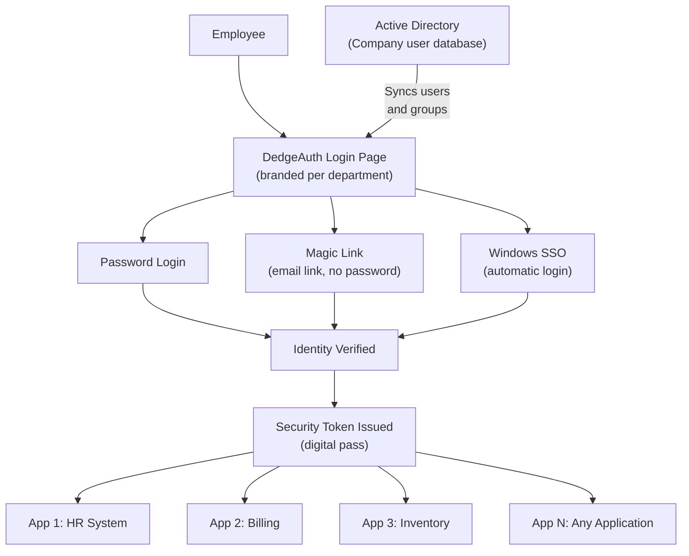

# DedgeAuth — One Login to Rule Them All

## What It Does (The Elevator Pitch)

Imagine you work at a company with 15 different internal applications — HR, billing, inventory, CRM, and more. With most setups, you'd need 15 different usernames and passwords. Forget one? Reset it. Changed your password? Update it in 15 places.

**DedgeAuth** eliminates this headache. It's a centralized login system — one place that handles authentication (verifying "you are who you say you are") for every application in the organization. Log in once, and you're in everywhere. It supports traditional passwords, magic links (click a link in your email to log in — no password needed), Windows single sign-on (if you're logged into your Windows PC, you're automatically logged into all apps), and Active Directory sync (it imports your company's user groups and permissions automatically).

And here's a bonus: each department or client can get their own branded login page with their own logo and colors.

## The Problem It Solves

Most organizations face an identity crisis (pun intended):
- **Password fatigue** — Employees manage dozens of passwords, leading to weak passwords, password reuse, and sticky notes on monitors
- **Scattered user management** — Adding a new employee means creating accounts in 10+ systems. Removing a departing employee means remembering to deactivate all those accounts (and if you miss one, that's a security breach)
- **No consistency** — Each application handles login differently. Some require 2-factor authentication; some don't. Some lock after 3 attempts; some never lock. The security posture is only as strong as the weakest link
- **Branding headaches** — Multi-tenant organizations (companies serving multiple clients or departments) need different branding on login screens, which most auth systems don't support

DedgeAuth solves all of this with one centralized system.

## How It Works

Here's the step-by-step:

1. **Employee visits any company application** — Instead of that app having its own login screen, it redirects to DedgeAuth.
2. **Employee chooses how to log in**:
   - **Password** — the traditional way
   - **Magic link** — enter your email, receive a link, click it, done. No password to remember.
   - **Windows SSO** — if you're already logged into your Windows PC, DedgeAuth recognizes you automatically. Zero clicks.
3. **DedgeAuth verifies identity** — It checks credentials against the company directory (Active Directory — the master list of all employees and their access rights).
4. **A security token is issued** — Think of this as a digital wristband at a concert. Once you have it, you can enter any stage without showing your ticket again.
5. **The token works everywhere** — Every application trusts DedgeAuth's token. Visit another app? The token is checked automatically — no second login needed.

## Key Features

- **Multiple login methods** — Password, magic link (email-based passwordless login), and Windows SSO (automatic login from Windows)
- **Active Directory sync** — Automatically imports users, groups, and permissions from your company's existing directory. No manual account creation.
- **Multi-tenant branding** — Each department, client, or business unit gets their own branded login page (custom logo, colors, messaging)
- **JWT-based tokens** — Uses JSON Web Tokens (industry-standard digital passes) that work with any modern application
- **Self-hosted** — Runs entirely on your own servers. No user data is sent to the cloud.
- **Centralized user management** — Add or remove a user in one place, and it takes effect across all applications instantly
- **Audit logging** — Every login attempt, success, and failure is recorded for compliance and security review

## How It Compares to Competitors

| Feature | DedgeAuth | Keycloak | Auth0 (Okta) | Authentik | ZITADEL |
|---|---|---|---|---|---|
| **Magic link login** | Built-in | Plugin required | Built-in | Via flows | Built-in |
| **Windows SSO/AD** | First-class | Via federation | Via enterprise add-on | Via LDAP | Limited |
| **Multi-tenant branding** | Built-in | Via realms | Enterprise tier | Via tenants | Built-in |
| **Self-hosted** | Yes (only option) | Yes | No (cloud only) | Yes | Cloud-first |
| **Deployment complexity** | Simple (.NET app) | Complex (Java stack) | N/A (managed) | Moderate (Docker) | Moderate |
| **Per-user pricing** | No | No (unless managed) | Yes ($23/mo+) | Yes ($5/user/mo enterprise) | Yes ($100/mo+) |
| **Active Directory sync** | Native, automatic | Federation setup | Enterprise connector | LDAP source | Via IDP |
| **Technology stack** | .NET (Windows-native) | Java | Cloud service | Python | Go |

**Key takeaway:** Auth0 is the market leader but charges per user and is cloud-only. Keycloak is free but requires Java expertise and complex setup. DedgeAuth fills the sweet spot: self-hosted, simple deployment on Windows, native AD/SSO integration, and no per-user fees. For Windows-centric organizations, DedgeAuth is the most natural fit.

## Screenshots

## Revenue Potential

### Licensing Model
- **Per-organization license** — flat fee, no per-user charges (a major selling point vs. Auth0/ZITADEL)
- **Tiered by features**: Standard (password + magic link) vs. Enterprise (+ SSO + AD sync + multi-tenant branding)
- **Annual subscription** with included updates and security patches

### Target Market
- **Mid-to-large enterprises** (100–10,000+ employees) running Windows Server infrastructure
- **Multi-tenant organizations** — companies managing multiple brands, clients, or departments
- **Regulated industries** (finance, healthcare) requiring self-hosted identity management for compliance
- **Organizations migrating away from Auth0/Okta** due to escalating per-user costs

### Revenue Drivers
- Auth0 costs $2.76–$14.40/user/month for enterprise features. A 500-person organization pays $16,560–$86,400/year. DedgeAuth's flat fee undercuts this significantly
- GDPR and data sovereignty requirements push organizations toward self-hosted solutions
- Active Directory integration is critical for Windows environments — and DedgeAuth does it natively while competitors treat it as an add-on

### Estimated Pricing
- **Standard** (password + magic link, up to 500 users): $5,000/year
- **Professional** (+ SSO + AD sync, up to 2,000 users): $15,000/year
- **Enterprise** (+ multi-tenant branding, unlimited users): $30,000+/year
- **Implementation consulting**: $10,000–$25,000

## What Makes This Special

1. **No per-user fees** — In a market where every competitor charges per user, DedgeAuth's flat pricing is a breath of fresh air. The cost doesn't balloon as the organization grows.
2. **Windows-native** — Built on .NET for Windows Server environments. No Java runtime (Keycloak), no Python stack (Authentik), no Go compilation (ZITADEL). It fits naturally into existing Windows infrastructure.
3. **Magic link + SSO + AD in one box** — Most competitors offer these as separate modules or plugins. DedgeAuth includes all three authentication methods out of the box.
4. **Multi-tenant branding** — Each department or client sees a login page that looks like *theirs*. This is an enterprise feature that competitors charge premium prices for.
5. **Self-hosted by design** — In an era of cloud-first products, DedgeAuth is self-hosted-first. User credentials never leave the organization's network — a requirement for many regulated industries.
