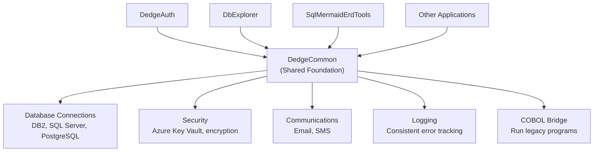

# DedgeCommon — The Invisible Foundation That Powers Every Application

## What It Does (The Elevator Pitch)

Think of a house. You see the walls, the roof, the kitchen, and the bathrooms. But underneath, hidden from view, there's plumbing, electrical wiring, a foundation, and structural beams. Without them, nothing works — but you never think about them.

**DedgeCommon** is the plumbing and electrical wiring of the Dedge software ecosystem. It's a shared foundation layer (a set of reusable building blocks) that every other Dedge application sits on top of. It handles the unglamorous but essential work: connecting to databases, securing sensitive data, sending emails and text messages, writing log files, and even running old COBOL programs (a programming language from the 1960s still used in banking and insurance) from modern applications.

## The Problem It Solves

Without a shared foundation, every application in a company reinvents the wheel:
- **App A** connects to the database one way; **App B** does it differently — and when the database password changes, both break in different ways
- **App C** sends emails using one method; **App D** uses another — and neither handles errors properly
- **App E** stores secrets in a configuration file (dangerous); **App F** uses Azure Key Vault (a secure cloud-based safe for passwords and encryption keys) — no consistency

This leads to duplicated effort, inconsistent behavior, security gaps, and a maintenance nightmare. When something breaks, each application has its own unique way of breaking.

DedgeCommon provides one consistent, tested, secure way to do all of these common tasks. Build on DedgeCommon, and the plumbing just works.

## How It Works

Here's what DedgeCommon provides under the hood:

1. **Database connections** — A single, consistent way to connect to three major database systems: DB2 (used heavily in banking/insurance), SQL Server (Microsoft's database), and PostgreSQL (a popular open-source database). When a password changes or a server moves, you update it in one place.
2. **Security via Azure Key Vault** — Instead of storing passwords in files (which can be stolen), DedgeCommon retrieves secrets from Azure Key Vault (Microsoft's cloud-based safe). Applications never see the actual passwords — they just ask DedgeCommon, and it handles the rest securely.
3. **Logging** — Every application writes its log entries (records of what happened) in the same format, to the same place, making it easy to search across all applications when troubleshooting.
4. **Communications** — Need to send an email notification or an SMS alert? DedgeCommon provides a ready-made, tested way to do it.
5. **COBOL bridge** — Many large organizations still run critical business logic in COBOL, a 60-year-old programming language. DedgeCommon lets modern applications call those old programs without rewriting them — like having a translator who speaks both languages fluently.

## Key Features

- **Multi-database support** — Connects to DB2, SQL Server, and PostgreSQL through a unified interface (one way to talk to all three)
- **Azure Key Vault integration** — Secure secret management without storing passwords in files
- **Structured logging** — Consistent log format across all applications for easy troubleshooting
- **Email and SMS** — Pre-built, tested communication capabilities
- **COBOL interoperability** — Bridge between modern .NET applications and legacy COBOL programs
- **NuGet package** — Distributed as a NuGet package (a pre-packaged software library that developers add to their projects with one command, like an app from an app store)
- **Battle-tested** — Used by every Dedge application in production

## How It Compares to Competitors

> **Note:** No competitor JSON file was found for this product. The comparison below is based on the general market landscape.

| Feature | DedgeCommon | Building from scratch | Enterprise Service Bus | Spring Boot Starters |
|---|---|---|---|---|
| **DB2 support** | Built-in | Manual setup | Varies | Limited |
| **COBOL bridge** | Built-in | Very difficult | Rare | No |
| **Azure Key Vault** | Built-in | Manual integration | Varies | Available |
| **Unified logging** | Built-in | Must standardize | Varies | Available |
| **Email/SMS** | Built-in | Must build | Varies | Must add |
| **Time to integrate** | Minutes | Weeks–months | Weeks | Hours–days |
| **Platform** | .NET | Any | Various | Java only |

**Key takeaway:** There's no direct competitor because DedgeCommon is purpose-built for the Dedge ecosystem. The real comparison is "use DedgeCommon" versus "build all of this from scratch for every application" — which costs months of developer time and introduces inconsistency.

## Screenshots

## Revenue Potential

### Licensing Model
- **Included with the Dedge platform** — DedgeCommon is the foundation, so it comes bundled with the ecosystem
- **Can be licensed separately** for organizations that want the infrastructure building blocks without the full product suite
- **Support contracts** for COBOL bridge implementation and database integration assistance

### Target Market
- **Organizations using the Dedge ecosystem** — every customer automatically needs DedgeCommon
- **Companies with legacy COBOL systems** that need modern application integration
- **Enterprises running DB2** (banking, insurance, government) that need standardized .NET connectivity

### Revenue Drivers
- Every Dedge product depends on DedgeCommon — it's a mandatory component that drives platform adoption
- The COBOL bridge alone justifies the investment for companies spending $500K–$5M+ annually on legacy system maintenance
- Standardized database and security handling reduces development costs by an estimated 20–30% across new projects

### Estimated Pricing
- **Bundled with Dedge platform**: Included
- **Standalone foundation license**: $10,000/year
- **COBOL bridge consulting**: $15,000–$50,000 per engagement
- **Custom integration support**: $200/hour

## What Makes This Special

1. **The COBOL bridge** — Very few modern frameworks can call COBOL programs from .NET applications. For organizations with decades of COBOL business logic, this alone is worth the price of admission.
2. **Three databases, one interface** — Supporting DB2, SQL Server, and PostgreSQL through a single consistent layer is unusual. Most foundations focus on one or two databases.
3. **Security by default** — Azure Key Vault integration means applications built on DedgeCommon are secure from Day 1, without developers needing to think about secret management.
4. **Production-proven** — DedgeCommon isn't theoretical. Every Dedge application runs on it daily in production environments. Bugs have been found and fixed over years of real-world use.
5. **The multiplier effect** — Every improvement to DedgeCommon instantly benefits every application in the ecosystem. Fix a database connection issue once, and all 10+ applications get the fix simultaneously.
