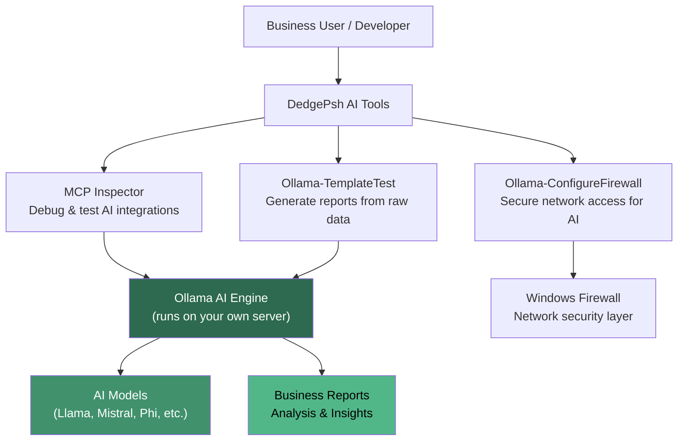

# DedgePsh AI Tools — Private AI Made Simple for Enterprise

## What These Tools Do (Elevator Pitch)

Artificial Intelligence is transforming every industry, but most businesses face a paralyzing question: *"How do we use AI without sending our confidential data to someone else's servers?"* The DedgePsh AI Tools answer that question. They let you run powerful AI models entirely on your own hardware — no data leaves your building, no monthly API fees, no vendor lock-in.

Think of it this way: instead of mailing your private documents to a stranger for analysis, you hire a brilliant analyst who works in your own office, uses your own computer, and never talks to anyone outside. These three tools handle the plumbing: setting up the AI engine, configuring the network, testing the results, and giving developers a way to inspect how the AI communicates.

For a business buyer, this means: **private, on-premises AI capabilities at a fraction of the cost of cloud AI services, with zero data-leakage risk.**

---

## Overview Diagram

---

## Tool-by-Tool Guide

---

### MCP Inspector

- **What it does (business terms):** MCP Inspector is a visual control panel for testing how AI tools communicate with each other. The "Model Context Protocol" (MCP) is a new industry standard — think of it as a universal language that lets AI assistants talk to databases, file systems, and other software. This tool gives developers a browser-based dashboard where they can see every message exchanged, test commands, and diagnose problems in real time.

  Imagine you are setting up a new phone system in your office. Before going live, you would want to make test calls, listen to the audio quality, and verify that every extension connects to the right desk. MCP Inspector is that test phone — but for AI integrations.

  The tool automatically installs itself (it uses Node.js behind the scenes), opens a web browser, and presents a clean interface where you can connect to any MCP server, send commands, and watch the responses flow back.

- **Who needs it:** Software developers and integration engineers building AI-powered features into business applications. Also useful for quality-assurance teams validating that AI integrations work correctly before going live.

- **Can it be sold standalone?** **Yes** — MCP is rapidly becoming the standard for AI tool integration (backed by Anthropic and adopted by major AI providers). A polished, easy-to-install MCP debugging tool has strong market appeal. Today's alternatives require manual command-line setup; this wraps everything in a one-click experience. As the MCP ecosystem grows, demand for debugging tools will grow with it.

---

### Ollama-ConfigureFirewall

- **What it does (business terms):** When you install an AI engine (Ollama) on a server, it needs permission to communicate over the network — both to download AI models from the internet and to accept requests from other machines in your office. Windows Firewall blocks all of this by default for security.

  This tool is like a security guard who knows exactly which doors to unlock: it reads the current AI configuration (which network port is being used, where the AI engine is installed), then creates precisely the right firewall rules — no more, no less. It opens the AI port for incoming requests, allows the AI engine to download models, and optionally lets the web browser access AI management pages.

  It also has a "show me what exists" mode (for auditing), a "remove everything" mode (for cleanup), and a "what would change" mode (for cautious administrators).

- **Who needs it:** Any IT team deploying Ollama (private AI) on Windows servers. Without proper firewall rules, the AI engine is either completely isolated (useless to other machines) or manually configured with overly broad rules (a security risk).

- **Can it be sold standalone?** **Possibly** — on its own, it is a relatively small utility. However, as a component of a "Private AI Deployment Kit" (install Ollama + configure firewall + validate with templates), it becomes part of a compelling package. The value is in eliminating the trial-and-error that most teams go through when deploying Ollama on Windows.

---

### Ollama-TemplateTest

- **What it does (business terms):** This is a working proof-of-concept that demonstrates the business value of private AI: it takes a raw log file (in this case, bank terminal transaction logs), feeds it to the local AI engine with a structured prompt template, and produces a polished Markdown report — all without any data leaving the server.

  Think of it like this: you have a shoebox full of receipts. Instead of hiring a bookkeeper to sort through them, you hand the box to your in-house AI analyst. Minutes later, you get back a clean, formatted summary report.

  The tool checks that the AI engine is running, selects the best available model, loads the data, applies the analysis template, times the operation, and saves the results. It demonstrates the full pipeline from raw data to business intelligence using entirely local AI.

- **Who needs it:** Business analysts, compliance teams, and operations managers who generate reports from raw data. Also valuable as a reference implementation for developers building their own AI-powered reporting tools.

- **Can it be sold standalone?** **Yes** — the template-based report generation pattern is extremely powerful and generalizable. The bank terminal example is just one use case. With additional templates, this becomes an "AI Report Factory" that can analyze server logs, customer feedback, financial data, regulatory filings, or any structured text. The key selling point is **privacy**: the data never leaves the building.

---

## Revenue Potential

| Product Concept | Target Buyer | Pricing Model | Estimated Annual Value |
|---|---|---|---|
| **Private AI Deployment Kit** (all 3 tools + setup guide) | IT teams exploring on-premises AI | One-time license + annual support | $5,000 - $15,000/year |
| **MCP Developer Toolkit** (MCP Inspector + SDK) | AI integration developers | Per-seat subscription | $500 - $1,500/developer/year |
| **AI Report Factory** (Template system + custom templates) | Business operations teams | Per-department license | $3,000 - $10,000/year |
| **Managed Private AI Service** (deployment + monitoring + updates) | Enterprises with compliance needs | Monthly managed service | $2,000 - $8,000/month |

### Product Packaging Ideas

1. **DedgePsh AI Starter** — All three tools bundled as a "get started with private AI in 30 minutes" package. Includes installation scripts, firewall configuration, and a working demo template. *Price: $2,500 one-time + $1,000/year support.*

2. **DedgePsh AI Report Factory** — Template-based report generation platform. Ship with 10 pre-built templates (financial analysis, log analysis, customer feedback, incident reports, etc.) and a template authoring guide. *Price: $5,000/year for the platform + $500 per custom template.*

3. **DedgePsh MCP DevTools** — MCP Inspector packaged as a professional developer tool with enhanced features (session recording, regression testing, CI/CD integration). *Price: $1,000/developer/year.*

4. **DedgePsh Private AI Enterprise** — Full deployment automation: Ollama installation, model management, firewall configuration, health monitoring, template library, and MCP debugging — all wrapped in a single deployment script with enterprise support. *Price: $15,000/year for up to 10 servers.*

---

## What Makes This Special

1. **Zero data leakage** — Every AI operation runs on the customer's own hardware. No API calls to OpenAI, Google, or any external service. This is the number-one requirement for banks, healthcare, government, and defense.

2. **No recurring API costs** — Cloud AI services charge per token (per word processed). A busy organization can spend $10,000+ per month on API fees. Ollama running locally costs only the electricity to run the server.

3. **MCP-native from day one** — The Model Context Protocol is the emerging standard for AI tool integration. Being MCP-native means these tools are future-proof and interoperable with the growing ecosystem of MCP-compatible AI assistants.

4. **Template-driven intelligence** — The report generation system separates the "how to analyze" (template) from the "what to analyze" (data). Business users can create new analysis types without writing code — just write a prompt template in plain English.

5. **Windows-first** — Most open-source AI tooling targets Linux. These tools are purpose-built for Windows Server environments, handling Windows-specific challenges (firewall configuration, service management, path conventions) that Linux-focused tools ignore.

6. **Production-tested** — These are not lab experiments. They run on production servers analyzing real business data, proving that private AI is practical today, not just a future promise.
