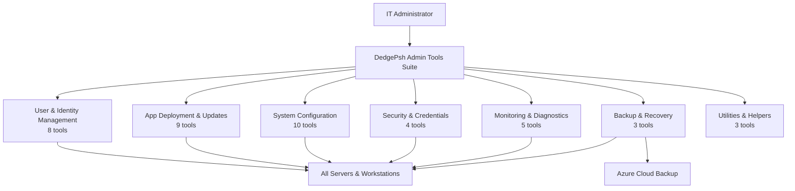

# DedgePsh Admin Tools — Your IT Department in a Box

## What These Tools Do (Elevator Pitch)

Imagine hiring a team of 42 expert IT administrators who never sleep, never make typos, and can configure hundreds of servers in minutes instead of days. That is what the DedgePsh Admin Tools suite delivers. These tools automate the most time-consuming, error-prone, and repetitive tasks that system administrators face daily: setting up new user accounts, deploying software, backing up configurations, patching servers, monitoring health, and enforcing security policies. Instead of clicking through dozens of screens on each server, an administrator runs one command and every server in the organization is updated simultaneously.

For a business buyer, this means: **fewer outages, faster onboarding of new employees, consistent security across every machine, and dramatically lower labor costs for routine IT operations.**

---

## Overview Diagram

---

## Tool-by-Tool Guide

---

### User & Identity Management

These tools handle everything related to people: creating accounts, checking permissions, comparing settings between users, and querying organizational directories.

---

#### AddDedgeUserAsLocalAdmin

- **What it does (business terms):** When a new team member joins and needs administrator access on a server, this tool adds them to the local administrators group automatically. Think of it as handing someone a master key to a building — but done instantly and logged for auditing.
- **Who needs it:** Any organization that onboards employees onto Windows servers and needs to grant elevated access without manual Remote Desktop sessions.
- **Can it be sold standalone?** **Yes** — this is a common pain point for IT helpdesks. A "one-click admin provisioning" micro-tool has appeal for MSPs (Managed Service Providers) managing multiple clients.

---

#### Ad-CompareUserSettings

- **What it does (business terms):** Compares the permissions and group memberships of two employees side by side, like comparing two resumes to spot what one person has that the other does not. Generates a categorized report highlighting every difference.
- **Who needs it:** IT managers onboarding a new hire who should have "the same access as Employee X," or auditors verifying that permissions match job roles.
- **Can it be sold standalone?** **Yes** — compliance-driven organizations (finance, healthcare) pay premium prices for user-access auditing tools. This fills a gap that many large vendors overlook.

---

#### AdEntra-GroupTools

- **What it does (business terms):** Exports the entire organizational chart of security groups from Active Directory and Microsoft Entra (the cloud directory) into a structured file. Imagine printing out a family tree of every club and committee in your company, showing who belongs to what.
- **Who needs it:** Security teams, auditors, and IT architects who need a snapshot of "who can access what" across on-premises and cloud environments.
- **Can it be sold standalone?** **Possibly** — valuable as part of a compliance bundle. Pure standalone appeal is moderate since larger SIEM tools overlap here.

---

#### Verify-AdUser

- **What it does (business terms):** Checks whether a specific user account actually exists in the company directory. Like calling the front desk to confirm someone really works here before giving them a badge.
- **Who needs it:** Scripts and automated workflows that need to validate user accounts before performing actions (creating mailboxes, granting database access, etc.).
- **Can it be sold standalone?** **No** — too narrow on its own, but essential as a building block within larger automation suites.

---

#### Entra-GetCurrentUserMetaInfo

- **What it does (business terms):** Retrieves the current logged-in user's profile information from the Microsoft cloud directory — name, email, department, manager, and other metadata. Like looking up your own employee badge details instantly.
- **Who needs it:** Any automated process that needs to personalize actions based on who is running it (e.g., sending notifications to the right email, tagging work items with the correct owner).
- **Can it be sold standalone?** **No** — a utility function, but critical plumbing for personalized automation.

---

#### Get-DedgeAclGroupMembers

- **What it does (business terms):** Lists every person who belongs to specific security groups, such as "Developers" or "Server Administrators." Like pulling a roster of everyone who has a keycard to a particular floor of the building.
- **Who needs it:** Managers and security officers who need quick answers to "who has access to our production servers?"
- **Can it be sold standalone?** **Possibly** — useful as part of an access-review or compliance toolkit.

---

#### Entra-GetADPrincipalGroupMembership

- **What it does (business terms):** Shows all the groups a particular user belongs to, including Windows capabilities and roles. The reverse of the previous tool: instead of "who is in this group," it answers "what groups does this person belong to?"
- **Who needs it:** Helpdesk staff troubleshooting "why can this person access X but not Y?"
- **Can it be sold standalone?** **No** — a diagnostic helper, best bundled with the identity management suite.

---

#### Export-DedgeCommonConfig

- **What it does (business terms):** Exports shared configuration files used across all company servers into a portable format. Think of it as photocopying every instruction manual in the building so you can recreate them elsewhere.
- **Who needs it:** Disaster recovery teams and migration projects that need a complete snapshot of organizational configuration.
- **Can it be sold standalone?** **No** — a support utility for the broader deployment system.

---

### App Deployment & Updates

These tools move software from a developer's machine to every server that needs it, automatically, securely, and consistently.

---

#### Get-App

- **What it does (business terms):** An interactive app store for the organization. Shows all available internal and external applications grouped by category, and lets you install any of them with a single selection — like browsing an app store on your phone, but for enterprise server software.
- **Who needs it:** Every server administrator who sets up new machines or needs to add software to existing ones.
- **Can it be sold standalone?** **Yes** — an "enterprise app store" that unifies internal tools, Windows features, and public packages (via winget) into one menu is a strong product concept. Competes with tools like PDQ Deploy and Chocolatey for Business.

---

#### Inst-Psh (Install PowerShell App)

- **What it does (business terms):** Installs a specific internal PowerShell application onto a server. Like ordering a single item from the company warehouse and having it delivered and set up.
- **Who needs it:** Administrators adding specific tools to servers without going through the full app-store experience.
- **Can it be sold standalone?** **No** — a component of the deployment system.

---

#### Inst-WinApp (Install Windows App)

- **What it does (business terms):** Installs native Windows desktop applications (.exe/.msi) from the organization's internal catalog. The desktop-app counterpart to Inst-Psh.
- **Who needs it:** IT staff provisioning Windows workstations with standard business applications.
- **Can it be sold standalone?** **No** — a component of the deployment system.

---

#### Upd-Apps (Update All Apps)

- **What it does (business terms):** Updates every installed application on the machine to its latest version in one sweep — like pressing a "refresh everything" button. Uses the Windows Package Manager (winget) under the hood.
- **Who needs it:** Any organization that wants to keep software up to date without manually checking each application.
- **Can it be sold standalone?** **Possibly** — "one-click patch everything" is appealing, though winget itself is free. The value is in the orchestration across fleets.

---

#### Agent-DeployTask

- **What it does (business terms):** Remotely triggers installation or reinstallation of software on target servers without needing to log into them. Like calling a building superintendent and saying "install new locks on floors 3 through 7" — and it just happens.
- **Who needs it:** Operations teams managing dozens or hundreds of servers that need consistent software deployments.
- **Can it be sold standalone?** **Possibly** — remote deployment agents are a crowded market, but this is lightweight and purpose-built.

---

#### Agent-HandlerAutoDeploy

- **What it does (business terms):** A scheduled watchdog that automatically deploys the latest versions of tools to all servers every day. No human needs to press a button — new versions appear on every server overnight. Like having a night janitor who also updates all the equipment.
- **Who needs it:** Organizations that want zero-touch software distribution across their server fleet.
- **Can it be sold standalone?** **Yes** — continuous deployment for internal tools is a strong selling point for any operations team.

---

#### Add-Task

- **What it does (business terms):** Registers a new Windows Scheduled Task with the correct security settings, folder structure, and logging. Instead of navigating the Scheduled Task wizard (which has dozens of screens), you type one command and the task is created, configured, and ready to run.
- **Who needs it:** Anyone who automates recurring jobs on Windows servers.
- **Can it be sold standalone?** **Possibly** — useful but niche. Best as part of the deployment suite.

---

#### Run-Psh

- **What it does (business terms):** A shortcut launcher that runs internal PowerShell apps with the correct parameters. Like a TV remote that knows which channel is which — you just press the button.
- **Who needs it:** Administrators who want quick access to frequently used tools.
- **Can it be sold standalone?** **No** — a convenience wrapper.

---

#### CompareDedgePshAppsFromProdWithLocal

- **What it does (business terms):** Compares the software versions deployed on production servers against the developer's local copies, highlighting any differences. Like checking whether the recipe in the restaurant kitchen matches the one in the cookbook. Also cleans up code formatting inconsistencies.
- **Who needs it:** Development leads and release managers ensuring production matches source control.
- **Can it be sold standalone?** **Possibly** — drift detection between environments is a known DevOps challenge. Could be packaged as "Environment Drift Detector."

---

### System Configuration

These tools standardize how servers and workstations are set up, ensuring every machine follows the same blueprint.

---

#### Set-WinRegionTimeAndLanguage

- **What it does (business terms):** Configures a Windows machine's regional settings — language, time zone, date format, keyboard layout — to the organization's standard. Runs automatically at login so new machines are instantly compliant. Like pre-setting every clock in a new office to the correct time zone.
- **Who needs it:** Any company deploying servers or virtual desktops that need consistent locale settings.
- **Can it be sold standalone?** **No** — a configuration primitive, but essential for onboarding automation.

---

#### Configure-DefaultTerminalToConsoleHost

- **What it does (business terms):** Sets the default command-line terminal on a machine so that administrators get the right environment every time they open a console window. Eliminates the "wrong shell" problem.
- **Who needs it:** IT teams standardizing the developer/admin experience across servers.
- **Can it be sold standalone?** **No** — a one-line configuration helper.

---

#### Disable-EdgeSidebar

- **What it does (business terms):** Turns off the Microsoft Edge browser sidebar across all machines via policy. On servers, browser distractions have no place — this removes them centrally. Like removing vending machines from the operating room.
- **Who needs it:** Organizations that lock down server environments for security and performance.
- **Can it be sold standalone?** **No** — too narrow, but a useful entry in a "server hardening" bundle.

---

#### Set-VsCodePwshDefault

- **What it does (business terms):** Configures Visual Studio Code and Cursor (code editors) to use modern PowerShell 7 instead of the legacy version. Prevents the frustrating "wrong PowerShell loaded" problem that wastes developer time.
- **Who needs it:** Development teams using VS Code or Cursor on Windows.
- **Can it be sold standalone?** **No** — a developer-experience enhancement.

---

#### Setup-TerminalProfiles

- **What it does (business terms):** Configures Windows Terminal with custom profiles, color schemes, and shortcuts tailored to the organization's tools. Like pre-configuring every workstation's desktop with the right icons and layouts.
- **Who needs it:** Teams that want a consistent terminal experience across all machines.
- **Can it be sold standalone?** **No** — a configuration helper.

---

#### Add-TaskBarShortcuts

- **What it does (business terms):** Pins the most-used administration tools (Task Scheduler, VS Code, PowerShell, database tools) to the Windows taskbar automatically. New servers get a ready-to-use desktop without manual setup.
- **Who needs it:** IT teams provisioning new servers or virtual desktops.
- **Can it be sold standalone?** **No** — a provisioning helper.

---

#### Config-Ssh

- **What it does (business terms):** Sets up secure SSH connections on Windows — installs the client, generates encryption keys, and configures server connections. Like installing a secure intercom system between buildings.
- **Who needs it:** Teams that manage Linux servers from Windows machines, or use SSH for secure file transfers.
- **Can it be sold standalone?** **Possibly** — SSH setup on Windows remains confusing for many admins. A guided setup wizard has appeal.

---

#### Map-NetworkDrives

- **What it does (business terms):** Automatically connects shared network folders (drive letters like S:, P:) at login. Ensures every user sees the same shared folders without manual setup. Like assigning everyone the same locker number on their first day.
- **Who needs it:** Organizations with shared file servers accessed by multiple users.
- **Can it be sold standalone?** **No** — a login configuration tool.

---

#### Check-PshPathsOnServers

- **What it does (business terms):** Scans all servers to verify that required application folders exist and are correctly configured. Like doing a walkthrough of every office to confirm the filing cabinets are in the right rooms.
- **Who needs it:** Operations teams validating deployment health across server fleets.
- **Can it be sold standalone?** **No** — a diagnostic/hygiene tool.

---

#### Reg-List

- **What it does (business terms):** Searches and displays Windows Registry settings in a human-readable format. The Windows Registry is like a giant settings database buried inside every machine — this tool lets you query it as easily as searching a spreadsheet. Supports copy-paste of paths directly from the Registry Editor.
- **Who needs it:** Administrators troubleshooting application settings, Group Policy effects, or driver configurations.
- **Can it be sold standalone?** **Possibly** — a "Registry Explorer" with search and export is moderately appealing, though free alternatives exist.

---

### Security & Credentials

These tools manage passwords, permissions, and access rights — the locks and keys of the IT world.

---

#### Chg-Pass

- **What it does (business terms):** Changes a user's password and simultaneously updates every Windows Service that runs under that account. Normally, changing a service account password means logging into each server and updating each service manually — a process that can take hours. This does it in seconds. Like changing the lock on a building and automatically updating every employee's keycard.
- **Who needs it:** Every organization running Windows services under domain accounts. Password rotations without this tool cause service outages.
- **Can it be sold standalone?** **Yes** — service-account password rotation is a significant pain point. Enterprises pay for tools that prevent the "changed password, broke 50 services" scenario.

---

#### Set-DedgeAdmPasswordsLocally

- **What it does (business terms):** Stores administrator passwords securely on the local machine so that automated scripts can authenticate to servers in different environments (development, test, production) without hardcoding secrets. Like giving a trusted robot a set of keys it can use but cannot show to anyone.
- **Who needs it:** Operations teams that run automated tasks against multiple server environments.
- **Can it be sold standalone?** **Possibly** — credential vaulting for automation is a known need, though Azure Key Vault and similar cloud services overlap.

---

#### Grant-LogonRightsToCurrentUser

- **What it does (business terms):** Grants the current user the right to run scheduled tasks and Windows services. Without these rights, automated jobs fail silently. Like stamping an employee's badge so the turnstile lets them into the automation wing.
- **Who needs it:** Anyone setting up scheduled automation on Windows servers.
- **Can it be sold standalone?** **No** — a prerequisite step, not a product. But critical for onboarding automation.

---

#### Auto-PatchHandler

- **What it does (business terms):** Takes over Windows Update patching from the system administrator, letting the application team control when and how patches are applied. Supports maintenance windows, rollback, exclusion lists, and notifications. Like giving the factory floor manager the ability to schedule equipment maintenance instead of waiting for a central team.
- **Who needs it:** Application teams that need control over patching schedules to avoid outages during critical business hours.
- **Can it be sold standalone?** **Yes** — automated patching with application-team control is a high-value product. Competes with WSUS, Ivanti, and ManageEngine Patch Manager but is lighter and more application-focused.

---

### Monitoring & Diagnostics

These tools watch servers for problems and provide detailed reports when something goes wrong.

---

#### Get-EventLog

- **What it does (business terms):** A comprehensive Windows Event Log analyzer with predefined patterns for common crises: unexpected reboots, database server failures, and system crashes. Instead of manually scrolling through thousands of cryptic log entries, this tool finds the needles in the haystack automatically. Like having a detective who reads every security camera tape and highlights only the suspicious moments.
- **Who needs it:** Any IT team that investigates server incidents. Especially valuable after outages.
- **Can it be sold standalone?** **Yes** — event-log analysis with pre-built patterns for common scenarios is a strong diagnostic product. Small-to-midsize businesses often lack dedicated SIEM tools and would benefit from this.

---

#### Scheduled-TaskMonitor

- **What it does (business terms):** Wraps any scheduled task with comprehensive logging — records when it started, how long it ran, whether it succeeded or failed, and captures all output. Turns invisible background jobs into fully audited, traceable operations. Like installing a dashcam on every delivery truck.
- **Who needs it:** Operations teams running dozens of scheduled tasks who need visibility into what is actually happening.
- **Can it be sold standalone?** **Possibly** — "scheduled task observability" is a niche but real need, especially for compliance.

---

#### WebSiteHandler

- **What it does (business terms):** Checks the health of IIS web servers — verifies that the web hosting software is installed correctly, all required components are present, and websites are responding. Like a building inspector checking that all the plumbing and electrical systems meet code.
- **Who needs it:** Teams running web applications on Windows servers (IIS).
- **Can it be sold standalone?** **Possibly** — IIS health checking is useful but narrow. Better as part of a monitoring bundle.

---

#### WinAdm

- **What it does (business terms):** An all-in-one administration menu that opens common tools (VS Code, PowerShell, Task Scheduler) with the correct elevated privileges. Also adds right-click context menu integration so you can open any file or folder in your preferred editor directly from Windows Explorer. Like having a universal remote for all your IT tools.
- **Who needs it:** Administrators who work across multiple tools daily and want a unified launcher.
- **Can it be sold standalone?** **Possibly** — an "admin command center" has appeal, especially with the context-menu integration.

---

#### WinUninstall

- **What it does (business terms):** Provides a clean, interactive menu for removing installed software, including stubborn programs that resist normal uninstallation. Scans all registry locations (64-bit, 32-bit, user-installed) and offers clean removal. Like hiring a moving company that finds and removes everything, even the things hidden in the attic.
- **Who needs it:** IT staff cleaning up servers or workstations, especially when standard uninstallers fail.
- **Can it be sold standalone?** **Possibly** — tools like Revo Uninstaller prove there is a market for thorough software removal.

---

### Backup & Recovery

These tools create safety nets so that configurations and applications can be restored after disasters.

---

#### Backup-EnvironmentVariables

- **What it does (business terms):** Creates a complete backup of every system setting (environment variable) on a machine as a restorable script. If a server is rebuilt or misconfigured, running the backup script restores all settings exactly as they were. Like photographing every dial and switch on a control panel before maintenance.
- **Who needs it:** Disaster recovery teams and anyone who rebuilds servers periodically.
- **Can it be sold standalone?** **Possibly** — environment variable management is a niche but painful gap in Windows administration.

---

#### Backup-DedgeCommonConfigFiles

- **What it does (business terms):** Automatically backs up shared configuration files from production servers on a regular schedule. Runs hourly on critical servers to ensure no configuration change is ever lost. Like having a secretary who photocopies every important document the moment it changes.
- **Who needs it:** Organizations running critical production servers where configuration drift or accidental changes could cause outages.
- **Can it be sold standalone?** **Possibly** — configuration backup for Windows servers is an underserved area. Most backup tools focus on data, not configuration.

---

#### Backup-ProductionDedgePshApps

- **What it does (business terms):** Creates daily snapshots of all production applications so they can be restored if a deployment goes wrong. Runs automatically on production and disaster-recovery servers. Like photographing every shelf in a warehouse so you know exactly where everything was.
- **Who needs it:** Operations teams that deploy frequently and need a rollback safety net.
- **Can it be sold standalone?** **Possibly** — deployment rollback insurance is valuable, though most CI/CD pipelines include this natively.

---

### Utilities & Helpers

Small but essential tools that support other operations.

---

#### RemoveServicesEntries

- **What it does (business terms):** Cleans up leftover database service entries from the Windows networking configuration file. When databases are uninstalled, they sometimes leave behind port reservations that can conflict with new installations. This tool surgically removes them. Like clearing old phone extensions from the company directory after someone leaves.
- **Who needs it:** Database administrators managing DB2 installations on Windows.
- **Can it be sold standalone?** **No** — too specialized to DB2 cleanup.

---

#### Remove-AppGlobally

- **What it does (business terms):** Removes a specific application from every server in the organization simultaneously. Instead of logging into 50 servers to uninstall something, one command cleans them all. Like recalling a product from every store shelf at once.
- **Who needs it:** IT teams retiring old applications or cleaning up after security incidents.
- **Can it be sold standalone?** **No** — a fleet-management utility, best bundled with the deployment suite.

---

#### Write-LogMessageBat

- **What it does (business terms):** Provides a logging bridge so that older Windows batch files (.bat) can use the same modern logging system as PowerShell scripts. Ensures all automation — old and new — writes to the same centralized log. Like giving legacy employees the same communication radio as everyone else.
- **Who needs it:** Organizations with a mix of old batch scripts and modern PowerShell automation.
- **Can it be sold standalone?** **No** — a compatibility bridge for the logging framework.

---

## Revenue Potential

| Segment | Target Buyer | Pricing Model | Estimated Annual Value |
|---|---|---|---|
| **Full Admin Suite** (all 42 tools) | Mid-to-large enterprises (50+ servers) | Per-server subscription | $15,000 - $50,000/year |
| **Deployment & Update Bundle** | MSPs managing client environments | Per-client flat fee | $3,000 - $8,000/year per MSP |
| **Security & Patching Bundle** | Compliance-driven organizations | Per-server subscription | $5,000 - $20,000/year |
| **Monitoring & Diagnostics Pack** | IT operations teams | Per-team license | $2,000 - $6,000/year |
| **Identity & Access Audit Pack** | Security/compliance teams | Annual audit license | $5,000 - $15,000/year |

**Total addressable market for the full suite:** Any Windows-centric organization with 20+ servers. Conservative estimate: 500,000+ potential customers globally.

### Product Packaging Ideas

1. **DedgePsh Essentials** — Get-App, Upd-Apps, Backup-EnvironmentVariables, Get-EventLog. Entry-level package for small IT teams. *Price: $2,000/year.*
2. **DedgePsh Operations** — Full Deployment + Monitoring + Backup bundles. For mid-size operations teams. *Price: $8,000/year.*
3. **DedgePsh Enterprise** — Everything including Identity Management, Security, and Patching. For compliance-driven enterprises. *Price: $25,000/year.*
4. **DedgePsh for MSPs** — Multi-tenant version of the full suite with per-client billing. *Price: $500/month base + $50/server/month.*

---

## What Makes This Special

1. **Battle-tested on production infrastructure** — These are not demo scripts. They manage real servers running real business-critical applications daily.
2. **Fleet-scale by default** — Every tool is designed to operate across dozens or hundreds of servers simultaneously, not just one machine at a time.
3. **Self-healing deployment** — The Agent-HandlerAutoDeploy system means the tools keep themselves up to date across the entire fleet without human intervention.
4. **Unified logging** — Every tool writes to the same centralized logging system, creating a single audit trail across all operations.
5. **Zero external dependencies** — No cloud subscriptions, no third-party agents, no licensing servers. Everything runs on standard Windows infrastructure with PowerShell.
6. **Compliance-ready** — Built-in auditing, logging, and reporting satisfy common compliance requirements (SOX, ISO 27001, GDPR operational controls).
