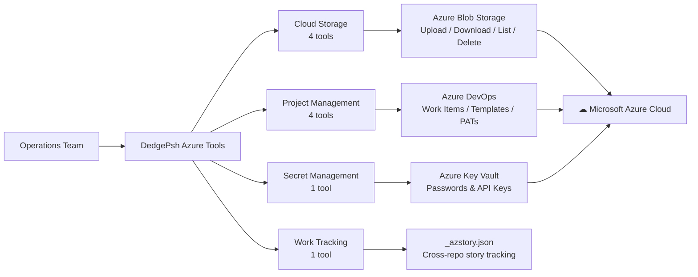

# DedgePsh Azure Tools — Your Cloud Operations Command Center

## What These Tools Do (Elevator Pitch)

Moving to the cloud is like moving your business to a new building — exciting, but overwhelming if you have to carry every box yourself. Microsoft Azure provides the building, but you still need someone to organize the filing cabinets, manage the storage rooms, handle the paperwork, and keep track of who has which keys.

The DedgePsh Azure Tools are that someone. This suite of 10 tools automates the most common Azure operations: storing and retrieving files in cloud storage, managing project plans in Azure DevOps, securing secrets in Key Vault, and tracking work items across development teams. Instead of clicking through the Azure Portal's labyrinth of menus, your team types one command and the job is done.

For a business buyer, this means: **faster cloud operations, fewer human errors, and a command-line interface that turns 15-minute portal tasks into 15-second automations.**

---

## Overview Diagram

---

## Tool-by-Tool Guide

---

### Cloud Storage Tools

These four tools work together as a complete file management system for Azure Blob Storage — Microsoft's cloud filing cabinet. Think of Azure Blob Storage as a limitless warehouse in the cloud where you can store any file (backups, reports, archives, exports). These tools let you put things in, take things out, see what is there, and clean up what you no longer need.

---

#### Azure-ContainerUpload

- **What it does (business terms):** Sends files from your server to Azure cloud storage. You specify which files to upload, and the tool handles authentication, container creation (if needed), and the transfer. Like dropping documents into a secure cloud safe-deposit box.

  The tool automatically organizes files by date in the cloud (year/month/day folders), reads account credentials from a configuration file (so secrets are not typed in commands), and logs every operation for auditing.

- **Who needs it:** Any team that needs to back up files to the cloud, share large files between offices, or archive data for long-term storage.

- **Can it be sold standalone?** **Possibly** — cloud upload tools exist in abundance, but this one integrates with the organization's existing authentication and logging framework, making it more convenient than generic alternatives like Azure Storage Explorer.

---

#### Azure-ContainerDownload

- **What it does (business terms):** Retrieves files from Azure cloud storage back to your server. Supports downloading multiple files at once and can recreate the original folder structure locally. Like requesting documents from your cloud safe-deposit box and having them delivered to your desk in the same organized folders.

- **Who needs it:** Teams that need to restore backups, retrieve archived reports, or pull shared files from the cloud.

- **Can it be sold standalone?** **No** — paired with Upload as a storage management duo.

---

#### Azure-ContainerListContent

- **What it does (business terms):** Shows you what is stored in a cloud container without downloading anything — like reading the table of contents of a filing cabinet without opening every drawer. Supports filtering by date range and name patterns so you can quickly find what you are looking for.

- **Who needs it:** Administrators auditing cloud storage usage, or anyone who needs to find a specific file in a large archive.

- **Can it be sold standalone?** **No** — a companion to the Upload/Download tools.

---

#### Azure-ContainerDelete

- **What it does (business terms):** Removes files from Azure cloud storage. Supports deleting multiple files at once and has a "what if" preview mode that shows what would be deleted without actually removing anything — a safety net for cautious administrators. Like shredding documents from the cloud archive, but with the option to review the stack before feeding them into the shredder.

- **Who needs it:** Teams managing storage costs by cleaning up old backups, or compliance teams purging data that has exceeded its retention period.

- **Can it be sold standalone?** **No** — completes the storage management quartet.

---

### Azure DevOps Project Management Tools

Azure DevOps is Microsoft's project management platform — think of it as a sophisticated digital whiteboard where teams plan work, track progress, and manage software releases. These tools automate the most tedious parts of using Azure DevOps.

---

#### Azure-DevOpsItemCreator

- **What it does (business terms):** Creates work items (tasks, user stories, bugs, epics) in Azure DevOps from a structured plan file. Instead of manually creating dozens of tasks one by one in the web interface, you write a JSON file describing the entire project hierarchy — epics containing stories containing tasks — and this tool creates them all at once, with proper parent-child relationships.

  Imagine you are planning a building renovation. Instead of writing 200 sticky notes by hand, you type up a spreadsheet and a machine stamps out all the sticky notes, color-coded, numbered, and pinned to the right columns on the board.

- **Who needs it:** Project managers and tech leads who set up new projects, sprints, or migration plans with many interrelated tasks.

- **Can it be sold standalone?** **Yes** — bulk work-item creation from templates is a pain point for every Azure DevOps team. Competing tools (like Azure DevOps REST API wrappers) exist but lack the hierarchical template approach and the template-per-server expansion capability this tool offers.

---

#### Azure-DevOpsUserStoryManager

- **What it does (business terms):** A comprehensive command center for managing individual work items in Azure DevOps. It can retrieve details, update descriptions, add comments, attach files, link to code repositories, change status, add tags, and create subtasks — all from a single tool. Offers both an interactive menu (for exploration) and a command-line interface (for automation).

  Think of it as a personal assistant for your project board. Instead of navigating through the Azure DevOps web portal (click, scroll, click, type, save), you tell the assistant what to do and it handles the portal for you.

  The tool also handles Unicode correctly (important for Norwegian and other non-English characters) and links Git branches to work items so the "Development" panel in Azure DevOps shows the right code connections.

- **Who needs it:** Developers, tech leads, and project managers who interact with Azure DevOps daily and want to automate repetitive actions.

- **Can it be sold standalone?** **Yes** — this is effectively a full Azure DevOps CLI client. While Microsoft offers `az boards`, this tool adds interactive mode, UTF-8 handling, repository linking, and a cleaner developer experience. Teams using automation pipelines (CI/CD, AI agents, chatbots) would especially benefit from a scriptable work-item manager.

---

#### Azure-DevOpsTemplateGenerator

- **What it does (business terms):** Generates hundreds of project tasks from server-specific templates. Given a list of servers and a task template (e.g., "for each server, create tasks for backup setup, monitoring configuration, and access verification"), the tool expands the template for every server and every database, creating all the Azure DevOps tasks with proper tags, dates, and prerequisite relationships.

  Imagine you are opening 15 new restaurant locations. Instead of writing the same 30-step setup checklist 15 times, you write it once with placeholders ("configure [restaurant name] kitchen"), and this tool prints out 450 personalized tasks — one for each step at each location.

- **Who needs it:** Infrastructure teams planning large-scale deployments, migrations, or server provisioning projects involving many similar servers.

- **Can it be sold standalone?** **Yes** — template-based work-item generation for infrastructure projects is a powerful concept. This solves the "we need 500 tasks for our data-center migration and creating them manually would take a week" problem.

---

#### Azure-DevOpsPAT-Manager

- **What it does (business terms):** Manages Personal Access Tokens (PATs) — the passwords that allow automated tools to communicate with Azure DevOps securely. Each team member's token is stored in a secure, per-user configuration file. The tool handles creation, storage, retrieval, validation, and guided setup.

  Think of PATs as special-purpose passwords: your regular password lets you log into the web portal, but automated scripts need their own credentials. This tool is the locksmith that creates, stores, and manages those credentials for every team member.

  If a token is missing or expired, the tool guides the user through setup interactively, then stores the result securely for all future use.

- **Who needs it:** Every team that uses Azure DevOps automation. Without proper PAT management, teams resort to sharing tokens (security risk), hardcoding them in scripts (audit failure), or constantly re-creating them when they expire (productivity drain).

- **Can it be sold standalone?** **Yes** — PAT management is a universal pain point. A tool that securely stores PATs per user, validates them, and integrates with other automation tools fills a real gap. Enterprise security teams would appreciate the per-user isolation and audit-friendly storage.

---

### Secret Management

---

#### Azure-KeyVaultManager

- **What it does (business terms):** A complete management interface for Azure Key Vault — Microsoft's cloud safe for passwords, API keys, certificates, and other secrets. Supports seven operations: create/update secrets, retrieve secrets, list all secrets, delete, recover deleted secrets, bulk import from a file, and bulk export.

  Think of Azure Key Vault as a bank vault in the cloud. This tool is the teller window: you can deposit secrets, withdraw them, check what is in the vault, remove items, and even recover items from the "recently deleted" shelf. The bulk import/export feature lets you move entire sets of secrets between environments (like moving all the contents of one safe into another).

  The tool handles subscription-aware vaults (when you have multiple Azure subscriptions), validates inputs before calling Azure, normalizes secret names to Key Vault's required format, and provides clear error messages when something goes wrong.

- **Who needs it:** DevOps engineers, security teams, and application developers who store credentials in Azure Key Vault and need a scriptable interface for managing them.

- **Can it be sold standalone?** **Yes** — Key Vault management from the command line with bulk import/export is a strong product. Developers often struggle with the Azure Portal's Key Vault interface for bulk operations. The import-from-TSV feature alone saves hours during environment setup. Security teams would value the export-for-audit capability.

---

### Work Tracking

---

#### Azure-StoryTracker

- **What it does (business terms):** Scans all projects on a developer's machine and creates a unified view of every Azure DevOps work item (user story, task, bug) that is linked to a local codebase. Each project can have an `_azstory.json` file that tracks which work items are associated with it. This tool collects them all into a single report.

  Think of it as a project manager walking through every office in the building and collecting the "current tasks" sticky notes from every desk, then presenting them in one consolidated list — grouped by project, showing status, type, and ownership.

- **Who needs it:** Team leads and developers who work across multiple projects and need a single view of all active work items without switching between Azure DevOps projects.

- **Can it be sold standalone?** **Possibly** — the concept of "show me all my work across all repositories" is valuable, but it depends on the `_azstory.json` convention being adopted. As part of a broader DevOps toolkit, it adds excellent visibility.

---

## Revenue Potential

| Product Concept | Target Buyer | Pricing Model | Estimated Annual Value |
|---|---|---|---|
| **Azure Storage Manager** (4 storage tools) | IT operations teams | Per-storage-account license | $2,000 - $5,000/year |
| **Azure DevOps Power Tools** (4 DevOps tools) | Development teams | Per-team subscription | $3,000 - $10,000/year |
| **Azure Key Vault CLI** (KeyVaultManager) | Security/DevOps teams | Per-seat license | $1,000 - $3,000/year |
| **Full Azure Operations Suite** (all 10 tools) | Enterprise IT departments | Per-organization license | $8,000 - $25,000/year |
| **Template Generator for Migrations** (standalone) | Infrastructure consulting firms | Per-project license | $5,000 - $15,000/project |

### Product Packaging Ideas

1. **DedgePsh Azure Essentials** — Storage tools + KeyVaultManager. For teams that primarily use Azure for backup and secret management. *Price: $3,000/year.*

2. **DedgePsh DevOps Accelerator** — All four DevOps tools + StoryTracker. For development teams that live in Azure DevOps and want command-line superpowers. *Price: $5,000/year per team.*

3. **DedgePsh Migration Planner** — TemplateGenerator + ItemCreator + UserStoryManager. Purpose-built for infrastructure teams planning large migrations. Includes sample templates for common migration scenarios (datacenter to Azure, database upgrades, server replacements). *Price: $10,000 per migration project.*

4. **DedgePsh Azure Complete** — The full 10-tool suite with priority support, custom template development, and quarterly feature updates. *Price: $15,000/year.*

5. **DedgePsh for Consultants** — Multi-tenant version allowing consultants to manage multiple client Azure environments from a single workstation. *Price: $8,000/year + $1,000/client/year.*

---

## What Makes This Special

1. **Unified authentication layer** — All tools share a single PAT management system and Azure login flow. Authenticate once, use everywhere. No per-tool credential juggling.

2. **Bulk operations where Azure Portal falls short** — The Azure web portal is powerful for individual operations but painful for bulk work. Creating 200 tasks, importing 50 secrets, or deleting 100 old backups — these tools handle volume effortlessly.

3. **Template-driven project planning** — The TemplateGenerator's server-aware, database-aware expansion is unique. Competitors offer basic CSV-to-work-item import; this tool understands infrastructure hierarchies (servers, databases, environments) and generates intelligent, interlinked task trees.

4. **Full Unicode support** — Built for international teams. Norwegian characters (æ, ø, å), German umlauts, and other non-ASCII text flow through correctly to Azure DevOps descriptions, comments, and titles. Many competing tools silently mangle international characters.

5. **Scriptable and automatable** — Every tool works in both interactive mode (for humans exploring) and command-line mode (for scripts and CI/CD pipelines). This dual-mode design means the same tools serve both ad-hoc administration and fully automated workflows.

6. **Configuration-file-driven** — Account keys, vault names, subscription IDs, and organization settings all live in configuration files — not in command parameters. This means commands are short, secrets stay out of command histories, and switching between environments is a config-file swap.
