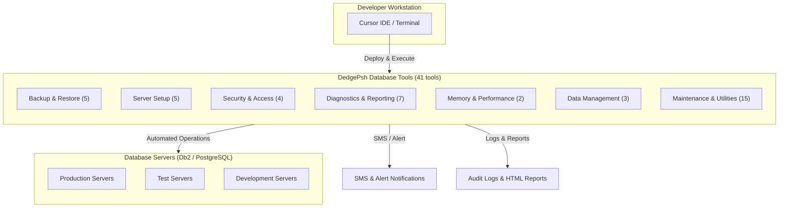
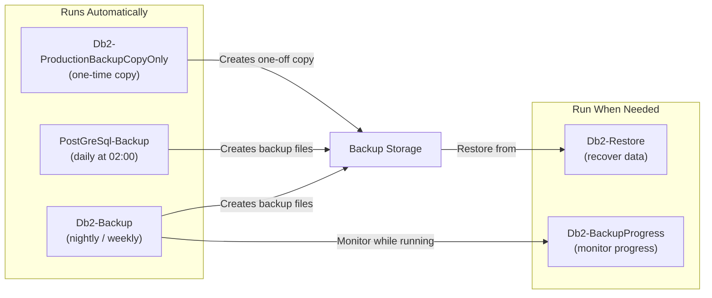
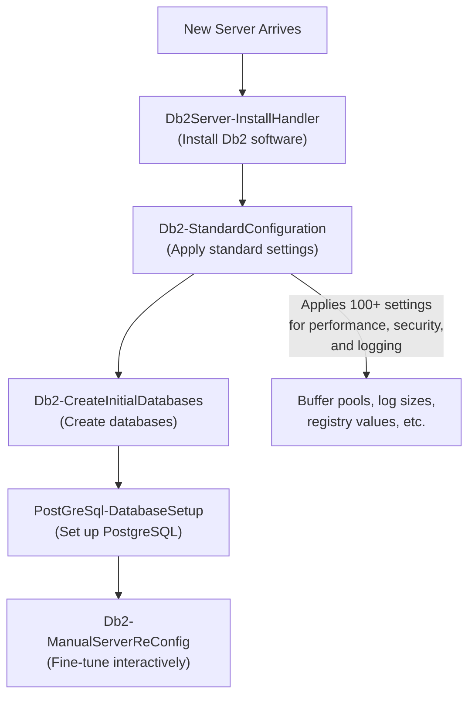
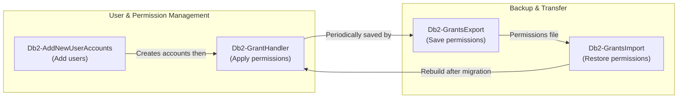
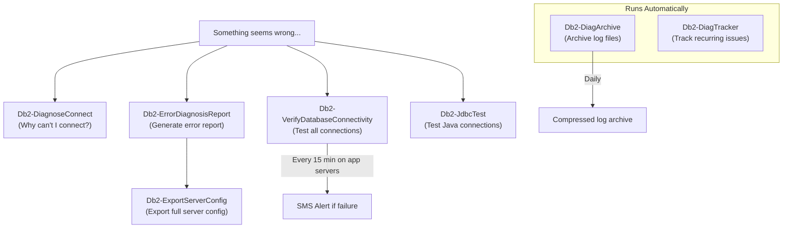
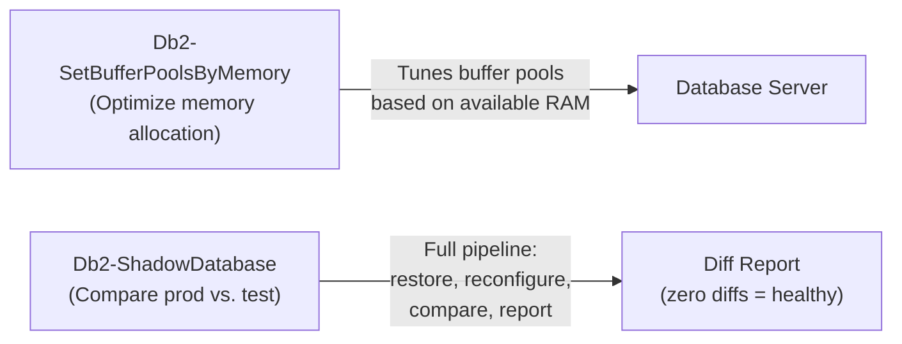
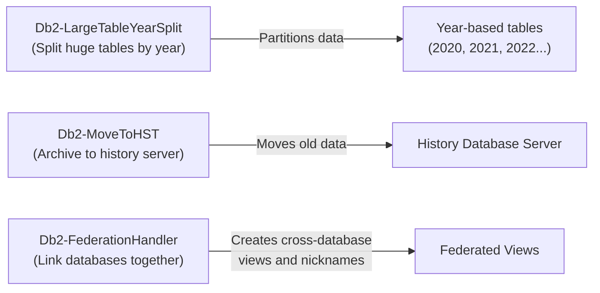
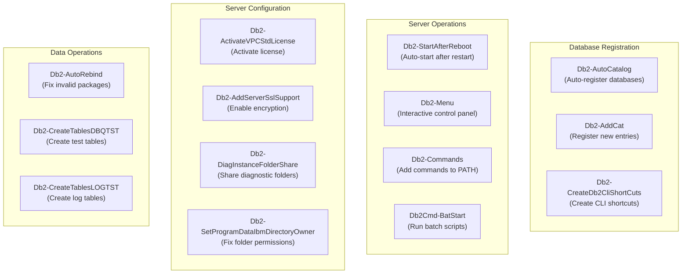
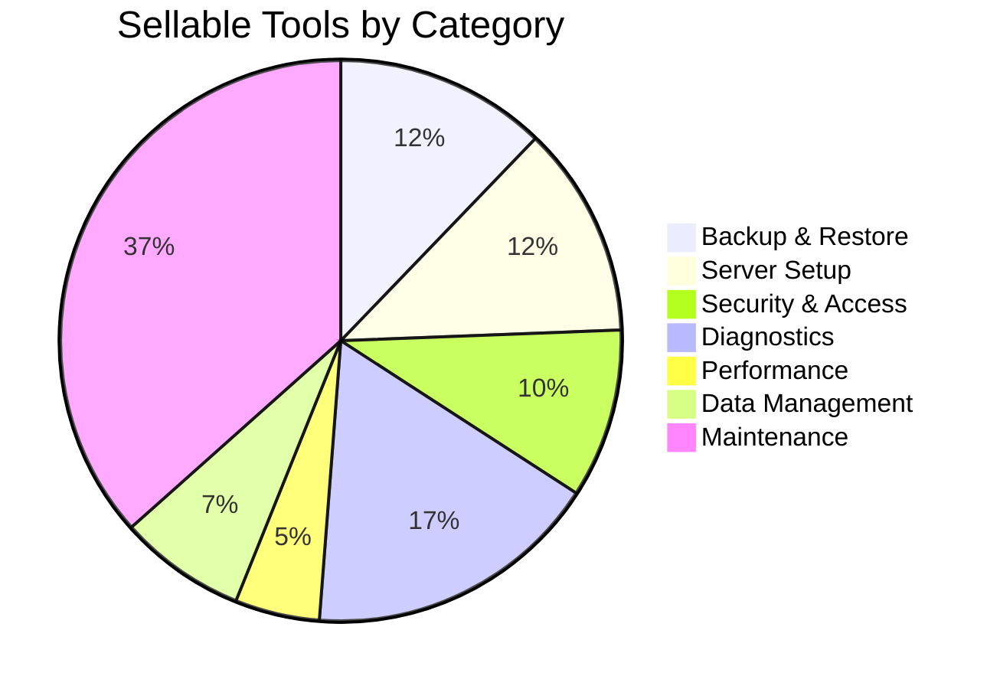

# DedgePsh Database Tools — Product Documentation

> **Audience:** Business stakeholders, non-technical decision-makers, and prospective customers with zero programming experience.
>
> **Product family:** DedgePsh DevTools — DatabaseTools
>
> **Total tools in this suite:** 41

---

## What Is This?

DedgePsh Database Tools is a collection of **41 ready-made automation tools** that manage IBM Db2 and PostgreSQL databases running on Windows Server. Instead of a human typing hundreds of technical commands by hand — risking typos, forgotten steps, and downtime — these tools do the work automatically, consistently, and with full audit logging.

Think of it like a **self-driving toolkit for your database fleet.** Each tool handles one specific job (backing up data, adding users, diagnosing problems, etc.) and can run on a schedule or on demand.

---

## Architecture Overview

---

## Tool Categories at a Glance

| Category | Count | What It Does (Plain English) |
|---|---|---|
| Backup & Restore | 5 | Protects your data by creating copies and recovering from them |
| Server Setup | 5 | Installs and configures brand-new database servers |
| Security & Access | 4 | Controls who can see and change your data |
| Diagnostics & Reporting | 7 | Finds and explains problems before they cause outages |
| Memory & Performance | 2 | Tunes the database engine so it runs faster |
| Data Management | 3 | Moves, splits, and links data across databases |
| Maintenance & Utilities | 15 | Day-to-day housekeeping that keeps everything running smoothly |

---

## Category 1: Backup & Restore

### How It Fits Together

### Db2-Backup

**What it does:** Creates a complete copy of every Db2 database on a server — automatically, on a schedule. Production servers back up nightly; test servers back up weekly. If something goes wrong (hardware failure, data corruption, accidental deletion), this backup is the safety net that lets you recover.

**Why it matters:** Without backups, a single disk failure could destroy years of business data. This tool eliminates the risk of "we forgot to back up" because it runs on its own.

**Can This Be Sold?** Yes. Automated, scheduled Db2 backup with environment-aware scheduling (production vs. test) is a high-value managed-service offering. Customers running Db2 on Windows routinely pay for backup management.

---

### Db2-BackupProgress

**What it does:** While a backup is running, this tool opens a visual progress bar on screen. It polls the database engine every 20 seconds, reads the completion percentage, and shows exactly how far along the backup is — like a download progress bar.

**Why it matters:** Large database backups can take hours. Without a progress indicator, administrators have no idea if the backup is 10% done or 95% done. This tool removes the guesswork.

**Can This Be Sold?** Bundled with Db2-Backup as a value-add. Not sold standalone, but it significantly improves the customer experience of the backup suite.

---

### Db2-Restore

**What it does:** Takes a backup file and rebuilds the database from it. On "RAP" (pre-production) environments, this runs daily on a schedule — automatically refreshing test databases with yesterday's production data so testing always uses realistic information.

**Why it matters:** A backup is useless if you cannot restore from it. Automated restore-to-test also means developers always work with fresh, production-like data without manual effort.

**Can This Be Sold?** Yes. Automated restore-to-test-environment is a premium feature in database management. Many organisations pay consultants to do this manually.

---

### Db2-ProductionBackupCopyOnly

**What it does:** Creates a one-time, "copy-only" backup of a production database at a specific date and time — without interfering with the regular backup chain. Think of it as taking a snapshot for a special occasion (before a major upgrade, before year-end processing, etc.).

**Why it matters:** Regular backups form a chain. A copy-only backup is independent — you can archive it forever without breaking the chain. This is essential for compliance and audit requirements.

**Can This Be Sold?** Yes, as part of a compliance/audit backup add-on. Financial and healthcare organisations specifically require point-in-time archive backups.

---

### PostGreSql-Backup

**What it does:** Backs up all PostgreSQL databases on a server every day at 2:00 AM. It auto-discovers the PostgreSQL installation, creates compressed backup files, and logs the result.

**Why it matters:** PostgreSQL is increasingly used alongside Db2. This tool ensures both database engines receive the same automated backup treatment.

**Can This Be Sold?** Yes. PostgreSQL backup automation is a standalone product. Combined with the Db2 backup tools, it forms a "unified database backup" offering.

---

## Category 2: Server Setup

### How It Fits Together

### Db2Server-InstallHandler

**What it does:** Installs IBM Db2 database software on a new Windows server — choosing the correct edition automatically. Production servers get "Standard Edition" (full-featured); all others get "Community Edition" (free). After installation, the server reboots to complete the setup.

**Why it matters:** Installing Db2 manually involves dozens of steps and decisions. Getting the edition wrong can cost tens of thousands in unnecessary licensing. This tool makes the right choice automatically.

**Can This Be Sold?** Yes. Automated, edition-aware Db2 installation is a key part of a "server provisioning" product.

---

### Db2-StandardConfiguration

**What it does:** After Db2 is installed, this tool applies the organisation's complete standard configuration — over a hundred settings covering performance tuning, security, logging, and networking. It works for both "primary" databases (main data) and "federated" databases (cross-database links). It includes safety checks for production environments, requiring explicit human confirmation before making changes.

**Why it matters:** A misconfigured database can be slow, insecure, or unstable. Applying a tested, standardised configuration eliminates configuration drift and human error.

**Can This Be Sold?** Yes. "Configuration-as-Code" for Db2 is a high-value consulting deliverable. Selling it as an automated, repeatable tool multiplies that value.

---

### Db2-CreateInitialDatabases

**What it does:** Creates brand-new databases on a freshly installed server. It handles both "primary" databases (where your main data lives) and "federated" databases (which link to other servers). The tool is interactive — it asks the administrator which instance, which database type, and whether to drop existing databases — then executes the full creation process, including restoring from a backup of another environment if desired.

**Why it matters:** Creating a production-grade database involves far more than just "CREATE DATABASE." Tablespace layout, logging configuration, federation wiring, and initial data population all need to happen in the correct order. This tool orchestrates it all.

**Can This Be Sold?** Yes. Database provisioning automation is a core offering in any "database-as-a-service" product.

---

### PostGreSql-DatabaseSetup

**What it does:** Sets up PostgreSQL databases on a server, configuring them according to the organisation's standards. Works alongside the Db2 setup to ensure all database engines on a server are ready for use.

**Why it matters:** Organisations increasingly run multiple database engines. Having a single, consistent setup process for PostgreSQL alongside Db2 reduces complexity.

**Can This Be Sold?** Yes. Multi-engine database setup is a differentiator.

---

### Db2-ManualServerReConfig

**What it does:** Provides an interactive, menu-driven interface for experienced database administrators to run any of 50+ database management functions — checking status, modifying configuration, managing permissions, cataloging databases, and more. Think of it as a "control panel" for the database, where every button runs a pre-tested, safe operation.

**Why it matters:** Even with full automation, there are times when a human needs to run a specific operation manually. This tool provides a safe way to do that — every action is logged, and dangerous operations require confirmation.

**Can This Be Sold?** Yes, as a "DBA Console" add-on. It lowers the skill barrier for day-to-day Db2 administration.

---

## Category 3: Security & Access

### How It Fits Together

### Db2-AddNewUserAccounts

**What it does:** Automatically adds the correct user accounts (read-only users, database administrators) to every database on a server. It reads the server's environment (Production, Test, Development) and assigns the right accounts with the right privileges. When finished, it can send an SMS notification.

**Why it matters:** Manually adding users to dozens of databases is tedious and error-prone. Forgetting one database means that applications or people cannot access the data they need.

**Can This Be Sold?** Yes. Automated user provisioning is part of any database managed-service offering.

---

### Db2-GrantHandler

**What it does:** Applies the complete set of database permissions (who can read what, who can modify what) to all databases on a server. It handles both primary and federated databases, applies environment-specific rules, and produces an HTML report showing exactly what was granted.

**Why it matters:** Database security is only as strong as its permissions. Manual permission management leads to drift — over time, permissions become inconsistent across servers. This tool enforces a single, auditable standard.

**Can This Be Sold?** Yes. Automated permission management with audit reporting is a compliance requirement in regulated industries.

---

### Db2-GrantsExport

**What it does:** Reads all current permissions from every database on a server and saves them to a JSON file — a complete snapshot of "who has access to what." Runs weekly on a schedule. These exports serve as both a backup and an audit trail.

**Why it matters:** If a server is rebuilt or migrated, you need to know exactly what permissions existed. This tool creates that record automatically.

**Can This Be Sold?** Yes. Permission auditing is a regulatory requirement in finance, healthcare, and government.

---

### Db2-GrantsImport

**What it does:** Takes a previously exported permissions file and applies it to a database — either restoring permissions after a rebuild or migrating them to a new server. Supports both traditional grants and modern role-based access control. After import, it creates validation views so the result can be verified.

**Why it matters:** Rebuilding permissions from scratch after a server migration can take days. This tool does it in minutes.

**Can This Be Sold?** Yes. Combined with GrantsExport, this forms a "permission lifecycle management" product.

---

## Category 4: Diagnostics & Reporting

### How It Fits Together

### Db2-DiagnoseConnect

**What it does:** When a database connection fails, this tool runs a comprehensive investigation: it checks recovery status, lists active databases, examines the database configuration, and inspects all Db2 Windows services. It produces a complete diagnostic report — like a doctor's examination for your database.

**Why it matters:** Connection failures can have dozens of root causes. Without systematic diagnosis, engineers waste hours guessing. This tool checks everything in seconds.

**Can This Be Sold?** Yes. "Database health check" services command premium consulting rates. Automating them into a tool is highly valuable.

---

### Db2-ErrorDiagnosisReport

**What it does:** Generates a comprehensive error diagnosis report for a specific database. It reads the Db2 diagnostic log, correlates errors with known issues, and produces a human-readable report explaining what went wrong and potential fixes.

**Why it matters:** Db2 diagnostic logs are dense and cryptic. This tool translates them into actionable information.

**Can This Be Sold?** Yes. Automated error analysis is a differentiator in database support contracts.

---

### Db2-VerifyDatabaseConnectivity

**What it does:** Tests connectivity to all configured databases — running every 15 minutes on application servers, daily on workstations. If a database becomes unreachable, it triggers alerts immediately rather than waiting for end users to report problems.

**Why it matters:** Proactive monitoring catches outages before users do. A 15-minute detection window means problems are fixed faster, reducing downtime.

**Can This Be Sold?** Yes. Database uptime monitoring is a standard SLA component in managed services.

---

### Db2-ExportServerConfig

**What it does:** Exports the complete Db2 server configuration — every setting, every parameter — to a file. This serves as documentation ("what is the server configured to?") and as a recovery aid ("what settings do I need to recreate?").

**Why it matters:** Without a configuration export, rebuilding a server requires guesswork. With it, you have a blueprint.

**Can This Be Sold?** Yes, as part of configuration management and disaster recovery offerings.

---

### Db2-DiagArchive

**What it does:** Automatically compresses and archives Db2 diagnostic log files daily. Log files can grow enormous; this tool keeps them manageable while preserving the history for troubleshooting.

**Why it matters:** Unmanaged log files can fill a disk and crash the server. Archiving prevents this while retaining the data.

**Can This Be Sold?** Yes, as part of a log management suite.

---

### Db2-DiagTracker

**What it does:** Tracks recurring diagnostic issues over time, running daily on all Db2 servers. It identifies patterns — errors that keep coming back — so engineers can address root causes instead of fighting symptoms.

**Why it matters:** A single error is an incident. A recurring error is a systemic problem. This tool finds the patterns.

**Can This Be Sold?** Yes. Trend analysis for database health is a premium monitoring feature.

---

### Db2-JdbcTest

**What it does:** Tests a JDBC (Java Database Connectivity) connection to Db2 using the same driver that popular tools like DBeaver use. It tries multiple security mechanisms (SSL, Windows authentication, etc.) to find one that works — invaluable for diagnosing why Java applications cannot connect.

**Why it matters:** Many business applications connect to Db2 through Java. When those connections fail, diagnosing whether the problem is the driver, the security settings, or the network is extremely difficult. This tool isolates the issue.

**Can This Be Sold?** Yes, as a connectivity troubleshooting add-on.

---

## Category 5: Memory & Performance

### How It Fits Together

### Db2-SetBufferPoolsByMemory (formerly Db2-AnalyzeMemoryConfig)

**What it does:** Automatically calculates the optimal memory allocation for Db2 buffer pools based on the server's available RAM. It detects the server type (production vs. community edition), reserves memory for the operating system, and distributes the remainder across buffer pools for maximum database performance. It can run non-interactively for fully automated tuning.

**Why it matters:** Buffer pool sizing is one of the most impactful performance settings in Db2. Too small and the database constantly reads from disk (slow). Too large and the operating system runs out of memory (crashes). This tool finds the sweet spot automatically.

**Can This Be Sold?** Yes. Automated performance tuning is a premium feature. Many organisations pay consultants thousands of dollars for buffer pool analysis that this tool does in seconds.

---

### Db2-ShadowDatabase

**What it does:** Runs a complete "shadow database pipeline" — it restores a production backup onto a test server, applies the test configuration, then compares the two databases object by object. The goal is a report with zero differences, proving that the test environment is a faithful copy of production. The entire pipeline is automated and can be triggered on a schedule.

**Why it matters:** Organisations need confidence that their test environments mirror production. This tool provides mathematical proof. It also catches configuration drift between environments.

**Can This Be Sold?** Yes. Environment parity validation is a high-value service for regulated industries and for any organisation with complex test environments.

---

## Category 6: Data Management

### How It Fits Together

### Db2-LargeTableYearSplit

**What it does:** Takes a very large database table (millions or billions of rows spanning many years) and splits it into separate year-based tables. It handles the entire process: renaming the original table, creating new year-partitioned tables, migrating the data, recreating all indexes, views, foreign keys, and grants. An orchestrator monitors the entire multi-hour operation and reports progress.

**Why it matters:** As tables grow beyond hundreds of millions of rows, queries slow to a crawl and maintenance operations (backups, reorganisations) become impractical. Splitting by year keeps each partition manageable while preserving full access to historical data.

**Can This Be Sold?** Yes. Large table partitioning is a specialised consulting engagement that typically costs thousands. An automated tool that handles it end-to-end is extremely valuable.

---

### Db2-MoveToHST

**What it does:** Installs and configures tools needed for moving data from active databases to a dedicated history ("HST") database server. This includes setting up AI-assisted database tools (Cursor MCP, Ollama RAG) that help analyse and plan the data migration.

**Why it matters:** Keeping decades of historical data in the active production database hurts performance. Moving it to a separate history server keeps the production database lean while preserving the data for compliance and analysis.

**Can This Be Sold?** Yes. Data lifecycle management (active → archive) is a standard offering in database services.

---

### Db2-FederationHandler

**What it does:** Manages Db2 "federation" — the ability for one database to query another as if the data were local. This tool sets up and refreshes federated nicknames (virtual links between databases), running daily on database servers. It handles both standard instance federation and history-database federation.

**Why it matters:** Federation lets applications query multiple databases through a single connection, simplifying architecture and reducing application complexity.

**Can This Be Sold?** Yes. Cross-database federation setup is a specialised service.

---

## Category 7: Maintenance & Utilities

### How It Fits Together

### Db2-AutoCatalog

**What it does:** Automatically discovers all databases across all servers and registers ("catalogs") them on workstations and application servers so applications can find and connect to them. Runs daily as a scheduled task on every non-database machine.

**Why it matters:** Without cataloging, applications cannot find databases. Manual cataloging across dozens of machines is a maintenance nightmare. This tool ensures every machine always knows where every database is.

**Can This Be Sold?** Yes. Automated service discovery for databases is a core infrastructure feature.

---

### Db2-AddCat

**What it does:** Registers new database catalog entries — scheduled daily on the central management server. Works alongside Db2-AutoCatalog to ensure new databases are immediately discoverable across the entire infrastructure.

**Why it matters:** When a new database is created, all machines need to know about it. This tool propagates that knowledge automatically.

**Can This Be Sold?** Bundled with Db2-AutoCatalog.

---

### Db2-StartAfterReboot

**What it does:** Automatically starts all Db2 instances and activates all databases after a server reboot. Uses a Windows Scheduled Task triggered at system startup. This ensures zero-intervention recovery from planned or unplanned reboots.

**Why it matters:** After a Windows Server reboot, Db2 does not always start automatically. Without this tool, a reboot at 3 AM means databases are down until someone manually starts them in the morning.

**Can This Be Sold?** Yes. Auto-recovery after reboot is a critical availability feature.

---

### Db2-Menu

**What it does:** Provides a text-based interactive menu for common Db2 operations: connecting to databases, running commands, restarting instances, activating databases. Designed for administrators who prefer a guided interface over memorising commands.

**Why it matters:** Reduces the learning curve for Db2 administration. Even experienced DBAs benefit from a consistent, safe interface.

**Can This Be Sold?** Yes, as part of a "DBA Toolkit."

---

### Db2-Commands

**What it does:** Adds the Db2 command-line tools to the system PATH so they can be called from any terminal window without specifying the full installation path.

**Why it matters:** A small convenience that eliminates a common frustration for anyone working with Db2 from the command line.

**Can This Be Sold?** Bundled with other tools — not standalone.

---

### Db2-CreateDb2CliShortCuts

**What it does:** Creates desktop and start-menu shortcuts for the Db2 command-line interface, making it easy for administrators to open a Db2 terminal with a single click.

**Why it matters:** Quality-of-life improvement that reduces onboarding time for new team members.

**Can This Be Sold?** Bundled.

---

### Db2Cmd-BatStart

**What it does:** Executes a batch file through the Db2 command-line processor — a bridge between Windows scripting and the Db2 environment. Verifies that both the batch file and Db2 exist before running.

**Why it matters:** Many legacy operations are written as batch files. This tool provides a safe, validated way to run them.

**Can This Be Sold?** Bundled.

---

### Db2-ActivateVPCStdLicense

**What it does:** Activates the IBM Db2 Standard Edition VPC (Virtual Processor Core) license on a server — downloading the license file, copying it to the correct location, and registering it with Db2.

**Why it matters:** Running Db2 without a valid license can result in feature restrictions or compliance violations. This tool automates a step that is easy to forget.

**Can This Be Sold?** Bundled with Db2Server-InstallHandler.

---

### Db2-AddServerSslSupport

**What it does:** Generates scripts for adding or removing SSL certificates for Db2 connections across different client types (Java/JDBC, DBeaver, OLE DB). It creates ready-to-run installation scripts that configure encrypted connections between clients and the database server.

**Why it matters:** Encrypted database connections are a security requirement in most organisations. Setting up SSL for Db2 involves multiple steps across multiple technologies. This tool generates all the scripts needed.

**Can This Be Sold?** Yes. Database encryption setup is a compliance requirement.

---

### Db2-DiagInstanceFolderShare

**What it does:** Shares the Db2 diagnostic instance folder on the network so administrators can access diagnostic logs from their workstations without logging directly into the server. Runs daily on all Db2 servers.

**Why it matters:** Remote access to diagnostic information speeds up troubleshooting — administrators do not need to use Remote Desktop to read log files.

**Can This Be Sold?** Bundled with diagnostics tools.

---

### Db2-SetProgramDataIbmDirectoryOwner

**What it does:** Fixes folder permissions on the IBM ProgramData directory — a common issue where Db2 cannot write to its own configuration directory due to Windows permission inheritance problems.

**Why it matters:** Permission issues on the ProgramData/IBM directory can cause Db2 to malfunction silently. This tool prevents that.

**Can This Be Sold?** Bundled.

---

### Db2-AutoRebind

**What it does:** Automatically finds and rebinds all invalid Db2 packages in a database. Packages become "invalid" after database changes (schema modifications, upgrades). The tool queries the system catalog for invalid packages and rebinds each one.

**Why it matters:** Invalid packages cause application errors. Automatic rebinding ensures applications continue to work after database changes.

**Can This Be Sold?** Yes. Post-upgrade package validation is a standard DBA service.

---

### Db2-CreateTablesDBQTST

**What it does:** Creates a predefined set of tables in the DBQTST (Database Quality Assurance Test) database using SQL scripts. Includes teardown, related, and non-related table creation phases. Produces an HTML report of the results.

**Why it matters:** Quality assurance databases need a standard set of tables for testing. This tool creates them consistently.

**Can This Be Sold?** Bundled with test environment setup.

---

### Db2-CreateTablesLOGTST

**What it does:** Creates tables in the LOGTST (Logging Test) database from an SQL schema file. Similar to CreateTablesDBQTST but for the logging database.

**Why it matters:** Consistent test database setup.

**Can This Be Sold?** Bundled.

---

## Commercial Summary

| Selling Tier | Tools | Positioning |
|---|---|---|
| **Tier 1 — Premium Standalone** | Db2-ShadowDatabase, Db2-LargeTableYearSplit, Db2-SetBufferPoolsByMemory | High-value specialised tools that command premium pricing |
| **Tier 2 — Core Suite** | Backup & Restore (5), Server Setup (5), Security & Access (4) | Foundation of a "Database Managed Service" offering |
| **Tier 3 — Monitoring & Diagnostics** | All 7 diagnostic tools | Sold as a "Database Health Monitoring" subscription |
| **Tier 4 — Bundled Utilities** | Remaining 15 maintenance tools | Included with Tier 2 or Tier 3 to add value |

### Key Selling Points

1. **41 tools, one platform** — covers the entire database lifecycle from installation to archival
2. **Multi-engine** — supports both IBM Db2 and PostgreSQL
3. **Environment-aware** — automatically adjusts behavior for Production, Test, and Development
4. **Audit-ready** — every operation is logged with timestamps and exportable reports
5. **SMS/Alert integration** — critical operations notify administrators in real time
6. **Zero-touch scheduling** — most tools run unattended on Windows Task Scheduler
7. **Safety-first** — production operations require explicit human confirmation

---

*Document generated: March 2026 | DedgePsh Database Tools v1.0 | 41 tools across 7 categories*
