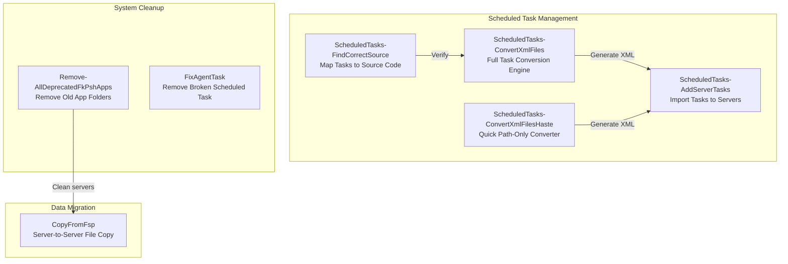

# Fix Jobs — One-Time Migrations and Surgical Repairs

## What These Tools Do

When a company moves to a new building, someone has to physically move the furniture, reconnect the phones, update the address labels, and throw away the old filing cabinets. That work only needs to happen once, but it needs to happen correctly — mistakes during the move can shut down the entire business.

Fix Jobs are the moving crew. These 7 scripts handle one-time migration tasks, system cleanup, and infrastructure transitions. They convert old scheduled tasks to new formats, clean up deprecated applications, copy data between servers, and repair broken configurations. Once the job is done, the tool has served its purpose — but the patterns and approaches are reused every time a similar migration occurs.

## Overview Diagram

## Tool-by-Tool Guide

### CopyFromFsp — Server-to-server data migration

When systems move between servers, data needs to follow. This tool uses robocopy to copy application folders from one server (the old FSP server) to the local development repository. It handles multiple environment folders (VFT, FUT, KAT, MIG, PER, SIT, VFK) in one sweep, excluding log files to keep transfers clean.

Think of it as a moving truck that knows exactly which boxes go to which rooms and leaves the trash behind.

**Who needs it:** Operations teams migrating application data between servers during infrastructure transitions.

**Can it be sold standalone?** No — environment-specific migration script. The pattern (multi-folder robocopy with exclusions) is common.

---

### FixAgentTask — Removes a broken scheduled task

A surgical fix tool. When a scheduled task called "agent" in the "DevTools" folder is broken or no longer needed, this script cleanly removes it. Short, focused, gets the job done — like a plumber called in to cap off one specific pipe.

**Who needs it:** Server administrators dealing with stale scheduled tasks from previous deployments.

**Can it be sold standalone?** No — single-purpose repair script.

---

### Remove-AllDeprecatedFkPshApps — Digital spring cleaning across all servers

Over time, old applications accumulate on servers like forgotten boxes in a storage room. This tool maintains two lists: an "Old" list of folder patterns that should be completely removed, and a "New" list of specific application folders that are deprecated and should be cleaned up. It runs across all managed servers, identifying and removing deprecated application folders.

The script currently targets ~50+ deprecated application folders including old database tools, configuration utilities, security scripts, and monitoring agents that have been superseded by newer versions.

**Who needs it:** IT operations teams performing server hygiene and reclaiming disk space. Essential during major version upgrades.

**Can it be sold standalone?** No — organization-specific cleanup. The pattern of maintaining deprecation lists is a good practice, though.

---

### ScheduledTasks-AddServerTasks — Imports scheduled tasks from XML to servers

Windows servers run hundreds of scheduled tasks (timed jobs that run automatically). When setting up a new server, all those tasks need to be recreated. This tool reads XML task definition files, generates the correct `schtasks.exe` commands with proper credentials, and outputs a batch file that an administrator can paste into a command prompt to import everything.

Security-conscious: prompts for credentials, generates the batch file, lets the admin review it, then deletes the file after use to avoid password exposure.

**Who needs it:** Server administrators setting up new servers or rebuilding existing ones.

**Can it be sold standalone?** Moderate — scheduled task migration is a common need during server migrations. Could be part of a "Server Setup Toolkit."

---

### ScheduledTasks-ConvertXmlFiles — Full scheduled task migration engine

The heavy lifter of task migration. When moving from old servers (with drive letters like C:\, D:\, E:\) to new servers (with standardized paths like `$env:OptPath\DedgePshApps`), every scheduled task's XML definition needs its file paths, commands, and arguments rewritten.

This tool parses task XML files, extracts all trigger configurations (daily, weekly, monthly, boot, logon, idle), maps old paths to new paths using a comprehensive conversion table, and generates updated XML files ready for import. It handles dozens of path mapping rules for different application types.

**Who needs it:** Teams migrating Windows Server infrastructure where hundreds of scheduled tasks reference hard-coded paths.

**Can it be sold standalone?** Yes — moderate standalone value. "Scheduled task migration tool" solves a universal pain point during server migrations.

---

### ScheduledTasks-ConvertXmlFilesHaste — Quick path converter for urgent migrations

A lighter version of the full converter, designed for when you need a quick path fixup without the full analysis. Takes task XML content, applies path conversions (C:\ → E:\, old app paths → new app paths), and outputs the corrected XML. Captures before/after paths for verification.

**Who needs it:** Administrators performing rapid server migrations where the full analysis is not needed.

**Can it be sold standalone?** No — simplified version of the full converter.

---

### ScheduledTasks-FindCorrectSource — Maps running tasks back to their source code

After tasks have been converted and imported, this verification tool reads the JSON mapping file and cross-references each task's command and arguments with the source code repository to confirm everything points to the right files. Like a post-move checklist that verifies every piece of equipment is plugged in correctly.

**Who needs it:** QA and operations teams validating server migrations are complete and correct.

**Can it be sold standalone?** No — verification companion to the conversion tools.

---

## Revenue Potential

| Revenue Tier | Tools | Est. Annual Value |
|---|---|---|
| **Medium — Reusable Patterns** | ScheduledTasks-ConvertXmlFiles, ScheduledTasks-AddServerTasks | $30K–$80K as part of "Server Migration Toolkit" |
| **Consulting Accelerator** | All 7 tools as migration engagement toolkit | $50K–$150K per migration project |
| **Template Value** | Deprecation list pattern (Remove-AllDeprecated) | Saves 40–80 hours per server cleanup engagement |

Fix Jobs generate revenue indirectly — they are the scaffolding that makes infrastructure projects finish on time and on budget. Every hour saved by automation is an hour not billed to the client at consulting rates.

## What Makes This Special

1. **Migration intelligence encoded** — The path mapping rules in ScheduledTasks-ConvertXmlFiles represent months of accumulated knowledge about how old paths map to new paths. This is institutional knowledge that would otherwise live only in someone's head.

2. **Security-aware design** — The task import tool handles credentials carefully: generates a batch file, lets the admin review, then immediately deletes it to prevent password exposure. This is the kind of security awareness that enterprise customers require.

3. **Comprehensive task parsing** — The XML converter handles every trigger type Windows supports: daily, weekly, monthly, boot, logon, idle, with all their sub-properties. This completeness is rare in migration tools.

4. **Deprecation management pattern** — The Remove-AllDeprecatedFkPshApps approach of maintaining explicit old/new lists is a proven pattern for managing technical debt during platform transitions. It turns "cleaning up old servers" from an ad-hoc task into a systematic process.
