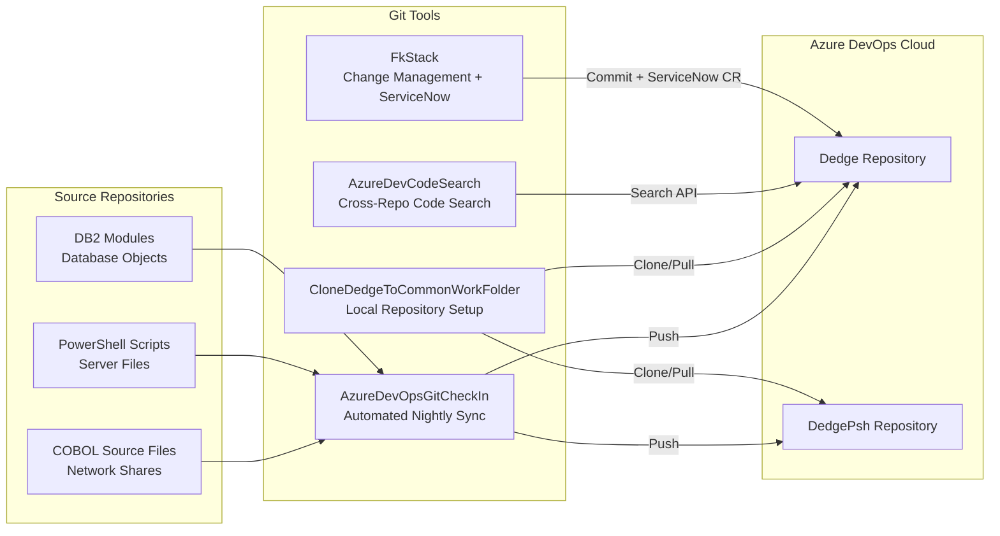

# Git Tools — Automated Source Control That Never Sleeps

## What These Tools Do

Imagine a librarian who works the night shift at a massive document archive. Every night, they collect all the documents that were changed during the day, carefully catalog them, file them in the right sections, stamp them with a date, and make sure the backup vault has a perfect copy. They do this without ever asking anyone for a password, without ever leaving a dialog box open on screen, and without ever losing a single page.

That is what the Git Tools do. They automate the process of storing, synchronizing, and searching source code in **Azure DevOps** (Microsoft's cloud-based code repository). In a world where forgetting to save your work to the shared repository could mean losing critical changes, these tools make sure it happens automatically, reliably, and silently.

## Overview Diagram

## Tool-by-Tool Guide

### AzureDevOpsGitCheckIn — The overnight librarian

This is the backbone of the source control automation. Every night, this scheduled task wakes up, collects source files from network shares and server directories (COBOL programs, PowerShell scripts, DB2 modules), copies them into a Git repository structure, commits the changes with a timestamp, and pushes them to Azure DevOps.

What makes it special:
- **Fully unattended** — Disables all Git Credential Manager dialogs, interactive prompts, and authentication popups. Uses PAT (Personal Access Token) authentication through the AzureFunctions module.
- **Smart file processing** — Copies source files with proper encoding handling, excludes temporary and build artifacts, and tracks statistics on every run.
- **Resilient** — Comprehensive error handling with a WorkObject that tracks every phase: network validation, folder initialization, Git operations, file processing, commit, and push.
- **Self-terminating** — Runs until a configurable stop hour (default 11 PM) and gracefully shuts down.

**Who needs it:** Any organization that has source code living on file servers, network shares, or legacy systems that are not natively Git-managed. Especially valuable for COBOL/mainframe shops where code lives on network drives.

**Can it be sold standalone?** Yes — significant standalone value. Many enterprises have source code scattered across file shares that is not under proper version control. "Git sync agent for legacy file systems" is a real market need.

---

### CloneDedgeToCommonWorkFolder — Sets up a working copy for other tools

Other tools (like AutoDoc) need a local copy of the source repositories to work with. This script clones or updates the Dedge and DedgePsh repositories to a standard work folder (`C:\opt\work\DedgeRepository`). It uses the same robust credential management as AzureDevOpsGitCheckIn — no interactive dialogs, no password prompts.

Supports a `-Force` flag to do a clean clone (deletes existing repos first) or a normal pull to get the latest changes.

**Who needs it:** Developers and automated tools that need a fresh local copy of the codebase.

**Can it be sold standalone?** No — utility script for the broader toolchain. However, the credential management pattern is reusable.

---

### AzureDevCodeSearch — Finds code across all repositories instantly

When someone needs to find every place a specific variable, function, or table name is used across the entire codebase, this tool queries the Azure DevOps Search API. It returns file names and matching code snippets — like having a search engine for your entire code archive.

Uses the Azure DevOps REST API (v7.1) with PAT authentication. Results include file paths and preview text showing the context of each match.

**Who needs it:** Developers investigating the impact of changes, auditors tracing data flows, or support staff finding which program uses a specific database table.

**Can it be sold standalone?** No — thin wrapper around the Azure DevOps API. The value is in having it pre-configured for the organization.

---

### FkStack (GitTools) — Change management with ServiceNow integration

The Git-side counterpart of the legacy FkStack tool. When developers deploy COBOL changes, this tool creates ServiceNow change requests (ITIL compliance), stages files for deployment to multiple environments (production, test, migration, acceptance), and manages the approval workflow.

Features include:
- **ServiceNow integration** — Creates standard change requests with descriptions, backout plans, and close notes
- **Multi-environment support** — Deploy to PRD, TST, MIG, VFT, VFK, or SIT
- **Immediate or scheduled** — Changes can be queued for overnight deployment or pushed immediately
- **Audit trail** — Every deployment is logged with who, what, when, and why

**Who needs it:** IT teams requiring ITIL-compliant change management workflows integrated with source control.

**Can it be sold standalone?** Moderate — the ServiceNow + Git integration pattern has value. Could be adapted into a "COBOL DevOps Bridge" product.

---

## Revenue Potential

| Revenue Tier | Tools | Est. Annual Value |
|---|---|---|
| **High — Productizable** | AzureDevOpsGitCheckIn | $100K–$300K as a "Legacy Source Control Agent" product |
| **Medium — Consulting** | FkStack (ServiceNow pattern) | $50K–$100K as a consulting deliverable |
| **Bundled Value** | All 4 tools as "Enterprise Git Automation Suite" | $150K–$400K per enterprise engagement |

The unattended Git sync capability alone addresses a real pain point: enterprises with decades of source code on file servers that needs to be brought under modern version control without disrupting workflows.

## What Makes This Special

1. **Zero-touch automation** — The Git check-in runs every night with absolutely no human interaction required. No dialog boxes, no password prompts, no "click OK to continue." This level of automation reliability is hard to achieve and extremely valuable.

2. **Credential management done right** — The tools systematically disable every possible avenue for Git Credential Manager to pop up a dialog: environment variables, process-level settings, killing GCM processes. This is battle-tested against real enterprise Windows environments where credential managers love to interrupt automation.

3. **ServiceNow bridge** — Connecting source control operations to ITIL change management (ServiceNow) is a compliance requirement in many regulated industries. This integration automates what is usually a manual, error-prone process.

4. **Legacy-to-modern bridge** — These tools solve the specific problem of source code that lives on network shares (the legacy way) needing to also exist in Git repositories (the modern way). They do both simultaneously without forcing a disruptive migration.
