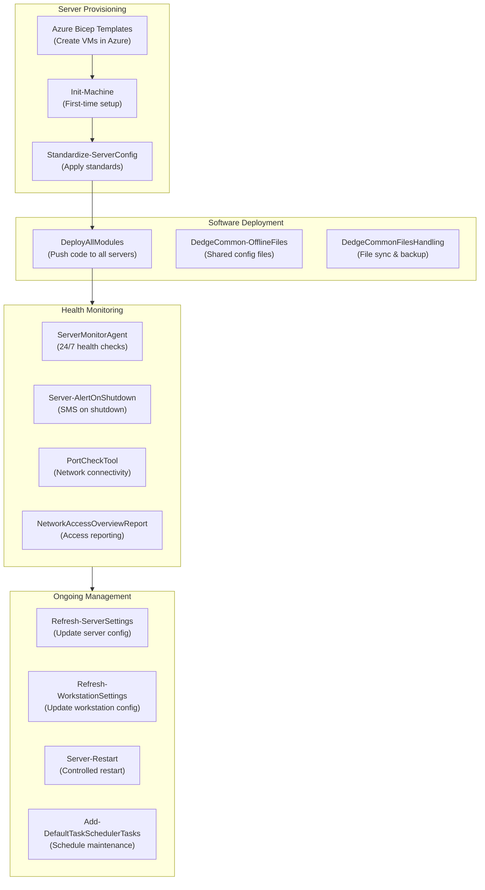
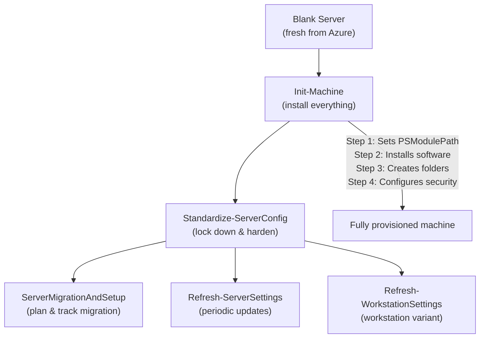
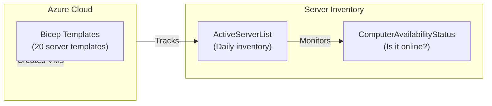
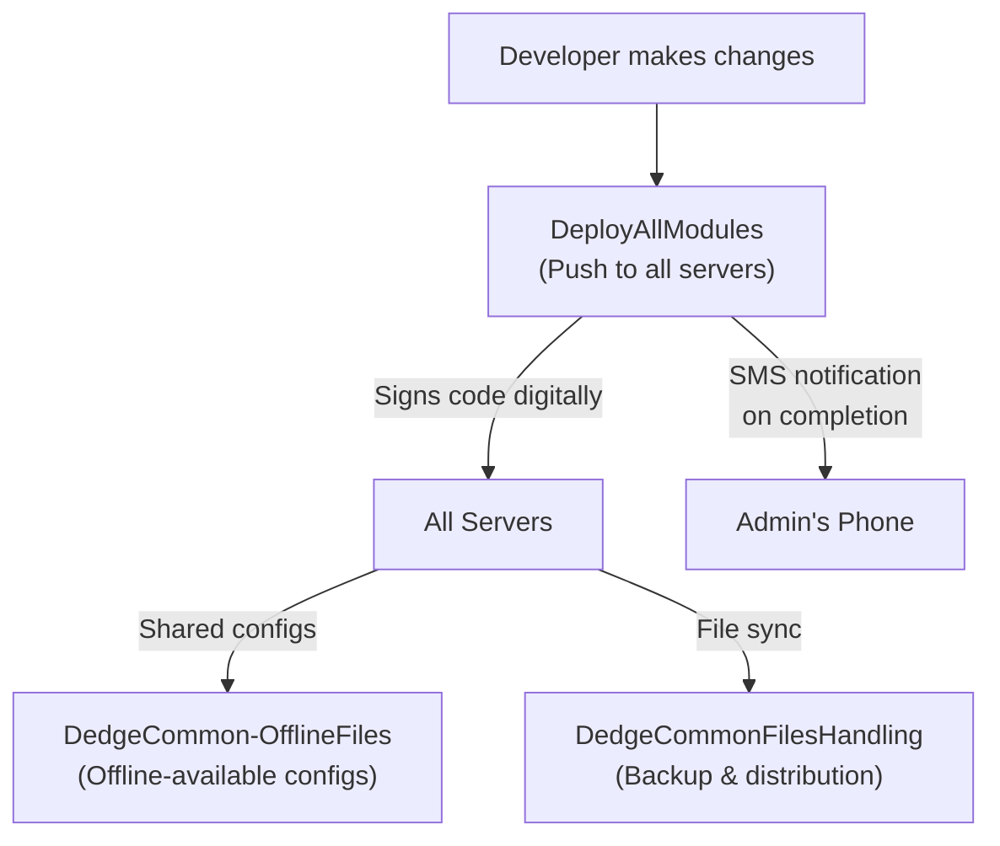
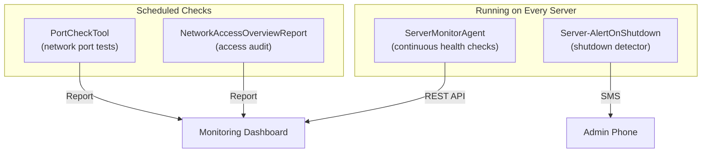
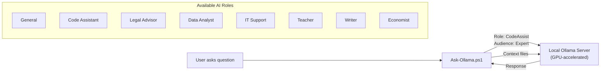
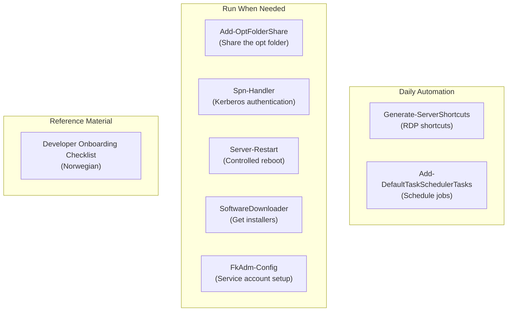
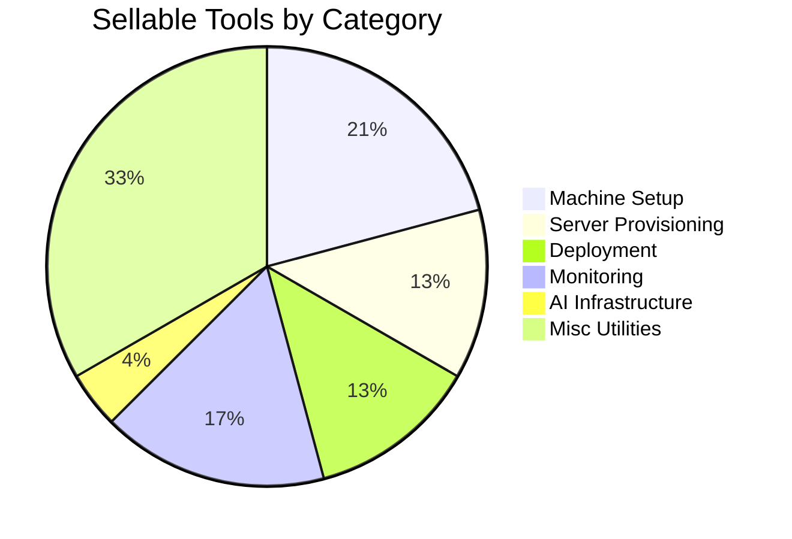

# DedgePsh Infrastructure Tools — Product Documentation

> **Audience:** Business stakeholders, non-technical decision-makers, and prospective customers with zero programming experience.
>
> **Product family:** DedgePsh DevTools — InfrastructureTools
>
> **Total tools in this suite:** 24

---

## What Is This?

DedgePsh Infrastructure Tools is a collection of **24 ready-made automation tools** that manage the servers, networks, and software that your business applications run on. Instead of manually configuring each new server, monitoring uptime by hand, or deploying software one machine at a time, these tools handle it all — automatically, consistently, and with full audit trails.

Think of it like a **factory assembly line for servers.** A new server arrives as a blank machine; these tools transform it into a fully configured, monitored, secured member of your infrastructure — and keep it that way.

---

## Architecture Overview

---

## Tool Categories at a Glance

| Category | Count | What It Does (Plain English) |
|---|---|---|
| Machine Setup | 5 | Transforms a blank server into a fully configured, production-ready machine |
| Server Provisioning | 3 | Creates new virtual servers in the cloud and tracks which servers exist |
| Deployment | 3 | Pushes software, configurations, and shared files to all servers at once |
| Monitoring | 4 | Watches every server 24/7 and sends alerts when something goes wrong |
| AI Infrastructure | 1 | Provides on-premises AI chat capability for internal use |
| Miscellaneous Utilities | 8 | Shortcuts, scheduling, networking, credentials, and other essentials |

---

## Category 1: Machine Setup

### How It Fits Together

### Init-Machine

**What it does:** This is the "big bang" tool — it takes a completely fresh Windows Server (or workstation) and transforms it into a fully operational member of the infrastructure. In one automated run, it:
- Sets up the module paths so all other tools can be found
- Installs required software (database clients, monitoring agents, security tools)
- Creates the standard folder structure
- Configures security settings and permissions
- Registers the machine with central management
- Handles both "standard" (FKM) installations and "other" types

The tool is smart enough to remove legacy configurations from previous setups, ensuring a clean state regardless of what was on the machine before.

**Why it matters:** Manually setting up a server takes a skilled engineer 4-8 hours and involves hundreds of steps. Miss one step and you get intermittent failures that are nearly impossible to diagnose. This tool does it in minutes, identically every time.

**Can This Be Sold?** Yes — absolutely. Automated server provisioning (sometimes called "Infrastructure as Code") is one of the most in-demand IT services. Organisations pay significant sums for tools that turn "days of manual setup" into "minutes of automated setup."

---

### Standardize-ServerConfig

**What it does:** Applies the complete organisational standard to an existing server — security hardening, service accounts, scheduled tasks, application installation, folder permissions, and more. It includes extensive safety checks:
- Database servers must be logged in with the correct service account
- Application servers must use admin accounts
- The existing password is retrieved securely
- Legacy software is removed before new software is installed

Think of it as a "compliance enforcer" — it brings any server into line with the organisation's standards, regardless of its current state.

**Why it matters:** Over time, servers drift from their intended configuration. Someone changes a setting, an update modifies a default, or a quick fix becomes permanent. This tool resets everything to the approved baseline.

**Can This Be Sold?** Yes. "Configuration compliance" tools are a growing market, especially in regulated industries.

---

### ServerMigrationAndSetup

**What it does:** Plans and tracks server migration projects. It generates structured task files for Azure DevOps (a project management system), creating work items for every step of a server migration — from initial assessment to final cutover. These tasks are imported automatically via the Azure DevOps API, creating a complete project plan.

**Why it matters:** Server migrations are complex projects with dozens of interdependent tasks. Forgetting a single step can cause extended outages. This tool creates a comprehensive checklist from a proven template.

**Can This Be Sold?** Yes. Migration planning tools are valuable professional services offerings.

---

### Refresh-ServerSettings

**What it does:** Periodically refreshes configuration on servers — updating wallpapers with server identification information, restarting services that may have stopped, and applying any configuration changes that have been made centrally. It is clever enough to detect if a developer is actively running code on the server and will skip operations that might disrupt their work.

**Why it matters:** Servers need periodic maintenance beyond the initial setup. This tool handles the routine "housekeeping" automatically.

**Can This Be Sold?** Yes, as part of a managed services package.

---

### Refresh-WorkstationSettings

**What it does:** The workstation equivalent of Refresh-ServerSettings. Updates developer workstations with the latest configurations, shortcuts, and settings. Can be uninstalled cleanly if no longer needed.

**Why it matters:** Keeping developer machines in sync with organisational standards improves consistency and reduces "it works on my machine" problems.

**Can This Be Sold?** Bundled with machine management offering.

---

## Category 2: Server Provisioning

### How It Fits Together

### Bicep Scripts for New Servers

**What it does:** Contains 20 Azure Bicep templates — one for each type of server in the infrastructure (database servers, application servers, SOA servers, development servers, etc.). Each template defines the exact specifications for a server: size, disk layout, networking, and region. When a new server is needed, the corresponding template is deployed to Azure, and a virtual machine is created automatically with the correct specifications.

The templates cover the full infrastructure:
- Production database and application servers
- Test and development database servers
- Migration and verification servers
- History and archive servers

**Why it matters:** Creating servers manually in Azure involves clicking through dozens of settings and hoping nothing is missed. These templates guarantee that every server of a given type is identical — same disk size, same network configuration, same region. This consistency is critical for reliability.

**Can This Be Sold?** Yes. Infrastructure-as-Code templates for Azure are a high-value consulting deliverable. Selling pre-built, tested templates saves customers weeks of engineering work.

---

### ActiveServerList

**What it does:** Runs daily on the central management server and produces a complete inventory of all active servers in the infrastructure. It reads from the organisation's JSON configuration, filters for active servers, and publishes the list. This serves as the "single source of truth" for what servers exist.

**Why it matters:** In any organisation with more than a handful of servers, keeping track of what exists is surprisingly difficult. Servers get created for projects and forgotten. This tool maintains an always-current inventory.

**Can This Be Sold?** Yes, as part of an infrastructure management dashboard.

---

### ComputerAvailabilityStatus

**What it does:** Checks whether each server in the infrastructure is online and responding. Runs daily and publishes the availability status to a central location. Think of it as a daily "roll call" for your servers.

**Why it matters:** A server that is technically "powered on" in Azure but not responding to network requests is effectively down. This tool catches those silent failures.

**Can This Be Sold?** Yes. Uptime monitoring is a fundamental managed-service component.

---

## Category 3: Deployment

### How It Fits Together

### DeployAllModules

**What it does:** Deploys all PowerShell modules (the building blocks that every other tool depends on) to every server in the infrastructure in a single command. Each module is digitally signed (like a tamper-proof seal) before deployment. When complete, it sends an SMS notification to confirm success.

**Why it matters:** Without a central deployment tool, updating a module means manually copying files to dozens of servers. Missing one server means it runs an outdated version, which can cause subtle, hard-to-diagnose failures. This tool guarantees every server runs the same version.

**Can This Be Sold?** Yes. Centralized, signed deployment is a core DevOps offering.

---

### DedgeCommon-OfflineFiles

**What it does:** Configures Windows "Offline Files" for critical shared configuration folders. This means that even when a server temporarily loses network access to the central file share, it continues to operate using locally cached copies of configuration files. The tool handles:
- Enabling the Windows Offline Files service (CscService)
- Fixing kernel-level driver configuration if needed
- Pinning critical folders for offline access
- Managing reboot requirements gracefully

**Why it matters:** Network outages should not crash your applications. By caching configuration files locally, this tool ensures resilience. If the central file server goes down for maintenance, every other server keeps working normally.

**Can This Be Sold?** Yes. High-availability configuration is a premium feature in infrastructure management.

---

### DedgeCommonFilesHandling

**What it does:** Manages the synchronisation and backup of shared files across the infrastructure. Runs daily as a scheduled task, ensuring that common configuration files, software packages, and monitoring configurations are consistently available on every machine.

**Why it matters:** Shared files are the glue that holds distributed infrastructure together. If one server has an outdated configuration file, it may behave differently from the others. This tool prevents that drift.

**Can This Be Sold?** Yes, bundled with DedgeCommon-OfflineFiles as a "shared configuration management" feature.

---

## Category 4: Monitoring

### How It Fits Together

### ServerMonitorAgent

**What it does:** Installs a dedicated health-monitoring service on every server. This service runs 24/7, continuously checking server health (CPU, memory, disk, services, database status) and exposing the results through a REST API. It is installed as a Windows Service that:
- Starts automatically on boot
- Restarts automatically if it crashes
- Includes a web-based monitoring dashboard
- Configures firewall rules for its monitoring port

The tool supports full lifecycle management: install, reinstall, remove, or completely uninstall.

**Why it matters:** You cannot fix what you cannot see. This agent provides real-time visibility into every server's health. The REST API means other tools (dashboards, alerting systems, automation) can read the health data programmatically.

**Can This Be Sold?** Yes — this is a **flagship product**. Server health monitoring with a REST API is the foundation of any "Managed Infrastructure" offering. It can be sold as a standalone product or as the core of a monitoring subscription.

---

### Server-AlertOnShutdown

**What it does:** Detects when a database server is shutting down or restarting and immediately sends SMS notifications and system alerts. It runs as a shutdown-triggered task, so it fires at the exact moment a shutdown begins — giving administrators maximum warning time.

**Why it matters:** Unexpected server shutdowns cause service outages. The faster administrators know about a shutdown, the faster they can respond — whether that means investigating a crash, failover to a backup, or simply informing users.

**Can This Be Sold?** Yes. Shutdown alerting is a critical availability feature for SLA-driven managed services.

---

### PortCheckTool

**What it does:** Tests network connectivity by checking whether specific ports on specific servers are reachable. Runs on a schedule and reports results. Think of it as a "can I reach you?" test for every critical service in the infrastructure.

**Why it matters:** Network problems (firewalls, routing changes, DNS failures) are one of the most common causes of outages. Regular port checks catch these problems before they affect users.

**Can This Be Sold?** Yes. Network connectivity monitoring is a standard component of infrastructure management.

---

### NetworkAccessOverviewReport

**What it does:** Generates a comprehensive report of network access patterns across the infrastructure — who can reach what, through which ports, from which locations. Runs daily on the central server and produces a report suitable for security audits.

**Why it matters:** Security auditors frequently ask "who has network access to what?" This tool produces that answer automatically, saving days of manual documentation.

**Can This Be Sold?** Yes. Automated network access reporting is a compliance and audit tool.

---

## Category 5: AI Infrastructure

### OllamaChat

**What it does:** Provides an on-premises AI chat interface powered by Ollama (a local AI model runner). It supports:
- Multiple AI roles (Code Assistant, Legal Advisor, Teacher, Data Analyst, IT Support, and more)
- Adjustable audience levels (from "Expert" down to "Child")
- File context support — you can feed documents to the AI for analysis
- Structured output for scripting and automation
- Completely private — no data leaves your network

**Why it matters:** AI assistants are transforming how teams work. But many organisations cannot send sensitive data to cloud AI services for regulatory or confidentiality reasons. This tool runs the AI entirely on your own servers — your data never leaves your network.

**Can This Be Sold?** Yes — **high commercial value.** On-premises AI is a rapidly growing market. Organisations in finance, healthcare, government, and defence specifically need AI that runs locally. Selling this as "Private AI Infrastructure" is a strong market position.

---

## Category 6: Miscellaneous Utilities

### How It Fits Together

### Generate-ServerShortcuts

**What it does:** Automatically generates Remote Desktop (RDP) shortcut files for every active server in the infrastructure. Runs daily on the central management server. The result is a folder full of clearly named shortcuts — click one and you are connected to that server.

**Why it matters:** With dozens of servers, remembering hostnames and creating RDP connections manually is tedious. This tool maintains a self-updating directory of shortcuts.

**Can This Be Sold?** Bundled with infrastructure management.

---

### Add-DefaultTaskSchedulerTasks

**What it does:** Sets up the standard set of Windows Task Scheduler tasks on a server — all the scheduled jobs that keep the infrastructure running (backups, monitoring, health checks, etc.). On database servers, it adds database-specific tasks as well.

**Why it matters:** Every tool that runs on a schedule needs a scheduled task. Setting these up manually is error-prone. This tool creates them all in one go.

**Can This Be Sold?** Bundled.

---

### Add-OptFolderShare

**What it does:** Creates a network share for the central "opt" folder (where all tools and configurations live) with the correct permissions. On workstations, it creates a more permissive share; on servers, permissions are locked down. It also sets up the underlying folder structure and administrator access.

**Why it matters:** The network share is how tools on one machine access files on another. Without it, nothing else works. This tool sets it up correctly every time.

**Can This Be Sold?** Bundled.

---

### Spn-Handler

**What it does:** Manages Service Principal Names (SPNs) for Db2 database servers in Active Directory. SPNs are what allow Kerberos authentication (secure, passwordless logins) to work. The tool reads the server inventory, determines the correct SPN entries, checks which Active Directory accounts exist, and generates a script that domain administrators can run to set everything up.

**Why it matters:** Kerberos authentication is the gold standard for secure database connections. But SPN configuration is notoriously tricky — one wrong entry and authentication silently fails. This tool eliminates the guesswork.

**Can This Be Sold?** Yes. Kerberos/SPN configuration is a specialised consulting service.

---

### Server-Restart

**What it does:** Performs a controlled server restart with:
- Configurable delay (default 30 seconds) to let services finish
- Notification to logged-in users with a countdown timer
- SMS notification to administrators
- Event log entry recording the reason for restart
- Audit logging of who restarted and why
- "WhatIf" mode that shows what would happen without actually restarting
- Force option for emergency situations

**Why it matters:** Uncontrolled restarts cause data corruption and service outages. This tool ensures every restart is planned, logged, and communicated.

**Can This Be Sold?** Yes. Controlled restart with audit trail is a compliance feature.

---

### SoftwareDownloader

**What it does:** Automatically downloads required software installers from their official sources, runs on a designated machine on a schedule. Ensures that the latest versions of required software are always available in the local repository.

**Why it matters:** When you need to install software on a server in a restricted network zone, having installers pre-downloaded saves significant time and avoids security concerns about downloading from the internet on production servers.

**Can This Be Sold?** Bundled with software management.

---

### FkAdm-Config

**What it does:** Updates the credentials for the administrative service accounts used by scheduled tasks and services across the infrastructure. When a password change is required, this tool propagates the new credentials everywhere they are needed.

**Why it matters:** Service account passwords must be changed periodically for security. Forgetting to update even one service causes it to fail. This tool updates them all.

**Can This Be Sold?** Yes. Credential lifecycle management is a security product.

---

### Developer Onboarding Checklist (Sjekkliste for tilgangsbestilling av ny utviklermaskin)

**What it does:** A structured checklist (in Norwegian) documenting every access request and configuration step needed when onboarding a new developer. It covers network access, software licenses, Active Directory group memberships, database access, and VPN setup.

**Why it matters:** Onboarding a new developer without a checklist means they spend days waiting for access to be granted piecemeal. With this checklist, IT completes everything in parallel on day one.

**Can This Be Sold?** Yes, as part of an "IT Onboarding Accelerator" package — the checklist template plus the automation tools to execute it.

---

## Commercial Summary

| Selling Tier | Tools | Positioning |
|---|---|---|
| **Tier 1 — Flagship Products** | ServerMonitorAgent, OllamaChat, Init-Machine | High-value standalone products with broad market appeal |
| **Tier 2 — Core Infrastructure** | Bicep Templates, Standardize-ServerConfig, DeployAllModules, DedgeCommon-OfflineFiles | Foundation of a "Managed Infrastructure" offering |
| **Tier 3 — Monitoring & Alerting** | Server-AlertOnShutdown, PortCheckTool, NetworkAccessOverviewReport, ComputerAvailabilityStatus | Sold as a "Server Monitoring" subscription |
| **Tier 4 — Bundled Utilities** | Remaining 12 tools | Included with higher tiers to add comprehensive value |

### Key Selling Points

1. **24 tools, complete lifecycle** — from creating a server in Azure to monitoring it in production
2. **Zero-to-production in minutes** — Init-Machine + Standardize-ServerConfig transforms a blank VM into a production-ready server
3. **24/7 monitoring** — ServerMonitorAgent with REST API provides real-time health visibility
4. **Private AI** — OllamaChat runs entirely on-premises, no data leaves the network
5. **Compliance-ready** — full audit logging, SMS alerts, controlled restarts, and network access reporting
6. **Multi-environment** — automatically adapts to Production, Test, and Development environments
7. **Infrastructure as Code** — 20 Azure Bicep templates for consistent, repeatable server provisioning
8. **Self-healing** — offline file caching, auto-restart services, and scheduled configuration refresh keep the infrastructure resilient

### Total Addressable Market

| Market Segment | Relevance |
|---|---|
| **Managed Service Providers (MSPs)** | Full suite — all 24 tools applicable |
| **Financial Institutions** | Compliance tools, monitoring, private AI |
| **Healthcare** | Private AI, audit logging, security tools |
| **Government** | On-premises everything, no cloud AI dependency |
| **Mid-size Enterprises** | Server setup and monitoring — reduce IT staff burden |

---

*Document generated: March 2026 | DedgePsh Infrastructure Tools v1.0 | 24 tools across 6 categories*
